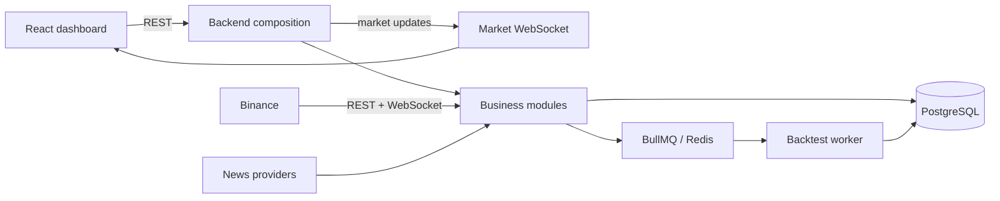

# CRYPTOX — Crypto Strategy Lab

Cryptox is a TypeScript monorepo for defining, combining, backtesting, ranking,
and searching crypto trading strategies. The assignment is evaluated on
architecture, extensibility, reproducibility, and demonstrable behavior—not on
investment returns.

## Evaluation quick links

| Deliverable | Where to review |
| --- | --- |
| Source code and run guide | This README |
| Architecture document | [Technical architecture](docs/design/architecture.md) |
| Detailed flows | [Data-flow appendix](docs/design/data-flow.md) |
| Architectural decisions | [ADR index](#architectural-decisions) |
| Criterion 18–20 evidence | [Rubric evidence map](docs/RUBRIC_EVIDENCE.md) |

## What the system does

- Shows normalized Binance market data in up to four independently configured charts.
- Lets a user create versioned single or composite strategies from the current built-in plugins: MA, RSI, Bollinger Bands, Support/Resistance, and Sentiment.
- Runs manual backtests and bounded search runs, then evaluates and ranks completed experiments in an immutable benchmark scope.
- Collects normalized news and keeps sentiment analysis isolated from market and backtesting paths.

## Architecture at a glance

The core is a **synchronous modular monolith**. Frontend commands and queries use REST. A dedicated market WebSocket carries only normalized realtime market updates. CPU-heavy backtests cross the single asynchronous boundary: the backend dispatches BullMQ jobs and independently runnable workers process them.



Read the [architecture document](docs/design/architecture.md) for the System Context, module responsibilities, contracts, and all required flows.

## Install and run

### Prerequisites

- Node.js 22 LTS or newer
- npm
- Docker Desktop / Docker Engine with Compose v2 for the durable stack

Install workspace dependencies from the repository root:

```bash
npm install
```

### Local presentation profile

The explicit `DEMO` profile is the fastest non-durable path for a local presentation shell:

```powershell
$env:RUNTIME_PROFILE = "DEMO"
npm run dev
```

The backend normally listens on `http://localhost:3000`; Vite prints the frontend URL, normally `http://localhost:5173`.

### Durable Docker stack

Copy the documented values into the ignored root `.env` file, then start the complete stack:

```bash
docker compose --env-file .env -f infra/docker-compose.yml up --build -d
```

The durable composition includes PostgreSQL, Redis, migrations, backend, backtest worker, and production frontend. It requires the documented database, Redis, JWT, and strategy-model configuration; do not commit real values.

Stop the durable stack without deleting data:

```bash
docker compose --env-file .env -f infra/docker-compose.yml down
```

## Verification commands

Run these commands independently from the repository root. A command is proof only when its current run completes successfully; this README does not claim that a command has run in a particular environment.

```bash
npm test
npm run build
npm run lint
npm run arch:check
npm run check:generated
npm run test:workflow
npm run smoke:backend
npm run smoke:dev
npm run docker:smoke
```

## Demo scenario

Use this sequence during evaluation. Record the result of each step as a screenshot or short screen recording; a source link is not a substitute for a live demo.

1. Start the chosen profile and open the dashboard.
2. Open `BTCUSDT`; configure up to four charts with independent timeframes.
3. Verify reconnect/status behavior by observing the market connection state.
4. Create or select MA, RSI, Bollinger Bands, Support/Resistance, or Sentiment strategies; create a composite if desired.
5. Create a benchmark scope and run one manual backtest. Inspect candidate status, metrics, trade markers/overlays, and the resulting experiment.
6. Start a bounded Search Run. Show generator type, stop condition, active candidates, terminal status, and Search Run ranking.
7. Open Leaderboard and demonstrate that entries are scoped to the immutable benchmark.
8. Open News, show a normalized item and its sentiment state. If inference is unavailable, show the explicit degraded/missing state rather than claiming a fabricated result.

## Repository structure

```text
apps/                 deployable compositions: backend, worker, frontend
modules/              business modules and public module APIs
packages/contracts/   REST, market-WebSocket, and queue wire contracts
infra/                Docker Compose and database migrations
docs/design/          canonical architecture and data-flow documentation
docs/adr/             accepted architectural decisions
docs/RUBRIC_EVIDENCE.md  link map for criteria 18–20
```

## Architectural decisions

| ADR | Decision |
| --- | --- |
| [ADR-001](docs/adr/ADR_001_websocket.md) | Use WebSocket only for normalized realtime market data. |
| [ADR-002](docs/adr/ADR_002_plugin_architecture.md) | Use a plugin registry for versioned strategy implementations. |
| [ADR-003](docs/adr/ADR_003_jobqueue.md) | Restrict asynchronous messaging to durable backtest jobs. |
| [ADR-004](docs/adr/ADR_004_sentiment_isolated_module.md) | Isolate sentiment behind an internal module contract. |
| [ADR-005](docs/adr/ADR_005_module_first_structure.md) | Use a module-first modular-monolith structure. |

## Scope and evidence boundaries

- The source implements module boundaries, provider ports, market WebSocket contracts, a BullMQ worker boundary, deterministic snapshots, strategy provenance, and the documented search/backtest lifecycle.
- Live Binance stability, browser end-to-end behavior, and multi-worker throughput require current demo/benchmark evidence. Do not infer them from code or tests alone.
- `averageBacktestDurationMs` is currently not populated by the application summary. It must not be presented as a completed performance measurement.

## Team

| Full name | Student ID |
| --- | --- |
| Pham Thanh Dat | 23127170 |
| Tran Khon Chi | 23127032 |
| Mai Xuan Hung | 23127372 |
| Nguyen Van Minh | 23127422 |
| Giao Thai Bao | 23127526 |

## License

Educational project. Do not use it as financial advice or as a trading system without independent security, compliance, and risk review.
