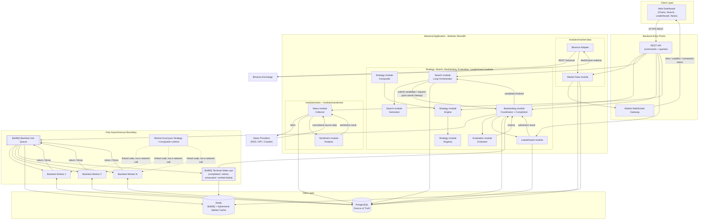

# Cryptox - Technical Architecture

# 1. Overall Architecture

## 1.1 Architectural Style: Synchronous Modular Monolith with a Dedicated Asynchronous Backtesting Worker Pool

Cryptox uses a **Modular Monolith** for the core application: Market Data, Strategy, Search Orchestration, Evaluation, Leaderboard, News, and Sentiment are internal modules composed inside `apps/backend`. Module boundaries remain explicit, but normal collaboration uses typed application-service interfaces and direct in-process calls.

Cryptox is **not a general Event-Driven Architecture**. There is no domain-wide Event Bus, no `event-bus` service, and no requirement to publish events for ordinary module collaboration. This avoids event ordering, duplicate-delivery, tracing, schema-versioning, and eventual-consistency costs where synchronous calls are sufficient.

The single asynchronous process boundary is **backtesting**. Backtests are compute-heavy, retryable, and independently scalable, so the backend submits work to a Redis-backed BullMQ job queue and separate workers consume it. BullMQ completion/failure notifications wake the Backtest Completion Processor, which coordinates the synchronous Evaluate → Score → Persist Experiment → Top-10 Admission flow. The Search Loop receives a direct callback only after a Search candidate reaches a durable terminal state.

This choice deliberately separates three mechanisms that solve different problems:

| Mechanism | Used for | Semantics |
|---|---|---|
| REST | Frontend commands and queries | Request/response; authoritative reads come from PostgreSQL-backed services |
| Market WebSocket | Realtime ticks, candles, and exchange connection status only | Backend-to-browser live stream; not an internal Event Bus |
| BullMQ job queue | Backtest dispatch, retry, backpressure, and worker completion/failure | Each job is claimed by one worker; completion notifications are limited to the backtest pipeline |

| Criteria | General Event-Driven Architecture | Synchronous core + async backtesting (chosen) |
|---|---|---|
| Operational complexity | Requires event ownership, schemas, ordering, idempotency, tracing, and consumer recovery across all modules | Messaging complexity exists only where independent scaling and retry are required |
| Consistency | Many flows become eventually consistent | Core workflows are explicit and easier to make transactional |
| Backtest scalability | Good when backed by a durable work queue | Equally good; workers still scale horizontally behind BullMQ |
| Frontend behavior | Often needs push subscriptions for many domain events | REST polling for search status/leaderboard; WebSocket remains only for realtime market data |
| Fit for the MVP | More infrastructure and failure modes than the current scope needs | Keeps the architecture demonstrable and proportional to the assignment drivers |

## 1.2 Plugin Architecture for the Strategy Engine

This is the most important extensibility decision in the system:

- `Strategy` is a standard interface: `analyze(context) → BUY | SELL | HOLD`.
- `StrategyRegistry` holds registered strategies. Adding a strategy means implementing one plugin and registering its factory; the Backtester, Evaluator, Leaderboard, and frontend core do not change.
- `StrategyGenerator` is replaceable (`RandomGenerator`, `DomainGuidedGenerator`, `GeneticGenerator`, ...). Downstream components consume a normalized `CandidateStrategy` and do not know how it was generated.
- A Strategy never depends on PostgreSQL, Redis, Binance, HTTP, or the UI. It receives a pre-normalized `StrategyContext`.

## 1.3 Main Components

1. **Web Dashboard (Frontend)**
   Displays up to four realtime candlestick charts, strategy configuration, search progress, experiments, Leaderboard, Trade Detail, and News/Sentiment. It contains no trading, backtesting, evaluation, or ranking logic. REST is used for every command and query; the market WebSocket is used only for realtime ticks/candles and connection health.

2. **Backend API Layer**
   The single frontend entry point. REST controllers call internal application services directly. Long-running commands such as starting a backtest or Search Run return an identifier immediately; the frontend polls REST status endpoints while work is active. A separate WebSocket gateway streams normalized market data only.

3. **Backend Application - internal modules**

   The rows below describe logical components, but their ownership is by business module:

   - Strategy Engine, Strategy Registry, and Composite Strategy belong to `modules/strategy`.
   - Strategy Generator and Search Loop Orchestrator belong to `modules/search`.
   - Backtest Coordinator, Completion Processor, and the MVP `ExperimentResult` aggregate belong to `modules/backtesting`.
   - Evaluator, Ranking/Leaderboard, Market Data, News, and Sentiment belong to their corresponding modules under `modules/`.
   - `apps/backend` and `apps/backtest-worker` compose these modules; they do not own their use cases or domain rules.

| Module | Responsibility | Collaboration rule |
|---|---|---|
| Market Data module | Normalizes Binance historical/realtime data, persists closed candles, updates the latest-value cache, and passes normalized market messages to the WebSocket Gateway | Raw Binance payloads never leave the adapter boundary |
| Strategy module / Engine | Runs registered strategies against a supplied context and returns BUY/SELL/HOLD | Pure domain logic; no I/O |
| Strategy module / Registry | Registers and discovers MA, RSI, Bollinger, SR, MACD, and future plugins | No branching on strategy identity |
| Strategy module / Composite | Combines normalized signals using Majority Vote or Weighted Score | Never inspects an individual strategy's internal logic |
| Search module / Generator | Generates candidate definitions using Random, Domain-guided, or future algorithms | Replaceable behind `StrategyGenerator` |
| Search module / Loop Orchestrator | Generates search candidates and serializes `fillAvailableSlots` from persisted state to enforce per-run stop/pause/cancel, `maxInFlight`, and `maxCandidates` | Does not consume BullMQ events or own manual backtests; callbacks only trigger a recoverable fill use case |
| Backtesting module / Coordinator + Completion Processor | Accepts Manual/Search candidates, performs idempotent enqueue/cancel cleanup, adapts terminal BullMQ notifications, owns enqueue/completion reconciliation and the terminal-job watchdog, and coordinates completion | The only backend module that touches the Backtest queue adapter; owns the async boundary for both modes |
| Evaluation module / Evaluator | Computes Return, Win Rate, Max Drawdown, Profit Factor, and Sharpe from a completed `BacktestResult` | Pure calculation called directly by the Completion Processor |
| Leaderboard module | Scores every successful non-cancelled completion, determines rank eligibility, and maintains a persistent Top-10 inside each immutable benchmark scope; also exposes a read-only ranking for one Search Run | Called directly by the Completion Processor; never called by a worker |
| News module / Collector | Fetches and normalizes items through `NewsProvider` adapters | Stores news before invoking Sentiment; a sentiment failure does not discard the news item |
| Sentiment module / Analysis Service | Classifies normalized news as POSITIVE/NEUTRAL/NEGATIVE | Called through an explicit interface with timeout/error isolation |

### 1.3.1 Module-to-layer placement

Each business module may use the following logical layers:

| Layer | Responsibility in this architecture |
|---|---|
| `api` | Thin REST/WebSocket adapters and public in-process module facades/contracts. |
| `application` | Use cases, transactions, orchestration, and inbound/outbound ports. |
| `domain` | Entities, value objects, policies, invariants, strategy plugins, and pure calculations. |
| `infrastructure` | PostgreSQL repositories, exchange/model adapters, Redis/BullMQ adapters, and runtime artifact resolution. |

The dependency direction is `api → application → domain`; `infrastructure` implements application ports. A module may consume another module only through its public API. It must not import another module's `domain` or `infrastructure` internals. Not every module needs all four folders, and empty layers are not required.

4. **Asynchronous Backtesting Boundary**

   - The Backtest Coordinator creates a durable candidate with deterministic `queueJobId = candidateId`, enqueues that BullMQ job, and conditionally records `QUEUED` after enqueue succeeds. A `CREATED`-candidate reconciler inspects the same deterministic job: it confirms/enqueues runnable work, but routes an already-terminal failed job to terminal reconciliation.
   - BullMQ is a **work queue**, not broadcast pub/sub: one available worker normally claims each job; fencing handles brief overlap during stalled-job recovery.
   - Each time BullMQ executes or retries a job, the worker locks the Candidate, closes an abandoned Attempt, checks the persisted attempt budget, and establishes a new active-attempt fencing generation. It verifies its local runtime against the immutable scope/job, loads content-hashed candle/sentiment inputs, and runs the simulation. Its normal final PostgreSQL transaction succeeds only for the still-active generation and atomically stores Attempt outcome, Trades if successful, and a Candidate pending-state transition.
   - On success the worker stores `PROCESSING_RESULT` and returns a small durable-reference payload. On a normal processor failure it persists the failure, writes `RETRY_WAIT` if another attempt remains or `TERMINAL_FAILURE_PENDING` plus `RETRY_EXHAUSTED`/error on the last allowed attempt, then throws so BullMQ records/retries the job. Crash/stall watchdog failures use `INFRASTRUCTURE`. The Completion Processor alone writes terminal Candidate `FAILED`.
   - Every worker Candidate update is fenced under a row lock. A superseded stalled delivery cannot overwrite the active delivery; a job cancelled before simulation is acknowledged as ignored, while one cancelled during simulation may finish its Attempt as a completed audit Attempt with Trades but cannot change Candidate state or create an Experiment/rank.
   - A thin queue adapter under `modules/backtesting/infrastructure/queue` forwards every `completed(jobId, returnvalue)` (including typed `IGNORED` outcomes) and `retries-exhausted(jobId, attemptsMade)` without reading domain tables. Every `failed` is untrusted until that adapter confirms current terminal `failed` state with no runnable retry. Exhaustion and verified-failure wake-ups may duplicate; the Completion Processor derives `candidateId = jobId`, reloads PostgreSQL, and either processes durable pending state or idempotently no-ops. Queue facts are wake-ups, not the source of truth.
   - On successful result completion, one PostgreSQL transaction follows the global lock order (`SearchRun → Candidate → LeaderboardScope` for Search; `Candidate → LeaderboardScope` for Manual), ensures the finite score/Experiment, applies rank eligibility/Top-10 admission, updates counters, and writes terminal Candidate state. Conditional transitions plus unique constraints make redelivery idempotent; bounded deadlock/serialization retries repeat the same claim.
   - Intermediate failed attempts remain attempt history and are retried by BullMQ. Completion processing has a separate persisted five-claim budget, generation-bound lease token, and backoff. For a success pending evaluation, permanent/exhausted processing failure becomes `COMPLETION_PROCESSING` and creates no partial Experiment; for a pending simulation failure, processing exhaustion preserves its original `RETRY_EXHAUSTED`/`INFRASTRUCTURE` cause. Both paths release the Search slot exactly once. Startup/periodic reconciliation claims due work, so losing a terminal notification only delays the transition.
   - The Coordinator-owned terminal-job watchdog covers worker crashes/stalls before the worker can write a pending state: it compares every stale non-terminal Candidate (`CREATED`, `QUEUED`, `BACKTESTING`, `RETRY_WAIT`) with BullMQ terminal state/no-runnable-retry, then closes a stale `RUNNING` Attempt or creates a synthetic failure Attempt under the Candidate lock before invoking the same failure completion path. Every redelivery closes any stale `RUNNING` Attempt, checks the attempt limit, and checks all terminal/pending Candidate states before allocating a fenced generation.
   - For a Search candidate, the processor calls `SearchLoop.onCandidateFinished(...)` after commit. That callback invokes serialized, idempotent `fillAvailableSlots`; the same use case runs on resume and startup/periodically for every `RUNNING` Search Run, so a lost callback cannot stall the loop.

5. **Data Stores**

   - **PostgreSQL** is the source of truth for live/history candles, sealed content-hashed backtest snapshots, versioned strategy/composite definitions, immutable Leaderboard scopes/formulas, Search Runs, candidates, attempts, trades, experiments, Leaderboard history, news, and sentiment.
   - **Redis** backs BullMQ and may hold ephemeral latest-tick/latest-candle and exchange-connection caches. Redis is not a general domain event broker and is not the source of truth for experiments or Leaderboard results.

6. **Backtest Worker Pool**

   Separate worker processes compose the same pure Strategy and Composite modules as the backend, consume BullMQ jobs, and write backtest attempts/trades. Workers are stateless between jobs, horizontally scalable, and safe to retry because each attempt and successful experiment is identified durably.

## 1.4 Communication Matrix

| Flow | Protocol / style |
|---|---|
| Frontend → Backend commands and queries | HTTPS REST |
| Backend → Frontend realtime market ticks/candles/exchange connection status | WebSocket, market channel only |
| Frontend → Search progress, Leaderboard, experiments, news | Periodic REST GET while relevant; no domain-event subscription |
| Backend module → backend module | Typed, direct in-process application-service call |
| Backend ↔ Binance | REST for historical data; WebSocket for realtime data, behind `BinanceAdapter` |
| Search Loop → Backtest Coordinator | Direct in-process Search-candidate submission plus post-cancel waiting/delayed-job cleanup request |
| Backtest Coordinator → Search Loop | Direct post-commit `onCandidateFinished` callback; periodic fill reconciliation is the recovery path |
| Backtest Coordinator → Backtest Workers | BullMQ/Redis durable work queue |
| BullMQ QueueEvents → Completion Processor | Thin terminal transport fact; processor derives/reloads durable domain references |
| Backend/Workers ↔ PostgreSQL | Repository interfaces over the PostgreSQL protocol |
| News Provider → News Collector | HTTP/HTTPS behind a `NewsProvider` adapter |

# 2. Architecture Diagram

The following is a process-level composition view, not a dependency graph. REST arrows represent calls into the module public facades; the layer rule `api → application → domain` still applies inside each module, and module infrastructure is reached only through its allowlisted bootstrap facade.

# 3. Runtime Rules

## 3.1 Manual Backtest

1. The frontend sends a REST command containing the selected strategy/composite and `leaderboardScopeId`; that immutable scope pins content-hashed candle/sentiment inputs, capital/cost assumptions, score formula, and worker/evaluation runtime hashes.
2. The Backtest Coordinator creates a candidate, idempotently enqueues one BullMQ job, and returns `202 Accepted` with `candidateId` and `jobId`.
3. The frontend polls the backtest status endpoint.
4. A worker claims the job, runs the simulation, and stores the attempt/trades.
5. A BullMQ terminal notification wakes the Completion Processor.
6. The processor directly evaluates, normalizes finite metrics, asks Leaderboard to compute the score/rank eligibility, persists one Experiment, applies Top-10 admission when eligible, and completes the Candidate in one transaction. The frontend may idempotently cancel a Manual candidate through REST; the Coordinator commits `CANCELLED` before best-effort removal of waiting/delayed work.

## 3.2 Continuous Search

The Search Loop repeats Generate → Submit to Backtest Coordinator → Backtest → Evaluate → Score with bounded in-flight concurrency and an explicit stop condition. `fillAvailableSlots` locks/leases one Search Run, obtains Candidate counts through the Backtesting public projection API, and creates no more than its missing slots or remaining candidate limit. When a normal stop condition is met it creates nothing new and marks the run `COMPLETED` after in-flight work drains. An unrecoverable orchestration/configuration error immediately marks the run `FAILED`/`ERROR` with `lastError` and `endedAt`; callbacks may update counters but never change `FAILED` to `COMPLETED`. It is invoked on start, resume, post-completion callback, and startup/periodically; callbacks improve latency but are not required for progress. `cancel` uses the same lock and a process-level application unit of work to mark the Search Run and ask the Backtesting facade to mark every non-terminal Candidate `CANCELLED`, with `USER_CANCELLED` and `endedAt`; after commit Search Loop calls the Coordinator to best-effort remove waiting/delayed jobs. Search Loop never reads or mutates BullMQ or Candidate persistence directly. REST polling only renders persisted status and does not drive the workflow. Per-run pause belongs to Search Loop and never globally pauses BullMQ jobs belonging to other runs/users.

## 3.3 Leaderboard Lifetime and Scope

The assignment requires Top-K ranking but does not define its lifetime, so the architecture makes the choice explicit as a fixed MVP Top-10:

- Every non-cancelled Candidate whose backtest/evaluation pipeline completes successfully creates one permanent, scored Experiment.
- A Search Run has a session result view that ranks all rank-eligible successful Experiments generated by that run. It remains queryable for audit but does not replace the shared leaderboard. A zero-trade success is still a permanent Experiment but is explicitly excluded from ranking with score `0`.
- The shared Leaderboard is persistent across Manual and Search runs and is partitioned by an immutable benchmark scope: content-hashed candle snapshot (including pair/timeframe/range), optional content-hashed/model-versioned sentiment snapshot, initial capital, fees, slippage, score-formula version, and exact worker/evaluation runtime hashes. The optional sentiment snapshot is mandatory for any composite using an `INFORMATION` plugin. The MVP uses a fixed Top-10 admission policy.
- Only an Experiment that fills an empty slot or beats current #10 gets a persistent Leaderboard entry. Non-qualifying Experiments still remain in history; evicted entries remain as inactive audit rows.

## 3.4 News and Sentiment

The News module stores each normalized item, then calls the Sentiment interface with a neutral `SentimentInput`. Sentiment owns persistence of `SentimentResult` and sealed snapshots. A timeout or inference failure is caught and reported through logs/metrics; the item remains readable with sentiment missing. It never interrupts Market Data, Search, Backtesting, or chart delivery. No `NewsCollected` or `SentimentAnalyzed` event is published.

## 3.5 Realtime Market Data

The Binance Adapter supplies normalized ticks/candles directly to the Market Data module. The module persists closed candles, updates the latest-value cache, and hands the normalized message to the WebSocket Gateway. No `MarketPriceUpdated` or `CandleClosed` domain event is required.
