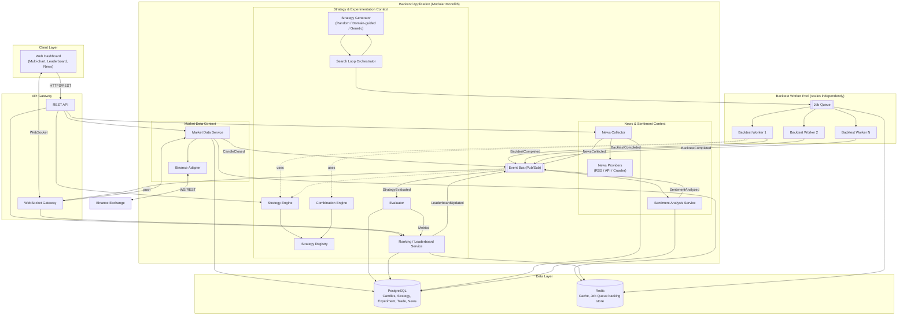

# Cryptox - Technical Architecture

# 1. Overall Architecture

## 1.1 Architectural Style: Modular Monolith + Event-Driven Architecture, with a dedicated Backtesting Worker Pool
Cryptox is designed as a **Modular Monolith** for the core business logic (Market Data, Strategy Engine, News, Leaderboard), with clear module boundaries so that any module can be extracted into a standalone microservice later without rewriting its logic. The **Backtesting Engine**, however, is designed as an **independent worker pool** from the very beginning (not part of the main process), because its workload profile is fundamentally different: compute grows combinatorially (from 10 to 100,000+ candidates) and needs to scale horizontally independently of the rest of the system.
 
Communication between modules uses **internal interfaces** (direct in-process calls) for synchronous flows that need a fast response (e.g. registering a strategy, reading the leaderboard), and an **Event Bus (pub/sub)** for asynchronous flows where coupling should be minimized (e.g. `StrategyEvaluated`, `LeaderboardUpdated`, `NewsCollected`, `SentimentAnalyzed`).
 
| Criteria | Pure Microservices | Modular Monolith + separate Worker Pool (chosen) |
|---|---|---|
| Operational complexity | High (many services, many databases, needs a service mesh) | Lower - only the piece that truly needs independent scaling (backtesting) is split out |
| Business boundaries | Must be correct from day one; mistakes are expensive to fix later | Can be adjusted incrementally within the process; easier to refactor |
| Extensibility for new strategies | Not directly related to this style | Solved via Plugin Architecture (section 1.2), independent of monolith vs. microservices |
| Backtest scalability | Good from the start (if split early) | Equally good, since the Backtest Worker Pool is already decoupled via a Job Queue from the MVP stage |
| Fit for academic project | Hard - heavy infra overhead, risks being judged as "using complex tech just to look impressive" | Good fit - time is spent on the quality of module boundaries, which is what the assignment actually grades |

## 1.2 Plugin Architecture for the Strategy Engine
 
This is the single most important architectural decision in the system, and it shapes how every other module is written:
 
- `Strategy` is a standard interface: `analyze(context) → BUY | SELL | HOLD`.
- `StrategyRegistry` holds the list of registered strategies; adding a new strategy means writing one class and calling `register()` - no changes to the Strategy Engine, Backtester, Evaluator, or UI.
- `StrategyGenerator` is also a replaceable interface (`RandomGenerator`, `DomainGuidedGenerator`, `GeneticGenerator`, ...) - everything downstream (Queue, Backtester, Evaluator, Leaderboard) only ever consumes a `CandidateStrategy` that has already been generated, and does not know (or need to know) which algorithm produced it.
- Dependency rule: **a Strategy must never depend on the Database, Binance, or the UI**. A Strategy only receives a pre-normalized `context` (a "pull" style of Dependency Injection — infrastructure is never "pushed" into a strategy).

## 1.3 Main Components
 
1. **Web Dashboard (Frontend)**
   Displays up to 4 realtime candlestick charts, allows each chart to change timeframe independently, lets the user enable/select strategies, and shows the Leaderboard, Trade Detail, and News & Sentiment views. Contains no business logic (does not compute RSI, run backtests, or rank strategies itself) — it only renders data already normalized by the Backend. Talks to the Backend via REST (actions) and WebSocket (realtime updates).
2. **API Gateway / Backend API Layer**
   The single entry point for the Frontend. Authenticates requests, routes them to the right internal module (Market Data, Strategy, News), exposes REST endpoints for actions (select pair, enable a strategy, view leaderboard), and provides a dedicated WebSocket Gateway for realtime push data (price updates, leaderboard updates).
3. **Backend Application - internal modules**

| Module | Responsibility | Boundary rule |
|---|---|---|
| Market Data Service | Receives candles from Binance via a `BinanceAdapter`, normalizes them into the internal model, publishes `CandleClosed` / `MarketPriceUpdated` events | Neither the Frontend nor the Strategy Engine ever sees Binance's raw format |
| Strategy Engine | Runs registered `Strategy` instances against the current context, returns a BUY/SELL/HOLD signal | Never calls the DB, never calls Binance, never renders a chart |
| Strategy Registry | Registers/discovers available strategies (MA, RSI, Bollinger, SR, MACD, ...) | No `if strategy == ...` branching |
| Combination Engine | Combines signals from multiple strategies into a composite one (Majority Vote / Weighted Score) | Has no knowledge of any individual strategy's internal logic — it only consumes normalized signals |
| Strategy Generator | Generates candidate combinations (Random / Domain-guided / Genetic, ...) | Fully replaceable, has no effect on the Backtester |
| Job Queue | Queues candidates awaiting backtest | Decouples candidate generation from candidate execution |
| Backtest Worker Pool | Simulates trades on historical data, produces the Trade list | Scales horizontally, retryable on failure |
| Evaluator | Computes Return, Win Rate, Max Drawdown, Sharpe, etc. from the Trade list | Fully decoupled from the Strategy implementation |
| Ranking / Leaderboard Service | Computes an overall score, maintains the Top-K list | Reacts to the `StrategyEvaluated` event; is never called directly by a worker |
| Search Loop Orchestrator | Drives the Generate → Backtest → Evaluate → Rank cycle, manages the Stop Condition | Supports pause/resume, exposes progress (observability) |
| News Collector | Gathers news through multiple `NewsProvider` implementations (RSS/API/Crawler) | Every provider returns the same normalized `NewsItem` format |
| Sentiment Analysis Service | Classifies items as POSITIVE/NEUTRAL/NEGATIVE using an ML model | Fully decoupled from the Crawler; swapping the model has no effect on the Strategy Engine |

 
4. **Event Bus (internal pub/sub)**
   Carries events such as `CandleClosed`, `StrategyGenerated`, `BacktestStarted/Completed`, `StrategyEvaluated`, `LeaderboardUpdated`, `NewsCollected`, `SentimentAnalyzed`. For the MVP, this can be Redis Pub/Sub or an in-process EventEmitter behind an adapter (so it can be swapped for Kafka/RabbitMQ later without touching the code that publishes events); the Backtest Job Queue uses a Redis-backed queue (BullMQ) for built-in retry/backoff.
5. **Databases**
   - **PostgreSQL** (primary store): Candles, StrategyDefinition (versioned), Combination, ExperimentResult, Trade, News, Sentiment. Provides ACID guarantees where consistency matters (e.g. an ExperimentResult must always point to the exact Strategy version used — the *Reproducibility* driver).
   - **Redis**: caches the latest candles for fast realtime reads, caches the Top-K Leaderboard for fast reads, and backs the Job Queue.
6. **Backtest Worker Pool (Node.js/Python workers, running as separate processes)**
   Consumes candidates from the Job Queue, runs trade simulations against historical data, publishes `BacktestCompleted`/`StrategyEvaluated`. The number of workers can be scaled up as needed (Scalability/Performance driver).

### How the components communicate
 
| Flow | Protocol |
|---|---|
| Frontend ↔ Backend API | HTTPS REST |
| Backend → Frontend (realtime prices, leaderboard updates) | WebSocket |
| Backend ↔ Binance | REST (historical) + WebSocket (realtime stream) via `BinanceAdapter` |
| Backend module ↔ module (internal) | In-process call (synchronous) or Event Bus (asynchronous) |
| Search Loop → Job Queue → Backtest Worker | Redis Queue (AMQP-style, with retry) |
| Backend ↔ PostgreSQL | TCP |
| Backend ↔ Redis | Redis Protocol |
| News Provider (RSS/API/Crawler) → News Collector | HTTP/HTTPS (per adapter) |

# 2. Architecture Diagram
 

