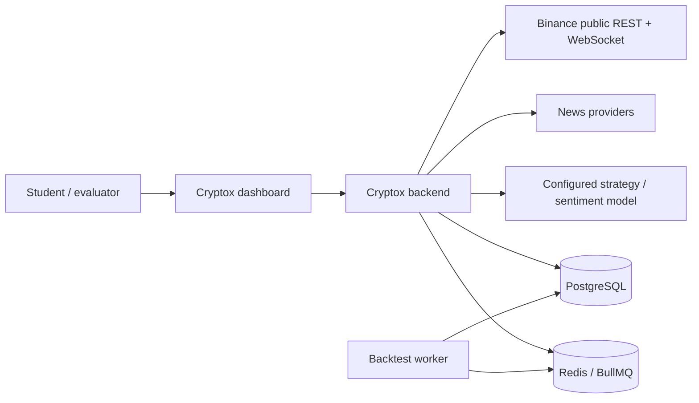
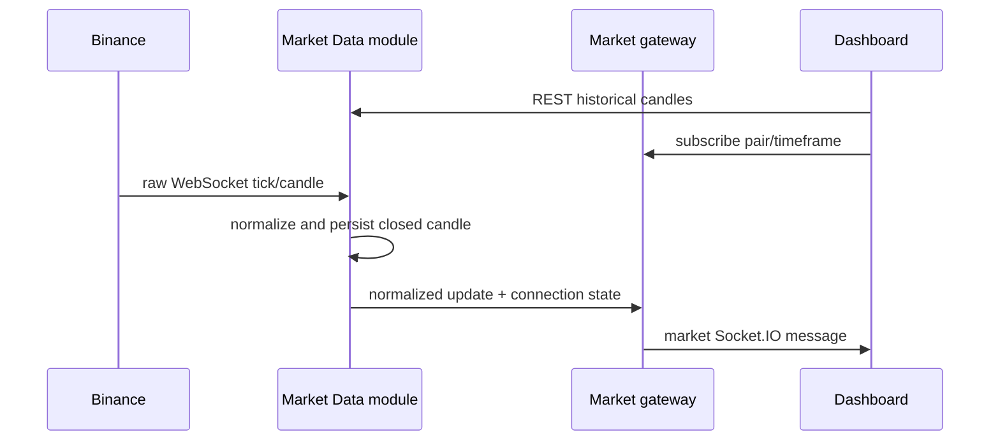
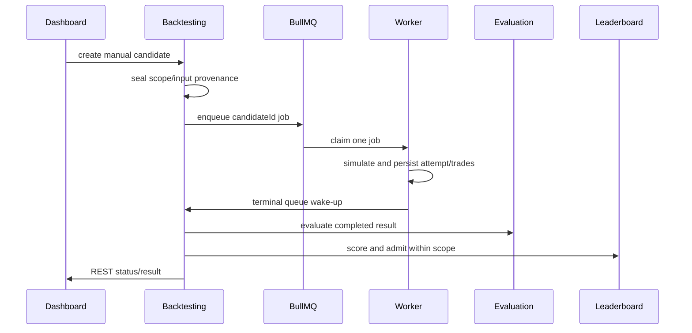

# Cryptox technical architecture

## 1. System Context

Cryptox is a crypto-strategy laboratory used by authenticated students to view market data, define strategies, run backtests/searches, and inspect experiments. It consumes public Binance market data and configured news/model providers; it does not place exchange orders or custody assets.

## 2. Containers and module decomposition

| Container or module | Responsibility | Boundary rule |
| --- | --- | --- |
| `apps/frontend` | React dashboard, REST client, normalized market subscription | No trading, evaluation, ranking, or provider logic. |
| `apps/backend` | Composition root, HTTP API, market WebSocket gateway | Composes public module APIs only. |
| `apps/backtest-worker` | Independently runnable backtest job consumer | Uses the canonical queue contract and pure module runtime. |
| `modules/market-data` | Binance adapter, normalized candles/ticks, snapshots | Raw Binance payloads stop at the adapter. |
| `modules/strategy` | Strategy registry, plugins, definitions, composites | Plugins are pure and receive a normalized context. |
| `modules/search` | Candidate generators and bounded Search Run orchestration | Does not own Candidate persistence or BullMQ. |
| `modules/backtesting` | Candidate lifecycle, queue dispatch, worker execution, completion | Owns the sole asynchronous business boundary. |
| `modules/evaluation` | Return, win rate, drawdown, profit factor, and Sharpe metrics | Pure calculation, separate from simulation. |
| `modules/leaderboard` | Scope-aware score/rank admission and Top-K reads | Never ranks across incompatible scopes. |
| `modules/news` | Provider collection and normalized `NewsItem` persistence | Persists news before optional sentiment analysis. |
| `modules/sentiment` | Sentiment result/snapshot ownership and model provenance | Failure is represented explicitly, not invented. |
| PostgreSQL | Durable source of truth | Stores versioned definitions, snapshots, candidates, attempts, trades, experiments. |
| Redis/BullMQ | Queue transport and ephemeral cache | Not the source of truth for results or ranking. |

Within a module, dependencies flow `api → application → domain`; infrastructure implements application ports. Cross-module code imports public APIs, not another module's domain or infrastructure internals. The architecture gate verifies this rule.

## 3. Communication model

| Flow | Protocol | Why |
| --- | --- | --- |
| Dashboard commands/queries | HTTPS REST | Explicit request/response and durable reads. |
| Backend to dashboard market updates | Socket.IO WebSocket, `/market` only | Low-latency normalized ticks/candles and connection state. |
| Backend to worker | BullMQ job | Compute-heavy, retryable work that can scale separately. |
| Backend module to backend module | Typed in-process public API | Keeps the modular-monolith core simple and transactional. |
| Backend to Binance | REST history + WebSocket realtime | Adapter normalizes an external schema. |
| Backend to news/model providers | Typed provider ports | Concrete providers remain replaceable. |

## 4. Component responsibilities and flows

### Strategy flow

1. The Strategy module registers the current factories: MA, RSI, Bollinger Bands, Support/Resistance, and Sentiment.
2. A definition records parameters and implementation provenance. A composite combines normalized signals rather than inspecting a plugin's internals.
3. Search generators emit normalized candidate definitions; the Backtesting module receives them through its public API.
4. The worker resolves the recorded strategy artifact against the sealed input snapshot. Missing historical artifacts fail explicitly instead of silently substituting newer code.

### Realtime market flow

The frontend never consumes the Binance wire schema directly. It can subscribe to at most four configured chart panels, each with its own timeframe.

### Manual backtest flow

Candidate state and PostgreSQL records are authoritative. Queue terminal signals are wake-ups; completion reloads durable state and remains idempotent.

### Search and backtest flow

1. A user starts a `RANDOM`, `DOMAIN_GUIDED`, or `GENETIC` Search Run with a bounded candidate count, duration/no-improvement stop condition, and `maxInFlight` limit.
2. Search creates only available candidate slots and submits each candidate to Backtesting through a typed public API.
3. Workers execute the same queue lifecycle as manual backtests.
4. Completion evaluates and ranks the candidate, then notifies Search after the durable transaction. Reconciliation can refill a lost slot safely.
5. The Search Run becomes terminal after its stop condition is met and active work has drained.

### News and sentiment flow

1. A News provider returns a normalized candidate item.
2. News validates, deduplicates, and persists the `NewsItem`.
3. News invokes Sentiment through a typed interface with a bounded failure boundary.
4. Sentiment persists its own result/provenance and seals a time-aligned snapshot when needed by an information strategy.
5. Failure yields explicit missing/degraded sentiment; it does not discard news or fail market/search/backtesting paths.

## 5. Reproducibility, reliability, and scale boundaries

- A Leaderboard scope pins candle/sentiment snapshots, cost assumptions, score formula, and runtime provenance before a candidate is dispatched.
- PostgreSQL stores durable candidates, attempts, trades, experiments, and terminal outcomes. Redis/BullMQ supplies queue semantics, retry, and backpressure—not business truth.
- Separate workers can be increased without changing the domain model. A throughput claim still requires an actual benchmark; the application currently does not populate `averageBacktestDurationMs`.
- The core intentionally does not use a general Event Bus. WebSocket is scoped to market data and BullMQ to backtest work.

## 6. Evidence entry points

| Requirement | Primary evidence |
| --- | --- |
| Public composition and module wiring | [`apps/backend/src/compose.ts`](../../apps/backend/src/compose.ts) |
| Market WebSocket contract/gateway | [`packages/contracts/websocket/market-data.ts`](../../packages/contracts/websocket/market-data.ts), [`apps/backend/src/market.gateway.ts`](../../apps/backend/src/market.gateway.ts) |
| Strategy registry | [`modules/strategy/domain/plugins.ts`](../../modules/strategy/domain/plugins.ts) |
| Queue wire contract/adapter | [`packages/contracts/queue/backtesting.ts`](../../packages/contracts/queue/backtesting.ts), [`modules/backtesting/infrastructure/queue/adapter.ts`](../../modules/backtesting/infrastructure/queue/adapter.ts) |
| Detailed flow walkthroughs | [Data-flow appendix](data-flow.md) |
| Decision rationale and trade-offs | [ADR directory](../adr) |

The evaluator-facing GitHub links for criteria 18–20 are collected in [`docs/RUBRIC_EVIDENCE.md`](../RUBRIC_EVIDENCE.md).
