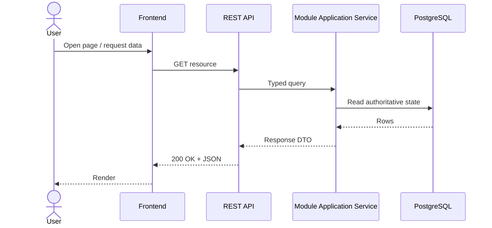
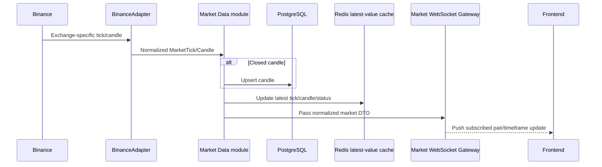

# Cryptox - Data Flows

## 1. Communication Policy

Cryptox does not use a general Event Bus. Data crosses boundaries in three ways:

1. **REST request/response** for frontend commands and queries.
2. **Market-only WebSocket** for realtime ticks, candles, and exchange connection status.
3. **BullMQ backtest queue** for compute-heavy work and its completion/failure notification.

Backend modules otherwise call explicit application-service interfaces in process. PostgreSQL is the source of truth; Redis queue notifications never replace persisted state.

These flows are process-level views. The implementation is organized by business module under `modules/`, with `api → application → domain` inside each module and infrastructure adapters implementing application ports. `apps/backend` is the backend composition root; `apps/backtest-worker` composes the worker side of `modules/backtesting`. This structure change does not alter the REST, market-only WebSocket, BullMQ, PostgreSQL, retry, fencing, reconciliation, or idempotency semantics described below.

## 2. Normal REST Query

Used for strategy catalog/configuration, Search Run status, candidate status, experiments, Leaderboard, and News/Sentiment.



While a Search Run is active, the frontend periodically calls `GET /search-runs/{id}` and `GET /search-runs/{id}/leaderboard`. The persistent cross-run Top-10 is read separately with `GET /leaderboard?scopeId=...`. Closing the browser does not stop server-side work.

## 3. Realtime Market Flow

Historical chart data is loaded with REST. Only subsequent realtime market updates use WebSocket.



There is no `MarketPriceUpdated` or `CandleClosed` domain event. The WebSocket is a delivery channel from Market Data to the browser, not an internal Event Bus.

## 4. Manual Backtest

```mermaid
sequenceDiagram
    actor U as User
    participant FE as Frontend
    participant API as REST API
    participant BC as Backtesting module / Coordinator
    participant PG as PostgreSQL
    participant Q as BullMQ
    participant W as Backtest Worker

    U->>FE: Configure fixed strategy and benchmark scope; click Run
    FE->>API: Commit/select immutable Strategy/Composite and benchmark scope first
    FE->>API: POST /backtests
    API->>BC: Start manual candidate
    BC->>BC: Load/verify same-owner immutable refs through Strategy/Leaderboard APIs
    BC->>PG: Transaction: insert Candidate(CREATED) with committed refs only
    BC->>Q: Idempotent enqueue with deterministic jobId
    BC->>PG: Conditional CREATED -> QUEUED
    BC-->>API: candidateId, jobId
    API-->>FE: 202 Accepted
    Q->>W: One worker claims job
    W->>PG: Lock Candidate
    alt Candidate already CANCELLED
        W->>Q: Return IGNORED/CANCELLED; Completion Processor reloads and no-ops
    else Candidate is runnable
        W->>PG: Verify scope-pinned simulator artifact; record worker build; close stale Attempt; check budget; allocate generation
        W->>W: Simulate trades (cancellation may race)
        alt Simulation succeeds
            W->>PG: One transaction if active generation: trades + Attempt=COMPLETED + PROCESSING_RESULT
            W->>Q: Return durable success IDs
        else Attempt fails
            alt Another retry remains
                W->>PG: One transaction: Attempt=FAILED + conditional RETRY_WAIT
            else Last allowed attempt
                W->>PG: One transaction: Attempt=FAILED + pending(RETRY_EXHAUSTED, error, due now)
            end
            W--xQ: Throw so BullMQ records/retries the job
        end
    end
```

Before Candidate commit, the Coordinator verifies same-owner immutable definition references, plugin-declared warm-up, and the normalized execution-policy snapshot. An `INFORMATION` composite additionally requires a sealed time-aligned sentiment snapshot. The job copies the scope's simulator artifact hash; the worker resolves that exact artifact and separately records its deployment build for audit. The frontend then polls status. Retries never exceed `maxAttempts`, and generation/token fencing makes overlapping deliveries harmless. Cancellation is DB-first; an in-flight worker may retain audit Trades but cannot overwrite `CANCELLED` or create an Experiment/rank. Redelivery after a successful PostgreSQL commit returns existing IDs instead of simulating again.

## 5. Continuous Search Run

```mermaid
sequenceDiagram
    actor U as User
    participant FE as Frontend
    participant API as REST API
    participant O as Search module / Loop Orchestrator
    participant BC as Backtesting module / Coordinator
    participant G as Search module / Generator
    participant PG as PostgreSQL
    participant Q as BullMQ

    U->>FE: Choose benchmark scope, search space, stop condition
    FE->>API: POST /search-runs
    API->>O: start(config)
    O->>PG: Insert SearchRun(scopeId, maxInFlight, CREATED -> RUNNING)
    O-->>API: searchRunId
    API-->>FE: 202 Accepted

    O->>PG: fillAvailableSlots: acquire Search Run lease; read Search-owned limits
    O->>BC: summarizeSearchCandidates(searchRunId)
    BC-->>O: Candidate projection/counts
    loop For each available slot while RUNNING and stop=false
        O->>G: generate(searchSpace)
        G-->>O: GeneratedCandidate
        O->>BC: Submit Search candidate metadata
        BC->>PG: Transaction: insert/verify generated Strategy + Composite versions, then Candidate(CREATED)
        BC->>Q: Idempotent enqueue BacktestQueueJob
        BC->>PG: Conditional CREATED -> QUEUED
    end
    O->>PG: Release lease; persist Search Run state if stop reached and drained

    FE->>API: GET /search-runs/{id}
    API->>O: status(searchRunId)
    O->>BC: summarizeSearchCandidates(searchRunId)
    BC-->>O: Candidate projection/counts
    O-->>API: LoopStatus
    API-->>FE: 200 OK
```

The Search module limits the number of in-flight jobs and never enqueues the whole space. `fillAvailableSlots(searchRunId)` is idempotent and serialized by a Search Run row lock/lease. It obtains Candidate counts/projections through the Backtesting public API, checks stop conditions, and submits no more than the missing slots or remaining `maxCandidates` through `BacktestCoordinator.submitSearchCandidate`; Search never reads Candidate tables directly. Once a normal stop condition is met it reserves nothing; when in-flight reaches zero it persists `COMPLETED`, `stopReason`, and `endedAt` only if the run is still `RUNNING`. It runs on start, resume, every completion callback, and backend startup/periodic reconciliation for all `RUNNING` runs; therefore a lost callback cannot stall the loop, and concurrent callbacks cannot overfill it. `UNIQUE (search_run_id, iteration_number)` makes a repeated reservation load the existing iteration. `pause` stops filling slots but lets claimed jobs finish. `cancel` locks the run and, through a process-level application unit of work, writes Search Run `CANCELLED`/`USER_CANCELLED`/`endedAt` and asks Backtesting's public facade to mark non-terminal Candidates `CANCELLED`; after commit it calls `BacktestCoordinator.removePendingJobs(candidateIds)`. The Backtesting module alone owns its queue infrastructure and best-effort removes waiting/delayed jobs. Late attempts/trades are audit-only and create no Experiment/rank. An unrecoverable Search orchestration error immediately records `FAILED`/`ERROR`/`lastError`/`endedAt`; callbacks may update counters but never change that state to `COMPLETED`.

## 6. Backtest Completion → Experiment → Leaderboard

This is the only asynchronous completion-notification path in the system. Dispatch still uses competing-consumer queue semantics; BullMQ `QueueEvents` acts only as the terminal wake-up channel.

```mermaid
sequenceDiagram
    participant W as Backtest Worker
    participant PG as PostgreSQL
    participant B as BullMQ job state
    participant Q as BullMQ QueueEvents Adapter
    participant BC as Backtesting module / Completion Processor
    participant E as Evaluation module / Evaluator
    participant L as Leaderboard module
    participant O as Search module / Loop

    W->>PG: On normal path, persist Attempt/Trades and fenced pending Candidate state
    W->>B: Return success IDs or throw
    alt Completed path
        B-->>Q: completed(jobId, returnvalue)
    else Failure path
        B-->>Q: failed(jobId, failedReason) as untrusted observation
        opt Retry budget reaches its limit
            B-->>Q: retries-exhausted(jobId, attemptsMade)
        end
        Q->>B: For failed observation, confirm current state=failed and no retry runnable
    end
    Q-->>BC: One or duplicate normalized wake-ups; IGNORED payloads also reload DB
    BC->>PG: Derive candidateId=jobId; repair verified terminal failure into pending state if needed
    BC->>PG: Claim due work; persist/return claim generation + unique lease token
    BC->>PG: Load persisted Attempt/Trades
    opt Completed attempt
        BC->>E: evaluate(CompletedBacktestResult) outside write transaction
        E-->>BC: Finite normalized EvaluationMetrics
        BC->>L: score(scopeId, metrics) outside write transaction
        L-->>BC: scoreFormulaId + finite score + rank eligibility
    end
    BC->>PG: BEGIN; Search locks Run→Candidate→Scope, Manual Candidate→Scope; match generation + token
    alt Candidate is CANCELLED
        BC->>PG: Preserve audit rows; commit no Experiment/rank
    else Completed and Candidate is PROCESSING_RESULT
        BC->>PG: Ensure scored ExperimentResult
        BC->>L: submit(experiment)
        L->>L: Decide persistent scoped Top-10 admission
        L->>PG: Persist entry/history only if admitted
        BC->>PG: Ensure counters + Candidate=COMPLETED; commit
        opt Search candidate
            BC->>O: onCandidateFinished(searchRunId) after commit
            O->>O: Invoke serialized fillAvailableSlots
        end
    else Candidate is TERMINAL_FAILURE_PENDING
        BC->>PG: Ensure Candidate=FAILED + counters once; preserve RETRY_EXHAUSTED/INFRASTRUCTURE
        opt Search candidate
            BC->>O: onCandidateFinished(searchRunId) after commit
            O->>O: Invoke serialized fillAvailableSlots
        end
    end
```

Leaderboard read semantics are deliberately separate:

- The **Search Run ranking** sorts every rank-eligible successful Experiment belonging to that `searchRunId` by its stored score. It is session-scoped and remains available after the run ends.
- The **persistent Leaderboard** is Top-10 per immutable benchmark `scopeId` across all Manual and Search runs. Only admitted, rank-eligible Experiments have an active `leaderboard_entries` row; every successful Experiment—including zero-trade audit results—is still stored even when it is excluded or misses Top-10.

Reliability rules:

- On normal processor return/throw paths, the worker persists result state before BullMQ completion/failure. Crash, lock-loss, and max-stalled paths that bypass that write are repaired by the Coordinator-owned terminal watchdog before Candidate finalization.
- The queue adapter forwards every `completed` (including typed `IGNORED` outcomes) and `retries-exhausted` as normalized wake-ups. Every `failed` is untrusted until the adapter confirms current terminal `failed` state and no runnable retry. `retries-exhausted` and verified `failed` can generate duplicate wake-ups for one job; the Completion Processor derives `candidateId = jobId`, reloads domain state, and idempotently processes pending or no-ops when terminal/cancelled. No large `Trade[]` crosses the queue.
- A Candidate row lock, conditional state transition, one transaction, and unique constraints make duplicate completion handling safe across Experiment, ranking, counters, and status.
- On startup and periodically, the Coordinator reconciles pending Candidates. Completion work is claimed with a persisted lease/token and a separate fixed budget of five processing claims; the claim returns its generation and every final write must match both original generation and token. Transient failures back off `5s`, `30s`, `2m`, and `10m` (±20% jitter). For `PROCESSING_RESULT`, permanent validation/runtime/non-finite-metric errors fail fast and budget exhaustion writes `FAILED`/`COMPLETION_PROCESSING`, retains the successful Attempt/Trades, creates no Experiment, updates counters once, releases the Search slot, and triggers refill. For `TERMINAL_FAILURE_PENDING`, processing exhaustion finalizes `FAILED` while preserving the existing `RETRY_EXHAUSTED` or `INFRASTRUCTURE` cause/counter. A fifth-claim crash terminalizes after lease expiry rather than running claim six.
- A watchdog checks all stale non-terminal Candidates (`CREATED | QUEUED | BACKTESTING | RETRY_WAIT`) against BullMQ. If the job is terminally failed (including max-stalled/process-crash failure), the Completion Processor locks the Candidate, closes any stale `RUNNING` Attempt or inserts a synthetic failed Attempt when none exists, moves through `TERMINAL_FAILURE_PENDING`, and idempotently finalizes `FAILED`. Every retry delivery closes an abandoned `RUNNING` Attempt, checks the persisted budget, and establishes a new fencing generation before work; a late delivery cannot overwrite the current one.
- Stale `CREATED` candidates are reconciled by inspecting deterministic BullMQ `jobId = candidateId`: a missing/runnable job is idempotently enqueued/confirmed, while an already-terminal failed job goes to terminal reconciliation. This repairs crashes before enqueue and between enqueue and the conditional `QUEUED` update. A worker may move `CREATED` directly to `BACKTESTING` if it claims the job first, so the late API update cannot overwrite worker progress.
- Every `RUNNING` Search Run is periodically passed to serialized `fillAvailableSlots`, repairing a crash after Candidate commit but before the in-process completion callback.

## 7. News and Sentiment

```mermaid
sequenceDiagram
    participant T as Backend Scheduler or REST Command
    participant N as News module / Collector
    participant P as NewsProvider
    participant S as Sentiment module / Analysis
    participant PG as PostgreSQL
    participant API as REST API
    participant FE as Frontend

    T->>N: Collect news
    N->>P: fetch()
    P-->>N: Normalized NewsItem[]
    N->>PG: Store/deduplicate news
    N->>S: analyze(SentimentInput) through explicit interface
    alt Sentiment succeeds
        S-->>N: SentimentResult
        S->>PG: Persist SentimentResult in Sentiment-owned storage
    else Timeout or model failure
        N->>N: Record logs/metrics; leave sentiment missing
    end
    opt Create reproducible INFORMATION benchmark input
        S->>PG: Seal sentiment points + model/hash snapshot
    end
    FE->>API: GET /news
    API->>N: Query news
    N->>PG: Query NewsItem records
    N->>S: Read available sentiment through Sentiment API
    S->>PG: Query SentimentResult records
    S-->>N: Sentiment projection
    N-->>API: News response DTO
    API-->>FE: 200 OK
```

There is no `NewsCollected` or `SentimentAnalyzed` event. Sentiment failure is contained by timeout/error handling and cannot stop market charts or backtesting.

The Backend Scheduler is a process-level trigger composed by `apps/backend`; it invokes the News public API and owns no News or Sentiment business rules. News reads `news_items` and Sentiment reads `sentiment_results` through their module APIs.

Redis latest-tick/latest-candle data is an optimization for realtime chart reads only. PostgreSQL remains authoritative for historical candles, news, sentiment, Candidates, Attempts, Trades, Experiments, and Leaderboard. A cache miss or stale/invalid cache entry falls back to PostgreSQL; cache timestamps are exposed only as connection/data freshness metadata, never as a replacement for durable state.
