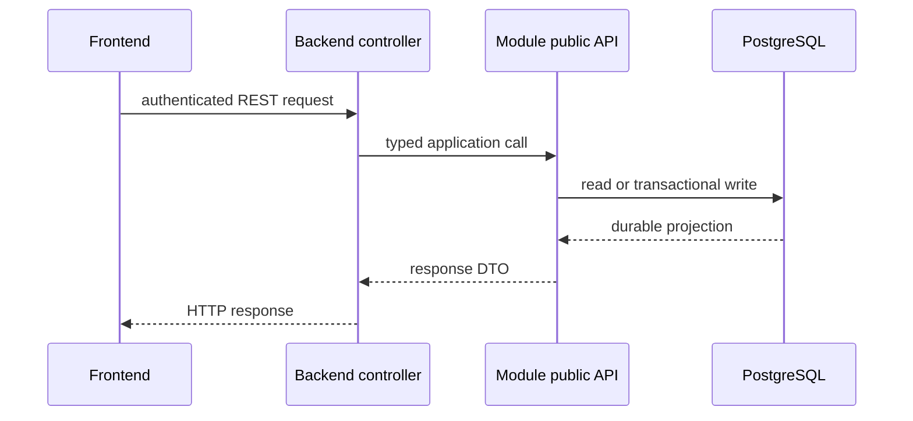
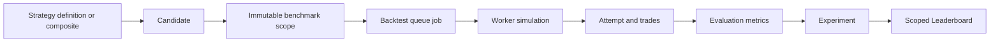

# Cryptox data-flow appendix

This appendix expands the flows summarized in the [technical architecture](architecture.md). It is deliberately a companion, not a competing architecture source.

## 1. REST query and command flow

REST owns strategy definitions, scopes, search status, candidate status, experiments, leaderboard reads, news, and sentiment queries. The frontend does not query PostgreSQL or provider APIs directly.

## 2. Realtime market flow

Historical candles are requested through REST. The backend's Binance adapter normalizes incoming realtime data and the market gateway forwards only the canonical market message contract to subscribed dashboards. Reconnection and missing-candle reconciliation stay behind this boundary.

Evidence: [`market.gateway.ts`](../../apps/backend/src/market.gateway.ts) and [`market-data.ts`](../../packages/contracts/websocket/market-data.ts).

## 3. Strategy-to-backtest flow

Definitions reference a registered plugin and its implementation provenance. The worker receives sealed inputs rather than mutable live market data. A successful completion becomes an Experiment only through the completion path; zero-trade results remain auditable but are not automatically rank-eligible.

## 4. Search flow

Search owns generation and bounded orchestration, not queue internals. It creates at most the missing number of slots, submits candidates to Backtesting, and waits for durable completion. The same refill operation can run after a restart, so losing an in-memory callback cannot permanently stall a run.

## 5. News and sentiment flow

News owns normalized item persistence. Sentiment owns its results and snapshot provenance. The workflow records an explicit missing/degraded state on model failure; no fabricated neutral score is used to hide a failed analysis.

## 6. Flow evidence boundary

The diagrams document intended and source-inspected behavior. They are not live runtime proof. Capture the README demo scenario and benchmark output before claiming WebSocket stability, end-to-end operation, or worker throughput.
