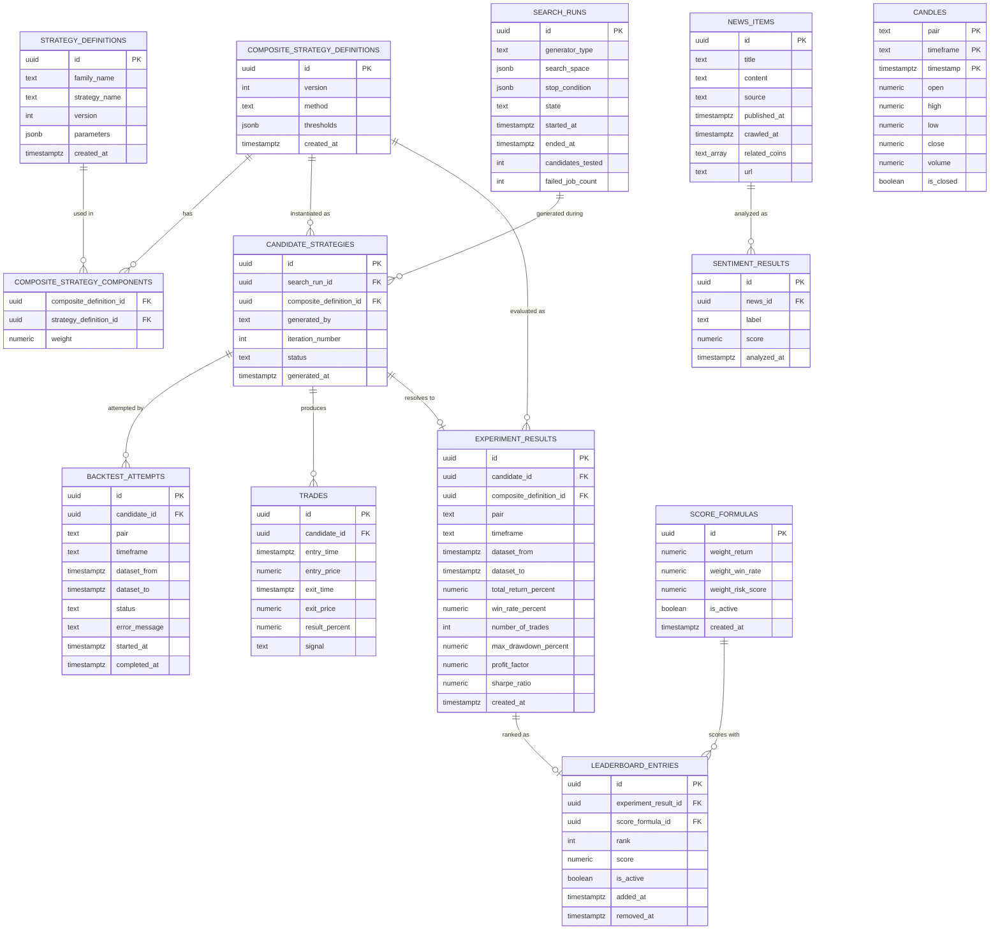

# Cryptox - Data Model

## 1. Storage Strategy Recap

| Store | Role | 
|---|---|
| **PostgreSQL** | Single source of truth for everything with ACID/versioning/reproducibility needs: candles, strategy & composite definitions, candidates, trades, experiment results, leaderboard, news, sentiment. |
| **Redis** | (a) latest-candle / latest-tick cache for realtime reads, (b) Top-K leaderboard mirror for fast push, (c) BullMQ-backed Job Queue for backtest candidates, (d) ephemeral connection-status keys (never written to Postgres). |

## 2. Entity-Relationship Diagram



`CANDLES` has no FK edges to the strategy/experiment side of the graph — by design (`architecture.md`'s boundary rule: strategies never touch the DB directly; only `market-data` and the Backtester's data-loading code read `candles`).

## 3. Table Definitions

### 3.1 `candles`

Owned by Market Data Service. Corresponds to brief §4 and `architecture.md` §1.3 ("Market Data Service ... publishes CandleClosed") and to the `Candle` contract in `component-contracts.md` §2.

| Column | Type | Notes |
|---|---|---|
| `pair` | `text` | Part of PK. Deliberately `text`, not an enum — brief §32.2/§44.3 requires adding pairs without a code change (mirrors the `Pair` contract type). |
| `timeframe` | `timeframe_enum` (`'1m','5m','15m','1h','4h','1d'`) | Part of PK. Matches the closed `Timeframe` union in the contract — extending it is a migration, which is acceptable since it's a small, brief-defined set. |
| `timestamp` | `timestamptz` | Part of PK. Candle open time. |
| `open`, `high`, `low`, `close`, `volume` | `numeric` | Per brief §1 example. |
| `is_closed` | `boolean` | Mirrors `Candle.isClosed` — lets the same table hold the still-forming realtime candle as well as finalized ones. |

```sql
CREATE TYPE timeframe_enum AS ENUM ('1m','5m','15m','1h','4h','1d');

CREATE TABLE candles (
  pair       TEXT NOT NULL,
  timeframe  timeframe_enum NOT NULL,
  "timestamp" TIMESTAMPTZ NOT NULL,
  open       NUMERIC NOT NULL,
  high       NUMERIC NOT NULL,
  low        NUMERIC NOT NULL,
  close      NUMERIC NOT NULL,
  volume     NUMERIC NOT NULL,
  is_closed  BOOLEAN NOT NULL DEFAULT true,
  PRIMARY KEY (pair, timeframe, "timestamp")
);
CREATE INDEX idx_candles_pair_tf_time ON candles (pair, timeframe, "timestamp" DESC);
```

**Not persisted:** `MarketTick` (raw per-tick price) and `MarketDataConnectionStatus`. Both are pure realtime/ephemeral state — see §5 (Redis). Writing every tick to Postgres would fight the Realtime driver (§32.3) for no reproducibility benefit, since only *closed* candles are ever backtested (brief §19).

**Growth note (brief §32.2):** this table is the one most likely to need partitioning once multiple pairs × 6 timeframes × months of history accumulate. Recommended path if/when it matters: monthly range partitions on `timestamp`, or move to TimescaleDB — noted as a scalability follow-up, not required for the MVP scope (brief §37).

### 3.2 `strategy_definitions`

Owned by Strategy Engine. Corresponds to `StrategyDefinition` in `component-contracts.md` §3, brief §36 (versioning).

| Column | Type | Notes |
|---|---|---|
| `id` | `uuid PK` | Unique **per version** (Identity rule, §0 of the contracts file) — never reused. |
| `family_name` | `text NULL` | Display-only grouping (e.g. "MA-RSI Strategy" across v1/v2/v3). **Never a FK.** |
| `strategy_name` | `text NOT NULL` | Matches `Strategy.name`, resolved via the runtime `StrategyRegistry` — not a FK to a DB table (see §3.2.1). |
| `version` | `int NOT NULL` | Incremented on any parameter change; rows are append-only, never updated. |
| `parameters` | `jsonb NOT NULL` | e.g. `{ "fastPeriod": 20, "slowPeriod": 50 }`. |
| `created_at` | `timestamptz NOT NULL DEFAULT now()` | |

```sql
CREATE TABLE strategy_definitions (
  id            UUID PRIMARY KEY DEFAULT gen_random_uuid(),
  family_name   TEXT,
  strategy_name TEXT NOT NULL,
  version       INT NOT NULL,
  parameters    JSONB NOT NULL,
  created_at    TIMESTAMPTZ NOT NULL DEFAULT now()
);
CREATE INDEX idx_strategy_defs_name ON strategy_definitions (strategy_name);
```

Rows are **immutable**: editing a strategy's parameters means `INSERT ... version = previous + 1`, never `UPDATE`. This is what makes brief §40.8 ("which strategy version produced this Leaderboard row?") a fixed join instead of a "the row might have changed since" hazard.

#### 3.2.1 Why there is no `strategy_catalog` table

I considered adding a table listing the currently-registered strategy *types* (name, category, param schema) so the Frontend's "select strategies" step (brief §2, §46 step 2) has something to query. Decided against it: `StrategyRegistry.list()` (contracts §3, plugin registration) already returns exactly that — it's runtime, in-process metadata that a plugin declares when it calls `register()` at bootstrap. Duplicating it into Postgres would create a second source of truth that can drift from the code (e.g. a plugin removed from the codebase but its row left behind). `GET /strategies` should call `StrategyRegistry.list()` directly and return `StrategyFactory[]` metadata — no table needed. `strategy_definitions` only stores *configured instances* of those types, which is the part that genuinely needs durability and versioning.

### 3.3 `composite_strategy_definitions` + `composite_strategy_components`

Owned by Composite Strategy service. Corresponds to `CompositeStrategyDefinition` in `component-contracts.md` §4, brief §13-14.

```sql
CREATE TYPE combination_method_enum AS ENUM ('MAJORITY_VOTE','WEIGHTED_SCORE');

CREATE TABLE composite_strategy_definitions (
  id         UUID PRIMARY KEY DEFAULT gen_random_uuid(),
  version    INT NOT NULL,
  method     combination_method_enum NOT NULL,
  thresholds JSONB,              -- { buy: 0.3, sell: -0.3 }; only meaningful for WEIGHTED_SCORE
  created_at TIMESTAMPTZ NOT NULL DEFAULT now()
);

CREATE TABLE composite_strategy_components (
  composite_definition_id UUID NOT NULL REFERENCES composite_strategy_definitions(id),
  strategy_definition_id  UUID NOT NULL REFERENCES strategy_definitions(id),
  weight                   NUMERIC NOT NULL DEFAULT 0,  -- ignored when method = MAJORITY_VOTE
  PRIMARY KEY (composite_definition_id, strategy_definition_id)
);
```

This is the associative table the contract's inline `components: Array<{ strategyDefinitionId, weight }>` implies but doesn't spell out as a relation — every `strategyDefinitionId` in a composite is version-pinned by FK, so a `CompositeStrategyDefinition` can never silently pick up a newer version of one of its components (same Identity/Reproducibility guarantee as §3.2, one level up — this is exactly the chain brief §40.8 needs: *experiment → composite version → each component's strategy version*).

### 3.4 `search_runs` *(additive)*

Groups candidates by "one press of START SEARCH" (brief §46 step 3) and gives `LoopStatus` (contracts §5.1) a durable backing row instead of pure in-memory state. Owned by Search Loop Orchestrator.

```sql
CREATE TYPE loop_state_enum AS ENUM ('RUNNING','PAUSED','STOPPED');
CREATE TYPE generator_type_enum AS ENUM ('RANDOM','DOMAIN_GUIDED','GENETIC');

CREATE TABLE search_runs (
  id              UUID PRIMARY KEY DEFAULT gen_random_uuid(),
  generator_type  generator_type_enum NOT NULL,
  search_space    JSONB NOT NULL,     -- snapshot of SearchSpaceConfig at start
  stop_condition  JSONB NOT NULL,     -- snapshot of StopCondition at start
  state           loop_state_enum NOT NULL DEFAULT 'RUNNING',
  started_at      TIMESTAMPTZ NOT NULL DEFAULT now(),
  ended_at        TIMESTAMPTZ,
  candidates_tested     INT NOT NULL DEFAULT 0,   -- denormalized counter, kept in sync by trigger/app code; source of truth is COUNT(candidate_strategies)
  failed_job_count      INT NOT NULL DEFAULT 0,
  average_backtest_duration_ms NUMERIC
);
```

`LoopStatus.candidatesTested` / `.failedJobCount` / `.averageBacktestDurationMs` can be served from this row directly (fast) and reconciled periodically with `count(*)` over `candidate_strategies` / `backtest_attempts` (correct) — cheap eventual consistency, not a second source of truth for anything that matters for reproducibility.

### 3.5 `candidate_strategies` *(additive)*

Owned by Search Loop Orchestrator / Job Queue boundary. Mirrors `CandidateStrategy` in `component-contracts.md` §5 field-for-field, plus a `status` column this data model adds for durability.

```sql
CREATE TYPE candidate_status_enum AS ENUM ('GENERATED','QUEUED','BACKTESTING','EVALUATED','FAILED');

CREATE TABLE candidate_strategies (
  id                      UUID PRIMARY KEY DEFAULT gen_random_uuid(),
  search_run_id           UUID REFERENCES search_runs(id),   -- NULL allowed: a candidate can be backtested ad-hoc, outside a search run
  composite_definition_id UUID NOT NULL REFERENCES composite_strategy_definitions(id),
  generated_by            generator_type_enum NOT NULL,
  iteration_number        INT NOT NULL,
  status                  candidate_status_enum NOT NULL DEFAULT 'GENERATED',
  generated_at            TIMESTAMPTZ NOT NULL DEFAULT now()
);
CREATE INDEX idx_candidates_run ON candidate_strategies (search_run_id, iteration_number);
CREATE INDEX idx_candidates_status ON candidate_strategies (status);
```

Row lifecycle, driven by the events already defined in `component-contracts.md` §10: `StrategyGenerated → GENERATED`, enqueue → `QUEUED`, `BacktestStarted → BACKTESTING`, `StrategyEvaluated → EVALUATED`, or a `FAILED` `BacktestResult` → `FAILED`. Nothing new is invented on the wire — the events already carry this information; this table just also writes it down.

### 3.6 `backtest_attempts` *(additive — see §0.3 for why)*

Owned by Backtest Worker Pool. Mirrors `BacktestResult`/`BacktestRequest` in `component-contracts.md` §6.

```sql
CREATE TYPE backtest_status_enum AS ENUM ('COMPLETED','FAILED');

CREATE TABLE backtest_attempts (
  id             UUID PRIMARY KEY DEFAULT gen_random_uuid(),
  candidate_id   UUID NOT NULL REFERENCES candidate_strategies(id),
  pair           TEXT NOT NULL,
  timeframe      timeframe_enum NOT NULL,
  dataset_from   TIMESTAMPTZ NOT NULL,
  dataset_to     TIMESTAMPTZ NOT NULL,
  status         backtest_status_enum NOT NULL,
  error_message  TEXT,                          -- populated only when status = FAILED
  started_at     TIMESTAMPTZ NOT NULL,
  completed_at   TIMESTAMPTZ NOT NULL
);
CREATE INDEX idx_backtest_attempts_candidate ON backtest_attempts (candidate_id);
```

Retry count/backoff/attempt-number stay in BullMQ (per `component-contracts.md` §6's own note) — this table only answers "what happened," not "how the queue is managing retries." One `candidate_strategies` row can have several `backtest_attempts` rows (one per retry); only the `COMPLETED` one, if any, gets `trades` and an `experiment_results` row.

### 3.7 `trades`

Owned by Backtest Worker Pool. Corresponds to `Trade` in `component-contracts.md` §6, brief §19/§26.

```sql
CREATE TYPE trade_signal_enum AS ENUM ('LONG','SHORT');

CREATE TABLE trades (
  id             UUID PRIMARY KEY DEFAULT gen_random_uuid(),
  candidate_id   UUID NOT NULL REFERENCES candidate_strategies(id),
  entry_time     TIMESTAMPTZ NOT NULL,
  entry_price    NUMERIC NOT NULL,
  exit_time      TIMESTAMPTZ NOT NULL,
  exit_price     NUMERIC NOT NULL,
  result_percent NUMERIC NOT NULL,
  signal         trade_signal_enum NOT NULL DEFAULT 'LONG'  -- MVP only needs LONG (brief §37); SHORT reserved for brief §38 extension
);
CREATE INDEX idx_trades_candidate ON trades (candidate_id, entry_time);
```

Only written for the `backtest_attempts` row that reached `COMPLETED` — a `FAILED` attempt never produces trade rows (see §0.3).

### 3.8 `experiment_results`

Owned by Evaluation service. The single persisted row per finished pipeline run, exactly as `component-contracts.md` §7.1 describes — this is "Experiment #122."

```sql
CREATE TABLE experiment_results (
  id                       UUID PRIMARY KEY DEFAULT gen_random_uuid(),
  candidate_id             UUID NOT NULL UNIQUE REFERENCES candidate_strategies(id),
  composite_definition_id  UUID NOT NULL REFERENCES composite_strategy_definitions(id),
  pair                     TEXT NOT NULL,
  timeframe                timeframe_enum NOT NULL,
  dataset_from             TIMESTAMPTZ NOT NULL,
  dataset_to               TIMESTAMPTZ NOT NULL,
  total_return_percent     NUMERIC NOT NULL,
  win_rate_percent         NUMERIC NOT NULL,
  number_of_trades         INT NOT NULL,
  max_drawdown_percent     NUMERIC NOT NULL,
  profit_factor            NUMERIC NOT NULL,
  sharpe_ratio             NUMERIC NOT NULL,
  created_at               TIMESTAMPTZ NOT NULL DEFAULT now()
);
CREATE INDEX idx_experiment_results_composite ON experiment_results (composite_definition_id);
```

`candidate_id UNIQUE` encodes "one candidate produces at most one persisted experiment" (a candidate that fails every attempt simply never gets a row here — it stays visible only via `candidate_strategies.status = 'FAILED'` and its `backtest_attempts` trail).

`EvaluationMetrics` fields are inlined here rather than kept in a separate 1:1 table — the contract itself nests `metrics: EvaluationMetrics` directly inside `ExperimentResult`, so a separate table would just be an unnecessary join for data that is never read independently of its parent experiment.

The reproducibility chain from brief §40.8 is now a concrete, three-hop join, exactly as `component-contracts.md` §7.1 promises:

```sql
-- "Which strategy versions produced Leaderboard row #1?"
SELECT sd.strategy_name, sd.version, sd.parameters, csc.weight
FROM leaderboard_entries le
JOIN experiment_results er   ON er.id = le.experiment_result_id
JOIN composite_strategy_components csc ON csc.composite_definition_id = er.composite_definition_id
JOIN strategy_definitions sd  ON sd.id = csc.strategy_definition_id
WHERE le.rank = 1 AND le.is_active = true;
```

### 3.9 `score_formulas`

Owned by Leaderboard service. Corresponds to `ScoreFormula` in `component-contracts.md` §8, brief §21 ("Nhóm phải trình bày rõ cách tính" — the team must show how the score is computed).

```sql
CREATE TABLE score_formulas (
  id                 UUID PRIMARY KEY DEFAULT gen_random_uuid(),
  weight_return      NUMERIC NOT NULL,
  weight_win_rate    NUMERIC NOT NULL,
  weight_risk_score  NUMERIC NOT NULL,
  is_active          BOOLEAN NOT NULL DEFAULT false,
  created_at         TIMESTAMPTZ NOT NULL DEFAULT now()
);
CREATE UNIQUE INDEX one_active_formula ON score_formulas (is_active) WHERE is_active;
```

Kept as rows, not a config constant, for the same reason `component-contracts.md` gives: the weighting (brief §21's `0.5×Return + 0.2×WinRate + 0.3×RiskScore` example) is explicitly meant to be swappable and documented, not hard-coded — and every `leaderboard_entries` row records *which* formula produced its score (§3.10), so changing the formula later never makes past scores ambiguous.

### 3.10 `leaderboard_entries`

Owned by Ranking/Leaderboard service. Corresponds to `LeaderboardEntry` in `component-contracts.md` §8, brief §21-23. See §0.4 for the persist-vs-compute decision.

```sql
CREATE TABLE leaderboard_entries (
  id                  UUID PRIMARY KEY DEFAULT gen_random_uuid(),
  experiment_result_id UUID NOT NULL UNIQUE REFERENCES experiment_results(id),
  score_formula_id    UUID NOT NULL REFERENCES score_formulas(id),
  rank                INT,                 -- NULL once evicted from Top-K; recomputed on every insert/eviction
  score               NUMERIC NOT NULL,
  is_active           BOOLEAN NOT NULL DEFAULT true,   -- false = currently outside Top-K, kept for history
  added_at            TIMESTAMPTZ NOT NULL DEFAULT now(),
  removed_at          TIMESTAMPTZ
);
CREATE INDEX idx_leaderboard_active_rank ON leaderboard_entries (rank) WHERE is_active;
```

`submit()` (contracts §8) becomes: insert a row with `score`; if the active set now has more than K rows, set `is_active = false, removed_at = now()` on the lowest-scoring active row instead of deleting it. This is what turns "MA20+RSI14+SR scored 82.1, displacing 78.4" (brief §23) into a queryable fact afterwards, not just a transient WebSocket message.

### 3.11 `news_items` / `sentiment_results`

Owned by `services/news-ingestion` and `services/sentiment` respectively — kept as two tables for the same reason `component-contracts.md` §9 keeps them as two files: so swapping the sentiment model, or adding a `CrawlerProvider`, never touches the other's schema.

```sql
CREATE TABLE news_items (
  id            UUID PRIMARY KEY DEFAULT gen_random_uuid(),
  title         TEXT NOT NULL,
  content       TEXT NOT NULL,
  source        TEXT NOT NULL,
  published_at  TIMESTAMPTZ NOT NULL,
  crawled_at    TIMESTAMPTZ NOT NULL DEFAULT now(),
  related_coins TEXT[] NOT NULL DEFAULT '{}',
  url           TEXT NOT NULL UNIQUE       -- natural de-dup key: RSS/API/Crawler providers may see the same story
);

CREATE TYPE sentiment_label_enum AS ENUM ('POSITIVE','NEUTRAL','NEGATIVE');

CREATE TABLE sentiment_results (
  id           UUID PRIMARY KEY DEFAULT gen_random_uuid(),
  news_id      UUID NOT NULL REFERENCES news_items(id),
  label        sentiment_label_enum NOT NULL,
  score        NUMERIC NOT NULL,
  analyzed_at  TIMESTAMPTZ NOT NULL DEFAULT now()
);
CREATE INDEX idx_sentiment_news ON sentiment_results (news_id, analyzed_at DESC);
```

`sentiment_results` is deliberately **one-to-many** on `news_id`, not one-to-one: if the ML model changes (brief §40.6: *"if the sentiment model changes, is the Strategy Engine affected?"*), re-analyzing old news inserts a new row instead of overwriting — the same append-only, never-mutate-in-place spirit as `strategy_definitions`. `NewsSentimentStrategy` (contracts §9) reads the row with `MAX(analyzed_at)` per `news_id` — a `latest_sentiment` view is the natural place to put that:

```sql
CREATE VIEW latest_sentiment AS
SELECT DISTINCT ON (news_id) *
FROM sentiment_results
ORDER BY news_id, analyzed_at DESC;
```

`url UNIQUE` on `news_items` gives the multi-provider de-dup that brief §28 implies (RSS, NewsAPI, and a Crawler could all surface the same story) without any provider needing to know about the others.

## 4. What is intentionally *not* a table

| Contract type | Where it actually lives | Why |
|---|---|---|
| `MarketTick` | Redis only (`ticks:latest:{pair}`) | Pure realtime state; never backtested, never reproducibility-relevant. |
| `MarketDataConnectionStatus` | Redis only (`connection:status:{provider}`) | Ephemeral health state; brief §32.4 needs it pushed to the Frontend live, not queried historically. |
| `LoopStatus` | Derived at read-time from `search_runs` + `candidate_strategies` + `leaderboard_entries` | Contracts §5.1 itself says this is "read-only, derived state ... not a separate source of truth" — persisting a snapshot of it would violate that rule. |
| `StrategyFactory` / registered plugin list | In-process `StrategyRegistry`, queried live | See §3.2.1 — persisting it would create a second, driftable source of truth for something that is really just "what code is currently deployed." |
| `EventEnvelope<T>` / event log | Not persisted in the MVP | The Event Bus (Redis Pub/Sub or in-process `EventEmitter`) is transport, not storage. Every event that matters for reproducibility already lands in a table via its consumer (e.g. `StrategyEvaluated` → `experiment_results`). Adding a durable, replayable event log is a reasonable brief §38 extension (Event Sourcing) but isn't required to satisfy the current architectural drivers, so it's left out to avoid over-building. |

## 5. Redis Key Design

| Key pattern | Type | Written by | Read by | Purpose |
|---|---|---|---|---|
| `candles:latest:{pair}:{timeframe}` | List/JSON blob (bounded length) | Market Data Service on `CandleClosed` | REST "initial chart load", WebSocket Gateway | Fast realtime reads without hitting Postgres per chart open (brief §5, §32.3). |
| `ticks:latest:{pair}` | String (JSON) | Market Data Service on every tick | WebSocket Gateway | The sub-candle price stream (brief §4 example); never persisted, as noted in §4. |
| `connection:status:{provider}` | String (JSON) | `BinanceAdapter` (and future `OKXAdapter`, etc.) | WebSocket Gateway → Frontend warning banner | Answers brief §40.7 ("if Binance WS disconnects, how does the system recover?") — Frontend shows `RECONNECTING` instead of freezing. |
| `leaderboard:topk` | Sorted Set (`ZADD score experimentResultId`) | Leaderboard service, in the same transaction as its `leaderboard_entries` write | WebSocket Gateway, REST `GET /leaderboard` | Mirror of the active rows in `leaderboard_entries`, rebuilt from Postgres on service startup (Postgres is the source of truth per §0.4). |
| `bullmq:backtest:*` | BullMQ-managed | Search Loop Orchestrator (enqueue), Backtest Workers (consume/ack) | Backtest Worker Pool | The Job Queue itself (`architecture.md` §1.3.4) — retry/backoff metadata lives entirely here, per the "no separate Job DTO" note in `component-contracts.md` §6. |