# Cryptox - Data Model

## 1. Storage Strategy Recap

| Store | Role | 
|---|---|
| **PostgreSQL** | Single source of truth for everything with ACID/versioning/reproducibility needs: candles, strategy & composite definitions, candidates, trades, experiment results, leaderboard, news, sentiment. |
| **Redis** | (a) BullMQ-backed backtest work queue and completion/failure notifications, (b) latest-candle/latest-tick cache for realtime reads, and (c) ephemeral exchange connection status. Redis is not a general Event Bus and stores no authoritative Experiment or Leaderboard state. |

## 2. Entity-Relationship Diagram

```mermaid
erDiagram
    STRATEGY_DEFINITIONS ||--o{ COMPOSITE_STRATEGY_COMPONENTS : "used in"
    COMPOSITE_STRATEGY_DEFINITIONS ||--o{ COMPOSITE_STRATEGY_COMPONENTS : "has"
    COMPOSITE_STRATEGY_DEFINITIONS ||--o{ CANDIDATE_STRATEGIES : "instantiated as"
    DATASET_SNAPSHOTS ||--o{ DATASET_SNAPSHOT_CANDLES : "freezes"
    DATASET_SNAPSHOTS ||--o{ LEADERBOARD_SCOPES : "benchmarked by"
    SENTIMENT_DATASET_SNAPSHOTS ||--o{ SENTIMENT_SNAPSHOT_POINTS : "freezes"
    SENTIMENT_DATASET_SNAPSHOTS o|--o{ LEADERBOARD_SCOPES : "optional information input"
    SCORE_FORMULAS ||--o{ LEADERBOARD_SCOPES : "versioned by"
    LEADERBOARD_SCOPES ||--o{ SEARCH_RUNS : "benchmarks"
    LEADERBOARD_SCOPES ||--o{ CANDIDATE_STRATEGIES : "runs under"
    LEADERBOARD_SCOPES ||--o{ BACKTEST_ATTEMPTS : "configures"
    LEADERBOARD_SCOPES ||--o{ EXPERIMENT_RESULTS : "scores within"
    LEADERBOARD_SCOPES ||--o{ LEADERBOARD_ENTRIES : "owns Top-K"
    SEARCH_RUNS o|--o{ CANDIDATE_STRATEGIES : "generated during"
    CANDIDATE_STRATEGIES ||--o{ BACKTEST_ATTEMPTS : "attempted by"
    BACKTEST_ATTEMPTS ||--o{ TRADES : "produces"
    CANDIDATE_STRATEGIES ||--o| EXPERIMENT_RESULTS : "resolves to"
    BACKTEST_ATTEMPTS ||--o| EXPERIMENT_RESULTS : "successful attempt"
    COMPOSITE_STRATEGY_DEFINITIONS ||--o{ EXPERIMENT_RESULTS : "evaluated as"
    EXPERIMENT_RESULTS ||--o| LEADERBOARD_ENTRIES : "ranked as"
    SCORE_FORMULAS ||--o{ EXPERIMENT_RESULTS : "scores with"
    NEWS_ITEMS ||--o{ SENTIMENT_RESULTS : "analyzed as"

    STRATEGY_DEFINITIONS {
        uuid id PK
        text family_name
        text strategy_name
        text implementation_version
        text implementation_sha256
        int version
        jsonb parameters
        timestamptz created_at
    }
    COMPOSITE_STRATEGY_DEFINITIONS {
        uuid id PK
        int version
        text method
        jsonb thresholds
        timestamptz created_at
    }
    COMPOSITE_STRATEGY_COMPONENTS {
        uuid composite_definition_id PK, FK
        uuid strategy_definition_id PK, FK
        numeric weight
    }
    SEARCH_RUNS {
        uuid id PK
        uuid leaderboard_scope_id FK
        text generator_type
        jsonb search_space
        jsonb stop_condition
        int max_in_flight
        text state
        text stop_reason
        timestamptz created_at
        timestamptz started_at
        timestamptz ended_at
        timestamptz updated_at
        int candidates_tested
        int failed_candidate_count
        int retry_exhausted_candidate_count
        int infrastructure_failure_candidate_count
        int completion_processing_failure_candidate_count
        int failed_attempt_count
        numeric average_backtest_duration_ms
        text last_error
    }
    CANDIDATE_STRATEGIES {
        uuid id PK
        uuid search_run_id FK
        uuid composite_definition_id FK
        uuid leaderboard_scope_id FK
        text queue_job_id
        text origin
        text generated_by
        int iteration_number
        int max_attempts
        int active_attempt_number
        int completion_attempt_count
        int completion_max_attempts
        timestamptz completion_next_retry_at
        timestamptz completion_lease_until
        uuid completion_claim_token
        text failure_kind
        text last_error
        text status
        timestamptz created_at
        timestamptz updated_at
    }
    BACKTEST_ATTEMPTS {
        uuid id PK
        uuid candidate_id FK
        uuid leaderboard_scope_id FK
        text queue_job_id
        int attempt_number
        text worker_runtime_version
        text worker_runtime_sha256
        text status
        text error_message
        timestamptz started_at
        timestamptz completed_at
    }
    TRADES {
        uuid id PK
        uuid backtest_attempt_id FK
        timestamptz entry_time
        numeric entry_price
        timestamptz exit_time
        numeric exit_price
        numeric result_percent
        text signal
    }
    EXPERIMENT_RESULTS {
        uuid id PK
        uuid candidate_id FK
        uuid backtest_attempt_id FK
        uuid composite_definition_id FK
        uuid leaderboard_scope_id FK
        uuid score_formula_id FK
        text worker_runtime_version
        text worker_runtime_sha256
        text evaluation_runtime_version
        text evaluation_runtime_sha256
        numeric total_return_percent
        numeric win_rate_percent
        int number_of_trades
        numeric max_drawdown_percent
        numeric profit_factor
        text profit_factor_status
        numeric sharpe_ratio
        text sharpe_ratio_status
        numeric overall_score
        boolean rank_eligible
        text rank_exclusion_reason
        timestamptz created_at
    }
    SCORE_FORMULAS {
        uuid id PK
        text name
        int version
        numeric weight_return
        numeric weight_win_rate
        numeric weight_risk_score
        text risk_score_method
        jsonb risk_score_parameters
        timestamptz created_at
    }
    LEADERBOARD_SCOPES {
        uuid id PK
        text name
        int version
        uuid dataset_snapshot_id FK
        uuid sentiment_snapshot_id FK
        text worker_runtime_version
        text worker_runtime_sha256
        text evaluation_runtime_version
        text evaluation_runtime_sha256
        numeric initial_capital
        numeric fee_rate_percent
        int slippage_bps
        uuid score_formula_id FK
        timestamptz created_at
    }
    DATASET_SNAPSHOTS {
        uuid id PK
        text pair
        text timeframe
        timestamptz dataset_from
        timestamptz dataset_to
        int candle_count
        text sha256
        timestamptz created_at
    }
    DATASET_SNAPSHOT_CANDLES {
        uuid dataset_snapshot_id PK, FK
        timestamptz timestamp PK
        numeric open
        numeric high
        numeric low
        numeric close
        numeric volume
    }
    SENTIMENT_DATASET_SNAPSHOTS {
        uuid id PK
        text related_coin
        timestamptz dataset_from
        timestamptz dataset_to
        int aggregation_window_seconds
        text model_name
        text model_version
        text model_sha256
        int point_count
        text sha256
        timestamptz created_at
    }
    SENTIMENT_SNAPSHOT_POINTS {
        uuid sentiment_snapshot_id PK, FK
        timestamptz timestamp PK
        text label
        numeric average_score
    }
    LEADERBOARD_ENTRIES {
        uuid id PK
        uuid experiment_result_id FK
        uuid leaderboard_scope_id FK
        uuid score_formula_id FK
        boolean is_active
        timestamptz added_at
        timestamptz removed_at
    }
    CANDLES {
        text pair PK
        text timeframe PK
        timestamptz timestamp PK
        numeric open
        numeric high
        numeric low
        numeric close
        numeric volume
        boolean is_closed
    }
    NEWS_ITEMS {
        uuid id PK
        text title
        text content
        text source
        timestamptz published_at
        timestamptz crawled_at
        text_array related_coins
        text url
    }
    SENTIMENT_RESULTS {
        uuid id PK
        uuid news_id FK
        text label
        numeric score
        text model_name
        text model_version
        timestamptz analyzed_at
    }
```



`CANDLES` has no FK edges to the strategy/experiment side of the graph — by design. Market Data alone turns mutable live/history rows into sealed `DATASET_SNAPSHOTS`; Backtest Workers read only the selected snapshot, and strategies never touch storage directly.

## 3. Table Definitions

### 3.1 `candles`

Owned by Market Data Service. Corresponds to brief §4 and `architecture.md` §1.3: the service normalizes and upserts candles, then serves them through REST and the market-only WebSocket boundary.

| Column | Type | Notes |
|---|---|---|
| `pair` | `text` | Part of PK. Deliberately `text`, not an enum — brief §32.2/§44.3 requires adding pairs without a code change (mirrors the `Pair` contract type). |
| `timeframe` | `timeframe_enum` (`'1m','5m','15m','1h','4h','1d'`) | Part of PK. Matches the closed `Timeframe` union in the contract — extending it is a migration, which is acceptable since it's a small, brief-defined set. |
| `timestamp` | `timestamptz` | Part of PK. Candle open time. |
| `open`, `high`, `low`, `close`, `volume` | `numeric` | Per brief §1 example. |
| `is_closed` | `boolean` | Mirrors `Candle.isClosed` — lets the same table hold the still-forming realtime candle as well as finalized ones. |

```sql
CREATE TYPE timeframe_enum AS ENUM ('1m','5m','15m','1h','4h','1d');

CREATE TABLE candles (
  pair       TEXT NOT NULL,
  timeframe  timeframe_enum NOT NULL,
  "timestamp" TIMESTAMPTZ NOT NULL,
  open       NUMERIC NOT NULL,
  high       NUMERIC NOT NULL,
  low        NUMERIC NOT NULL,
  close      NUMERIC NOT NULL,
  volume     NUMERIC NOT NULL,
  is_closed  BOOLEAN NOT NULL DEFAULT true,
  PRIMARY KEY (pair, timeframe, "timestamp")
);
CREATE INDEX idx_candles_pair_tf_time ON candles (pair, timeframe, "timestamp" DESC);
```

**Not persisted:** `MarketTick` (raw per-tick price) and `MarketDataConnectionStatus`. Both are pure realtime/ephemeral state — see §5 (Redis). Writing every tick to Postgres would fight the Realtime driver (§32.3) for no reproducibility benefit, since only *closed* candles are ever backtested (brief §19).

**Growth note (brief §32.2):** this table is the one most likely to need partitioning once multiple pairs × 6 timeframes × months of history accumulate. Recommended path if/when it matters: monthly range partitions on `timestamp`, or move to TimescaleDB — noted as a scalability follow-up, not required for the MVP scope (brief §37).

#### 3.1.1 Immutable backtest dataset snapshots

The live `candles` table may be corrected or re-imported. A date range alone therefore cannot reproduce an old Experiment. Before a benchmark scope is used, Market Data freezes its exact closed candles into a content-addressed snapshot:

```sql
CREATE TABLE dataset_snapshots (
  id             UUID PRIMARY KEY DEFAULT gen_random_uuid(),
  pair           TEXT NOT NULL,
  timeframe      timeframe_enum NOT NULL,
  dataset_from   TIMESTAMPTZ NOT NULL,
  dataset_to     TIMESTAMPTZ NOT NULL,
  candle_count   INT NOT NULL CHECK (candle_count > 0),
  sha256         CHAR(64) NOT NULL UNIQUE,
  created_at     TIMESTAMPTZ NOT NULL DEFAULT now(),
  CHECK (dataset_to > dataset_from)
);

CREATE TABLE dataset_snapshot_candles (
  dataset_snapshot_id UUID NOT NULL REFERENCES dataset_snapshots(id),
  "timestamp"         TIMESTAMPTZ NOT NULL,
  open                NUMERIC NOT NULL,
  high                NUMERIC NOT NULL,
  low                 NUMERIC NOT NULL,
  close               NUMERIC NOT NULL,
  volume              NUMERIC NOT NULL,
  PRIMARY KEY (dataset_snapshot_id, "timestamp")
);
```

`sha256` covers the normalized pair, timeframe, ordered timestamps, and OHLCV values. Snapshot creation inserts all candle rows, verifies `candle_count` and hash, then seals the snapshot in one transaction. Application roles have no `UPDATE`/`DELETE` permission on sealed snapshots; corrected source data creates a new snapshot ID/hash. Backtest Workers load candles only by `dataset_snapshot_id`.

#### 3.1.2 Immutable sentiment dataset snapshots

A live sentiment aggregate changes whenever news or the model changes. To make an `INFORMATION` strategy replayable, the News workflow can seal a time-aligned series before creating a compatible benchmark scope:

```sql
CREATE TYPE sentiment_label_enum AS ENUM ('POSITIVE','NEUTRAL','NEGATIVE');

CREATE TABLE sentiment_dataset_snapshots (
  id                         UUID PRIMARY KEY DEFAULT gen_random_uuid(),
  related_coin               TEXT NOT NULL,
  dataset_from               TIMESTAMPTZ NOT NULL,
  dataset_to                 TIMESTAMPTZ NOT NULL,
  aggregation_window_seconds INT NOT NULL CHECK (aggregation_window_seconds > 0),
  model_name                 TEXT NOT NULL,
  model_version              TEXT NOT NULL,
  model_sha256               CHAR(64) NOT NULL,
  point_count                INT NOT NULL CHECK (point_count > 0),
  sha256                     CHAR(64) NOT NULL UNIQUE,
  created_at                 TIMESTAMPTZ NOT NULL DEFAULT now(),
  CHECK (dataset_to > dataset_from)
);

CREATE TABLE sentiment_snapshot_points (
  sentiment_snapshot_id UUID NOT NULL REFERENCES sentiment_dataset_snapshots(id),
  "timestamp"           TIMESTAMPTZ NOT NULL,
  label                 sentiment_label_enum NOT NULL,
  average_score         NUMERIC NOT NULL CHECK (average_score BETWEEN -1 AND 1),
  PRIMARY KEY (sentiment_snapshot_id, "timestamp")
);
```

The snapshot hash covers model identity/hash, aggregation rule, ordered timestamps, labels, and scores. It is sealed under the same `SELECT`/`INSERT`-only role and append-only trigger policy as candle snapshots. A new model or late news creates a new snapshot instead of changing one referenced by an Experiment.

### 3.2 `strategy_definitions`

Owned by Strategy Engine. Corresponds to `StrategyDefinition` in `component-contracts.md` §3, brief §36 (versioning).

| Column | Type | Notes |
|---|---|---|
| `id` | `uuid PK` | Unique **per version** (Identity rule, §0 of the contracts file) — never reused. |
| `family_name` | `text NULL` | Display-only grouping (e.g. "MA-RSI Strategy" across v1/v2/v3). **Never a FK.** |
| `strategy_name` | `text NOT NULL` | Matches `Strategy.name`, resolved via the runtime `StrategyRegistry` — not a FK to a DB table (see §3.2.1). |
| `implementation_version`, `implementation_sha256` | `text`, `char(64)` | Pins the exact retained plugin build; parameter version alone cannot reproduce behavior after code changes. |
| `version` | `int NOT NULL` | Incremented on any parameter change; rows are append-only, never updated. |
| `parameters` | `jsonb NOT NULL` | e.g. `{ "fastPeriod": 20, "slowPeriod": 50 }`. |
| `created_at` | `timestamptz NOT NULL DEFAULT now()` | |

```sql
CREATE TABLE strategy_definitions (
  id            UUID PRIMARY KEY DEFAULT gen_random_uuid(),
  family_name   TEXT,
  strategy_name TEXT NOT NULL,
  implementation_version TEXT NOT NULL,
  implementation_sha256 CHAR(64) NOT NULL,
  version       INT NOT NULL,
  parameters    JSONB NOT NULL,
  created_at    TIMESTAMPTZ NOT NULL DEFAULT now()
);
CREATE INDEX idx_strategy_defs_name ON strategy_definitions (strategy_name);
```

Rows are **immutable**: changing parameters or plugin implementation means a new row/version, never `UPDATE`. Repository roles receive `SELECT`/`INSERT` but not `UPDATE`/`DELETE`, with an append-only trigger as defense in depth. Replay resolves the exact retained plugin artifact by `implementation_sha256`; an unavailable artifact causes an explicit non-replayable response rather than silently using current code. This is what makes brief §40.8 ("which strategy version produced this Leaderboard row?") answerable without behavioral drift.

#### 3.2.1 Why there is no `strategy_catalog` table

I considered adding a table listing the currently-registered strategy *types* (name, category, parameter schema) so the Frontend's "select strategies" step (brief §2, §46 step 2) has something to query. Decided against it: `StrategyRegistry.list()` already returns serializable `StrategyPluginDescriptor[]`, declared by each plugin at bootstrap. Duplicating it into Postgres would create a second source of truth that can drift from deployed code. `GET /strategies` returns these descriptors — never factory functions — while `strategy_definitions` stores the configured immutable instances that genuinely need durability/versioning.

### 3.3 `composite_strategy_definitions` + `composite_strategy_components`

Owned by Composite Strategy service. Corresponds to `CompositeStrategyDefinition` in `component-contracts.md` §4, brief §13-14.

```sql
CREATE TYPE combination_method_enum AS ENUM ('MAJORITY_VOTE','WEIGHTED_SCORE');

CREATE TABLE composite_strategy_definitions (
  id         UUID PRIMARY KEY DEFAULT gen_random_uuid(),
  version    INT NOT NULL,
  method     combination_method_enum NOT NULL,
  thresholds JSONB,              -- { buy: 0.3, sell: -0.3 }; only meaningful for WEIGHTED_SCORE
  created_at TIMESTAMPTZ NOT NULL DEFAULT now()
);

CREATE TABLE composite_strategy_components (
  composite_definition_id UUID NOT NULL REFERENCES composite_strategy_definitions(id),
  strategy_definition_id  UUID NOT NULL REFERENCES strategy_definitions(id),
  weight                   NUMERIC NOT NULL DEFAULT 0,  -- ignored when method = MAJORITY_VOTE
  PRIMARY KEY (composite_definition_id, strategy_definition_id)
);
```

This is the associative table the contract's inline `components: Array<{ strategyDefinitionId, weight }>` implies but doesn't spell out as a relation — every `strategyDefinitionId` in a composite is version-pinned by FK, so a `CompositeStrategyDefinition` can never silently pick up a newer version of one of its components (same Identity/Reproducibility guarantee as §3.2, one level up — this is exactly the chain brief §40.8 needs: *experiment → composite version → each component's strategy version*).

Composite definitions and their component rows are inserted together, then treated as append-only under the same repository permission/trigger policy as Strategy Definitions. Editing method, threshold, component, or weight creates a new Composite Definition version.

### 3.4 `score_formulas`

Owned by Leaderboard Service. Formula rows are immutable and versioned so every Experiment keeps the exact scoring rule that produced its score. The default formula uses:

`riskScore = clamp(50 + 10 × sharpeRatio − maxDrawdownPercent, 0, 100)`, where drawdown is stored as a non-negative loss magnitude (`18`, not `-18`)

`overallScore = weightReturn × totalReturnPercent + weightWinRate × winRatePercent + weightRisk × riskScore`

```sql
CREATE TABLE score_formulas (
  id                 UUID PRIMARY KEY DEFAULT gen_random_uuid(),
  name               TEXT NOT NULL,
  version            INT NOT NULL CHECK (version > 0),
  weight_return      NUMERIC NOT NULL CHECK (weight_return BETWEEN 0 AND 1),
  weight_win_rate    NUMERIC NOT NULL CHECK (weight_win_rate BETWEEN 0 AND 1),
  weight_risk_score  NUMERIC NOT NULL CHECK (weight_risk_score BETWEEN 0 AND 1),
  risk_score_method  TEXT NOT NULL DEFAULT 'CLAMP_50_PLUS_10_SHARPE_MINUS_DRAWDOWN',
  risk_score_parameters JSONB NOT NULL DEFAULT '{"base": 50, "sharpeMultiplier": 10, "drawdownMultiplier": 1}',
  created_at         TIMESTAMPTZ NOT NULL DEFAULT now(),
  UNIQUE (name, version),
  CHECK (weight_return + weight_win_rate + weight_risk_score = 1)
);
```

Changing weights or risk calculation creates a new version; old rows are never updated. Database roles grant formula repositories `SELECT`/`INSERT` but not `UPDATE`/`DELETE`, and an append-only trigger rejects in-place changes as defense in depth. This turns the brief's example `0.5×Return + 0.2×WinRate + 0.3×RiskScore` into an auditable rule instead of a hard-coded constant.

Metric edge cases are part of this versioned scoring contract. No API or table stores `NaN` or positive/negative infinity. Zero trades produces Return/Win Rate/Drawdown/Sharpe `0`, Profit Factor `NULL`, and an audited Experiment with `overall_score = 0`, `rank_eligible = false`, `rank_exclusion_reason = NO_TRADES`. With trades but no gross loss, Profit Factor remains `NULL` with a reason status (the UI may display infinity); zero-variance or insufficient-sample Sharpe is stored as finite `0`. Wins are strictly positive trades. These rules prevent undefined arithmetic from trapping completion reconciliation or corrupting ranking.

### 3.5 `leaderboard_scopes`

The assignment specifies Top-K behavior but not whether unrelated datasets may compete. Cryptox chooses a **persistent leaderboard per immutable benchmark scope**, because scores are comparable only when the content-hashed candle snapshot, optional sentiment/model snapshot, initial capital, fees, slippage, formula, simulator/indicator runtime, and evaluation runtime are identical. A changed benchmark input or runtime creates a new scope/version.

```sql
CREATE TABLE leaderboard_scopes (
  id                  UUID PRIMARY KEY DEFAULT gen_random_uuid(),
  name                TEXT NOT NULL,
  version             INT NOT NULL CHECK (version > 0),
  dataset_snapshot_id UUID NOT NULL REFERENCES dataset_snapshots(id),
  sentiment_snapshot_id UUID REFERENCES sentiment_dataset_snapshots(id),
  worker_runtime_version TEXT NOT NULL,
  worker_runtime_sha256 CHAR(64) NOT NULL,
  evaluation_runtime_version TEXT NOT NULL,
  evaluation_runtime_sha256 CHAR(64) NOT NULL,
  initial_capital     NUMERIC NOT NULL CHECK (initial_capital > 0),
  fee_rate_percent    NUMERIC NOT NULL CHECK (fee_rate_percent >= 0),
  slippage_bps        INT NOT NULL CHECK (slippage_bps >= 0),
  score_formula_id    UUID NOT NULL REFERENCES score_formulas(id),
  created_at          TIMESTAMPTZ NOT NULL DEFAULT now(),
  UNIQUE (name, version),
  UNIQUE (
    id, score_formula_id,
    worker_runtime_version, worker_runtime_sha256,
    evaluation_runtime_version, evaluation_runtime_sha256
  )
);
```

Both Manual Backtest and Search Run select a scope. A scope combines immutable candle/sentiment inputs, capital/cost assumptions, a score-formula version, and exact worker/evaluation runtime hashes. Candidate submission inspects registered plugin descriptors: a composite containing category `INFORMATION` requires the scope's sentiment snapshot, matching coin and covering the candle snapshot range; candle-only composites may use a scope without it. The Coordinator copies the pinned worker runtime into the job, and both worker and evaluator reject a local runtime that does not match the scope. Scope repositories likewise have `SELECT`/`INSERT` only, and an append-only trigger rejects `UPDATE`/`DELETE`; changes always create a new version. Every non-cancelled Candidate whose pipeline succeeds becomes a permanent Experiment; only a rank-eligible Experiment that qualifies for that scope's fixed MVP Top-10 becomes a persistent `leaderboard_entries` row.

### 3.6 `search_runs` *(additive)*

Groups candidates by "one press of START SEARCH" (brief §46 step 3) and gives `LoopStatus` (contracts §5.1) a durable backing row instead of pure in-memory state. Owned by Search Loop Orchestrator.

```sql
CREATE TYPE loop_state_enum AS ENUM ('CREATED','RUNNING','PAUSED','COMPLETED','CANCELLED','FAILED');
CREATE TYPE generator_type_enum AS ENUM ('RANDOM','DOMAIN_GUIDED','GENETIC');

CREATE TABLE search_runs (
  id              UUID PRIMARY KEY DEFAULT gen_random_uuid(),
  leaderboard_scope_id UUID NOT NULL REFERENCES leaderboard_scopes(id),
  generator_type  generator_type_enum NOT NULL,
  search_space    JSONB NOT NULL,     -- snapshot of SearchSpaceConfig at start
  stop_condition  JSONB NOT NULL,     -- snapshot of StopCondition at start
  max_in_flight   INT NOT NULL CHECK (max_in_flight > 0),
  state           loop_state_enum NOT NULL DEFAULT 'CREATED',
  stop_reason     TEXT,
  created_at      TIMESTAMPTZ NOT NULL DEFAULT now(),
  started_at      TIMESTAMPTZ,
  ended_at        TIMESTAMPTZ,
  updated_at      TIMESTAMPTZ NOT NULL DEFAULT now(),
  last_error      TEXT,
  candidates_tested       INT NOT NULL DEFAULT 0 CHECK (candidates_tested >= 0),
  failed_candidate_count  INT NOT NULL DEFAULT 0 CHECK (failed_candidate_count >= 0),
  retry_exhausted_candidate_count INT NOT NULL DEFAULT 0 CHECK (retry_exhausted_candidate_count >= 0),
  infrastructure_failure_candidate_count INT NOT NULL DEFAULT 0 CHECK (infrastructure_failure_candidate_count >= 0),
  completion_processing_failure_candidate_count INT NOT NULL DEFAULT 0 CHECK (completion_processing_failure_candidate_count >= 0),
  failed_attempt_count    INT NOT NULL DEFAULT 0 CHECK (failed_attempt_count >= 0),
  average_backtest_duration_ms NUMERIC NOT NULL DEFAULT 0 CHECK (average_backtest_duration_ms >= 0),
  CHECK (candidates_tested >= failed_candidate_count),
  CHECK (
    failed_candidate_count = retry_exhausted_candidate_count
      + infrastructure_failure_candidate_count
      + completion_processing_failure_candidate_count
  ),
  UNIQUE (id, leaderboard_scope_id),
  UNIQUE (id, leaderboard_scope_id, generator_type)
);
```

`stop_reason` records `MAX_CANDIDATES`, `MAX_DURATION`, `NO_IMPROVEMENT`, `USER_CANCELLED`, or `ERROR`. `started_at` is set only on `CREATED → RUNNING`, so `maxDurationSeconds` excludes pre-start time. `LoopStatus` is served through `GET /search-runs/{id}` from this row plus candidate/attempt counts.

Counter definitions are exact: `candidates_tested` counts non-cancelled Candidates in terminal `COMPLETED` or `FAILED`; `failed_candidate_count` counts all terminal `FAILED`; `retry_exhausted_candidate_count`, `infrastructure_failure_candidate_count`, and `completion_processing_failure_candidate_count` partition failure cause; `failed_attempt_count` counts failed Attempt rows, including synthetic terminal audit rows; `average_backtest_duration_ms` averages completed Attempts only. They are updated once in the completion transaction and periodically reconciled from PostgreSQL queries.

For concurrency accounting, `CREATED`, `QUEUED`, `BACKTESTING`, `RETRY_WAIT`, `PROCESSING_RESULT`, and `TERMINAL_FAILURE_PENDING` are all in-flight. `COMPLETED`, `FAILED`, and `CANCELLED` release a slot.

`fillAvailableSlots` serializes on this Search Run row (or an equivalent per-run advisory lock), then derives in-flight and total-created counts before reserving iterations. It never creates more than `max_in_flight`, never crosses `StopCondition.maxCandidates`, and is safe to invoke concurrently from start/resume/completion/startup reconciliation. Once any stop condition is met it stops reserving; when in-flight count reaches zero it writes `COMPLETED`, `stop_reason`, and `ended_at` in the same locked transaction. The Candidate uniqueness constraints make repeated iteration reservation idempotent.

`cancel` uses the same run lock. In one idempotent transaction it conditionally writes Search Run `CANCELLED`, `stop_reason = USER_CANCELLED`, `ended_at`, marks every non-terminal Candidate `CANCELLED`, and clears active generations, completion retry schedule/lease/token, pending failure classification, and stale error text (the user's cancellation is the terminal reason). After commit, Search Loop passes those Candidate IDs to `BacktestCoordinator.removePendingJobs`; only the Coordinator owns `queue-client`. Cleanup is best-effort and removes waiting/delayed jobs only. Running jobs are neutralized by fenced Candidate writes. Manual cancellation performs the same Candidate-field cleanup after locking and verifying `origin = MANUAL`.

All transactions that touch more than one lifecycle aggregate use one lock order: a Search Candidate takes `SearchRun → Candidate → LeaderboardScope`; a Manual Candidate takes `Candidate → LeaderboardScope`. Search cancel/fill already begins with Search Run, worker-only transitions lock Candidate, and Top-10 admission locks Scope last. Bounded retries for PostgreSQL deadlock/serialization codes `40P01`/`40001` repeat the same transaction without consuming a new completion claim.

### 3.7 `candidate_strategies` *(additive)*

Owned by Backtest Coordinator. The Search Loop supplies metadata for Search candidates, while Manual candidates use the same lifecycle and queue boundary.

```sql
CREATE TYPE candidate_origin_enum AS ENUM ('MANUAL','SEARCH');
CREATE TYPE candidate_status_enum AS ENUM (
  'CREATED','QUEUED','BACKTESTING','RETRY_WAIT','PROCESSING_RESULT',
  'TERMINAL_FAILURE_PENDING','COMPLETED','FAILED','CANCELLED'
);

CREATE TABLE candidate_strategies (
  id                      UUID PRIMARY KEY DEFAULT gen_random_uuid(),
  search_run_id           UUID REFERENCES search_runs(id),   -- NULL allowed: a candidate can be backtested ad-hoc, outside a search run
  composite_definition_id UUID NOT NULL REFERENCES composite_strategy_definitions(id),
  leaderboard_scope_id    UUID NOT NULL REFERENCES leaderboard_scopes(id),
  queue_job_id            TEXT NOT NULL UNIQUE,               -- deterministic BullMQ jobId; equal to this candidate id
  origin                  candidate_origin_enum NOT NULL,
  generated_by            generator_type_enum,
  iteration_number        INT,
  max_attempts             INT NOT NULL CHECK (max_attempts > 0),
  active_attempt_number    INT CHECK (active_attempt_number > 0),
  completion_attempt_count INT NOT NULL DEFAULT 0,
  completion_max_attempts  INT NOT NULL DEFAULT 5 CHECK (completion_max_attempts = 5),
  completion_next_retry_at TIMESTAMPTZ,
  completion_lease_until   TIMESTAMPTZ,
  completion_claim_token   UUID,
  failure_kind             TEXT CHECK (failure_kind IN ('RETRY_EXHAUSTED','INFRASTRUCTURE','COMPLETION_PROCESSING')),
  last_error               TEXT,
  status                  candidate_status_enum NOT NULL DEFAULT 'CREATED',
  created_at              TIMESTAMPTZ NOT NULL DEFAULT now(),
  updated_at              TIMESTAMPTZ NOT NULL DEFAULT now(),
  CHECK (
    (origin = 'MANUAL' AND search_run_id IS NULL AND generated_by IS NULL AND iteration_number IS NULL)
    OR
    (origin = 'SEARCH' AND search_run_id IS NOT NULL AND generated_by IS NOT NULL AND iteration_number > 0)
  ),
  CHECK (queue_job_id = id::text),
  CHECK (completion_attempt_count BETWEEN 0 AND completion_max_attempts),
  CHECK (
    (status = 'BACKTESTING' AND active_attempt_number IS NOT NULL)
    OR (status <> 'BACKTESTING' AND active_attempt_number IS NULL)
  ),
  CHECK (
    (status IN ('TERMINAL_FAILURE_PENDING','FAILED') AND failure_kind IS NOT NULL)
    OR (status NOT IN ('TERMINAL_FAILURE_PENDING','FAILED') AND failure_kind IS NULL)
  ),
  CHECK (
    (completion_lease_until IS NULL AND completion_claim_token IS NULL)
    OR (completion_lease_until IS NOT NULL AND completion_claim_token IS NOT NULL)
  ),
  CHECK (
    (status IN ('PROCESSING_RESULT','TERMINAL_FAILURE_PENDING')
      AND (completion_next_retry_at IS NOT NULL OR completion_lease_until IS NOT NULL))
    OR (status NOT IN ('PROCESSING_RESULT','TERMINAL_FAILURE_PENDING')
      AND completion_next_retry_at IS NULL AND completion_lease_until IS NULL AND completion_claim_token IS NULL)
  ),
  UNIQUE (search_run_id, iteration_number),
  UNIQUE (id, leaderboard_scope_id),
  UNIQUE (id, leaderboard_scope_id, queue_job_id),
  FOREIGN KEY (search_run_id, leaderboard_scope_id, generated_by)
    REFERENCES search_runs (id, leaderboard_scope_id, generator_type)
);
CREATE INDEX idx_candidates_run ON candidate_strategies (search_run_id, iteration_number);
CREATE INDEX idx_candidates_status ON candidate_strategies (status);
CREATE INDEX idx_candidates_completion_due
  ON candidate_strategies (completion_next_retry_at)
  WHERE status IN ('PROCESSING_RESULT','TERMINAL_FAILURE_PENDING');
```

Application code updates the lifecycle directly. A normal success follows `CREATED → QUEUED → BACKTESTING → PROCESSING_RESULT → COMPLETED`. A retryable attempt failure follows `BACKTESTING → RETRY_WAIT → BACKTESTING`. On the last normal processor attempt, the worker durably writes `TERMINAL_FAILURE_PENDING` before throwing; the Completion Processor then writes `FAILED`. `CANCELLED` is terminal and cannot transition back to a processing or completed state. `active_attempt_number` is a fencing generation, not a retry counter: only the currently active generation may move the Candidate out of `BACKTESTING`, and it is cleared on every pending/terminal/cancel transition. This persisted lifecycle is what REST status endpoints read.

`queue_job_id` is assigned deterministically as the Candidate UUID. The attempt's composite foreign key prevents a worker from recording an attempt under a job ID belonging to another Candidate. If enqueue succeeds but the process crashes before writing `QUEUED`, a reconciler can re-add the same BullMQ job ID without creating duplicate work. It periodically scans stale `CREATED` candidates and either confirms the job exists or enqueues it again. `UNIQUE (search_run_id, iteration_number)` also makes a restarted/concurrent Search Loop load the already-committed iteration instead of inserting a second one.

For both Manual and Search submissions, the Coordinator first persists/verifies the complete immutable Strategy/Composite aggregate and Candidate in one PostgreSQL transaction. Generated IDs make retries idempotent; `ON CONFLICT` must compare the immutable content and reject an ID reused with different content. Enqueue begins only after this transaction commits, so `composite_definition_id` can never point at an in-memory-only generated object.

Completion processing has its own bounded, durable retry state and never consumes another backtest Attempt. Every transition into `PROCESSING_RESULT` or `TERMINAL_FAILURE_PENDING` sets `completion_next_retry_at = now()`. A due Candidate is claimed under a row lock/`SKIP LOCKED`: `completion_attempt_count` increments and the claim stores/returns both that generation and a fresh `completion_claim_token` with its lease. Every final write must match the original generation **and** token; an expired claimant cannot use a newer lease. Transient failures persist the fixed delays `5s`, `30s`, `2m`, `10m` (±20% jitter). On `PROCESSING_RESULT`, a permanent validation/runtime/non-finite-metric error or claim-five exhaustion terminalizes as `FAILED`/`COMPLETION_PROCESSING`, retains the successful Attempt/Trades, creates no Experiment, and releases the Search slot. On `TERMINAL_FAILURE_PENDING`, processing exhaustion still finalizes `FAILED` but preserves its existing `RETRY_EXHAUSTED` or `INFRASTRUCTURE` cause/counter. A crashed claim is retried after lease expiry; if claim five crashed, expiry terminalizes instead of issuing claim six. A successful or terminal transaction clears the retry timestamp/lease/token. The same post-commit Search callback runs for both failure paths, so a bad result cannot stall a long Search Run.

### 3.8 `backtest_attempts`

Owned by Backtest Worker Pool. Mirrors `BacktestResult`/`BacktestRequest` in `component-contracts.md` §6.

```sql
CREATE TYPE backtest_status_enum AS ENUM ('RUNNING','COMPLETED','FAILED');

CREATE TABLE backtest_attempts (
  id             UUID PRIMARY KEY DEFAULT gen_random_uuid(),
  candidate_id   UUID NOT NULL REFERENCES candidate_strategies(id),
  leaderboard_scope_id UUID NOT NULL REFERENCES leaderboard_scopes(id),
  queue_job_id   TEXT NOT NULL,
  attempt_number INT NOT NULL CHECK (attempt_number > 0),
  worker_runtime_version TEXT NOT NULL,
  worker_runtime_sha256 CHAR(64) NOT NULL,
  status         backtest_status_enum NOT NULL DEFAULT 'RUNNING',
  error_message  TEXT,                          -- populated only when status = FAILED
  started_at     TIMESTAMPTZ NOT NULL DEFAULT now(),
  completed_at   TIMESTAMPTZ,
  UNIQUE (candidate_id, attempt_number),
  FOREIGN KEY (candidate_id, leaderboard_scope_id, queue_job_id)
    REFERENCES candidate_strategies (id, leaderboard_scope_id, queue_job_id),
  CHECK (
    (status = 'RUNNING' AND completed_at IS NULL AND error_message IS NULL)
    OR
    (status = 'COMPLETED' AND completed_at IS NOT NULL AND error_message IS NULL)
    OR
    (status = 'FAILED' AND completed_at IS NOT NULL AND error_message IS NOT NULL)
  )
);
CREATE INDEX idx_backtest_attempts_candidate ON backtest_attempts (candidate_id);
CREATE INDEX idx_backtest_attempts_job ON backtest_attempts (queue_job_id, attempt_number);
```

BullMQ owns retry timing/backoff. At the start of every delivery, the worker locks/reloads the Candidate and inspects its attempts. If a prior stalled delivery left an Attempt `RUNNING`, the worker first closes it as `FAILED` with the redelivery/stall reason. It then checks `MAX(attempt_number) < Candidate.max_attempts` before allocating the next number and storing it in `Candidate.active_attempt_number`; if the budget is already spent after stall/redelivery, it allocates nothing and moves to `TERMINAL_FAILURE_PENDING` with `failure_kind = INFRASTRUCTURE`, `last_error`, and immediate completion due time. It never leaves two `RUNNING` Attempts for one Candidate or exceeds the persisted attempt budget. Retries share `queue_job_id` but have distinct attempt numbers. Dataset details are hydrated through Candidate → Scope → immutable Snapshot rather than copied into this table. The worker verifies that its local runtime version/hash matches both the job and immutable scope. Its normal final writes are atomic in one PostgreSQL transaction under the Candidate lock:

- Success: only if Attempt is still `RUNNING` and `active_attempt_number` still matches, insert Trades, set Attempt `COMPLETED`, conditionally move Candidate to `PROCESSING_RESULT`, and clear the active generation.
- Retryable failure: under the same two fencing predicates, set Attempt `FAILED`, conditionally move Candidate to `RETRY_WAIT`, and clear the active generation.
- Last allowed normal processor failure: under the same predicates, set Attempt `FAILED`, move Candidate to `TERMINAL_FAILURE_PENDING` with `failure_kind = RETRY_EXHAUSTED`/`last_error`, set immediate completion due time, and clear the active generation.

If fencing fails because another delivery superseded this Attempt, the late worker rolls back its final transaction and returns typed `IGNORED/SUPERSEDED`; it cannot reopen a closed Attempt or change the Candidate. Cancellation clears the active generation and is a deliberate special case: under the Candidate lock, a worker may close its own still-`RUNNING` Attempt and store its Trades as audit data, but it performs no Candidate transition. Thus cancellation won during simulation is never overwritten, and no cancelled Candidate can be referenced by an Experiment.

Before creating an Attempt, every delivery locks/reloads the Candidate. `CANCELLED` returns `IGNORED/CANCELLED`; `COMPLETED`/`FAILED` return `IGNORED/ALREADY_TERMINAL`; `TERMINAL_FAILURE_PENDING` returns `IGNORED/PENDING_COMPLETION`; and `PROCESSING_RESULT` returns the existing successful IDs so completion is woken again. A completed Attempt likewise returns its identifiers instead of rerunning. Only `CREATED`, `QUEUED`, `BACKTESTING` with a stale Attempt, or `RETRY_WAIT` may proceed to a new Attempt. A superseded worker returns `IGNORED/SUPERSEDED`; if its BullMQ lock is already gone, reconciliation—not that return—is the recovery mechanism. This covers a worker crash after the PostgreSQL commit but before BullMQ acknowledged completion.

If the worker dies before creating an Attempt, or before its atomic final write, BullMQ may eventually declare the job terminal while the Candidate remains `CREATED`, `QUEUED`, `BACKTESTING`, or `RETRY_WAIT`. The Backtest Coordinator's terminal watchdog therefore compares **every non-terminal Candidate** with BullMQ, not only candidates that already have an Attempt. Under the Candidate lock it verifies terminal job state/no runnable retry; closes a stale `RUNNING` Attempt and clears its generation if one exists, otherwise inserts a synthetic `FAILED` Attempt carrying the scope-pinned worker runtime and queue failure reason/time; sets `TERMINAL_FAILURE_PENDING`, `failure_kind = INFRASTRUCTURE`, `last_error`, and immediate completion due time; and invokes the same idempotent failure completion transaction. The `CREATED` enqueue reconciler also routes an already-terminal job here instead of treating mere job existence as progress. Every raw `failed` observation is untrusted; it enters this path only after terminal-state/no-runnable-retry verification. Ordinary budget exhaustion is also woken by `retries-exhausted`, and duplicate wake-ups are harmless. Losing QueueEvents can therefore delay but never strand the Candidate.

### 3.9 `trades`

Owned by Backtest Worker Pool. Corresponds to `Trade` in `component-contracts.md` §6, brief §19/§26.

```sql
CREATE TYPE trade_signal_enum AS ENUM ('LONG','SHORT');

CREATE TABLE trades (
  id             UUID PRIMARY KEY DEFAULT gen_random_uuid(),
  backtest_attempt_id UUID NOT NULL REFERENCES backtest_attempts(id),
  entry_time     TIMESTAMPTZ NOT NULL,
  entry_price    NUMERIC NOT NULL,
  exit_time      TIMESTAMPTZ NOT NULL,
  exit_price     NUMERIC NOT NULL,
  result_percent NUMERIC NOT NULL,
  signal         trade_signal_enum NOT NULL DEFAULT 'LONG'  -- MVP only needs LONG (brief §37); SHORT reserved for brief §38 extension
);
CREATE INDEX idx_trades_attempt ON trades (backtest_attempt_id, entry_time);
```

Only written for a `backtest_attempts` row that reaches `COMPLETED`; a failed attempt never produces trade rows. Referencing the attempt records exactly which retry produced the trades.

### 3.10 `experiment_results`

Owned by Evaluation service. The single persisted row per finished pipeline run, exactly as `component-contracts.md` §7.1 describes — this is "Experiment #122."

```sql
CREATE TABLE experiment_results (
  id                       UUID PRIMARY KEY DEFAULT gen_random_uuid(),
  candidate_id             UUID NOT NULL UNIQUE REFERENCES candidate_strategies(id),
  backtest_attempt_id      UUID NOT NULL UNIQUE REFERENCES backtest_attempts(id),
  composite_definition_id  UUID NOT NULL REFERENCES composite_strategy_definitions(id),
  leaderboard_scope_id     UUID NOT NULL REFERENCES leaderboard_scopes(id),
  score_formula_id         UUID NOT NULL REFERENCES score_formulas(id),
  worker_runtime_version   TEXT NOT NULL,
  worker_runtime_sha256    CHAR(64) NOT NULL,
  evaluation_runtime_version TEXT NOT NULL,
  evaluation_runtime_sha256 CHAR(64) NOT NULL,
  total_return_percent     NUMERIC NOT NULL,
  win_rate_percent         NUMERIC NOT NULL CHECK (win_rate_percent BETWEEN 0 AND 100),
  number_of_trades         INT NOT NULL CHECK (number_of_trades >= 0),
  max_drawdown_percent     NUMERIC NOT NULL CHECK (max_drawdown_percent >= 0),
  profit_factor            NUMERIC,
  profit_factor_status     TEXT NOT NULL CHECK (profit_factor_status IN ('FINITE','NO_TRADES','NO_LOSSES','NO_GROSS_MOVEMENT')),
  sharpe_ratio             NUMERIC NOT NULL,
  sharpe_ratio_status      TEXT NOT NULL CHECK (sharpe_ratio_status IN ('FINITE','INSUFFICIENT_OBSERVATIONS','ZERO_VARIANCE')),
  overall_score            NUMERIC NOT NULL,
  rank_eligible            BOOLEAN NOT NULL,
  rank_exclusion_reason    TEXT CHECK (rank_exclusion_reason IN ('NO_TRADES')),
  created_at               TIMESTAMPTZ NOT NULL DEFAULT now(),
  CHECK (total_return_percent NOT IN ('NaN'::numeric, 'Infinity'::numeric, '-Infinity'::numeric)),
  CHECK (win_rate_percent NOT IN ('NaN'::numeric, 'Infinity'::numeric, '-Infinity'::numeric)),
  CHECK (max_drawdown_percent NOT IN ('NaN'::numeric, 'Infinity'::numeric, '-Infinity'::numeric)),
  CHECK (sharpe_ratio NOT IN ('NaN'::numeric, 'Infinity'::numeric, '-Infinity'::numeric)),
  CHECK (overall_score NOT IN ('NaN'::numeric, 'Infinity'::numeric, '-Infinity'::numeric)),
  CHECK (
    (profit_factor_status = 'FINITE' AND profit_factor IS NOT NULL AND profit_factor >= 0
      AND profit_factor NOT IN ('NaN'::numeric, 'Infinity'::numeric, '-Infinity'::numeric))
    OR (profit_factor_status <> 'FINITE' AND profit_factor IS NULL)
  ),
  CHECK (
    (number_of_trades = 0 AND profit_factor_status = 'NO_TRADES')
    OR (number_of_trades > 0 AND profit_factor_status <> 'NO_TRADES')
  ),
  CHECK (
    (sharpe_ratio_status = 'FINITE')
    OR (sharpe_ratio_status IN ('INSUFFICIENT_OBSERVATIONS','ZERO_VARIANCE') AND sharpe_ratio = 0)
  ),
  CHECK (number_of_trades >= 2 OR sharpe_ratio_status = 'INSUFFICIENT_OBSERVATIONS'),
  CHECK (
    (rank_eligible AND rank_exclusion_reason IS NULL AND number_of_trades > 0)
    OR (NOT rank_eligible AND rank_exclusion_reason = 'NO_TRADES' AND number_of_trades = 0
      AND total_return_percent = 0 AND win_rate_percent = 0 AND max_drawdown_percent = 0
      AND sharpe_ratio = 0 AND overall_score = 0 AND profit_factor_status = 'NO_TRADES')
  ),
  UNIQUE (id, leaderboard_scope_id, score_formula_id),
  UNIQUE (
    id, leaderboard_scope_id, score_formula_id,
    worker_runtime_version, worker_runtime_sha256,
    evaluation_runtime_version, evaluation_runtime_sha256
  ),
  FOREIGN KEY (
    leaderboard_scope_id, score_formula_id,
    worker_runtime_version, worker_runtime_sha256,
    evaluation_runtime_version, evaluation_runtime_sha256
  ) REFERENCES leaderboard_scopes (
    id, score_formula_id,
    worker_runtime_version, worker_runtime_sha256,
    evaluation_runtime_version, evaluation_runtime_sha256
  )
);
ALTER TABLE backtest_attempts
  ADD CONSTRAINT uq_backtest_attempt_candidate_scope_runtime
  UNIQUE (id, candidate_id, leaderboard_scope_id, worker_runtime_version, worker_runtime_sha256);
ALTER TABLE candidate_strategies
  ADD CONSTRAINT uq_candidate_composite UNIQUE (id, composite_definition_id);
ALTER TABLE experiment_results
  ADD CONSTRAINT fk_experiment_attempt_candidate
  FOREIGN KEY (
    backtest_attempt_id, candidate_id, leaderboard_scope_id,
    worker_runtime_version, worker_runtime_sha256
  ) REFERENCES backtest_attempts (
    id, candidate_id, leaderboard_scope_id,
    worker_runtime_version, worker_runtime_sha256
  );
ALTER TABLE experiment_results
  ADD CONSTRAINT fk_experiment_candidate_composite
  FOREIGN KEY (candidate_id, composite_definition_id)
  REFERENCES candidate_strategies (id, composite_definition_id);
ALTER TABLE experiment_results
  ADD CONSTRAINT fk_experiment_candidate_scope
  FOREIGN KEY (candidate_id, leaderboard_scope_id)
  REFERENCES candidate_strategies (id, leaderboard_scope_id);
CREATE INDEX idx_experiment_results_composite ON experiment_results (composite_definition_id);
CREATE INDEX idx_experiment_results_scope_score
  ON experiment_results (leaderboard_scope_id, overall_score DESC)
  WHERE rank_eligible;
```

`candidate_id UNIQUE` encodes "one candidate produces at most one persisted experiment." Composite foreign keys ensure the Attempt, immutable scope, runtime provenance, and Composite Definition all belong to that Candidate. The Attempt→Experiment composite FK forces the Experiment's worker runtime to equal the runtime that actually produced its Trades; the Scope→Experiment FK forces both worker and evaluation runtimes to equal the immutable benchmark. This prevents rolling deployments from mixing implementations in one Top-10. Before inserting, the Completion Processor locks and verifies that the referenced Attempt is `COMPLETED`. For full idempotency, it applies every postcondition — Experiment, optional admitted Leaderboard entry, Search Run counters, and Candidate state — inside one PostgreSQL transaction. Redelivery after commit is a no-op.

`EvaluationMetrics` fields are inlined here rather than kept in a separate 1:1 table. `overall_score` is stored for **every** successful Experiment, including a zero-trade audit result and one that does not qualify for persistent Top-10. Repository validation plus SQL checks reject all non-finite values. `GET /search-runs/{id}/leaderboard` filters `rank_eligible = true`; Experiment History does not.

The reproducibility chain from brief §40.8 is now a concrete, three-hop join, exactly as `component-contracts.md` §7.1 promises:

```sql
-- "Which strategy versions produced the current #1 in one scope?"
SELECT sd.strategy_name, sd.version, sd.parameters, csc.weight
FROM leaderboard_entries le
JOIN experiment_results er   ON er.id = le.experiment_result_id
JOIN composite_strategy_components csc ON csc.composite_definition_id = er.composite_definition_id
JOIN strategy_definitions sd  ON sd.id = csc.strategy_definition_id
WHERE le.leaderboard_scope_id = :scope_id
  AND le.is_active = true
ORDER BY er.overall_score DESC, er.created_at ASC, er.id ASC
LIMIT 1;
```

### 3.11 `leaderboard_entries`

Owned by Ranking/Leaderboard service. Corresponds to `LeaderboardEntry` in `component-contracts.md` §8 and brief §21-23. PostgreSQL persists Leaderboard membership/history; the REST API queries it directly for the MVP.

```sql
CREATE TABLE leaderboard_entries (
  id                  UUID PRIMARY KEY DEFAULT gen_random_uuid(),
  experiment_result_id UUID NOT NULL REFERENCES experiment_results(id),
  leaderboard_scope_id UUID NOT NULL REFERENCES leaderboard_scopes(id),
  score_formula_id    UUID NOT NULL REFERENCES score_formulas(id),
  is_active           BOOLEAN NOT NULL DEFAULT true,   -- false = outside current Top-10, kept for history
  added_at            TIMESTAMPTZ NOT NULL DEFAULT now(),
  removed_at          TIMESTAMPTZ,
  UNIQUE (leaderboard_scope_id, experiment_result_id),
  FOREIGN KEY (experiment_result_id, leaderboard_scope_id, score_formula_id)
    REFERENCES experiment_results (id, leaderboard_scope_id, score_formula_id),
  CHECK ((is_active AND removed_at IS NULL) OR (NOT is_active AND removed_at IS NOT NULL))
);
```

`leaderboard_entries` intentionally stores neither score nor rank. REST joins `experiment_results.overall_score` into the `LeaderboardEntry.score` field and derives rank with `row_number()` using the one canonical order: `overall_score DESC, experiment_results.created_at ASC, experiment_results.id ASC`. This is also the admission tie-breaker and the Search Run ranking order.

`submit()` first rejects `rank_eligible = false`, then locks the owning `leaderboard_scopes` row with `SELECT ... FOR UPDATE` and joins active entries to their Experiments in canonical order. Locking the scope serializes admissions even when the board is empty. If fewer than the fixed MVP `K = 10` entries exist, or the new Experiment orders ahead of current #10, it inserts the new entry and marks the displaced row inactive (`removed_at = now()`). If the Experiment does not qualify, `submit()` inserts no entry; the scored Experiment remains permanently queryable. Derived rank avoids conflicting rank-update writes. This admission work, Experiment insert, Candidate transition, and Search Run counters are committed in one Completion Processor transaction.

Two read models are intentionally different:

- `GET /search-runs/{id}/leaderboard` uses the same canonical score/tie-break order for rank-eligible Experiments whose candidates belong to that Search Run. Zero-trade and other non-admitted Experiments remain in Experiment History; this view never mutates the persistent Top-10.
- `GET /leaderboard?scopeId=...` reads active `leaderboard_entries` for that immutable benchmark scope. It survives across runs and includes both Manual and Search Experiments that qualified.

### 3.12 `news_items` / `sentiment_results`

Owned by `services/news-ingestion` and `services/sentiment` respectively — kept as two tables for the same reason `component-contracts.md` §9 keeps them as two files: so swapping the sentiment model, or adding a `CrawlerProvider`, never touches the other's schema.

```sql
CREATE TABLE news_items (
  id            UUID PRIMARY KEY DEFAULT gen_random_uuid(),
  title         TEXT NOT NULL,
  content       TEXT NOT NULL,
  source        TEXT NOT NULL,
  published_at  TIMESTAMPTZ NOT NULL,
  crawled_at    TIMESTAMPTZ NOT NULL DEFAULT now(),
  related_coins TEXT[] NOT NULL DEFAULT '{}',
  url           TEXT NOT NULL UNIQUE       -- natural de-dup key: RSS/API/Crawler providers may see the same story
);

CREATE TABLE sentiment_results (
  id           UUID PRIMARY KEY DEFAULT gen_random_uuid(),
  news_id      UUID NOT NULL REFERENCES news_items(id),
  label        sentiment_label_enum NOT NULL,
  score        NUMERIC NOT NULL CHECK (score BETWEEN -1 AND 1),
  model_name   TEXT NOT NULL,
  model_version TEXT NOT NULL,
  analyzed_at  TIMESTAMPTZ NOT NULL DEFAULT now(),
  UNIQUE (news_id, model_name, model_version)
);
CREATE INDEX idx_sentiment_news ON sentiment_results (news_id, analyzed_at DESC);
```

`sentiment_results` is deliberately **one-to-many** on `news_id`, not one-to-one: if the ML model changes (brief §40.6: *"if the sentiment model changes, is the Strategy Engine affected?"*), re-analyzing old news inserts a new row instead of overwriting — the same append-only, never-mutate-in-place spirit as `strategy_definitions`. `NewsSentimentStrategy` (contracts §9) reads the row with `MAX(analyzed_at)` per `news_id` — a `latest_sentiment` view is the natural place to put that:

```sql
CREATE VIEW latest_sentiment AS
SELECT DISTINCT ON (news_id) *
FROM sentiment_results
ORDER BY news_id, analyzed_at DESC;
```

`url UNIQUE` on `news_items` gives the multi-provider de-dup that brief §28 implies (RSS, NewsAPI, and a Crawler could all surface the same story) without any provider needing to know about the others.

## 4. What is intentionally *not* a table

| Contract type | Where it actually lives | Why |
|---|---|---|
| `MarketTick` | Redis only (`ticks:latest:{pair}`) | Pure realtime state; never backtested, never reproducibility-relevant. |
| `MarketDataConnectionStatus` | Redis only (`connection:status:{provider}`) | Ephemeral health state; brief §32.4 needs it pushed to the Frontend live, not queried historically. |
| `LoopStatus` | Derived at REST read-time from `search_runs` + `candidate_strategies` + `backtest_attempts` + `experiment_results` | It is a read model, not a second source of truth. Its current top entry is scoped to that Search Run. |
| `StrategyPluginDescriptor` / registered plugin list | In-process `StrategyRegistry`, queried live | See §3.2.1 — persisting it would create a second, driftable source of truth for something that is really just "what code is currently deployed." |

## 5. Redis Key Design

| Key pattern | Type | Written by | Read by | Purpose |
|---|---|---|---|---|
| `candles:latest:{pair}:{timeframe}` | List/JSON blob (bounded length) | Market Data Service after normalizing a candle | REST initial chart load, Market WebSocket Gateway | Fast reads without hitting PostgreSQL per chart open (brief §5, §32.3). |
| `ticks:latest:{pair}` | String (JSON) | Market Data Service on every tick | WebSocket Gateway | The sub-candle price stream (brief §4 example); never persisted, as noted in §4. |
| `connection:status:{provider}` | String (JSON) | `BinanceAdapter` (and future `OKXAdapter`, etc.) | WebSocket Gateway → Frontend warning banner | Answers brief §40.7 ("if Binance WS disconnects, how does the system recover?") — Frontend shows `RECONNECTING` instead of freezing. |
| `bullmq:backtest:*` | BullMQ-managed | Backtest Coordinator (enqueue), Backtest Workers (consume/complete/fail) | Backtest Worker Pool and Completion Processor | The only asynchronous messaging boundary. BullMQ owns dispatch, retry/backoff, and terminal notifications; PostgreSQL remains authoritative. |
