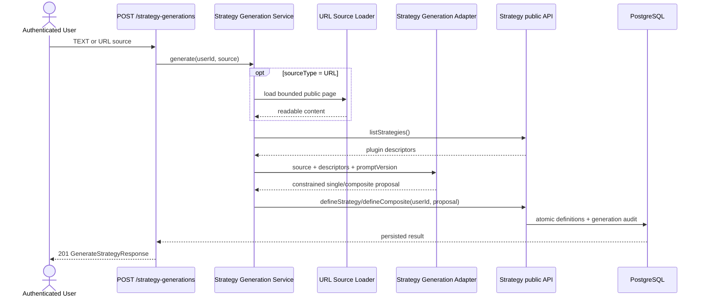

# Spec: AI-Generated Strategy Definitions

## 1. Overview

This capability adds an authenticated user command to generate one `StrategyDefinition` or `CompositeStrategyDefinition` from natural language or one website URL. `modules/strategy` owns orchestration and persistence; an LLM and URL loader are replaceable application ports. The primary canonical files are `strategy-spec.md`, `data-model.md`, and `component-contracts.md`; `search-spec.md` must clarify that Search candidate generation remains a separate bounded optimization workflow.

## ADDED Requirements

### Requirement: Exactly one supported source
The generation command MUST accept exactly one non-empty source: natural-language text or one public HTTP(S) URL. It MUST reject empty input, multiple sources, unsupported schemes, and malformed URLs before invoking an LLM.

#### Scenario: Text generation request
- **WHEN** an authenticated user submits non-empty `TEXT` input
- **THEN** Strategy starts one generation flow scoped to that user

#### Scenario: Ambiguous input
- **WHEN** a request contains both text and URL input or neither input
- **THEN** the API returns `400 VALIDATION_ERROR` and writes nothing

### Requirement: Website source loading is bounded
For URL input, the source loader MUST fetch only public HTTP(S) resources, MUST revalidate redirects, MUST block private/loopback/link-local destinations, and MUST apply configured timeout and response-size bounds. It MUST convert the page to bounded readable content and MUST NOT persist fetched raw HTML.

#### Scenario: Public strategy article
- **WHEN** a public HTTP(S) article is fetched within the configured bounds
- **THEN** its readable content is supplied to the generation adapter together with the registered strategy catalog

#### Scenario: Unsafe destination
- **WHEN** a URL or redirect resolves to a blocked address or exceeds a fetch bound
- **THEN** generation fails with a source-loading error and no definition is written

### Requirement: LLM output is a constrained proposal
The LLM adapter MUST receive the registered `StrategyPluginDescriptor[]` and MUST return a schema-constrained proposal for either a single registered plugin with parameters or a composite of registered plugins with method, weights, and thresholds. It MUST NOT return executable source code as a runnable Strategy.

#### Scenario: Model proposes a registered single strategy
- **WHEN** the model returns a schema-valid proposal naming a registered plugin
- **THEN** the application maps it to the normal Strategy definition validation flow

#### Scenario: Model proposes an unknown plugin
- **WHEN** the model output references an unregistered plugin or violates the proposal schema
- **THEN** the application rejects the output and persists neither the output nor a definition

### Requirement: Existing Strategy rules remain authoritative
Every generated Strategy Definition and Composite Strategy Definition MUST pass the same parameter schema, implementation provenance, component ownership, combination method, weight, threshold, immutability, version allocation, and idempotency rules as manually created definitions.

#### Scenario: Invalid generated parameters
- **WHEN** a model proposal contains a parameter outside the registered descriptor's constraints
- **THEN** `defineStrategy` rejects it and the generation operation writes nothing

#### Scenario: Valid generated composite
- **WHEN** every proposed component and combination value is valid for the authenticated user
- **THEN** component definitions, the composite, and generation provenance are persisted atomically

### Requirement: Successful generation provenance is persisted
The system MUST persist one owner-scoped `strategy_generation_requests` row for every successful generation, recording source type and original source, model name/version, prompt version, output kind, and the resulting Strategy or Composite Definition reference. Failed attempts MUST NOT create this row in the MVP.

#### Scenario: Successful generation audit
- **WHEN** a generated definition commits successfully
- **THEN** the response includes `generationId` and the audit row identifies the exact persisted result and generation provenance

### Requirement: Generation failures are atomic and isolated
Input errors, fetch failures, LLM timeouts/errors, malformed output, and Strategy validation errors MUST return a bounded error without partial definitions/components/audit rows. Manual Strategy creation, Search, Market Data, and existing definitions MUST remain usable.

#### Scenario: Model timeout
- **WHEN** the configured LLM call exceeds its timeout
- **THEN** the request fails without partial writes and unrelated capabilities continue operating

## 3. Behavior



## 4. Contracts

```typescript
export type GenerateStrategyRequest =
  | { sourceType: "TEXT"; text: string; url?: never }
  | { sourceType: "URL"; url: string; text?: never };

export interface GenerateStrategyResponse {
  generationId: string;
  kind: "SINGLE" | "COMPOSITE";
  strategyDefinition?: StrategyDefinition;
  compositeStrategyDefinition?: CompositeStrategyDefinition;
}

export interface StrategyGenerationAdapter {
  generate(input: {
    sourceText: string;
    strategies: readonly StrategyPluginDescriptor[];
    promptVersion: string;
  }): Promise<GeneratedStrategyProposal>;
}
```

REST mapping: `POST /strategy-generations` requires a bearer JWT and returns `201` on committed success, `400` for request/output/Strategy validation errors, `422` for unusable source content, and `503` for bounded source/model unavailability.

The `strategy_generation_requests` table MUST have `user_id`, mutually exclusive source fields, model/prompt provenance, mutually exclusive output references, and a creation timestamp. Its referenced definition MUST have the same owner.

## 5. Constraints

- One synchronous bounded generation call; no generation queue or streaming lifecycle.
- One model adapter configured by the composition root; provider-specific SDK types stay in infrastructure.
- No generated executable code, dynamic plugin installation, or direct LLM database access.
- No raw fetched HTML persistence.
- Search's `Generator` remains responsible only for candidates inside a bounded Search Run.

## 6. Acceptance Criteria

- [ ] Both text and public website input can produce and persist a valid single or composite definition.
- [ ] Generated output passes exactly the same Strategy validation and ownership rules as manual output.
- [ ] Unsafe URLs, unknown plugins, malformed output, and timeouts produce no partial rows.
- [ ] Successful rows preserve model, prompt, source, owner, and result provenance.
- [ ] No model-generated code is executed.

