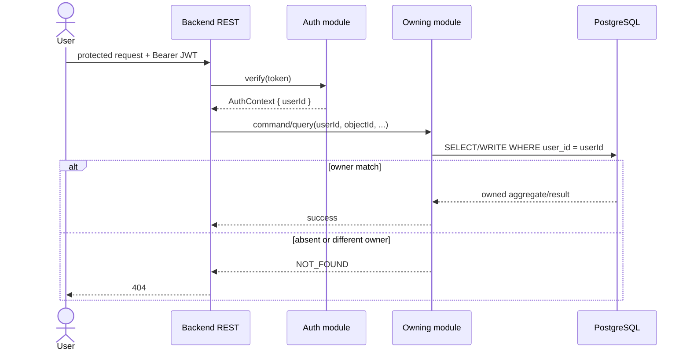

# Spec: Multi-Tenant Authentication and Ownership

## 1. Overview

This capability extends `modules/auth` and adds per-user ownership boundaries to `modules/strategy`, `modules/search`, `modules/leaderboard`, and derived Backtesting/Experiment reads. Its canonical documentation targets are `auth-spec.md`, `strategy-spec.md`, `search-spec.md`, `ranking-spec.md`, `data-model.md`, and `component-contracts.md`.

Actors are an unauthenticated visitor registering or logging in, an authenticated user operating only on their own data, and Backend REST middleware translating a bearer token into an application-level `userId`.

## ADDED Requirements

### Requirement: Minimal password and JWT authentication
The Auth module MUST register unique email/password users using a bcrypt password hash, MUST authenticate valid credentials, and MUST issue a stateless signed JWT containing `sub = users.id`, `iat`, and a one-hour `exp`. It MUST NOT require OAuth, SSO, MFA, RBAC, refresh tokens, token rotation, or a server-side session store.

#### Scenario: Register and login
- **WHEN** a visitor registers a unique email and password and then logs in with the same credentials
- **THEN** the system stores only a bcrypt hash and returns a signed JWT whose `sub` identifies the new user

#### Scenario: Invalid authentication
- **WHEN** credentials are invalid or a protected endpoint receives a missing, invalid, or expired bearer token
- **THEN** the system returns `401` without exposing a password hash or protected data

### Requirement: Authenticated context is authoritative
Protected REST handlers MUST derive `userId` only from the verified bearer token and MUST pass it explicitly to owner-aware module APIs. A request-body, path, or query `userId` MUST NOT grant access.

#### Scenario: Forged body owner
- **WHEN** authenticated user A submits user B's ID in a command body
- **THEN** the command is evaluated as user A and cannot create or read data as user B

### Requirement: User-owned aggregate roots
Every Strategy Definition, Composite Strategy Definition, Search Run, and Leaderboard Scope MUST have exactly one immutable `user_id` referencing `users.id`. Definition family/version and scope name/version uniqueness MUST be evaluated within that owner.

#### Scenario: Same logical names for different users
- **WHEN** users A and B independently create the same logical family name/version or scope name/version
- **THEN** both rows may exist because owner-aware uniqueness treats them as separate user data

### Requirement: Same-owner references
A Composite Strategy Definition MUST reference only Strategy Definitions owned by its user, and a Search Run MUST reference only a Leaderboard Scope owned by its user. Manual backtests, Candidates, Experiments, and Leaderboard Entries MUST be accepted or returned only when their immutable parent chain resolves to the authenticated owner.

#### Scenario: Cross-user composite component
- **WHEN** user A attempts to create a composite containing user B's Strategy Definition ID
- **THEN** the Strategy module rejects the command with `OWNERSHIP_MISMATCH` and writes no composite

#### Scenario: Cross-user search scope
- **WHEN** user A attempts to start a Search Run with user B's Leaderboard Scope ID
- **THEN** Search rejects the command and writes no Search Run or Candidate

### Requirement: Owner-scoped queries conceal other users' objects
All reads and controls for user-owned or derived objects MUST include the authenticated owner boundary. If a valid ID belongs to another user, the REST API MUST return `404` and MUST NOT reveal that the object exists.

#### Scenario: Guessed Search Run identifier
- **WHEN** user A requests, pauses, resumes, cancels, or lists candidates for user B's Search Run ID
- **THEN** the system returns `404` and does not modify or disclose the run

#### Scenario: Guessed Experiment identifier
- **WHEN** user A requests an Experiment derived from user B's scope/definition chain
- **THEN** the system returns `404` and no Experiment or Trade detail is disclosed

### Requirement: Rankings are partitioned by owner
`rankSearchRun` MUST require an owner-matching Search Run, and persistent `topK` MUST require an owner-matching Leaderboard Scope. The fixed MVP `K = 10` applies independently to each user-owned scope; experiments from different users MUST NOT compete in one ranking.

#### Scenario: Equal benchmark data under different owners
- **WHEN** users A and B create scopes that pin the same immutable dataset and formula
- **THEN** each user receives a separate Top-10 containing only Experiments authorized through that user's scope

## 3. Behavior



## 4. Contracts

```typescript
export interface AuthContext { userId: string }

export interface AuthModulePublicApi {
  register(email: string, password: string): Promise<void>;
  login(email: string, password: string): Promise<{ token: string }>;
  verify(token: string): Promise<AuthContext>;
}

// Representative breaking signatures
defineStrategy(userId: string, command: DefineStrategyCommand): Promise<StrategyDefinition>;
defineComposite(userId: string, command: DefineCompositeCommand): Promise<CompositeStrategyDefinition>;
startSearch(userId: string, config: StartSearchConfig): Promise<{ searchRunId: string }>;
topK(userId: string, scopeId: string): Promise<LeaderboardEntry[]>;
rankSearchRun(userId: string, searchRunId: string): Promise<SearchRunRankingEntry[]>;
```

```sql
ALTER TABLE strategy_definitions ADD COLUMN user_id UUID REFERENCES users(id);
ALTER TABLE composite_strategy_definitions ADD COLUMN user_id UUID REFERENCES users(id);
ALTER TABLE search_runs ADD COLUMN user_id UUID REFERENCES users(id);
ALTER TABLE leaderboard_scopes ADD COLUMN user_id UUID REFERENCES users(id);
-- Backfill to an explicit legacy user, then set every column NOT NULL.
```

Owner-aware indexes MUST cover the principal list/lookup paths. Owner-aware unique constraints MUST replace global family/version uniqueness where applicable.

## 5. Constraints

- PostgreSQL row-level security and a separate identity service are out of scope.
- `score_formulas`, candle snapshots, and sentiment snapshots remain global immutable reference data; access to them is mediated through an owned scope.
- No protected module parses JWTs; transport middleware owns token extraction.
- Ownership of child records is derived through immutable foreign-key chains rather than duplicated onto every table.

## 6. Acceptance Criteria

- [ ] Registration, login, expiration, and protected-route `401` behavior match `auth-spec.md`.
- [ ] Each requested aggregate root has non-null ownership and owner-aware uniqueness/indexing.
- [ ] Cross-user direct and indirect ID tests return `404` with no data leakage.
- [ ] Same-owner validation prevents mixed-owner composites and Search Runs.
- [ ] Search Run ranking and persistent Top-10 never mix users.
- [ ] Existing rows are assigned to one explicit migration owner before `NOT NULL` enforcement.

