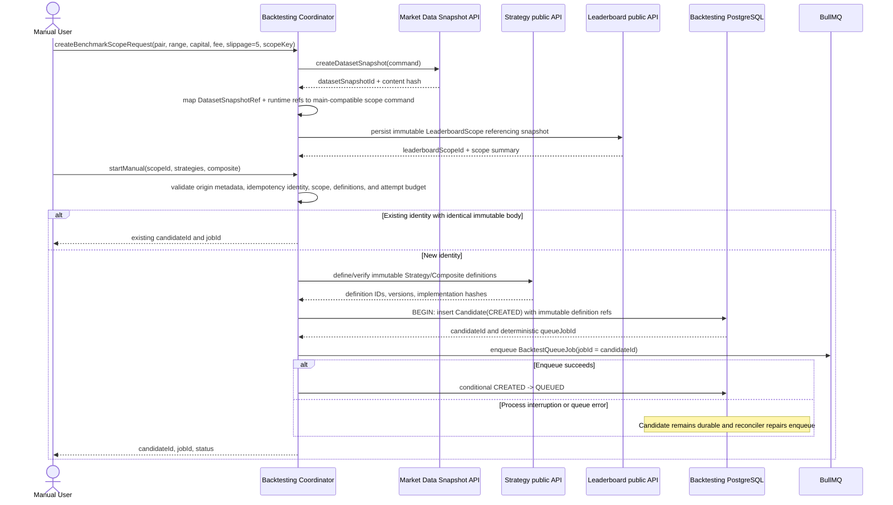
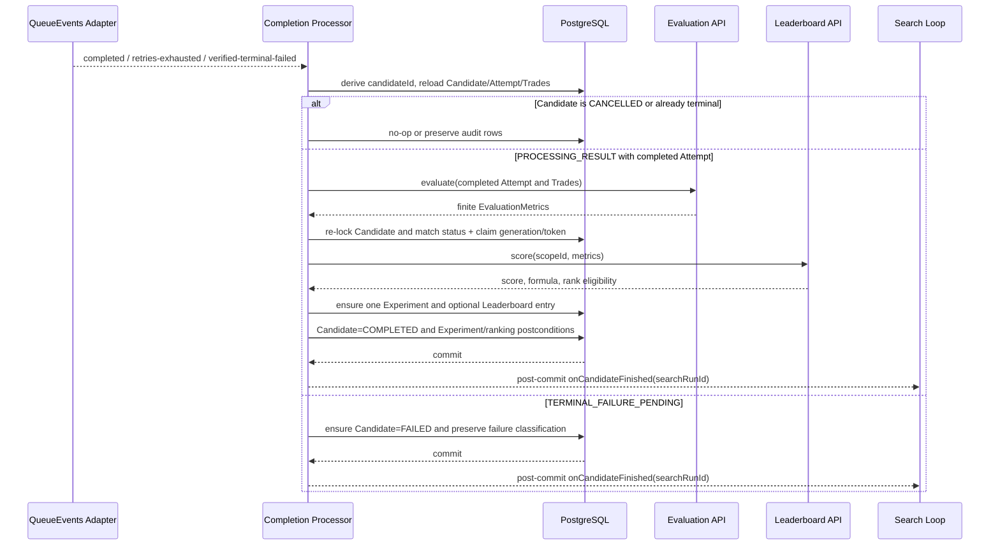
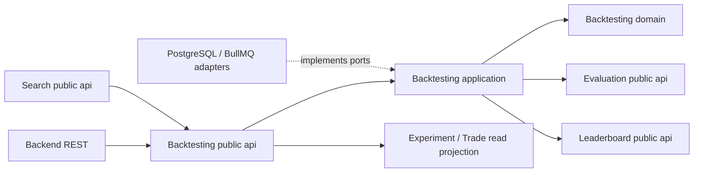

# Spec: Backtest Log and Audit Trail (`modules/backtesting`)

Status: proposed implementation baseline — aligned with the branch `main` module specs

This spec defines the durable record and read model used to understand what
happened to one Manual or Search backtest. It covers Candidate progress,
worker Attempt history, Trade Detail, completion processing, and the
provenance needed to reproduce an Experiment. It does not introduce a second
event bus or treat BullMQ messages as the source of truth.

## 1. Overview

### Purpose

The Backtest Log gives a user, operator, or downstream module a reliable
answer to: what was submitted, which immutable benchmark and strategy versions
were used, which worker deliveries ran, what each delivery did, why retries or
failures occurred, which Trades were produced, and whether the result was
evaluated and ranked.

The log is a durable read model over Backtesting-owned PostgreSQL records:
`candidate_strategies`, `backtest_attempts`, `trades`, and
`experiment_results`. The current Candidate state is mutable, while Attempt,
Trade, and Experiment history is historical audit data. An Attempt may be
updated only while it is `RUNNING`; once it is `COMPLETED` or `FAILED`, it is
immutable. Trade and Experiment rows are append-only.

### Scope

In scope:

- Candidate identity, origin, benchmark scope, immutable composite reference,
  lifecycle status, and timestamps.
- One durable Attempt record for each runnable worker delivery, including retry
  number, worker runtime provenance, timing, outcome, and error detail.
- Trade Detail produced by a completed Attempt, including audit-only Trades
  that finish after cancellation.
- Completion processing state, claim count, lease/retry timing, failure kind,
  and the final Experiment reference.
- Fenced worker deliveries, duplicate queue notifications, terminal watchdog
  recovery, and startup/periodic reconciliation.
- The `status(candidateId)` public API and the REST projections composed from
  it, plus the existing Experiment and Trade Detail read surface.
- Public submission, cancellation, Candidate audit, and paginated Trade Detail
  contracts needed by the Backend adapter and a future coding agent.

Out of scope:

- Logging every candle, indicator value, strategy decision, or worker debug
  statement as a durable domain row.
- A general Event Bus, Redis Pub/Sub stream, non-market WebSocket channel, or
  queue payload containing the full backtest result.
- Evaluation metric calculation, score policy, or Top-10 admission rules;
  these are owned by Evaluation and Leaderboard public APIs. This spec records
  their required input/output semantics for compatibility and replay, but the
  Backtesting module does not implement or persist their internal aggregates.
- Market-data ingestion, live trading, or a live-money audit system.
- A retention duration. Retention and archival policy is an operational
  decision and must not silently remove records required for a retained
  Experiment.

### Actors

| Actor                     | Interaction                                                                                                                                        |
| ------------------------- | -------------------------------------------------------------------------------------------------------------------------------------------------- |
| `apps/backend` / Frontend | Starts, polls, cancels, and displays a backtest through REST. It never reads Backtesting tables directly.                                          |
| Backtest Coordinator      | Creates Candidates, owns queue submission/reconciliation, exposes progress, and owns terminal-job watchdog behavior.                               |
| Backtest Worker           | Claims a queue job, creates a fenced Attempt, runs the pure simulation, and persists Attempt/Trade results before returning or throwing.           |
| Completion Processor      | Consumes small terminal wake-ups, reloads PostgreSQL state, evaluates successful Attempts, and finalizes the Candidate/Experiment transactionally. |
| `modules/search`          | Reads Candidate summaries through the Backtesting public API and receives a post-commit completion callback.                                       |
| Evaluation / Leaderboard  | Supplies metric and scoring policies through public APIs; neither owns Candidate or Attempt history.                                               |
| PostgreSQL                | Authoritative source for Candidate, Attempt, Trade, completion, and Experiment history.                                                            |
| BullMQ / Redis            | Durable work dispatch and terminal wake-up transport only; its messages are not the audit record.                                                  |

### Source interpretation and precedence

The supplied PDF is the Crypto Strategy Lab assignment brief. Its relevant
requirements are that Backtesting simulates historical trades, preserves
Trade Detail, produces the minimum evaluation inputs (Return, Win Rate, Max
Drawdown, and Number of Trades), supports a repeatable Generate -> Backtest ->
Evaluate -> Rank loop, and exposes observability such as candidates tested,
backtest duration, failed jobs, and the current top strategy. The PDF's sample
values, optional event names, and alternative technologies are illustrative;
they are not additional implementation commands.

The repository's `openspec/config.yaml`, Backtesting contracts, data model,
data flow, ADR-003, and existing module specs resolve those assignment goals
into the exact ownership, queue, persistence, fencing, and API rules in this
document. In particular, loop-level counters and ranking remain Search and
Leaderboard projections, while Backtesting owns the per-Candidate audit trail
that supplies them.

The branch `main` design documents are the compatibility baseline for shared
contracts. This spec adds the Backtest Log detail required by the assignment,
but it must not replace the existing `DatasetSnapshotRef`,
`StartManualBacktestCommand`, `SubmitSearchCandidateCommand`,
`BacktestQueueJob`, `BacktestQueueReturn`, or module ownership rules. Sections
§4.1, §4.2.1, and §4.4 define the additive mapping: REST/application adapters may
orchestrate scope creation and expose richer Trade Detail, while the shared
in-process and queue shapes remain main-compatible. Any field that is only an
additive projection is explicitly marked as such; there are no competing
runtime behaviors.

## 2. Requirements

### 2.1 Functional requirements

| ID        | Requirement                                                                                                                                                                                                                                                                                                                                                                                                                                                                                                                                                                                                        |
| --------- | ------------------------------------------------------------------------------------------------------------------------------------------------------------------------------------------------------------------------------------------------------------------------------------------------------------------------------------------------------------------------------------------------------------------------------------------------------------------------------------------------------------------------------------------------------------------------------------------------------------------ |
| FR-BL-001 | The Backtesting module must persist one Candidate identity containing `candidateId`, origin, immutable `selectionMode`, origin-specific Search metadata, `leaderboardScopeId`, immutable composite-definition reference, `queueJobId`, attempt budget, and lifecycle timestamps before queue submission. Search Candidates require `searchRunId`, `generatedBy`, and positive `iterationNumber`; Manual Candidates must contain none of those Search fields. A Manual transport retry is identified by an optional durable `submissionIdempotencyKey`; the key is request metadata and is not a strategy identity. |
| FR-BL-002 | The log must expose the Candidate's current lifecycle status using the documented states `CREATED`, `QUEUED`, `BACKTESTING`, `RETRY_WAIT`, `PROCESSING_RESULT`, `TERMINAL_FAILURE_PENDING`, `COMPLETED`, `FAILED`, and `CANCELLED`.                                                                                                                                                                                                                                                                                                                                                                                |
| FR-BL-003 | Every runnable worker delivery must create at most one Attempt number for the Candidate, and the persisted Attempt number must never exceed `Candidate.maxAttempts`. A redelivery that observes an existing `RUNNING` Attempt must reuse it or close it only after verified stalled/terminal evidence; repeated delivery of an already completed or terminal Candidate must create no new Attempt.                                                                                                                                                                                                                 |
| FR-BL-004 | Each Attempt must retain `attemptId`, `candidateId`, `queueJobId`, `attemptNumber`, `status`, `startedAt`, optional `completedAt`, worker runtime version, worker runtime SHA-256, and bounded, redacted failure context when the Attempt fails.                                                                                                                                                                                                                                                                                                                                                                   |
| FR-BL-005 | A successful Attempt must persist its Trades before the worker reports success to BullMQ. A failed Attempt must have no Trades. A completed Attempt belonging to a Candidate cancelled during simulation may retain Trades as audit history, but those Trades are not eligible for an Experiment or ranking.                                                                                                                                                                                                                                                                                                       |
| FR-BL-006 | The log must distinguish simulation Attempt status from completion-processing status. Completion processing uses the persisted `completionAttemptCount` as its claim generation, fixed completion budget, next-retry time, lease/token, `failureKind`, and `lastError`; final writes must match the Candidate, claim generation, token, and an unexpired lease (`completion_lease_until > now()`), and completion processing never consumes another simulation Attempt.                                                                                                                                            |
| FR-BL-007 | The log must classify terminal failure as `RETRY_EXHAUSTED`, `INFRASTRUCTURE`, or `COMPLETION_PROCESSING`, retain bounded/redacted error context, and preserve the original simulation failure kind when completion processing later exhausts its own budget. MVP Attempt failures identify `RETRYABLE`, `INFRASTRUCTURE`, or `CANCELLED_AUDIT`; permanent validation failures are rejected before Attempt allocation, and invalid evaluator output is `COMPLETION_PROCESSING`.                                                                                                                                    |
| FR-BL-008 | A non-cancelled Candidate whose completed Attempt is evaluated successfully must produce at most one ExperimentResult, linked to the exact Candidate, Attempt, Composite Definition, Leaderboard Scope, score formula, worker runtime, and evaluation runtime. The completion transaction must re-lock the Candidate and require the expected `PROCESSING_RESULT` state, claim generation/token, and unexpired completion lease before creating Experiment or ranking data.                                                                                                                                        |
| FR-BL-009 | The log must preserve a zero-trade successful Experiment with finite `totalProfitAmount = 0`, `totalReturnPercent = 0`, `winRatePercent = 0`, `maxDrawdownPercent = 0`, `numberOfTrades = 0`, `overallScore = 0`, `profitFactor = null`/`NO_TRADES`, and `rankEligible = false`; it must not fabricate a Trade or silently discard the successful Attempt.                                                                                                                                                                                                                                                         |
| FR-BL-010 | Worker final writes must be fenced by the active Attempt generation and Candidate state. A superseded delivery may emit `IGNORED/SUPERSEDED`, but it must not close another Attempt, overwrite Candidate state, or add Trades. The only exception is the explicit cancelled-audit fence in §3.4, which permits that same Attempt to finish its own audit Trades without reopening the Candidate.                                                                                                                                                                                                                   |
| FR-BL-011 | Cancellation must be durable and idempotent. A Candidate that is `CANCELLED` must remain `CANCELLED`; a worker already simulating may finish its own Attempt and Trades for audit, but no Experiment, ranking entry, Search completion counter, or slot release may be created from that audit result.                                                                                                                                                                                                                                                                                                             |
| FR-BL-012 | The Completion Processor must reload the authoritative log state for every terminal wake-up. Duplicate `completed`, `retries-exhausted`, or verified-terminal-failed notifications must converge to one final outcome without duplicate Attempts, Experiments, ranking entries, counters, or slot releases.                                                                                                                                                                                                                                                                                                        |
| FR-BL-013 | Startup and periodic reconciliation must recover Candidates whose queue notification was lost, whose enqueue state was interrupted, or whose worker crashed before its normal final write. Recovery must close an abandoned `RUNNING` Attempt or create a synthetic failed Attempt before terminal failure finalization.                                                                                                                                                                                                                                                                                           |
| FR-BL-014 | The public progress projection must be bounded and safe for polling: it must include Candidate status, deterministically ordered Attempt summaries, retry/completion metadata, failure information, timestamps, and an Experiment reference when available, but must not embed the full Trade list or raw queue payload. `maxAttempts` must obey a finite deployment-configured upper bound.                                                                                                                                                                                                                       |
| FR-BL-015 | The Experiment read surface must provide the reproducibility chain and Trade Detail for a completed Experiment: pair, timeframe, dataset range/hash, initial capital, fees, slippage, immutable strategy/composite versions and parameters, worker/simulator provenance, evaluation provenance, score-formula version, finite metrics including total net profit amount, score, rank eligibility, and deterministically ordered Trades. Each Trade row must expose the columns required by FR-BL-021.                                                                                                              |
| FR-BL-016 | Operational structured logs and metrics may record queue, worker, reconciliation, fencing, and completion events, but they must contain stable IDs and typed failure categories rather than secrets, credentials, or provider-specific raw payloads. Operational logs are diagnostic only; PostgreSQL remains authoritative.                                                                                                                                                                                                                                                                                       |
| FR-BL-017 | The allowlisted Backtesting boundary must expose submission, status, Candidate summary, cancellation, Attempt audit, and paginated Trade Detail capabilities. Terminal-signal processing and reconciliation are Backtesting application/bootstrap operations, not REST or Search-owned operations. REST adapters must map missing IDs to `404`, wrong-origin cancellation to `409`, and repeated cancellation of an already terminal Candidate to an idempotent success/no-op.                                                                                                                                     |
| FR-BL-018 | The Manual Backtest flow must let the caller create or select an immutable benchmark scope containing canonical pair/coin, timeframe, UTC `[from, to)` range, initial capital, fee rate, and MVP slippage of exactly `5` bps. The scope must seal the dataset snapshot before a Candidate is created; the accepted Candidate stores only the committed scope reference and later exposes the same values.                                                                                                                                                                                                          |
| FR-BL-019 | Manual submission may declare `selectionMode = "SINGLE"` or `"COMPOSITE"` as a client assertion. The server derives and persists `SINGLE` for exactly one Strategy Definition and one-component weight-`1` Composite, or `COMPOSITE` for at least two components; a mismatching assertion is rejected. The supplied Strategy Definitions must match the Composite components one-to-one, in deterministic order, with no duplicates or extras.                                                                                                                                                                     |
| FR-BL-020 | The Manual Backtest REST flow must expose `POST /leaderboard-scopes` for benchmark setup and `POST /backtests` for Manual submission. The first returns `201` with a committed scope reference; the second returns `202` with `candidateId`, `jobId`, and status. The REST adapter maps request bodies to the public Backtesting API and never writes domain tables directly.                                                                                                                                                                                                                                      |
| FR-BL-021 | Paginated Trade Detail must expose one row per completed Trade with pair, sequence/trade ID, entry time and executed price, optional stop-loss and take-profit trigger prices, exit time and executed price, quantity, fee amount, `slippageBps = 5`, slippage amount, net absolute `profit`, and net `resultPercent`. Amounts are in the scope's quote currency; timestamps are ISO-8601 UTC; all values are finite and deterministically ordered.                                                                                                                                                                |
| FR-BL-022 | Trade accounting must be reproducible: the simulator applies the scope fee rate and exactly 5 bps slippage to entry and exit fills, persists the applied amounts, and defines `profit` as net P&L after fee and slippage. The Experiment metrics must also expose total net profit amount and define `totalReturnPercent = totalProfitAmount / initialCapital * 100`.                                                                                                                                                                                                                                              |
| FR-BL-023 | Reproducibility provenance must include simulator version/hash (an MVP alias of the pinned worker runtime version/hash), benchmark timezone, fill/execution policy, same-candle ordering policy, and a deterministic seed or an explicit deterministic guarantee, so replaying the same sealed scope and definitions yields identical Trade rows and metrics.                                                                                                                                                                                                                                                      |
| FR-BL-024 | Benchmark-scope creation must be retry-safe. A scope request uses a required bounded idempotency key and immutable request SHA-256; the Market Data snapshot operation and scope persistence use the same create-or-get identity, while reconciliation repairs an interrupted cross-system call without creating a second scope or snapshot reference. A reused key with a different body is rejected with `409`.                                                                                                                                                                                                  |
| FR-BL-025 | The Backtesting Coordinator must derive the persisted `selectionMode` from the validated Composite component count (`1` = `SINGLE`, `>=2` = `COMPOSITE`). A transport `selectionMode` is only an optional client assertion; a mismatch is rejected with `400` and it is never an independent identity field. Every retained Strategy Definition must resolve through the Strategy public API using its exact implementation version/hash; unavailable artifacts fail explicitly with `IMPLEMENTATION_ARTIFACT_UNAVAILABLE`.                                                                                        |
| FR-BL-026 | The public Backtesting API must expose a replay-verification operation that loads the original sealed scope, Strategy/Composite artifacts, simulator/fill/evaluation policies, and runtime hashes, then compares canonical ordered Trades and metrics without creating a new Candidate, Experiment, ranking entry, or mutating historical rows. Missing artifacts or snapshots produce typed non-replayable failures.                                                                                                                                                                                              |
| FR-BL-027 | Shared v1 REST/in-process contracts remain compatible with branch `main` and use finite JavaScript `number` values for existing prices, quantities, fees, P&L, capital, percentages, and metrics. The simulator and persistence layer must still use the exact decimal policy internally and for canonical replay comparison; `DecimalString` is internal/persistence representation, not a replacement wire type. Trade timestamps must declare candle-level fill semantics, and every Trade cursor must be opaque, resource-bound, limit-bound, and encode the last `(entryTime, sequence, id)` ordering key.    |

### 2.2 Business rules

- **Authoritative storage:** PostgreSQL is the source of truth for the Backtest
  Log. BullMQ/Redis terminal observations wake processing but cannot prove that
  an Attempt, Trade, Candidate, or Experiment exists.
- **Durable-before-notification:** on normal worker return or throw paths, the
  worker persists Attempt outcome, Trades when successful, and the fenced
  Candidate pending state before BullMQ records completion or failure.
- **Historical mutability:** An Attempt may be updated from `RUNNING` to one
  terminal status exactly once under the Candidate lock. Terminal Attempts,
  Trades, and ExperimentResults are immutable historical records. Candidate
  status and completion-claim fields are the mutable current projection.
- **Cancellation fence:** cancellation clears the normal
  `active_attempt_number`; when a worker is still running, it first copies that
  number to `cancelled_audit_attempt_number`. Only the matching Candidate and
  Attempt number may perform the one audit finalization, after which the fence
  is cleared. This preserves the existing invariant that `active_attempt_number`
  is null outside `BACKTESTING`.
- **Deterministic identity:** `queueJobId = candidateId`. Search submission
  identity is `(searchRunId, iterationNumber)`; the same identity with the same
  immutable body returns the existing Candidate, while a conflicting body is
  rejected. Manual submissions create a new Candidate by default; a transport
  retry is idempotent only when it repeats the same durable
  `submissionIdempotencyKey` and immutable body. Queue retries share the
  Candidate/job identity but have distinct Attempt numbers. Experiment
  identity is unique per Candidate, so redelivery cannot create a second
  Experiment.
- **Idempotency key bounds:** a Manual `submissionIdempotencyKey` is a
  non-empty UTF-8 string of at most 255 bytes; comparison uses the exact
  normalized request value and the immutable-body digest is lowercase
  hexadecimal SHA-256. Keys outside these bounds are rejected before any
  Candidate or mapping row is written.
- **Canonical request digest:** immutable request bodies are canonicalized
  before hashing: object keys are lexicographically sorted, arrays retain their
  validated semantic order, timestamps are normalized to ISO-8601 UTC, finite
  numbers use the shared decimal spelling, omitted fields are omitted, explicit
  `null` is retained, server defaults are applied before hashing, and no
  whitespace is included. `requestSha256` is lowercase hexadecimal SHA-256 of
  those UTF-8 bytes. This rule applies to scope and Manual submission
  idempotency and prevents equivalent JSON bodies from producing different
  identities.
- **Manual benchmark selection:** the Manual screen may present benchmark
  setup as one form, but the durable backend sequence is
  `POST /leaderboard-scopes` followed by `POST /backtests`. Scope creation
  validates canonical pair/coin, supported timeframe, UTC inclusive `from`,
  UTC exclusive `to`, `from < to`, timeframe alignment, finite positive
  `initialCapital`, finite non-negative `feeRatePercent`, and the MVP literal
  `slippageBps = 5`. Any configured `stopLossPercent` or
  `takeProfitPercent` must be finite and in `[0, 100)`. It requires a bounded
  idempotency key and immutable
  request digest, then calls Market Data's idempotent
  `createDatasetSnapshot` for the exact pair/range, persists both
  `datasetSnapshotId` and its content hash, and asks Leaderboard to persist and
  lock the immutable scope. Backtesting never writes the `leaderboard_scopes`
  table directly. Market Data and PostgreSQL are separate resource managers,
  so this is an idempotent two-step saga rather than a pretend distributed
  transaction: retry/reconciliation repeats the same snapshot command and
  content hash, and changed sealed content returns
  `SCOPE_SNAPSHOT_CONTENT_CHANGED` instead of silently substituting a new
  benchmark. `startManual` accepts only that
  committed scope ID; it cannot
  silently replace pair, range, capital, fee, or slippage with current defaults.
  `sentimentSnapshotId` and `sentimentCreate` are mutually exclusive. When
  `sentimentCreate` is supplied, Backtesting calls Sentiment's public
  `createSnapshot` with the canonical command, verifies the returned immutable
  reference, and stores that reference in the Leaderboard scope. A caller may
  provide neither, but never both; Backtesting never persists sentiment points
  or reads Sentiment tables.
- **Manual strategy selection:** execution always resolves a
  `CompositeStrategyDefinition`, even for a single strategy.
  `derivedSelectionMode = SINGLE` requires one Strategy Definition, one
  matching Composite component, `WEIGHTED_SCORE`, and weight `1`;
  `derivedSelectionMode = COMPOSITE` requires at
  least two matching components and uses the existing `MAJORITY_VOTE` or
  `WEIGHTED_SCORE` rules. The submitted definitions must match component IDs
  one-to-one, with no duplicate or extra IDs. The Coordinator derives the
  persisted mode from component cardinality; a submitted mode is only a
  client assertion and a mismatch is rejected with `400`.
- **Manual strategy validation:** definitions are created or verified through
  the Strategy public API first. The API may participate in the caller's
  opaque process-level unit of work, but Strategy remains the owner of its
  tables and repositories. Backtesting persists only immutable definition
  IDs, versions, implementation hashes, and the Composite reference in its
  Candidate transaction; it never writes Strategy-owned tables or passes a
  database handle across the module boundary. Unknown, duplicate, mismatched,
  or conflicting IDs reject with a typed `400`/`409`.
  Weighted composites require finite weights summing to `1` and valid
  thresholds (`buy > sell`). If any component is an `INFORMATION` strategy,
  the selected scope must contain a matching sealed sentiment snapshot
  covering the candle range.
- **Strategy execution compatibility:** the worker calls the Strategy public
  `resolveStrategy` and `combineSignals` APIs. Combination semantics remain
  owned by Strategy: encode `BUY = +1`, `HOLD = 0`, `SELL = -1`; use strict
  `score > buy` / `score < sell` thresholds for `WEIGHTED_SCORE`; and return
  `HOLD` for every `MAJORITY_VOTE` tie. Majority Vote weights/thresholds use
  Strategy's normalized defaults. Backtesting records the resolved versions
  but does not reimplement or fork those rules.
- **Retained strategy artifacts:** before a worker claims an Attempt, every
  Strategy Definition is resolved through the Strategy public API using its
  retained `implementationVersion` and `implementationSha256`. If the exact
  artifact is unavailable, the Attempt records
  `failure_category = INFRASTRUCTURE`,
  `failure_code = IMPLEMENTATION_ARTIFACT_UNAVAILABLE`,
  `failure_retryable = false`, and the Candidate follows the terminal failure
  mapping; current deployed code is never substituted.
- **Attempt budget ownership:** `maxAttempts` is a positive integer requested
  by the caller but owned and capped by the Backtesting Coordinator's
  deployment configuration. The accepted Candidate persists the effective
  value before enqueue; no queue payload, worker, Search generator, or retry
  may increase it later.
- **Trade accounting:** a Trade's `entryPrice` and `exitPrice` are executed
  quote-per-base prices after the scope's 5-bps slippage policy. The simulator
  also records `feeAmount` and `slippageAmount` in quote currency. `grossProfit`
  is the P&L before fee/slippage, `profit` is net P&L after both, and
  `resultPercent = profit / notionalEntryValue * 100`. `quantity` and
  `notionalEntryValue` make the absolute amount reproducible. Stop-loss and
  take-profit are the intended trigger prices captured at entry; they are null
  when the selected strategy did not configure that order. `WIN` means profit
  strictly greater than zero, `LOSS` strictly less than zero, and
  `BREAKEVEN` exactly zero after the persisted decimal rounding policy.
- **MVP position policy `MVP_LONG_FULL_CAPITAL_V1`:** every Candidate starts
  `FLAT` and may hold at most one unleveraged `LONG` position. A `BUY` observed
  while `FLAT` schedules entry at the next eligible candle open; a `HOLD`
  leaves the position unchanged; a `SELL` while `LONG` schedules a strategy
  close at the next eligible candle close; and a `SELL` while `FLAT` is a no-op.
  The MVP never opens a short or reverses on the same candle, and no same-candle
  re-entry is allowed after an exit. Position quantity is full-capital and
  fee-aware: `quantity = initialCapital / (executedEntryPrice * (1 +
feeRatePercent / 100))`. `SHORT` remains a reserved extension in the generic
  formulas and is rejected by the MVP policy rather than inferred from a
  `SELL` signal.
- **Risk-policy source:** when `stopLossPercent` or `takeProfitPercent` is
  present in the sealed scope, the simulator derives the trigger from the
  unadjusted `marketEntryPrice`: LONG stop = entry × (1 - percent / 100),
  LONG take = entry × (1 + percent / 100). An absent policy persists null
  triggers. The policy is immutable with the scope and is never read from
  mutable Strategy code during replay.
- **Exact fill formulas:** let `s = slippageBps / 10,000 = 0.0005` and
  `d = +1` for `LONG`, `-1` for `SHORT`. The simulator computes
  `entryPrice = marketEntryPrice * (1 + d*s)` and
  `exitPrice = marketExitPrice * (1 - d*s)`;
  `entryNotional = entryPrice * quantity` and
  `exitNotional = exitPrice * quantity`; `notionalEntryValue` is exactly the
  persisted rounded `entryNotional`;
  `slippageAmount = abs(entryPrice - marketEntryPrice) * quantity +
abs(exitPrice - marketExitPrice) * quantity`;
  `grossProfit = d * (marketExitPrice - marketEntryPrice) * quantity`;
  `feeAmount = (feeRatePercent / 100) * (entryNotional + exitNotional)`;
  and `profit = grossProfit - slippageAmount - feeAmount`. These formulas use
  the scope decimal policy before persistence.
- **Evaluation policy `MVP_EVALUATION_V1`:** is the sole authoritative
  evaluation policy for this spec. `modules/evaluation` owns its implementation
  and version; Backtesting does not recalculate or override the metrics
  returned by that API. The adapter must persist this policy ID, and any future
  formula requires a new policy ID and compatibility mapping. Over the
  deterministically ordered closed Trades ordered by
  `(entryTime ASC, sequence ASC, id ASC)`,
  `numberOfTrades = N`, `wins = count(profit > 0)`,
  `winRatePercent = 0` when `N = 0`, otherwise `wins / N * 100`, and
  `totalProfitAmount = sum(profit)`. Let `equity_0 = initialCapital` and
  `equity_i = equity_(i-1) + profit_i`; `peak_i = max(equity_0..equity_i)`;
  `maxDrawdownPercent = max((peak_i - equity_i) / peak_i * 100)` with a
  minimum of zero. `positiveProfit = sum(max(profit_i, 0))`,
  `negativeProfit = sum(min(profit_i, 0))`, and
  `profitFactor = positiveProfit / abs(negativeProfit)` when `N > 0` and
  negative profit is non-zero. Its status is `NO_TRADES` when `N = 0`,
  `NO_LOSSES` when `N > 0`, positive profit exists, and `negativeProfit = 0`,
  `NO_GROSS_MOVEMENT` when `N > 0` and both positive and negative profit are
  zero, and `FINITE` otherwise. Sharpe uses per-Trade decimal returns
  `resultPercent / 100`, arithmetic mean, sample standard deviation (denominator
  `N - 1`), and
  `mean / stddev * sqrt(N)` with no risk-free rate; `N < 2` maps to
  `INSUFFICIENT_OBSERVATIONS`, and `N >= 2` with sample standard deviation
  `<= 1e-12` maps to `ZERO_VARIANCE`, matching the branch `main` Evaluation
  contract. Otherwise both metric statuses are `FINITE`.
  `profitFactor` is null for all non-`FINITE` profit-factor statuses; Sharpe is
  finite `0` for `INSUFFICIENT_OBSERVATIONS` or `ZERO_VARIANCE`. All formulas
  use closed Trades only.
- **Decimal policy `MVP_DECIMAL_HALF_UP_V1`:** use exact decimal arithmetic;
  round market/reference, executed, stop-loss, and take-profit prices to scale
  `8`, quantity to scale `8`, quote-currency amounts (`notionalEntryValue`,
  `grossProfit`, `feeAmount`, `slippageAmount`, `profit`) to scale `2`, and
  percentage fields to scale `8`, all with half-up rounding. Round prices and
  quantity before notionals, round each fee/slippage leg before summing, round
  `grossProfit`/`feeAmount`/`slippageAmount` before calculating rounded `profit`,
  then calculate and round `resultPercent`. The same policy applies to the
  equity curve and all metrics.
- **Fill policy `MVP_OHLC_STOP_FIRST_V1`:** candles are processed in UTC
  ascending order over the sealed `[from,to)` range. A signal observed at bar
  close enters at the next bar's `open`; the entry bar cannot also exit that
  position. On every later bar, protective exits are checked before a strategy
  close signal. For `LONG`, stop-loss triggers when `low <= stopLoss` and
  take-profit when `high >= takeProfit`; generic `SHORT` stop-loss triggers
  when `high >= stopLoss` and take-profit when `low <= takeProfit` are
  extension-only formulas because the MVP position policy rejects SHORT. If both trigger
  in one candle, stop-loss wins. If the bar opens beyond a trigger, the raw
  fill is the bar `open` (gap fill); otherwise it is the trigger price. If no
  exit trigger or strategy close occurs before the range ends, an open position
  is force-closed at the last available closed-candle `close`. This range-end
  force-close is an explicit terminal exception to the no same-candle exit
  rule: if the final candle is also the next-open entry bar, it may close at
  that candle's close with `exitReason = RANGE_END`. A strategy close
  is filled at that candle's `close`. Only one position may be open per
  component/composite context, and no same-candle re-entry is allowed. These
  raw fill prices become `marketEntryPrice`/`marketExitPrice` before the 5-bps
  execution adjustment. `entryTime` is the next candle's UTC open timestamp.
  A gap or protective trigger exit uses the current candle's UTC open
  timestamp because OHLC data has no authoritative intrabar time; a strategy
  close or `RANGE_END` exit uses the current candle's UTC close timestamp
  (`candle.timestamp + timeframe duration`). No synthetic sub-candle timestamp
  may be invented.
- **Slippage and fee policy:** `slippageBps = 5` means a rate of
  `5 / 10,000 = 0.0005` (`0.05%`) per fill. The simulator applies adverse
  slippage to both entry and exit according to side (`LONG`/`SHORT`) and
  persists the resulting executed prices and total slippage amount.
  `feeAmount = (feeRatePercent / 100) * (entryNotional + exitNotional)`;
  no UI-only recalculation may change persisted values.
- **Trade output units:** all money amounts use the quote currency of the
  selected pair; prices use quote currency per base asset; quantity uses base
  asset units; percentages are in percentage points (for example `1.25` means
  `1.25%`). Timestamps are ISO-8601 UTC. Decimal precision and half-up
  rounding are fixed by the scope's `decimalPolicyId` and included in
  provenance; no binary floating-point display value is authoritative.
- **Runtime provenance:** the worker must match the immutable scope/job runtime
  version and hash. The Experiment must retain the runtime that actually
  produced its Trades and the evaluation runtime that produced its metrics.
- **Cancellation audit:** audit Attempts/Trades that finish after cancellation
  remain queryable from Attempt/Trade history, but are excluded from Search
  operational counters, Experiment History, and ranking.
- **Completion retries are separate:** the five-claim completion budget,
  generation-bound lease/token, and backoff do not allocate another simulation
  Attempt. `completionAttemptCount` is the claim generation. Claiming is
  atomic under the Candidate lock. The processor renews its lease before it
  expires while evaluation/scoring is in progress. Every final write must
  match `(candidateId, completionAttemptCount, completionClaimToken)` and
  require `completionLeaseUntil > now()`. If the lease expires, the processor
  discards its in-memory metrics/score and performs no Experiment, ranking, or
  Candidate final write; it may reacquire a new claim only when the persisted
  count is below five. When the persisted count has reached five and the lease
  expires, the expiry handler terminalizes without issuing claim six.
- **Leaderboard side effects are idempotent:** `Leaderboard.submit` uses the
  stable key `(candidateId, leaderboardScopeId, scoreFormulaId)` and, when an
  Experiment ID exists, also records that ID. It may be safely retried after
  an uncertain transaction outcome and must return/ensure the same admission
  rather than insert a duplicate. The Completion Processor renews the lease
  before scoring/submission, rechecks the Candidate/lease before finalizing,
  and creates/ensures the Experiment and Leaderboard admission in one
  PostgreSQL unit of work. If the external call outcome is uncertain, the
  Candidate remains retryable and the same key is retried; no compensating
  delete or second admission is permitted. It invokes the Search callback
  only after commit.
- **Failure context:** an Attempt failure carries a stable category and
  retryability (`RETRYABLE`, `INFRASTRUCTURE`, or `CANCELLED_AUDIT`) plus a
  bounded, redacted message. Permanent validation failures are rejected before
  an Attempt is allocated. Invalid evaluator output is a completion-processing
  failure. Candidate `failureKind` is the terminal aggregation category and
  is not a substitute for the Attempt-level failure category. The existing
  retry policy maps retryable failures with remaining `maxAttempts` to
  `RETRY_WAIT`, the last simulation failure to `RETRY_EXHAUSTED`, and verified
  worker/queue failures to `INFRASTRUCTURE`.
- **Finite attempt budget:** `maxAttempts` is a positive integer no greater
  than the deployment's configured `BACKTEST_MAX_ATTEMPTS`. This bounds both
  simulation retry allocation and the size of the polling Attempt summary.
- **Manual idempotency storage:** a Manual `submissionIdempotencyKey` is
  stored in the dedicated Backtesting-owned `candidate_submission_keys` table
  defined in §4.2.1, together with a SHA-256 digest of the immutable request
  body. The `(origin = MANUAL, submissionIdempotencyKey)` pair is unique;
  insertion and return-existing behavior occur in the same transaction as
  Candidate creation. This mapping is a request idempotency index, not an
  audit event table.
- **No guessed failure:** a raw BullMQ `failed` observation is not terminal
  until the adapter verifies BullMQ state is terminal and no retry is runnable.
  Malformed queue fields are logged and left for reconciliation.
- **No large transport payload:** the queue terminal signal carries only the
  job ID, schema/version, status, small return reference, or failure context.
  Trade arrays and Experiment metrics are reloaded or computed through the
  Backtesting completion flow.
- **Read projection boundary:** `GET /backtests/{candidateId}` is a progress
  projection, not a Trade Detail endpoint. `GET /experiments/{experimentId}`
  is the detailed result surface.
- **Loop observability ownership:** Backtesting supplies per-Candidate
  progress and Search Run Candidate summaries through its public API. Search
  owns the `LoopStatus` projection for run state, candidates tested, failure
  counters, average duration, and stop conditions; Leaderboard supplies the
  current top entry. No module duplicates Candidate persistence to display
  these assignment-required observability fields. `candidatesTested` counts
  non-cancelled terminal Candidates; `failedCandidateCount` counts terminal
  `FAILED` Candidates; `retryExhaustedCandidateCount`,
  `infrastructureFailureCandidateCount`, and
  `completionProcessingFailureCandidateCount` partition terminal failures by
  `failureKind`; `failedAttemptCount` counts failed Attempts attached to
  non-cancelled Candidates; and `averageBacktestDurationMs` averages completed
  non-cancelled Attempts using `completedAt - startedAt`. Each Candidate is
  counted once in the completion transaction; startup reconciliation may repair
  counters from PostgreSQL.
- **Replay verification:** `verifyReplay` loads the exact sealed snapshot and
  retained Strategy artifacts, reruns the pure simulator and evaluator, and
  compares canonical decimal Trade rows and metrics. It is read-only and has
  no Candidate, Experiment, or Leaderboard side effects. Missing historical
  input or implementation artifacts returns a typed non-replayable failure
  rather than silently using current data or code.
- **No future-looking replay:** the log identifies the immutable candle and,
  when applicable, sentiment snapshot selected by the Leaderboard Scope. A
  replay must use those sealed references instead of querying mutable live
  market rows.

### 2.3 Candidate state transition contract

The following transitions are normative. `COMPLETED`, `FAILED`, and
`CANCELLED` are terminal. Cancellation wins when its transaction acquires the
Candidate lock before a worker or Completion Processor final write.

| Current state                      | Allowed next state         | Guard / owner                                                                                                                                               |
| ---------------------------------- | -------------------------- | ----------------------------------------------------------------------------------------------------------------------------------------------------------- |
| `CREATED`                          | `QUEUED`                   | Coordinator records enqueue success; update is conditional on `status = CREATED`.                                                                           |
| `CREATED`                          | `BACKTESTING`              | Worker claims the job before the late `QUEUED` update; the late update must not overwrite it.                                                               |
| `CREATED`                          | `TERMINAL_FAILURE_PENDING` | Watchdog verifies the deterministic job is terminal and no retry is runnable.                                                                               |
| `CREATED`                          | `CANCELLED`                | Manual/Search cancellation commits first.                                                                                                                   |
| `QUEUED`                           | `BACKTESTING`              | Worker allocates the active Attempt generation.                                                                                                             |
| `QUEUED`                           | `TERMINAL_FAILURE_PENDING` | Watchdog has `QueueRecoveryEvidence` proving the deterministic job is terminal and no retry is runnable; it closes or creates one synthetic failed Attempt. |
| `QUEUED`                           | `CANCELLED`                | Manual/Search cancellation commits first.                                                                                                                   |
| `BACKTESTING`                      | `RETRY_WAIT`               | Fenced retryable Attempt failure with remaining simulation budget.                                                                                          |
| `BACKTESTING`                      | `PROCESSING_RESULT`        | Fenced successful Attempt transaction persisted Trades and closed the Attempt.                                                                              |
| `BACKTESTING`                      | `TERMINAL_FAILURE_PENDING` | Last simulation failure or verified infrastructure failure.                                                                                                 |
| `BACKTESTING`                      | `CANCELLED`                | Cancellation commits first; a later audit Attempt write does not leave this state.                                                                          |
| `RETRY_WAIT`                       | `BACKTESTING`              | A retry delivery allocates the next Attempt generation.                                                                                                     |
| `RETRY_WAIT`                       | `TERMINAL_FAILURE_PENDING` | Watchdog verifies terminal/no-runnable queue state.                                                                                                         |
| `RETRY_WAIT`                       | `CANCELLED`                | Manual/Search cancellation commits first.                                                                                                                   |
| `PROCESSING_RESULT`                | `COMPLETED`                | Completion transaction matches claim generation/token and creates/ensures one Experiment.                                                                   |
| `PROCESSING_RESULT`                | `FAILED`                   | Completion claim is permanently invalid or exhausted; use `COMPLETION_PROCESSING`.                                                                          |
| `PROCESSING_RESULT`                | `CANCELLED`                | Cancellation commits first; completion discards computed metrics.                                                                                           |
| `TERMINAL_FAILURE_PENDING`         | `FAILED`                   | Completion transaction preserves `RETRY_EXHAUSTED` or `INFRASTRUCTURE`.                                                                                     |
| `TERMINAL_FAILURE_PENDING`         | `CANCELLED`                | Cancellation commits first; no Experiment is created.                                                                                                       |
| `COMPLETED`, `FAILED`, `CANCELLED` | none                       | Terminal states are never reopened.                                                                                                                         |

### 2.4 Non-functional requirements

- **Auditability:** a caller with a Candidate ID must be able to follow
  submission, queue identity, Attempt history, worker provenance, errors,
  Trades, completion outcome, and Experiment/ranking references without
  consulting ephemeral worker memory.
- **Reproducibility:** the same Candidate, immutable Composite Definition,
  Leaderboard Scope, worker runtime hash, and sealed snapshots identify the
  same historical inputs and implementation provenance.
- **Crash safety:** a process crash may delay the log's terminal state, but it
  must not make a committed Attempt/Trade/Experiment disappear or require a
  queue notification that was already lost.
- **Idempotency:** reprocessing the same Candidate or terminal signal is safe
  across restart, duplicate QueueEvents, stalled-worker replacement, and
  completion-claim retry.
- **Queryability:** progress reads must be bounded and indexed by Candidate,
  queue job, Search Run, and Experiment references. Trade Detail may be larger
  but is read separately from polling status.
- **Isolation:** a Backtest Worker is stateless between jobs; the log does not
  depend on process-local caches or a particular worker instance remaining
  alive.
- **Layering and boundaries:** the module follows `api -> application ->
domain`; infrastructure implements ports. Other modules consume the public
  Backtesting API and never read its tables or queue adapter directly.
- **Observability:** retries, fencing, terminal-watchdog repair, completion
  claim exhaustion, and malformed queue observations are measurable with
  stable Candidate/Attempt identifiers and typed categories.

## 3. Behavior

### 3.1 Create the Candidate log and enqueue work

The Manual Backtest UI can render benchmark setup and strategy selection as a
single form, but the durable flow has two explicit operations. First it creates
or selects a sealed `LeaderboardScope`; then it submits a Manual Candidate that
references that scope. This prevents a queue job from carrying mutable pair,
date-range, capital, fee, or slippage inputs.

```typescript
import type { DatasetSnapshotRef, Pair, Timeframe } from "modules/market-data/api";
import type { SentimentDatasetSnapshotRef } from "modules/sentiment/api";

export type DecimalString = string;
// Internal/persistence-only canonical base-10 text. The shared v1 wire
// contracts below retain finite `number` fields from branch main; domain code
// converts them to this exact representation before arithmetic and hashing.

// REST/application setup request. The adapter validates Pair/Timeframe and
// asks Market Data to createDatasetSnapshot before mapping this request to the
// main-compatible CreateLeaderboardScopeCommand below. `scopeIdempotencyKey`
// belongs to Backtesting's scope-creation ledger; it is not sent as a Market
// Data command field.
export interface CreateBenchmarkScopeRequest {
  name: string; // non-empty scope family name; Leaderboard allocates version
  pair: Pair; // opaque canonical Market Data symbol; do not parse BASE/QUOTE
  timeframe: Timeframe;
  datasetRange: { from: string; to: string }; // UTC, half-open [from, to)
  scopeIdempotencyKey: string; // required, 1..255 UTF-8 bytes
  initialCapital: number; // finite and > 0 on the shared v1 wire
  feeRatePercent: number; // finite and >= 0 on the shared v1 wire
  slippageBps: number; // validated to exactly 5 for this MVP
  scoreFormulaId: string;
  riskPolicy?: {
    stopLossPercent?: number;
    takeProfitPercent?: number;
  };
  sentimentSnapshotId?: string; // select an existing sealed Sentiment snapshot
  sentimentCreate?: CreateSentimentSnapshotCommand;
}

// Canonical in-process shape compatible with branch main's
// BacktestCoordinator.createBenchmarkScope. The snapshot and runtime refs are
// already resolved/sealed; no raw pair/range query enters the queue payload.
export interface CreateLeaderboardScopeCommand {
  name: string;
  datasetSnapshot: DatasetSnapshotRef;
  sentiment?: { relatedCoin: string; range: { from: string; to: string } };
  sentimentDatasetSnapshot?: SentimentDatasetSnapshotRef;
  initialCapital: number;
  feeRatePercent: number;
  slippageBps: number; // must equal 5 in this MVP
  scoreFormulaId: string;
  riskPolicy?: {
    stopLossPercent?: number;
    takeProfitPercent?: number;
  };
  workerRuntimeVersion: string;
  workerRuntimeSha256: string;
  evaluationRuntimeVersion: string;
  evaluationRuntimeSha256: string;
}

export interface StartManualBacktestCommand {
  leaderboardScopeId: string; // already committed by CreateLeaderboardScope
  strategyDefinitions: StrategyDefinition[];
  compositeDefinition: CompositeStrategyDefinition;
  maxAttempts: number;
}

// Canonical branch `main` Search boundary; Search never submits a selectionMode
// field and never imports Backtesting persistence or queue infrastructure.
export interface SubmitSearchCandidateCommand {
  searchRunId: string;
  leaderboardScopeId: string;
  iterationNumber: number;
  maxAttempts: number;
  strategyDefinitions: StrategyDefinition[];
  compositeDefinition: CompositeStrategyDefinition;
  generatedBy: GeneratorType;
}

export type GeneratorType = "RANDOM" | "DOMAIN_GUIDED" | "GENETIC";

export interface CreateSentimentSnapshotCommand {
  relatedCoin: string; // canonical base asset, for example BTC
  range: { from: string; to: string }; // half-open [from, to)
  aggregationWindowSeconds: number;
  modelName: string;
  modelVersion: string;
  modelSha256: string;
}

export interface BenchmarkScopeSummary {
  id: string;
  name: string;
  version: number;
  datasetSnapshot: DatasetSnapshotRef;
  sentimentDatasetSnapshot?: SentimentDatasetSnapshotRef;
  workerRuntimeVersion: string;
  workerRuntimeSha256: string;
  evaluationRuntimeVersion: string;
  evaluationRuntimeSha256: string;
  pair: Pair;
  timeframe: Timeframe;
  datasetRange: { from: string; to: string }; // UTC, [from, to)
  datasetSnapshotId: string;
  datasetSnapshotSha256: string;
  initialCapital: number;
  feeRatePercent: number;
  slippageBps: number;
  riskPolicy?: {
    stopLossPercent?: number;
    takeProfitPercent?: number;
  };
  decimalPolicyId: "MVP_DECIMAL_HALF_UP_V1";
  evaluationPolicyId: "MVP_EVALUATION_V1";
  scoreFormulaId: string;
  createdAt: string;
}

export interface ReplayVerificationResult {
  experimentId: string;
  sourceAttemptId: string;
  status: "MATCH" | "MISMATCH" | "NON_REPLAYABLE";
  comparedTradeCount: number;
  mismatches: Array<{ fieldPath: string; expected: string; actual: string }>;
  failureCode?: "MISSING_SNAPSHOT" | "IMPLEMENTATION_ARTIFACT_UNAVAILABLE";
}
```

The REST/application adapter for `POST /leaderboard-scopes` first validates the
request and calls Market Data's public snapshot operation. It then maps the
returned `DatasetSnapshotRef` (and, when needed, the Sentiment public snapshot
reference) into the main-compatible `CreateLeaderboardScopeCommand`. The
Backtesting scope API returns `201` and a scope ID only after the canonical
snapshot reference, runtime refs, capital, fee, fixed 5-bps slippage,
evaluation policy, and score formula are sealed. `startManual` (the
in-process equivalent of `POST /backtests`) accepts only the committed scope
ID and returns `202` with Candidate/job identifiers. A single UI form may call
both operations sequentially; it must not merge them into one mutable queue
payload.



The Candidate row and all immutable definition references are committed before
queue submission. Search uses `(searchRunId, iterationNumber)` as its durable
identity. Manual REST submissions use a durable `submissionIdempotencyKey`
when the caller needs retry-safe submission; omitting it intentionally creates
a new Candidate. A reused identity with different immutable content is a
conflict and cannot overwrite the existing Candidate.

If enqueue succeeds but the `QUEUED` update does not, the Candidate Log still
exists and the deterministic job ID lets reconciliation confirm or re-enqueue
work without creating a duplicate Candidate. The `QUEUED` update is always
conditional on `status = CREATED`, so it cannot overwrite `BACKTESTING` or a
terminal state.

### 3.2 Run, retry, and record one Attempt

```mermaid
sequenceDiagram
    participant Q as BullMQ
    participant W as Backtest Worker
    participant PG as PostgreSQL
    participant S as Sealed Scope / Snapshot

    Q->>W: BacktestQueueJob
    W->>PG: lock Candidate and reload current log
    alt Candidate is terminal or cancelled
        W-->>Q: IGNORED/CANCELLED or IGNORED/ALREADY_TERMINAL
    else Candidate is runnable
        W->>PG: close RUNNING Attempt only after verified stalled/terminal evidence
        W->>PG: allocate next Attempt and active fencing generation
         W->>S: read DatasetSnapshotRef through Market Data public reader
         opt INFORMATION component
             W->>S: read SentimentDatasetSnapshotRef/readAt through Sentiment public API
         end
         W->>W: resolve exact Strategy artifacts and call combineSignals
         W->>W: run pure Strategy/Composite simulation
        alt Attempt succeeds
            W->>PG: fenced transaction: Trades + Attempt=COMPLETED + PROCESSING_RESULT
            W-->>Q: COMPLETED with small durable references
        else Retryable failure and budget remains
            W->>PG: fenced transaction: Attempt=FAILED + RETRY_WAIT
            W-->>Q: throw; BullMQ retries
        else Last attempt or infrastructure failure
            W->>PG: fenced transaction: Attempt=FAILED + TERMINAL_FAILURE_PENDING
            W-->>Q: throw or terminal signal
        end
    end
```

Only the worker delivery holding the current active generation may perform the
normal final transaction. A `RUNNING` Attempt is not stale merely because a
wall-clock threshold elapsed: it may be closed only by a Candidate-locked
replacement delivery after verified BullMQ stalled/terminal evidence, or by
the terminal watchdog after the same verification. A late delivery rolls back
its attempted final write and returns `IGNORED/SUPERSEDED`; it cannot append
Trades under a superseded Attempt. A worker crash before this transaction is
repaired by the terminal watchdog, which closes the stale Attempt or inserts a
synthetic failed Attempt. The identity of a final worker write is
`(candidateId, attemptId, activeAttemptNumber)`.

The evidence is an internal Backtesting application port result, not a raw
BullMQ payload:

```typescript
export interface QueueRecoveryEvidence {
  jobId: string;
  kind: "TERMINAL_RECONCILIATION" | "STALL_REPLACEMENT";
  bullmqState: "failed" | "completed" | "active" | "waiting" | "delayed";
  noRunnableRetry: boolean;
  previousDeliveryLockLost: boolean;
  previousDeliveryToken?: string;
  previousDeliveryHeartbeatAt?: string;
  queueLockLostAt?: string;
  evidenceVersion: "QUEUE_EVIDENCE_V1";
  observedAt: string;
}
```

`TERMINAL_RECONCILIATION` is valid only when `bullmqState = "failed"` or a
validated `RETRIES_EXHAUSTED` observation exists and `noRunnableRetry = true`.
`STALL_REPLACEMENT` is valid only when the queue adapter has confirmed the
previous delivery's lock was lost, a replacement delivery owns the job, and
the evidence was read no more than the configured `QUEUE_EVIDENCE_MAX_AGE`
before the Candidate-locked transition. A delivery must publish a heartbeat
at least every `WORKER_HEARTBEAT_INTERVAL`; the queue adapter records the
last heartbeat and lock-loss timestamp. `STALL_REPLACEMENT` is valid only if
`previousDeliveryHeartbeatAt` is present, older than `WORKER_STALL_TIMEOUT`,
and `queueLockLostAt >= previousDeliveryHeartbeatAt`.
`previousDeliveryToken` must match the delivery token stored on the active
Attempt, and the replacement must atomically acquire a new delivery token
under the Candidate lock. A generic `failed` callback, an old evidence
object, a missing heartbeat, or a job merely being `active` is insufficient
to close an Attempt. The watchdog and replacement worker use this same
predicate before allocating the next generation. The deployment must set
`WORKER_HEARTBEAT_INTERVAL < WORKER_STALL_TIMEOUT / 2` and
`QUEUE_EVIDENCE_MAX_AGE <= WORKER_STALL_TIMEOUT`.

The database is authoritative for delivery ownership. An active Attempt has a
unique `deliveryToken`, `heartbeatAt`, and optional `queueLockLostAt`; the
Candidate stores the matching active Attempt number/token. A worker heartbeat
updates the Attempt only when `(candidateId, attemptId, attemptNumber,
deliveryToken)` still matches a `RUNNING` Attempt and the Candidate is still
`BACKTESTING`. Heartbeat writes are diagnostic/lease evidence and never move
Candidate state by themselves.

Every worker finalization is one Candidate-locked compare-and-set transaction:

```sql
-- Pseudocode: the repository must check the affected-row count.
UPDATE backtest_attempts
SET status = :terminalStatus, completed_at = :now
WHERE id = :attemptId
  AND candidate_id = :candidateId
  AND attempt_number = :attemptNumber
  AND delivery_token = :deliveryToken
  AND status = 'RUNNING';
```

If the update affects zero rows, the delivery is superseded and must not
insert Trades or update the Candidate. A successful finalization inserts
Trades in the same transaction with `UNIQUE (backtest_attempt_id,
trade_sequence)`, then updates the Candidate only when its active Attempt
number/token still match. A replacement delivery acquires a fresh token only
after the Candidate lock, verified `QueueRecoveryEvidence`, and persisted
attempt-budget check all succeed. This makes a late worker harmless even if
BullMQ's own lock state is delayed or ambiguous.

For each Attempt, the worker resolves every retained Strategy Definition using
its exact `implementationSha256`, loads the sealed scope/snapshot, calls
`analyze()` once per component, and calls `combineSignals()` using the
component signals in Composite component order. A `SINGLE` selection follows
the same path with one component and the one-component weight-1 Composite
Definition. The worker never substitutes a currently deployed implementation
or mutable market data when a retained artifact is missing. A post-claim
missing implementation artifact is recorded as
`failure_category = INFRASTRUCTURE`, `failure_code =
IMPLEMENTATION_ARTIFACT_UNAVAILABLE`, `failure_retryable = false`, then follows
`TERMINAL_FAILURE_PENDING`/`INFRASTRUCTURE`.

### 3.3 Complete, evaluate, and expose the result



Completion claims store a generation-bound lease/token and increment
`completionAttemptCount`, which is the claim generation. Transient errors use
the documented bounded delays (`5s`, `30s`, `2m`, `10m`, with jitter). A
fifth-claim crash is terminalized after lease expiry rather than creating claim
six. The processor renews the lease before expiry while evaluation/scoring is
running; every final transaction requires the matching generation/token and
`completionLeaseUntil > now()`. An expired processor discards its computed
result, and claim-five expiry is handled by the terminal expiry path rather than
by a sixth claim. The final transaction is idempotent across duplicate wake-ups
and may create only one Experiment per Candidate. `Evaluator.evaluate` receives only a
`CompletedBacktestResult` and must return finite `EvaluationMetrics`; with zero
Trades the existing metric policy applies (`Return = 0`, `Win Rate = 0`,
`Drawdown = 0`, `Sharpe = 0`/`INSUFFICIENT_OBSERVATIONS`, and
`ProfitFactor = null`/`NO_TRADES`). `Leaderboard.score` and `submit` are called
through their public APIs inside the documented completion unit of work; a
conflict or non-finite result creates no partial Experiment.

Backtesting does not write `search_runs` or Search-owned counters directly.
For Search Candidates, the Completion Processor supplies terminal facts to
Search's documented projection port inside the same opaque process-level unit
of work that commits the Candidate/Experiment postconditions; Search owns the
Search Run row and its counter update. After that unit commits, Backtesting
invokes the best-effort post-commit `onCandidateFinished(searchRunId)` callback
only to trigger prompt slot refill. A lost callback is repaired by Search
startup/periodic reconciliation, and a lost projection update is repaired by
the same Search-owned counter reconciliation query.

The process-level completion unit of work has one concrete owner: the
Backtesting composition root opens the PostgreSQL transaction, locks the
Candidate, creates `CompletionUnitOfWork`, and commits or rolls back the
transaction. The
Evaluation adapter is pure/read-only for the input Attempt and Trades and
returns metrics; it performs no persistence. Leaderboard's `score` and
idempotent `submit` operations receive the same UoW capability and write only
Leaderboard-owned rows enlisted in that transaction. Search's projection port
receives terminal facts through the same capability and writes only
Search-owned projection/counter rows. None of these adapters may open a nested
transaction or retain the capability after return. If any adapter fails, the
composition root rolls back all enlisted writes and leaves the Candidate claim
retryable (or terminalizes after the fixed claim budget); no partial Experiment,
ranking entry, Search counter, or slot release is allowed. An uncertain commit
is resolved by reloading the stable Candidate/Experiment/ranking keys, never by
compensating deletion.

The cancellation unit has the same ownership rule: Search's transition and
Backtesting's Candidate cancellations enlist in one composition-root UoW;
BullMQ cleanup occurs only after commit and is never part of the transaction.

#### 3.3.1 Atomic completion transaction

The Completion Processor uses one PostgreSQL transaction for every successful
or terminal completion. The composition root owns transaction control and
passes only transaction-bound repository ports to module adapters; no adapter
receives a database handle or opens a nested transaction. The lock order is
the repository-wide order: Search Candidates lock `SearchRun -> Candidate ->
LeaderboardScope`; Manual Candidates lock `Candidate -> LeaderboardScope`.

The success path is the following transaction script:

1. Lock and reload the Candidate, then verify `PROCESSING_RESULT`, the
   completion generation/token, and an unexpired completion lease.
2. Call the pure Evaluation policy on the already persisted Attempt/Trades;
   Evaluation performs no writes and does not enlist a repository.
3. Insert-or-get exactly one Experiment using the Candidate uniqueness key.
4. Call Leaderboard scoring and idempotent admission through its transaction-
   bound repository port; it may write only Leaderboard-owned rows.
5. For a Search Candidate, apply terminal facts and counters through the
   Search transaction-bound projection port; Search may write only its own
   `search_runs` projection.
6. Mark the Candidate terminal and commit. The post-commit refill callback
   is outside the transaction and is recoverable through reconciliation.

Any failure before commit rolls back every enlisted write. A retry reloads
the stable Candidate, Experiment, ranking, and Search identity keys; it never
uses compensating deletes. Database constraints are mandatory defenses,
including one Experiment per Candidate, stable Leaderboard admission identity,
matching Candidate/Scope foreign keys, and idempotent Search terminal-fact
application. Integration tests must inject a failure after each step and
prove that no partial Experiment, ranking entry, counter update, or Candidate
terminal transition remains.

### 3.4 Cancellation and audit completion

Cancellation first commits the Candidate's terminal `CANCELLED` state and
clears completion-claim fields. If a `RUNNING` Attempt exists, the
Candidate's `activeAttemptNumber` is copied to the durable
`cancelledAuditAttemptNumber` fence and the normal `activeAttemptNumber` is
cleared; the fence remains until that Attempt's one permitted audit
finalization. The `(candidateId, attemptNumber,
cancelledAuditAttemptNumber)` predicate identifies the audit Attempt because
`(candidateId, attemptNumber)` is unique. All normal worker and Completion
Processor transitions treat `CANCELLED` as terminal. If no Attempt is running,
`cancelledAuditAttemptNumber` is null. Waiting or delayed queue jobs may be
removed best-effort after commit; running workers are not force-killed. The
cancellation transaction wins only if it acquires the Candidate lock before
the worker/completion final-write transaction.

If cancellation wins before a worker claims the job, the worker returns
`IGNORED/CANCELLED` and no Attempt is created. If cancellation wins while a
worker is simulating, the worker takes the Candidate lock and may commit its
own still-`RUNNING` Attempt as `COMPLETED` and insert its Trades in the same
transaction, provided `(candidateId, attemptNumber,
cancelledAuditAttemptNumber)` matches the retained fence and the Attempt is
still `RUNNING`. This is the explicit audit exception to normal fencing: the
transaction must not move the Candidate, start completion processing, create
an Experiment, update Search counters, or admit a ranking entry. After the
audit transaction commits, `cancelledAuditAttemptNumber` is cleared. If the
Attempt is no longer active, the worker returns `IGNORED/SUPERSEDED` and
writes no Trades.

If cancellation wins while a Completion Processor is evaluating, the computed
metrics are discarded. Its final transaction must re-lock the Candidate and
require `PROCESSING_RESULT` plus the original claim generation/token; seeing
`CANCELLED` produces an idempotent no-op and no Experiment/ranking/counter
side effect.

If the cancelled worker crashes or stalls before its audit transaction commits,
the terminal watchdog uses the same Candidate/Attempt fence and verified queue
evidence to close one synthetic audit Attempt as `COMPLETED` with
`audit_only = true`, `failure_category = CANCELLED_AUDIT`, and
`failure_code = CANCELLED_AUDIT_INTERRUPTED`. That synthetic audit row has no
Trades and does not reopen the Candidate, create an Experiment, update Search,
or release a slot. The fence is then cleared; a late worker is
`IGNORED/SUPERSEDED`.

For Search cancellation, Search and Backtesting participate in one opaque
`CancellationUnitOfWork`: the Search Run transition and all non-terminal
Candidate cancellations commit together, while neither side passes a database
handle across the boundary. Only after that unit commits does Search call the
Coordinator's `removePendingJobs(candidateIds)` best-effort operation. It may
remove only waiting/delayed BullMQ jobs; it never force-kills a running worker.
Lost cleanup is harmless because Candidate cancellation and worker fencing are
durable, and startup reconciliation can retry the cleanup. The unit clears
`active_attempt_number`, completion retry timestamps, lease/token,
`failureKind`, and `lastError` for cancelled Candidates. It clears
`cancelled_audit_attempt_number` immediately only when no Attempt is running;
when a worker is running, the worker or terminal watchdog owns clearing that
fence after the one audit finalization.

### 3.5 Error / edge cases

| Case                            | Trigger                                                                                               | Required log behavior                                                                                                                                                                                                                                                                                                                                                                                                     |
| ------------------------------- | ----------------------------------------------------------------------------------------------------- | ------------------------------------------------------------------------------------------------------------------------------------------------------------------------------------------------------------------------------------------------------------------------------------------------------------------------------------------------------------------------------------------------------------------------- |
| Invalid submission              | Missing/invalid scope, definition, origin metadata, or non-positive attempt budget                    | Reject before queue submission; no Candidate or Attempt log is created.                                                                                                                                                                                                                                                                                                                                                   |
| Duplicate submission retry      | Same Search identity or Manual `submissionIdempotencyKey` and identical immutable body                | Return the existing Candidate/definitions; never create a second Candidate for the same idempotency identity.                                                                                                                                                                                                                                                                                                             |
| Idempotency conflict            | Same durable identity is reused with different scope, definitions, Search metadata, or attempt budget | Reject with a conflict; never overwrite the existing Candidate or definitions.                                                                                                                                                                                                                                                                                                                                            |
| Queue enqueue interruption      | Candidate committed but `QUEUED` update or enqueue acknowledgment is lost                             | Keep Candidate durable; reconciler confirms or re-enqueues `jobId = candidateId`.                                                                                                                                                                                                                                                                                                                                         |
| Retryable Attempt failure       | Worker error and attempt budget remains                                                               | Persist a failed Attempt with error and `RETRY_WAIT`; later delivery receives a new Attempt number.                                                                                                                                                                                                                                                                                                                       |
| Retry exhaustion                | Last allowed simulation Attempt fails                                                                 | Persist failed Attempt and `TERMINAL_FAILURE_PENDING` with `RETRY_EXHAUSTED`; Completion Processor later writes terminal `FAILED`.                                                                                                                                                                                                                                                                                        |
| Worker crash/stall              | No normal Attempt final write before queue becomes terminal                                           | Watchdog verifies terminal/no-runnable queue state, then closes a stale Attempt or inserts one synthetic failed Attempt with `INFRASTRUCTURE`; the synthetic insert is idempotent.                                                                                                                                                                                                                                        |
| Raw failed wake-up              | Queue reports `failed` while a retry may still run                                                    | Do not finalize; verify terminal BullMQ state and no runnable retry first.                                                                                                                                                                                                                                                                                                                                                |
| Duplicate terminal wake-up      | `completed` and/or verified failure signals arrive more than once                                     | Reload PostgreSQL and process or no-op idempotently; no duplicate Experiment, ranking, or counter. PostgreSQL state and claim generation/token win over signal arrival order.                                                                                                                                                                                                                                             |
| Conflicting terminal wake-up    | Signals for one job disagree or a signal's `jobId` does not match its return candidate ID             | Treat `jobId` as the routing key, reject the mismatch/anomaly, create no result from the signal, and leave the Candidate for reconciliation.                                                                                                                                                                                                                                                                              |
| Superseded delivery             | Stalled job overlaps with replacement worker                                                          | Return `IGNORED/SUPERSEDED`; no late Attempt close, Trade insert, or Candidate overwrite.                                                                                                                                                                                                                                                                                                                                 |
| Cancelled during simulation     | Candidate becomes `CANCELLED` after worker claim                                                      | Preserve audit Attempt/Trades if the worker can finish safely; exclude them from Experiment, ranking, and Search counters.                                                                                                                                                                                                                                                                                                |
| Cancelled worker crashes/stalls | Cancellation committed, but the fenced audit Attempt has no final write                               | After verified terminal/no-runnable evidence, close one synthetic completed `CANCELLED_AUDIT` Attempt with `CANCELLED_AUDIT_INTERRUPTED`, no Trades, and no downstream side effects; late delivery is superseded.                                                                                                                                                                                                         |
| Completed Candidate redelivery  | Queue job is redelivered after durable success                                                        | Return existing successful IDs or wake completion; do not simulate again.                                                                                                                                                                                                                                                                                                                                                 |
| Evaluation failure              | Evaluation throws, returns invalid data, or produces non-finite metrics                               | Retain successful Attempt/Trades, classify the failure as transient or permanent, retry only within the completion claim budget, and create no partial Experiment. Terminalization uses `COMPLETION_PROCESSING` and releases the Search slot once.                                                                                                                                                                        |
| Zero-trade success              | Simulation completes without Trades                                                                   | Persist Experiment with zero metrics/score as documented and `rankEligible = false`; keep the Attempt auditable.                                                                                                                                                                                                                                                                                                          |
| Missing historical input        | Required sealed snapshot data is incomplete or unavailable                                            | Validate snapshot references before worker claim; invalid/incomplete references reject with a typed 4xx and create no Attempt. If the sealed snapshot becomes unavailable after claim, record `failure_category = INFRASTRUCTURE`, `failure_code = MISSING_SNAPSHOT`, `failure_retryable = false`, move to `TERMINAL_FAILURE_PENDING`, and finalize `FAILED`. Never read future/live data or fabricate candles/sentiment. |
| Invalid lifecycle transition    | A worker, reconciler, cancellation, or completion callback observes a state not allowed by §2.3       | Lock/reload, reject or no-op the transition, and leave the durable Candidate state unchanged.                                                                                                                                                                                                                                                                                                                             |

## 4. Contracts

### 4.1 Public progress and result surfaces

The public Backtesting API remains the allowlisted boundary for status and
completion. The REST adapter composes these surfaces; it does not expose
repositories or queue internals.

The module is constructed through the allowlisted
`createBacktestingModule` composition facade documented in
`docs/design/project-structure.md` §5.1. `apps/backend` and
`apps/backtest-worker` may supply concrete repository, clock, queue, runtime,
evaluation, and Leaderboard adapters only through that bootstrap boundary.
`processTerminalSignal`, `reconcile`, and `removePendingJobs` are
Backtesting-owned application/bootstrap operations; consumers must not reach
into `modules/backtesting/infrastructure` directly.

Compatibility mapping: branch `main`'s in-process
`BacktestCoordinator.createBenchmarkScope(command)` remains the owner and
returns the canonical `LeaderboardScope`. The `BacktestLogApi` facade below is
the REST/read-model extension; its `createBenchmarkScope` delegates to that
Coordinator and maps the canonical scope to the richer
`BenchmarkScopeSummary`. It is not a second scope aggregate or a competing
scope-creation implementation.

```typescript
// modules/backtesting/api/contracts.ts

export type CandidateStatus =
  | "CREATED"
  | "QUEUED"
  | "BACKTESTING"
  | "RETRY_WAIT"
  | "PROCESSING_RESULT"
  | "TERMINAL_FAILURE_PENDING"
  | "COMPLETED"
  | "FAILED"
  | "CANCELLED";

export interface BacktestSubmissionAccepted {
  candidateId: string;
  jobId: string; // always equal to candidateId
  status: CandidateStatus;
}

export interface CancellationUnitOfWork {
  kind: "CANCELLATION";
  id: string;
  // Opaque process-level capability; never expose a PostgreSQL/ORM handle.
}

export interface CompletionUnitOfWork {
  kind: "COMPLETION";
  id: string;
  candidateId: string;
  completionAttemptCount: number;
  completionClaimToken: string;
  // Module calls enlist in the Backtesting transaction; no nested transaction.
  enlist(moduleName: "EVALUATION" | "LEADERBOARD" | "SEARCH"): void;
}

export interface CompletionTransactionController {
  execute<T>(work: (unitOfWork: CompletionUnitOfWork) => Promise<T>): Promise<T>;
  // The composition root owns BEGIN/COMMIT/ROLLBACK; adapters never receive
  // the database handle or transaction-control methods.
}

export interface SearchProjectionPort {
  applyCandidateTerminalFacts(
    facts: SearchCandidateTerminalFacts,
    unitOfWork: CompletionUnitOfWork,
  ): Promise<void>;
}

export interface SearchCandidateTerminalFacts {
  searchRunId: string;
  candidateId: string;
  terminalStatus: "COMPLETED" | "FAILED" | "CANCELLED";
  failureKind?: "RETRY_EXHAUSTED" | "INFRASTRUCTURE" | "COMPLETION_PROCESSING";
  durationMs?: number;
}

export interface CompletionCoordinator {
  complete(candidateId: string, unitOfWork: CompletionUnitOfWork): Promise<void>;
}

export interface BacktestLogApi {
  createBenchmarkScope(
    command: CreateLeaderboardScopeCommand,
    options: { scopeIdempotencyKey: string }, // required; 1..255 UTF-8 bytes
  ): Promise<BenchmarkScopeSummary>; // REST 201
  startManual(
    command: StartManualBacktestCommand,
    options?: { submissionIdempotencyKey?: string }, // 1..255 UTF-8 bytes; exact value is persisted
  ): Promise<BacktestSubmissionAccepted>;
  submitSearchCandidate(command: SubmitSearchCandidateCommand): Promise<BacktestSubmissionAccepted>;
  status(candidateId: string): Promise<CandidateProgress>; // missing ID -> 404
  summarizeSearchCandidates(searchRunId: string): Promise<SearchCandidateSummary>;
  listSearchCandidates(
    searchRunId: string,
    page: SearchCandidatePageRequest,
  ): Promise<SearchCandidatePage>;
  cancelSearchCandidates(
    searchRunId: string,
    unitOfWork: CancellationUnitOfWork,
  ): Promise<{ candidateIds: string[] }>;
  cancelManualCandidate(candidateId: string, unitOfWork: CancellationUnitOfWork): Promise<void>; // wrong origin -> 409
  removePendingJobs(candidateIds: string[]): Promise<void>; // internal, best-effort waiting/delayed cleanup only
  readAttempt(attemptId: string): Promise<BacktestAttemptAudit>; // missing ID -> 404
  listAttemptTrades(attemptId: string, page: TradePageRequest): Promise<TradePage>;
  readExperimentSummary(experimentId: string): Promise<ExperimentResultSummary>; // missing ID -> 404
  listExperimentTrades(experimentId: string, page: TradePageRequest): Promise<TradePage>;
  verifyReplay(experimentId: string): Promise<ReplayVerificationResult>; // read-only; no new Candidate/Experiment
}

export interface SearchCandidateSummary {
  searchRunId: string;
  active: CandidateProgress[]; // status order then candidateId
  queuedCount: number;
  runningCount: number;
  candidatesTested: number;
  failedCandidateCount: number;
  retryExhaustedCandidateCount: number;
  infrastructureFailureCandidateCount: number;
  completionProcessingFailureCandidateCount: number;
  failedAttemptCount: number;
  averageBacktestDurationMs: number | null;
}

// `maxInFlight`, failure partitions, duration averages, and the Search Run's
// stop/counter state remain owned by `modules/search` and its `search_runs`
// projection. Backtesting supplies only these Candidate projections/counts.

export interface SearchCandidatePageRequest {
  limit: number; // positive and <= configured MAX_PAGE_SIZE
  cursor?: string; // opaque Search Run-bound cursor
}

export interface SearchCandidatePage {
  items: CandidateProgress[]; // deterministic createdAt ASC, candidateId ASC
  nextCursor?: string;
}

export interface TradePageRequest {
  limit: number; // positive and <= configured MAX_PAGE_SIZE
  cursor?: string; // opaque resource-bound cursor; malformed/mismatched -> 400 INVALID_CURSOR
}

export interface TradePage {
  items: Trade[]; // entryTime ASC, sequence ASC, id ASC within the complete result set
  nextCursor?: string;
}

export interface BacktestApiError {
  code:
    | "INVALID_REQUEST"
    | "INVALID_CURSOR"
    | "NOT_FOUND"
    | "WRONG_ORIGIN"
    | "SCOPE_SNAPSHOT_CONTENT_CHANGED"
    | "MISSING_SNAPSHOT"
    | "SNAPSHOT_INCOMPLETE"
    | "IMPLEMENTATION_ARTIFACT_UNAVAILABLE"
    | "WORKER_RUNTIME_MISMATCH"
    | "WORKER_CRASH"
    | "QUEUE_ANOMALY"
    | "RETRY_EXHAUSTED"
    | "EVALUATOR_EXCEPTION"
    | "INVALID_EVALUATOR_OUTPUT"
    | "CANCELLED_AUDIT_INTERRUPTED"
    | "SUPERSEDED";
  message: string; // bounded and redacted; no raw provider payload
  requestId: string;
}

// A cursor is opaque to clients. Its authenticated server-side payload is
// version, resource kind/id, requested limit, and the last ordering tuple
// (entryTime, sequence, id). The server rejects a cursor bound to another
// Attempt/Experiment or limit with 400 INVALID_CURSOR; clients never construct
// or alter its contents.

// Additive Backtest Log projection. Existing branch `main` fields keep their
// names/types; the fields after `signal` are detail/audit extensions for the
// assignment and may be ignored by legacy consumers.
export interface Trade {
  id: string;
  sequence: number; // 1-based and unique within the Attempt
  pair: Pair; // opaque canonical Market Data symbol, derived from the Scope
  backtestAttemptId: string;
  signal: "LONG" | "SHORT";
  entryTime: string; // ISO-8601 UTC; next-entry candle open timestamp
  marketEntryPrice: number; // finite sealed market/reference price before slippage
  entryPrice: number; // finite executed quote-per-base price after slippage
  stopLoss: number | null; // configured trigger price, quote-per-base
  takeProfit: number | null; // configured trigger price, quote-per-base
  exitTime: string; // ISO-8601 UTC; open for gap/protective exits, close for strategy/range-end exits
  marketExitPrice: number; // finite sealed market/reference price before slippage
  exitPrice: number; // finite executed quote-per-base price after slippage
  exitReason: "STOP_LOSS" | "TAKE_PROFIT" | "STRATEGY_CLOSE" | "RANGE_END";
  quantity: number; // finite base-asset units
  notionalEntryValue: number; // finite quote-currency amount
  grossProfit: number; // finite quote currency, before fee and slippage
  feeAmount: number; // finite quote currency, entry + exit fee
  slippageBps: 5;
  slippageAmount: number; // finite quote currency, entry + exit slippage
  profit: number; // finite quote currency, net after fee and slippage
  resultPercent: number; // finite net profit / notionalEntryValue * 100
  result: "WIN" | "LOSS" | "BREAKEVEN";
}

import type { EvaluationMetrics } from "modules/evaluation/api";

// Backtest Log projection layered on top of the canonical branch `main`
// EvaluationMetrics. The shared Evaluator contract remains unchanged; the
// Completion Processor derives totalProfitAmount from immutable Trade rows.
export interface BacktestLogMetrics extends EvaluationMetrics {
  candidateId: string;
  totalProfitAmount: number; // finite quote currency, sum of closed Trade.profit
}
```

The Manual Backtest result table uses this canonical mapping:

| UI column                    | API field                       | Unit / rule                                                                                                                 |
| ---------------------------- | ------------------------------- | --------------------------------------------------------------------------------------------------------------------------- |
| Pair / Coin                  | `Trade.pair`                    | Opaque canonical Market Data `Pair`; the UI label does not imply BASE/QUOTE parsing.                                        |
| Thời gian vào lệnh           | `entryTime`                     | ISO-8601 UTC.                                                                                                               |
| Giá vào lệnh                 | `entryPrice`                    | Executed quote-per-base price after slippage.                                                                               |
| Stoploss                     | `stopLoss`                      | Trigger price, nullable when not configured.                                                                                |
| TakeProfit                   | `takeProfit`                    | Trigger price, nullable when not configured.                                                                                |
| Thời gian kết thúc           | `exitTime`                      | ISO-8601 UTC using the candle-level fill semantics in §2.2.                                                                 |
| Giá kết thúc                 | `exitPrice`                     | Executed quote-per-base price after slippage.                                                                               |
| Khối lượng                   | `quantity`                      | Base-asset quantity used to calculate notionals and P&L.                                                                    |
| Transaction cost (Phí)       | `feeAmount`                     | Non-negative quote-currency amount.                                                                                         |
| Slippage / Spread (UI label) | `slippageBps`, `slippageAmount` | Exactly 5 bps (`0.05%`) in MVP plus applied quote amount; “Spread” is a display synonym only, not a separate input or cost. |
| Profit                       | `profit`, `resultPercent`       | Net quote-currency P&L after fee/slippage and net percentage.                                                               |

```typescript
// GET /backtests/{candidateId}; bounded polling projection.
export interface CandidateProgress {
  candidateId: string;
  origin: "MANUAL" | "SEARCH";
  selectionMode: "SINGLE" | "COMPOSITE"; // additive read field; derived from immutable component count
  searchRunId?: string;
  iterationNumber?: number;
  leaderboardScopeId: string;
  status: CandidateStatus;
  attempts: BacktestAttemptProgress[]; // attemptNumber ASC; maxAttempts is deployment-bounded
  maxAttempts: number;
  activeAttemptNumber?: number;
  completionAttemptCount: number;
  completionMaxAttempts: number;
  completionNextRetryAt?: string;
  experimentResultId?: string;
  failureKind?: "RETRY_EXHAUSTED" | "INFRASTRUCTURE" | "COMPLETION_PROCESSING";
  failureCode?: string; // stable taxonomy code; never a raw provider exception
  lastError?: string;
  createdAt: string;
  updatedAt: string;
}

export interface BacktestAttemptProgress {
  attemptId: string;
  attemptNumber: number;
  status: "RUNNING" | "COMPLETED" | "FAILED";
  startedAt: string;
  completedAt?: string;
  failureCategory?: "RETRYABLE" | "INFRASTRUCTURE" | "CANCELLED_AUDIT";
  failureCode?: string;
  errorMessage?: string;
}

export interface BacktestAttemptAudit extends BacktestAttemptProgress {
  candidateId: string;
  queueJobId: string;
  workerRuntimeVersion: string;
  workerRuntimeSha256: string;
  tradeCount: number;
  auditOnly: boolean;
}

export interface ExperimentResultSummary {
  id: string;
  candidateId: string;
  backtestAttemptId: string;
  selectionMode: "SINGLE" | "COMPOSITE"; // additive read field; derived, never an independent identity
  compositeDefinitionId: string;
  leaderboardScopeId: string;
  scoreFormulaId: string;
  compositeDefinition: {
    id: string;
    logicalFamilyKey: string;
    version: number;
    method: "MAJORITY_VOTE" | "WEIGHTED_SCORE";
    components: Array<{ strategyDefinitionId: string; weight: number }>;
    thresholds?: { buy: number; sell: number };
  };
  datasetSnapshot: DatasetSnapshotRef;
  sentimentDatasetSnapshot?: SentimentDatasetSnapshotRef;
  strategyDefinitions: Array<{
    id: string;
    strategyName: string;
    implementationVersion: string;
    implementationSha256: string;
    version: number;
    parameters: Record<string, number | string>;
  }>;
  benchmark: {
    datasetSnapshot: DatasetSnapshotRef;
    sentimentDatasetSnapshot?: SentimentDatasetSnapshotRef;
    pair: Pair;
    timeframe: Timeframe;
    datasetRange: { from: string; to: string };
    datasetSnapshotId: string;
    datasetSnapshotSha256: string;
    initialCapital: number;
    feeRatePercent: number;
    slippageBps: number;
    riskPolicy?: {
      stopLossPercent?: number;
      takeProfitPercent?: number;
    };
    decimalPolicyId: "MVP_DECIMAL_HALF_UP_V1";
    evaluationPolicyId: "MVP_EVALUATION_V1";
    sentimentSnapshotSha256?: string;
  };
  workerRuntimeVersion: string;
  workerRuntimeSha256: string;
  simulatorVersion: string; // MVP alias of workerRuntimeVersion; no second runtime row
  simulatorSha256: string; // MVP alias of workerRuntimeSha256
  benchmarkTimezone: "UTC";
  fillPolicyId: "MVP_OHLC_STOP_FIRST_V1";
  sameCandleOrderPolicy: "STOP_LOSS_BEFORE_TAKE_PROFIT";
  deterministic: true;
  evaluationRuntimeVersion: string;
  evaluationRuntimeSha256: string;
  metrics: EvaluationMetrics;
  totalProfitAmount: number; // additive Backtest Log projection, net quote P&L
  overallScore: number;
  rankEligible: boolean;
  rankExclusionReason?: "NO_TRADES";
  createdAt: string;
}
```

The REST adapter exposes the Manual flow as:

Illustrative wire shape (pseudocode; the object bodies are not literal JSON):

```text
POST /leaderboard-scopes
Content-Type: application/json
Idempotency-Key: <required scope creation key>

{ name, pair, timeframe, datasetRange: { from, to }, initialCapital,
  feeRatePercent, slippageBps: 5, scoreFormulaId, riskPolicy?,
  sentimentSnapshotId? | sentimentCreate? }

201 Created
 { id, name, version, datasetSnapshot, sentimentDatasetSnapshot?,
   workerRuntimeVersion, workerRuntimeSha256, evaluationRuntimeVersion,
   evaluationRuntimeSha256, pair, timeframe, datasetRange, datasetSnapshotId,
   datasetSnapshotSha256, initialCapital, feeRatePercent, slippageBps: 5,
   riskPolicy?,
   decimalPolicyId: "MVP_DECIMAL_HALF_UP_V1",
   evaluationPolicyId: "MVP_EVALUATION_V1", scoreFormulaId }

POST /backtests
Content-Type: application/json
Idempotency-Key: <optional Manual submission key>

{ leaderboardScopeId, selectionMode?, strategyDefinitions,
  compositeDefinition, maxAttempts }

202 Accepted
{ candidateId, jobId, status: CandidateStatus }

GET /backtests/{candidateId}
200 OK
CandidateProgress

GET /leaderboard-scopes
200 OK
BenchmarkScopeSummary[]

GET /experiments/{experimentId}
200 OK
ExperimentResultSummary

GET /experiments/{experimentId}/trades?limit={limit}&cursor={cursor}
200 OK
TradePage

GET /search-runs/{searchRunId}/candidates
200 OK
SearchCandidatePage // apps/backend composition from Backtesting projections

POST /backtests/{candidateId}/cancel
204 No Content

GET /backtests/attempts/{attemptId}
200 OK
BacktestAttemptAudit

GET /backtests/attempts/{attemptId}/trades?limit={limit}&cursor={cursor}
200 OK
TradePage

POST /experiments/{experimentId}/replay-verification
200 OK
ReplayVerificationResult
```

The scope endpoint validates and seals benchmark inputs; the backtest endpoint
validates the optional `selectionMode` assertion/definitions, strips that
transport-only assertion, and invokes the main-compatible
`BacktestLogApi.startManual` command. The Coordinator derives the persisted
mode from the Composite component count.
The scope `Idempotency-Key` is required and is durably mapped to the sealed
scope request digest before `201` is acknowledged; a repeated identical body
returns the original scope, while a conflicting body returns `409`.
Invalid pair, range, capital, fee, slippage, strategy, or scope references
return typed `400`/`409` before Candidate creation. The `Idempotency-Key`
maps to the durable `submissionIdempotencyKey` described in §2.2.
Error responses use the bounded `BacktestApiError` shape and stable `code`;
raw provider exceptions and credentials never cross the adapter boundary.

`CandidateProgress` is intentionally smaller than the durable log: it does
not contain the Composite Definition, raw queue payload, or full Trade list.
`selectionMode` is immutable and derived from the Composite component count;
the optional request field is only an assertion and a mismatch is rejected;
the `strategyDefinitions` array in `ExperimentResultSummary` is one-to-one
with `compositeDefinition.components` and preserves that deterministic order.
`readExperimentSummary` returns the bounded summary. The existing internal
`ExperimentResult` aggregate may hydrate `trades` from child rows, but REST
Trade Detail is always paginated through `listExperimentTrades`; cancelled
audit Attempts use `readAttempt` and `listAttemptTrades` because they have no
Experiment. Every missing resource returns `404`; repeated cancellation of an
already terminal Candidate is a successful no-op, while cancelling a Search
Candidate through the Manual endpoint returns `409`. A malformed, expired, or
resource-mismatched Trade cursor returns `400 INVALID_CURSOR`; a valid empty
page returns `200` with `items = []` and no cursor.

`GET /search-runs/{searchRunId}/candidates` is a paginated Candidate history
projection (`SearchCandidatePage`); `summarizeSearchCandidates` is the bounded
counter/active-row summary and is not a substitute for that history endpoint.
`POST /backtests/{candidateId}/cancel` is the Manual-candidate cancellation
adapter and is idempotent for an already terminal Candidate. The Attempt audit
and Trade Detail routes work for cancelled audit Attempts as well as successful
Experiments. These routes require the caller to be authorized for the
resource; workers use an authenticated internal adapter, and resource IDs
alone never grant access.

REST ownership remains compatible with branch `main`: Search owns
`GET /search-runs/{searchRunId}` and its pause/resume/cancel controls, while
`apps/backend` composes `GET /search-runs/{searchRunId}/candidates` directly
from Backtesting's public Candidate projection. Backtesting does not expose a
second Search API or let Search read its tables.

`submissionIdempotencyKey` is supplied by the REST/application envelope when
needed and must be durably mapped to the accepted Candidate before the request
is acknowledged. It does not require Search or Strategy to import a transport
type.

`Evaluator.evaluate(result: CompletedBacktestResult): EvaluationMetrics` and
`Leaderboard.score/submit` remain the existing public contracts. The summary
must resolve the concrete `LeaderboardScope` fields shown above, immutable
strategy/composite versions and parameters, and the score-formula version.
All canonical EvaluationMetrics numbers must be finite. The Completion
Processor derives the additive Backtest Log field `totalProfitAmount` from
closed
Trade `profit` values in quote currency and
`totalReturnPercent = totalProfitAmount / initialCapital * 100`.
`maxDrawdownPercent` is stored as a non-negative loss magnitude; a UI may
format it as `-N%` but that sign is not persisted. With zero Trades,
`totalProfitAmount`, Return, Win Rate, Drawdown, Sharpe, and Overall Score are
`0`; Profit Factor is `null` with `NO_TRADES`, and the result is
`rankEligible = false` with `rankExclusionReason = NO_TRADES`. With non-zero
Trades, the existing `NO_LOSSES`, `NO_GROSS_MOVEMENT`,
`INSUFFICIENT_OBSERVATIONS`, and `ZERO_VARIANCE` status rules remain in force.

### 4.2 Data model, durable log ownership, and mapping

| Durable record             | Owner                                                              | Required audit meaning                                                                                                                                                                                                                                                |
| -------------------------- | ------------------------------------------------------------------ | --------------------------------------------------------------------------------------------------------------------------------------------------------------------------------------------------------------------------------------------------------------------- |
| `leaderboard_scopes`       | `modules/leaderboard`; Backtesting is the composition orchestrator | Leaderboard owns persistence, version allocation, locking, and immutability. Backtesting supplies the sealed Market Data/Sentiment references, capital, fee, fixed 5-bps slippage, score formula, decimal policy, and evaluation policy through the public scope API. |
| `candidate_strategies`     | `modules/backtesting`                                              | Current Candidate identity, origin, immutable selection mode, scope, queue identity, lifecycle, attempt budget, completion claims, failure classification, and timestamps.                                                                                            |
| `backtest_attempts`        | `modules/backtesting`                                              | One worker delivery's execution history, retry number, runtime provenance, timing, status, and error.                                                                                                                                                                 |
| `trades`                   | `modules/backtesting`                                              | Immutable Trade Detail produced by one Attempt; excluded from ranking when the Candidate was cancelled.                                                                                                                                                               |
| `experiment_results`       | `modules/backtesting`                                              | One successful non-cancelled Candidate's evaluated result, score, provenance, and rank eligibility.                                                                                                                                                                   |
| `leaderboard_entries`      | `modules/leaderboard`                                              | Optional scoped Top-10 admission/history; it is a projection of ranking, not the execution log.                                                                                                                                                                       |
| BullMQ job/terminal signal | `modules/backtesting/infrastructure/queue`                         | Transport wake-up and failure context only; never a durable domain source.                                                                                                                                                                                            |
| Operational logs/metrics   | Composition/observability adapters                                 | Diagnostic record only; must reference stable IDs and typed categories.                                                                                                                                                                                               |

The Backtesting module owns the Candidate, Attempt, Trade, and Experiment
aggregate for the MVP. Evaluation calculates metrics and Leaderboard decides
scoring/admission, but neither module writes Backtesting tables directly.

#### 4.2.1 Required persistence shapes and failure mapping

The following are normative persistence additions to the repository baseline.
They make the idempotency, cancellation-fence, and typed failure rules
implementable without relying on an in-memory map or an undocumented JSON
field. The coding agent must add the equivalent migration/repository fields;
the table/column names below are canonical for this spec.

The SQL block below describes the target schema, not a single migration to run
verbatim against a populated database. Migrations must use the following
expand/backfill/validate/contract sequence. Each phase is a separately
deployable migration and is safe to rerun by checking for existing columns,
constraints, indexes, and tables.

1. **Expand:** add new columns nullable (or with a temporary safe default),
   create the idempotency tables, and create indexes concurrently where the
   database supports it. Do not add a new `NOT NULL` constraint to a populated
   table in this phase. Deploy repositories that dual-write the new fields while
   retaining the legacy columns.
2. **Backfill:** run bounded, resumable batches keyed by the table primary key.
   Backfill scope fields from the existing immutable benchmark/snapshot
   reference and reject rows whose referenced snapshot is missing or whose
   content hash cannot be verified. Backfill `candidate_strategies.selection_mode`
   from the persisted component count (`1` => `SINGLE`, otherwise `COMPOSITE`),
   `trades.trade_sequence` from deterministic `(entry_time, id)` order per
   Attempt, trade accounting fields from the existing entry/exit/fee records,
   `trade_outcome` from net profit, Attempt failure fields from the legacy
   status/error mapping, `backtest_attempts.delivery_token` with a fresh random
   token for every historical Attempt (tokens are delivery fences, not business
   provenance), and `experiment_results.total_profit_amount` as
   `COALESCE(SUM(trades.profit), 0)` per Experiment. A zero-trade Experiment
   must receive `0`; never invent a Trade. Record migration rejects in a
   bounded operator-review table/log and do not silently coerce them.
3. **Validate:** run the invariant queries in the acceptance criteria plus
   duplicate checks for idempotency keys and `(backtest_attempt_id,
trade_sequence)`. Compare every backfilled total against the legacy value
   where one exists. The migration fails closed if any required row remains
   NULL, any hash/reference pair disagrees, or any value is non-finite.
4. **Contract:** only after validation succeeds, add the `NOT NULL`, CHECK,
   UNIQUE, and foreign-key constraints shown below, remove temporary defaults,
   and stop dual-writing superseded legacy fields. This phase must be recorded
   with a schema version consumed by the application bootstrap.

Existing rows are never assigned a guessed snapshot, strategy version, runtime
hash, or Trade sequence based on insertion order. If the legacy schema lacks a
source value required by this spec, the row is a migration reject and must be
resolved by an explicit operator/data migration before the contract phase.
Before the contract phase, every legacy `RUNNING` Attempt must be reconciled
or closed under the Candidate lock; the deployment must not introduce the new
fencing contract while an old worker can still write without a delivery token.
Migration rejects use the infrastructure migration ledger (migration ID,
table, primary-key identity, stable reason code, bounded detail, created time,
and resolved time), are unique per migration/row/reason, and block the
contract phase until resolved. This ledger is deployment metadata, not a
Backtesting domain event or a second source of Candidate history.

```sql
-- Leaderboard owns the canonical scope row and migration. The projection
-- fields below are additive Backtest Log requirements and must be migrated by
-- Leaderboard, not by Backtesting. They are denormalized copies of the sealed
-- snapshot/runtime inputs and must remain equal to the public references.
ALTER TABLE leaderboard_scopes
  ADD COLUMN pair TEXT NOT NULL,
  ADD COLUMN timeframe TEXT NOT NULL
    CHECK (timeframe IN ('1m','5m','15m','1h','4h','1d')),
  ADD COLUMN dataset_from TIMESTAMPTZ NOT NULL,
  ADD COLUMN dataset_to TIMESTAMPTZ NOT NULL,
  ADD COLUMN dataset_snapshot_sha256 CHAR(64) NOT NULL
    CHECK (dataset_snapshot_sha256 ~ '^[0-9a-f]{64}$'),
  ADD COLUMN sentiment_snapshot_sha256 CHAR(64)
    CHECK (sentiment_snapshot_sha256 IS NULL OR sentiment_snapshot_sha256 ~ '^[0-9a-f]{64}$'),
  ADD COLUMN sentiment_model_sha256 CHAR(64)
    CHECK (sentiment_model_sha256 IS NULL OR sentiment_model_sha256 ~ '^[0-9a-f]{64}$'),
  ADD COLUMN risk_stop_loss_percent NUMERIC
    CHECK (risk_stop_loss_percent IS NULL OR (risk_stop_loss_percent >= 0 AND risk_stop_loss_percent < 100)),
  ADD COLUMN risk_take_profit_percent NUMERIC
    CHECK (risk_take_profit_percent IS NULL OR (risk_take_profit_percent >= 0 AND risk_take_profit_percent < 100)),
  ADD COLUMN decimal_policy_id TEXT NOT NULL DEFAULT 'MVP_DECIMAL_HALF_UP_V1'
    CHECK (decimal_policy_id = 'MVP_DECIMAL_HALF_UP_V1'),
  ADD CONSTRAINT ck_scope_dataset_range CHECK (dataset_to > dataset_from),
  ADD CONSTRAINT ck_scope_mvp_slippage CHECK (slippage_bps = 5);

-- The pair/timeframe/range/hash columns are immutable denormalized copies of
-- the referenced sealed snapshot. Scope creation must verify equality with the
-- snapshot in the same application transaction; the snapshot remains the
-- canonical candle content and a changed benchmark creates a new scope.
-- `sentiment_snapshot_id` is an opaque external reference to Sentiment's
-- immutable SentimentDatasetSnapshotRef; it is intentionally not a
-- cross-module SQL FK. Its related coin, range, aggregation window, model
-- name/version/hash, point count, and content hash are obtained and verified
-- through Sentiment's public API before Candidate creation. Backtesting never
-- copies sentiment points or reads Sentiment tables.

ALTER TABLE leaderboard_scopes
  ADD COLUMN evaluation_policy_id TEXT NOT NULL DEFAULT 'MVP_EVALUATION_V1'
    CHECK (evaluation_policy_id = 'MVP_EVALUATION_V1');

ALTER TABLE experiment_results
  ADD COLUMN total_profit_amount NUMERIC NOT NULL DEFAULT 0
    CHECK (total_profit_amount NOT IN ('NaN'::numeric, 'Infinity'::numeric, '-Infinity'::numeric));

CREATE TABLE leaderboard_scope_idempotency_keys (
  idempotency_key          TEXT PRIMARY KEY
    CHECK (octet_length(idempotency_key) BETWEEN 1 AND 255),
  request_sha256           CHAR(64) NOT NULL
    CHECK (request_sha256 ~ '^[0-9a-f]{64}$'),
  leaderboard_scope_id     UUID NOT NULL UNIQUE REFERENCES leaderboard_scopes(id),
  created_at               TIMESTAMPTZ NOT NULL DEFAULT now()
);

CREATE TABLE candidate_submission_keys (
  origin                    candidate_origin_enum NOT NULL CHECK (origin = 'MANUAL'),
  submission_idempotency_key TEXT NOT NULL CHECK (octet_length(submission_idempotency_key) BETWEEN 1 AND 255),
  request_sha256            CHAR(64) NOT NULL CHECK (request_sha256 ~ '^[0-9a-f]{64}$'),
  candidate_id              UUID NOT NULL UNIQUE REFERENCES candidate_strategies(id),
  created_at                TIMESTAMPTZ NOT NULL DEFAULT now(),
  PRIMARY KEY (origin, submission_idempotency_key)
);

ALTER TABLE candidate_strategies
  ADD COLUMN selection_mode TEXT NOT NULL
    CHECK (selection_mode IN ('SINGLE','COMPOSITE')),
  ADD COLUMN active_attempt_delivery_token UUID,
  ADD COLUMN cancelled_audit_attempt_number INT
    CHECK (cancelled_audit_attempt_number IS NULL OR cancelled_audit_attempt_number > 0),
  ADD CONSTRAINT ck_active_attempt_delivery_fence CHECK (
    (status = 'BACKTESTING' AND active_attempt_number IS NOT NULL
      AND active_attempt_delivery_token IS NOT NULL)
    OR
    (status <> 'BACKTESTING' AND active_attempt_number IS NULL
      AND active_attempt_delivery_token IS NULL)
  );

ALTER TABLE backtest_attempts
  ADD COLUMN delivery_token UUID NOT NULL,
  ADD COLUMN heartbeat_at TIMESTAMPTZ,
  ADD COLUMN queue_lock_lost_at TIMESTAMPTZ,
  ADD COLUMN failure_category TEXT
    CHECK (failure_category IN ('RETRYABLE','INFRASTRUCTURE','CANCELLED_AUDIT')),
  ADD COLUMN failure_code TEXT,
  ADD COLUMN failure_retryable BOOLEAN NOT NULL DEFAULT false,
  ADD COLUMN audit_only BOOLEAN NOT NULL DEFAULT false,
  ADD CONSTRAINT ck_attempt_failure_shape CHECK (
    (status = 'FAILED' AND failure_category IN ('RETRYABLE','INFRASTRUCTURE')
      AND failure_code IS NOT NULL AND audit_only = false)
    OR
    (status = 'COMPLETED' AND (
      (audit_only = false AND failure_category IS NULL AND failure_code IS NULL)
      OR
      (audit_only = true AND failure_category = 'CANCELLED_AUDIT'
        AND failure_code IS NOT NULL)
    ))
    OR
    (status = 'RUNNING' AND audit_only = false
      AND failure_category IS NULL AND failure_code IS NULL)
  );

ALTER TABLE trades
  ADD COLUMN trade_sequence INT NOT NULL CHECK (trade_sequence > 0),
  ADD COLUMN market_entry_price NUMERIC NOT NULL,
  ADD COLUMN stop_loss NUMERIC,
  ADD COLUMN take_profit NUMERIC,
  ADD COLUMN market_exit_price NUMERIC NOT NULL,
  ADD COLUMN trade_exit_reason TEXT NOT NULL
    CHECK (trade_exit_reason IN ('STOP_LOSS','TAKE_PROFIT','STRATEGY_CLOSE','RANGE_END')),
  ADD COLUMN quantity NUMERIC NOT NULL CHECK (quantity > 0),
  ADD COLUMN notional_entry_value NUMERIC NOT NULL CHECK (notional_entry_value > 0),
  ADD COLUMN gross_profit NUMERIC NOT NULL,
  ADD COLUMN fee_amount NUMERIC NOT NULL CHECK (fee_amount >= 0),
  ADD COLUMN slippage_bps INT NOT NULL DEFAULT 5 CHECK (slippage_bps = 5),
  ADD COLUMN slippage_amount NUMERIC NOT NULL CHECK (slippage_amount >= 0),
  ADD COLUMN profit NUMERIC NOT NULL,
  ADD COLUMN trade_outcome TEXT NOT NULL CHECK (trade_outcome IN ('WIN','LOSS','BREAKEVEN')),
  ADD CONSTRAINT uq_trades_attempt_sequence UNIQUE (backtest_attempt_id, trade_sequence);

CREATE INDEX idx_trades_attempt_order
  ON trades (backtest_attempt_id, entry_time, trade_sequence, id);
```

`experiment_results.total_profit_amount` is an additive Backtesting projection
field. The completion transaction writes it from the closed Trade rows; a
migration backfill must derive legacy values from those rows before removing
the default, and a zero-trade result remains exactly `0`.

`candidate_submission_keys` is written in the same transaction as the Manual
Candidate. On a repeated key, the transaction locks the existing mapping,
compares `request_sha256`, and returns the existing Candidate when equal; a
different digest is a conflict and writes nothing. Search identity remains the
existing unique `(search_run_id, iteration_number)` constraint and does not use
this table. A missing Manual key intentionally bypasses the table and creates a
new Candidate.

`leaderboard_scope_idempotency_keys` is written in the same PostgreSQL
transaction as the immutable scope mapping after Market Data returns its
sealed snapshot. A repeated scope key with the same digest returns the existing
scope; a different digest returns `409` and writes nothing. If the process
fails after Market Data seals the snapshot but before PostgreSQL commits,
retrying the same key calls `createDatasetSnapshot` with the same normalized
command. Identical sealed content returns the existing snapshot reference;
changed content returns `SCOPE_SNAPSHOT_CONTENT_CHANGED` and requires explicit
operator reconciliation. An orphaned sealed snapshot is never attached to a
different request and may be garbage-collected only by Market Data
reconciliation.

The Attempt columns have these exact meanings: `failure_category = RETRYABLE`
means the simulation failed and the queue may deliver another Attempt;
`INFRASTRUCTURE` means a verified worker/queue failure or synthetic watchdog
Attempt; and `CANCELLED_AUDIT` is used only for a completed audit Attempt with
`audit_only = true`. `failure_code` is a stable allowlisted code, not a raw
provider error. `failure_retryable` is true only for a retryable simulation
failure. `error_message` remains bounded and redacted.

#### 4.2.2 Failure code taxonomy

The adapter and Completion Processor use this closed vocabulary. A new code is
a contract change and must update the queue adapter, repository mapping, and
acceptance fixtures together.

| Code                                  | Used when                                                                                                | Category / persistence                                                     | Retry or terminal action                            |
| ------------------------------------- | -------------------------------------------------------------------------------------------------------- | -------------------------------------------------------------------------- | --------------------------------------------------- |
| `INVALID_REQUEST`                     | Scope, strategy, origin, or attempt-budget validation fails before claim                                 | No Attempt row; typed `4xx`                                                | Do not enqueue or retry                             |
| `INVALID_CURSOR`                      | A Trade or Search cursor is malformed, expired, resource-bound to another ID, or limit-bound incorrectly | No Attempt row; typed `400`                                                | Client must request a fresh page                    |
| `NOT_FOUND`                           | Candidate, Attempt, Experiment, or scope ID is not visible to the authorized caller                      | No Attempt row; typed `404`                                                | Do not retry without a valid resource ID            |
| `WRONG_ORIGIN`                        | Manual cancellation targets a Search Candidate                                                           | No Attempt row; typed `409`                                                | Use the owning Search control                       |
| `SCOPE_SNAPSHOT_CONTENT_CHANGED`      | A repeated scope key resolves to different sealed Market Data content                                    | No Attempt row; typed `409`                                                | Require explicit new scope/reconciliation           |
| `MISSING_SNAPSHOT`                    | A claimed Candidate cannot read its sealed snapshot                                                      | `INFRASTRUCTURE`, `failure_retryable = false`                              | Terminal `FAILED`                                   |
| `SNAPSHOT_INCOMPLETE`                 | Snapshot metadata/content hash/candle count fails verification                                           | `INFRASTRUCTURE`, `failure_retryable = false`                              | Terminal `FAILED`                                   |
| `IMPLEMENTATION_ARTIFACT_UNAVAILABLE` | Exact retained Strategy implementation version/hash cannot be resolved                                   | `INFRASTRUCTURE`, `failure_retryable = false`                              | Terminal `FAILED`                                   |
| `WORKER_RUNTIME_MISMATCH`             | Worker runtime does not match the retained scope/runtime contract                                        | `INFRASTRUCTURE`, `failure_retryable = false`                              | Terminal `FAILED`                                   |
| `WORKER_CRASH`                        | Verified terminal worker loss requires a synthetic Attempt                                               | `INFRASTRUCTURE`, `failure_retryable = false`                              | Terminal `FAILED`                                   |
| `QUEUE_ANOMALY`                       | Queue observation is malformed/conflicting after durable reconciliation                                  | `INFRASTRUCTURE`, `failure_retryable = false`                              | Reconcile, then terminalize if no retry is runnable |
| `RETRY_EXHAUSTED`                     | The final retryable simulation Attempt fails                                                             | `RETRYABLE`, `failure_retryable = true`                                    | Move to `TERMINAL_FAILURE_PENDING`, then `FAILED`   |
| `EVALUATOR_EXCEPTION`                 | Evaluation throws or returns an unusable runtime result                                                  | Candidate `failureKind = COMPLETION_PROCESSING`; no new simulation Attempt | Retry completion within its five-claim budget       |
| `INVALID_EVALUATOR_OUTPUT`            | Evaluation returns non-finite or contract-invalid metrics                                                | Candidate `failureKind = COMPLETION_PROCESSING`; no new simulation Attempt | Terminal `FAILED` with `COMPLETION_PROCESSING`      |
| `CANCELLED_AUDIT_INTERRUPTED`         | A fenced cancelled worker crashes before audit finalization                                              | `CANCELLED_AUDIT`, completed `audit_only = true`                           | Clear fence; no Trades or downstream side effects   |
| `SUPERSEDED`                          | A stale overlapping delivery loses the Candidate/Attempt fence                                           | Queue return only; no row overwrite                                        | Ignore delivery and reconcile                       |

`Trade.pair` is a read-model field resolved through
`Trade -> BacktestAttempt -> Candidate -> LeaderboardScope`; it is not a
second mutable pair column. `TradePage` must join that immutable scope when
serving cancelled audit Attempts as well as completed Experiments. The API
names map to the durable columns as follows: `sequence` -> `trade_sequence`,
`stopLoss` -> `stop_loss`, `takeProfit` -> `take_profit`, `feeAmount` ->
`fee_amount`, `slippageAmount` -> `slippage_amount`, `profit` -> `profit`,
`marketEntryPrice` -> `market_entry_price`, `marketExitPrice` ->
`market_exit_price`, `exitReason` -> `trade_exit_reason`, and `result` ->
`trade_outcome`. In the MVP, `ExperimentResultSummary.simulatorVersion` and
`.simulatorSha256` are aliases of the durable worker runtime version/hash;
there are no separate simulator columns. A future distinct simulator requires
an additive schema/version change rather than silently changing the alias.

| Situation                                                                | Attempt persistence                                                                                                              | Candidate/completion result                                                                                   |
| ------------------------------------------------------------------------ | -------------------------------------------------------------------------------------------------------------------------------- | ------------------------------------------------------------------------------------------------------------- |
| Permanent request validation before worker claim                         | No Attempt row                                                                                                                   | Reject the request with a typed 4xx; no Candidate is created.                                                 |
| Retryable simulation error with budget remaining                         | `FAILED`, `failure_category = RETRYABLE`, `failure_retryable = true`                                                             | `RETRY_WAIT`; BullMQ may deliver the next Attempt.                                                            |
| Final retryable simulation error                                         | `FAILED`, `failure_category = RETRYABLE`, `failure_retryable = true`                                                             | `TERMINAL_FAILURE_PENDING` with `failureKind = RETRY_EXHAUSTED`; completion finalizes `FAILED`.               |
| Verified queue/worker stall or terminal infrastructure loss              | One failed real or synthetic Attempt, `failure_category = INFRASTRUCTURE`                                                        | `TERMINAL_FAILURE_PENDING` with `failureKind = INFRASTRUCTURE`; completion finalizes `FAILED`.                |
| Sealed snapshot is missing after a worker claim                          | `FAILED`, `failure_category = INFRASTRUCTURE`, `failure_code = MISSING_SNAPSHOT`, `failure_retryable = false`                    | `TERMINAL_FAILURE_PENDING` with `failureKind = INFRASTRUCTURE`; completion finalizes `FAILED`.                |
| Sealed snapshot fails metadata/content verification after a worker claim | `FAILED`, `failure_category = INFRASTRUCTURE`, `failure_code = SNAPSHOT_INCOMPLETE`, `failure_retryable = false`                 | `TERMINAL_FAILURE_PENDING` with `failureKind = INFRASTRUCTURE`; completion finalizes `FAILED`.                |
| Retained strategy implementation is missing after a worker claim         | `FAILED`, `failure_category = INFRASTRUCTURE`, `failure_code = IMPLEMENTATION_ARTIFACT_UNAVAILABLE`, `failure_retryable = false` | `TERMINAL_FAILURE_PENDING` with `failureKind = INFRASTRUCTURE`; completion finalizes `FAILED`.                |
| Cancellation wins during a running simulation                            | `COMPLETED`, `failure_category = CANCELLED_AUDIT`, `audit_only = true`, with Trades allowed                                      | Candidate stays `CANCELLED`; no completion, Experiment, ranking, Search counter, or slot-release side effect. |
| Evaluator transient error                                                | No new simulation Attempt                                                                                                        | Retry the completion claim within the five-claim budget.                                                      |
| Evaluator permanent error or non-finite output                           | No new simulation Attempt                                                                                                        | `FAILED` with `failureKind = COMPLETION_PROCESSING`; retain successful Attempt/Trades, create no Experiment.  |

### 4.3 Provenance and immutability contract

Every completed Experiment must be traceable through this chain:

```text
ExperimentResult
  -> Candidate + CompositeStrategyDefinition version/parameters
  -> StrategyDefinition component versions/parameters
  -> LeaderboardScope
       -> sealed candle snapshot ID + content hash
       -> pair/timeframe/range
       -> initial capital/fee/slippage settings
       -> optional SentimentDatasetSnapshotRef ID/content hash
       -> optional sentiment related coin/range/window/model version/hash
       -> score formula version
       -> worker runtime version/hash
       -> simulator version/hash
       -> UTC timezone, fill policy, same-candle order policy
       -> decimal policy, evaluation policy, and deterministic guarantee
       -> evaluation runtime version/hash
  -> completed BacktestAttempt
       -> ordered Trades
```

The worker runtime hash, snapshot identifiers/hashes, immutable definition
versions, and score formula are references to sealed records. They are not
replaced by the currently deployed code or a newly fetched live dataset during
read or replay.

The Market Data reference is the branch `main` `DatasetSnapshotRef`, whose
content hash uses the versioned `market-data-snapshot-v1` canonical
serialization and whose `candleCount`, pair, timeframe, and half-open range are
verified before scope commit. When the composite includes an `INFORMATION`
strategy, the Sentiment reference is the branch `main`
`SentimentDatasetSnapshotRef`; the worker and replay call Sentiment's public
`readSnapshot`/`readAt(snapshotId, candleCloseTime)` API and never read future
points, carry values forward, or access Sentiment tables directly.

The replay-verification contract is:

```typescript
// Backtesting application operation; exposed by the REST adapter as
// POST /experiments/{experimentId}/replay-verification.
verifyReplay(experimentId: string): Promise<ReplayVerificationResult>;
```

The operation loads the Experiment's exact `leaderboardScopeId`, snapshot
hashes, Composite/Strategy Definition versions, retained implementation
hashes, simulator/fill/decimal/evaluation policies, and runtime hashes. It
reruns the pure simulation and evaluator against those references, compares
the canonical ordered Trade rows and metrics, and returns `MATCH` only when
all values match. It never inserts a Candidate, Attempt, Experiment, or
Leaderboard entry and never updates the source rows. `MISMATCH` is a failed
determinism assertion; `NON_REPLAYABLE` is returned for
`MISSING_SNAPSHOT` or `IMPLEMENTATION_ARTIFACT_UNAVAILABLE`.

### 4.4 Terminal queue contract

The canonical serialized queue schema is authored at
`packages/contracts/queue/backtesting.ts` and is exported logically as
`@cryptox/contracts/queue/backtesting`. It is versioned with
`schemaVersion`. The job and return contracts are:

```typescript
export interface BacktestQueueJob {
  schemaVersion: 1;
  jobId: string;
  candidateId: string;
  leaderboardScopeId: string;
  maxAttempts: number;
  workerRuntimeVersion: string;
  workerRuntimeSha256: string;
  enqueuedAt: string;
}

export type BacktestQueueReturn =
  | {
      candidateId: string;
      status: "COMPLETED";
      attemptId: string;
      completedAt: string;
    }
  | {
      candidateId: string;
      status: "IGNORED";
      reason: "CANCELLED" | "ALREADY_TERMINAL" | "SUPERSEDED" | "PENDING_COMPLETION";
    };
```

`jobId === candidateId`, `maxAttempts` is positive and no greater than the
deployment `BACKTEST_MAX_ATTEMPTS`. The queue return follows the
branch `main` `BacktestQueueReturn` shape exactly; Attempt number, failure code,
and bounded error context remain PostgreSQL audit fields rather than queue
fields. The job contains no Trades, metrics, or raw provider payload. The
terminal signal is limited to the following kinds:

```typescript
export type BacktestQueueTerminalSignal =
  | {
      schemaVersion: 1;
      jobId: string;
      status: "COMPLETED";
      returnValue: BacktestQueueReturn;
    }
  | {
      schemaVersion: 1;
      jobId: string;
      status: "RETRIES_EXHAUSTED";
      attemptsMade: number;
    }
  | {
      schemaVersion: 1;
      jobId: string;
      status: "VERIFIED_TERMINAL_FAILED";
      failedReason: string; // bounded and redacted wake-up hint only
    };
```

The adapter validates the discriminator and fields, requires
`jobId === returnValue.candidateId` for `COMPLETED` signals, forwards the
main-compatible signal, and does not query domain tables. The Completion
Processor derives `candidateId = jobId`, reloads PostgreSQL, and performs the
domain decision, mapping only the bounded `failedReason` wake-up hint into
durable typed failure context.
Unknown or malformed versions, mismatched IDs, and conflicting terminal
observations are rejected as anomalies and left for reconciliation; they are
never guessed or silently coerced. QueueEvents is the existing BullMQ terminal
wake-up adapter; it is not a new durable event bus and the Search callback is a
direct post-commit application call.

### 4.5 Events

The MVP publishes no Backtesting domain events. BullMQ `QueueEvents` are
transport wake-ups only; they do not carry the audit record and are never a
replacement for PostgreSQL state. Search completion is a direct post-commit
application callback, not a Backtesting event. Any future domain-event
catalog requires a separate accepted architecture decision. The queue adapter
normalizes provider-specific observations: `RETRIES_EXHAUSTED` is accepted only
when BullMQ terminal state and `attemptsMade` prove no runnable retry remains;
otherwise the observation is only a reconciliation hint. The MVP therefore
uses state-driven processing with queue wake-ups, not event sourcing.

### 4.6 Module dependency direction

These boundaries are architecture decisions, not implementation suggestions:

- The Backtesting Coordinator owns Candidate lifecycle, queue reconciliation,
  cancellation fences, and completion claims because those operations must be
  serialized against PostgreSQL state and cannot depend on queue delivery
  order.
- PostgreSQL owns the authoritative Candidate/Attempt/Trade/Experiment audit
  history. BullMQ/Redis only dispatches work and wakes reconciliation; treating
  it as state would lose history on duplicate, delayed, or missing events.
- A sealed Leaderboard Scope is created before a Candidate so the worker can
  run against immutable market inputs and cost policies. This is why the UI's
  single form maps to two durable operations rather than one mutable queue
  payload.
- Backtest Workers are stateless and run pure simulation against the sealed
  scope and retained Strategy artifacts. This permits retries and replacement
  workers without changing the result or requiring process-local memory.
- Evaluation and Leaderboard remain public API consumers of completed results;
  they do not write Backtesting tables directly. This preserves aggregate
  ownership and prevents ranking concerns from changing execution history.



Consumers may import `modules/backtesting/api` or its approved bootstrap
facade only. `modules/search` may request Candidate summaries, submission, and
cancellation through the public Backtesting API; it may not read Candidate,
Attempt, Trade, or queue infrastructure directly.

## 5. Constraints

### Technical constraints

- TypeScript domain/application logic must remain independent of HTTP,
  PostgreSQL, Redis, BullMQ, framework code, and UI code.
- PostgreSQL repositories are the durable implementation of the log; Redis may
  support BullMQ but must not become authoritative for Candidate or result
  state.
- The Backtest queue is a competing-consumer work queue. It is not broadcast
  Pub/Sub and is the only asynchronous backend boundary in the MVP.
- Queue wire contracts are self-contained and versioned in
  `packages/contracts/queue/backtesting.ts`, exported as
  `@cryptox/contracts/queue/backtesting`; the queue adapter remains under
  `modules/backtesting/infrastructure/queue`.
- The polling projection must use bounded queries. Trade Detail is loaded
  separately so a large Experiment cannot make status polling unbounded.
- Schema changes must preserve the existing composite foreign keys and unique
  identities that enforce Candidate/Attempt/Experiment provenance and
  idempotency.
- Public REST reads and cancellation require an opaque authorization context
  from the adapter; application code authorizes resource ownership or operator
  scope before returning history or changing lifecycle state. IDs are not
  authorization credentials, and internal worker calls use authenticated
  service identity.

### Business constraints

- Cryptox is an experiment platform, not a live trading or financial execution
  system. The Backtest Log describes simulations only.
- Strategy and Composite Definitions, benchmark scopes, snapshot contents,
  terminal Attempt history, Trades, and Experiment results are immutable
  historical inputs/results; a newer implementation creates new versioned
  data. A `RUNNING` Attempt may transition once to a terminal status.
- A non-cancelled Candidate whose pipeline succeeds creates exactly one
  Experiment. A failed or cancelled Candidate creates none.
- Cancelled audit Attempts and Trades remain available for investigation but
  never affect Search counters, Experiment History, or ranking.
- Evaluation failures must not create a partial Experiment or non-finite
  metrics. A zero-trade success is retained as an auditable non-rankable
  Experiment.
- Logs must avoid secrets, credentials, raw provider payloads, and unbounded
  diagnostic blobs. Stable IDs and typed failure context are sufficient for
  tracing.

### Out of scope

- A general-purpose audit-event table or domain-event catalog.
- A centralized log search product, log retention SLA, or cross-service trace
  collector.
- Streaming backtest progress through WebSocket. Frontend progress uses REST
  polling.
- Storing every strategy decision or candle in the queue payload. Replays read
  immutable snapshots and definitions through the Backtesting/Market Data
  public contracts.

## 6. Acceptance Criteria

The following scenarios are implementation-testable. Tests should inject the
clock, queue adapter, Market Data snapshot reader, Strategy/Evaluation/
Leaderboard APIs, repositories, lease policy, and reconciliation scheduler so
the Backtest Log can be verified deterministically without BullMQ, Redis, or
network access.

### Candidate and Attempt history

- [ ] Starting a valid Manual or Search Candidate persists its identity,
      immutable scope/Composite references, deterministic `queueJobId`, attempt
      budget, and `CREATED` state before enqueue.
- [ ] The Manual flow can create/select a sealed scope from pair/coin,
      timeframe, UTC `from`/`to`, initial capital, fee rate, and exactly 5 bps
      slippage; the scope calls Market Data to persist a `datasetSnapshotId` and
      content hash using `market-data-snapshot-v1`, verifies the returned
      `DatasetSnapshotRef.candleCount`/pair/timeframe/range, and the same immutable
      values are returned by the scope endpoint and later visible in the Experiment
      summary.
- [ ] Scope creation requires a bounded `Idempotency-Key` and request SHA-256;
      an identical retry returns the original scope, a conflicting body returns
      `409`, and a failure between Market Data snapshot creation and PostgreSQL
      scope commit is repaired by idempotent snapshot/scope reconciliation without attaching
      the snapshot to another request.
- [ ] `POST /leaderboard-scopes` returns `201`, and `POST /backtests` with the
      committed scope and Manual strategy selection returns `202` with
      `candidateId`/`jobId`; the REST adapter does not write domain tables.
- [ ] Manual `selectionMode = SINGLE` accepts exactly one matching strategy
      component with weight `1`; `COMPOSITE` accepts at least two; mismatched,
      duplicate, extra, unknown, invalid-weight, or missing-sentiment definitions
      are rejected before Candidate creation. The persisted mode is derived from
      component cardinality; a mismatching client assertion is rejected.
- [ ] Strategy Definitions/Composites are created or verified through the
      Strategy public API before Backtesting persists only immutable references;
      the worker calls `resolveStrategy`/`combineSignals` and follows Strategy's
      exact weighted/majority/tie rules.
- [ ] An `INFORMATION` Composite requires a matching immutable
      `SentimentDatasetSnapshotRef`; scope validation checks related coin, range,
      aggregation/model provenance, and content hash, and the worker reads it only
      through Sentiment's public `readSnapshot`/`readAt` API.
- [ ] Scope setup accepts exactly one of an existing `sentimentSnapshotId` or
      canonical `sentimentCreate` command, or neither; a supplied create command
      calls Sentiment's public `createSnapshot` and stores the returned immutable
      reference before the scope is committed.
- [ ] Search submissions are idempotent by `(searchRunId, iterationNumber)`;
      Manual retries are idempotent only with the same durable
      `submissionIdempotencyKey`, and a conflicting body is rejected.
- [ ] Manual idempotency uses the unique
      `(origin, submission_idempotency_key)` mapping and persisted request SHA-256
      digest from §4.2.1; the insert/compare/return-existing path is atomic with
      Candidate creation.
- [ ] Search candidates require `searchRunId`, `generatedBy`, and positive
      `iterationNumber`; Manual candidates reject all Search-only metadata.
- [ ] A successful enqueue can be read as `QUEUED`; if the process crashes
      before that update, reconciliation finds or recreates the same job and does
      not create a duplicate Candidate.
- [ ] A late `QUEUED` update is conditional on `status = CREATED` and cannot
      overwrite `BACKTESTING`, `PROCESSING_RESULT`, or any terminal state.
- [ ] Every runnable delivery creates at most one Attempt with a unique
      `(candidateId, attemptNumber)` and no Attempt number exceeds `maxAttempts`.
- [ ] Every Attempt preserves worker runtime version/hash, start/completion
      timestamps, status, and typed error context when failed.
- [ ] Attempt failure persistence uses exactly the §4.2.1 persistence shape and
      §4.2.2 category/code mapping:
      `RETRYABLE`, `INFRASTRUCTURE`, or `CANCELLED_AUDIT`; permanent request
      validation creates no Attempt, and evaluator failure maps to
      `COMPLETION_PROCESSING` without a new simulation Attempt.
- [ ] A worker resolves every retained Strategy Definition by exact
      implementation version/hash; an unavailable artifact records
      `IMPLEMENTATION_ARTIFACT_UNAVAILABLE` and never falls back to current code.
- [ ] A `RUNNING` Attempt can transition once to a terminal status; after that
      transition its row and any Trades are immutable. A retry creates a new
      Attempt row and leaves prior terminal history unchanged.
- [ ] A replacement delivery closes a `RUNNING` Attempt only after verified
      stalled/terminal evidence and under the Candidate lock; elapsed time alone
      cannot supersede a live worker.

### Trades and completion

- [ ] A successful Attempt persists Trades before the worker emits a completed
      queue result, and the Trade inserts plus Attempt=`COMPLETED` update are one
      fenced transaction; a failed Attempt persists no Trades.
- [ ] A Candidate cancelled during simulation may retain completed audit
      Attempt/Trade rows, but it remains `CANCELLED` and creates no Experiment or
      ranking entry.
- [ ] Cancellation clears `active_attempt_number`, copies a running generation
      to `cancelled_audit_attempt_number`, and permits exactly one matching audit
      finalization before clearing that fence.
- [ ] Cancelled audit Attempts are readable through the Backtesting public
      Attempt/Trade Detail API even though they have no Experiment.
- [ ] A completed non-cancelled Candidate creates at most one Experiment even
      when completion signals are duplicated or the backend restarts.
- [ ] The Experiment references the exact completed Attempt, Candidate,
      Composite Definition, Leaderboard Scope, score formula, worker runtime, and
      evaluation runtime used for that result.
- [ ] A zero-trade successful Attempt creates finite metrics with Return,
      Win Rate, Drawdown, and Score equal to `0`, `Profit Factor = null` with
      `NO_TRADES`, `rankEligible = false`, and remains visible in Experiment
      History with `totalProfitAmount = 0`.
- [ ] Every Trade Detail row exposes pair, stable sequence/ID, UTC entry time,
      executed entry price, nullable stop-loss/take-profit, UTC exit time,
      executed exit price, quantity, fee amount, `slippageBps = 5`, slippage
      amount, net absolute `profit`, and net `resultPercent` in the quote-currency
      units defined by §2.2.
- [ ] Trade accounting persists `grossProfit`, fee, slippage, and net profit;
      `profit = grossProfit - feeAmount - slippageAmount`,
      `resultPercent = profit / notionalEntryValue * 100`, and the outcome is
      `WIN`/`LOSS`/`BREAKEVEN` using the fixed decimal policy.
- [ ] Fixture tests for `MVP_LONG_FULL_CAPITAL_V1` cover `FLAT -> LONG -> FLAT`,
      next-open entry, full-capital fee-aware quantity, HOLD/no-op behavior,
      opposite-signal behavior, no short/reversal/same-candle re-entry, and
      rejection of a `SHORT` signal in the MVP.
- [ ] Fixture tests for `MVP_OHLC_STOP_FIRST_V1` cover LONG stop/take-profit
      direction, gap-at-open fills, both stop/take-profit triggers in one candle
      (stop wins), strategy-close fills, forced close at range end, and the
      explicit final-candle entry/`RANGE_END` exception. Generic SHORT trigger
      formulas are extension-only tests and cannot change the MVP position policy.
- [ ] Scope risk-policy fixtures cover absent triggers, LONG stop/take formulas
      derived from the unadjusted market entry price, boundary percentages, and
      replay using the immutable persisted policy rather than mutable Strategy
      configuration.
- [ ] `totalProfitAmount` is stored atomically with the Experiment, equals the
      rounded sum of closed Trade `profit` values, and is exposed beside the
      canonical `EvaluationMetrics` without changing the shared Evaluator contract.

### Failure, fencing, and recovery

- [ ] A retryable worker failure records `RETRY_WAIT` and a failed Attempt; the
      final simulation failure records `TERMINAL_FAILURE_PENDING` with
      `RETRY_EXHAUSTED` before BullMQ exhaustion.
- [ ] A worker crash/stall before final persistence is repaired by the terminal
      watchdog, which closes a stale `RUNNING` Attempt or creates a synthetic
      failed `INFRASTRUCTURE` Attempt before final Candidate failure.
- [ ] A cancelled worker crash/stall closes exactly one synthetic completed
      `CANCELLED_AUDIT` Attempt with `CANCELLED_AUDIT_INTERRUPTED`, no Trades, and
      no Experiment/ranking/Search side effect; a late delivery is superseded.
- [ ] A raw BullMQ `failed` observation does not finalize a Candidate until
      terminal state and absence of a runnable retry are verified.
- [ ] The versioned `BacktestQueueJob`, `BacktestQueueReturn`, and terminal
      signal contracts remain wire-compatible with branch `main`: `jobId ===
candidateId`, `status`/`completedAt`/`failedReason` use the canonical names,
      schema version and bounded attempt budget are validated, and the payloads
      contain no Trades/metrics/provider data before the Completion Processor runs.
- [ ] An overlapping stalled delivery cannot close or overwrite a superseded
      Attempt, append Trades, or move Candidate state; it returns
      `IGNORED/SUPERSEDED` or is recovered by reconciliation.
- [ ] Completion claims use the persisted generation/lease/token and fixed
      five-claim budget; the processor renews the lease while working, every final
      write requires `completionLeaseUntil > now()`, and an expired fifth claim
      terminalizes rather than issuing a sixth claim.
- [ ] A completion final write matches `(candidateId, completionAttemptCount,
completionClaimToken)`, requires an unexpired completion lease, and matches
      expected Candidate state; a cancellation that
      commits first prevents Experiment, ranking, counter, and callback side
      effects.
- [ ] Leaderboard scoring/submission is retried with the stable
      `(candidateId, leaderboardScopeId, scoreFormulaId)` idempotency key after an
      uncertain outcome and cannot create a duplicate or orphan admission.
- [ ] Duplicate terminal signals produce no duplicate Experiment, ranking
      entry, Search counter increment, or slot release.

### Read model, reproducibility, and traceability

- [ ] `GET /backtests/{candidateId}` returns a bounded projection containing
      Candidate status, Attempt summaries, completion retry metadata, failure
      classification, timestamps, and Experiment reference when available.
- [ ] The progress projection omits full Trades and raw queue payloads; Attempt
      and Experiment Trade Detail uses a positive bounded page size, cursor, and
      deterministic `(entryTime ASC, sequence ASC, id ASC)` ordering; evaluation
      uses the same order.
- [ ] From one Experiment ID, a read can trace the Candidate, Composite and
      component strategy versions, immutable benchmark/snapshot ID and hashes, worker and
      simulator/evaluation runtime provenance, UTC/fill/same-candle/decimal
      policies, pair/timeframe/range, capital/cost settings, Attempt, Trades,
      metrics including absolute profit, score, and rank eligibility.
- [ ] `GET /backtests/{candidateId}`, `GET /experiments/{experimentId}`, and
      paginated `GET /experiments/{experimentId}/trades` expose the bounded public
      projections; `POST /experiments/{experimentId}/replay-verification` returns
      `MATCH`, `MISMATCH`, or typed `NON_REPLAYABLE` without mutating history.
- [ ] Replaying the same sealed scope and exact strategy/runtime artifacts
      produces identical ordered Trades and metrics; no current deployment or live
      market data can alter the result.
- [ ] Existing public decimal-valued fields remain finite `number` values for
      branch `main` compatibility; the simulator/persistence layer applies the
      exact internal decimal policy. Fill times follow the candle-level semantics
      in §2.2, and Trade cursors are opaque and bound to resource, limit, and
      `(entryTime, sequence, id)`.
- [ ] `MVP_EVALUATION_V1` is persisted and its formulas for win rate, profit
      factor, drawdown equity curve, and per-Trade Sharpe are applied exactly as
      defined in §2.2; UI formatting (including a negative MDD display sign) does
      not alter persisted metrics.
- [ ] Search Run observability can report run state, Candidates tested,
      backtest duration, failed-job/Attempt counts, and current top entry from the
      Backtesting, Search, and Leaderboard public projections without reading
      Candidate tables from Search.
- [ ] `summarizeSearchCandidates` returns only active Candidate projections
      plus all documented counts/failure partitions and
      `averageBacktestDurationMs`; active rows have deterministic ordering.
      `listSearchCandidates` returns a bounded paginated history. Search owns
      `maxInFlight` and never admits more active rows than its own persisted limit.
- [ ] Search owns and updates its failure partitions, failed-attempt count,
      average duration, and stop-condition counters in `search_runs`; Backtesting
      exposes the Candidate/Attempt facts needed for that projection but does not
      duplicate Search-owned aggregates.
- [ ] Search Run `currentTopEntry` is distinct from persistent scope Top-10 and
      uses deterministic ordering: score descending, creation time ascending, ID
      ascending.
- [ ] Startup/periodic reconciliation can recover a missed completion signal
      and a Candidate whose queue state or worker write was interrupted without
      relying on in-memory worker/coordinator state.
- [ ] Invalid sealed snapshot references reject before Attempt allocation;
      snapshot loss discovered after claim records `INFRASTRUCTURE/MISSING_SNAPSHOT`
      and follows the terminal failure mapping.
- [ ] Structured operational log assertions contain stable Candidate/Attempt
      identifiers and typed categories, and do not contain credentials or raw
      provider payloads.

### Boundary / architecture

- [ ] Other modules access Candidate/Attempt/Trade/Experiment history only via
      `modules/backtesting/api` or an approved bootstrap facade.
- [ ] REST submission returns `202` with Candidate/job identifiers; missing
      resources return `404`, wrong-origin cancellation returns `409`, and
      repeated cancellation is idempotent. Manual cancellation, Attempt audit,
      and Attempt Trade Detail routes are present and enforce resource
      authorization.
- [ ] Search cancellation calls Backtesting's `removePendingJobs` only after
      its own transaction commits; the operation removes waiting/delayed jobs
      best-effort and never force-kills running workers. `apps/backend` composes
      `GET /search-runs/{id}/candidates` from Backtesting projections while Search
      owns the Search Run endpoint and controls.
- [ ] Scope persistence is owned by Leaderboard, Strategy tables are owned by
      Strategy, and Search counters are owned by Search; cross-module calls use
      public contracts or opaque process-level units of work and never pass a
      database handle or write another module's tables.
- [ ] Search cancellation commits the Search Run transition and Candidate
      cancellations in one opaque `CancellationUnitOfWork`; Backtesting completion
      commits Candidate/Experiment postconditions and Search projection facts in
      the documented process-level unit before any best-effort refill callback.
- [ ] `CompletionUnitOfWork` is created and committed/rolled back only by the
      Backtesting composition root; Evaluation, Leaderboard, and Search enlist
      through the capability, open no nested transaction, and cannot retain it
      after return. Any enlisted failure rolls back all Experiment, ranking, and
      Search projection writes together.
- [ ] Failure injection after Experiment insertion, after Leaderboard
      admission, and after Search counter application leaves no partial write;
      retrying the same Candidate produces exactly one Experiment, at most one
      matching ranking entry, one terminal counter application, and one terminal
      Candidate state.
- [ ] The authoritative Evaluation implementation is `MVP_EVALUATION_V1` in
      `modules/evaluation`; the persisted policy ID, sample-standard-deviation
      denominator, observation ordering, and zero-trade statuses match §2.2, and
      Backtesting contains no duplicate metric formula.
- [ ] Worker heartbeat, lock-loss, delivery-token, and stall-timeout evidence
      satisfy the `QueueRecoveryEvidence` predicate before a stale Attempt is
      closed or replaced; elapsed wall-clock time alone cannot trigger recovery.
- [ ] A stale worker whose delivery-token compare-and-set affects zero rows
      inserts no Trades and cannot update Candidate state; duplicate Trade
      sequences are rejected by the Attempt/sequence uniqueness constraint.
- [ ] Persistence migration tests prove the expand/backfill/validate/contract
      sequence: legacy rows are backfilled in resumable batches, rejects are
      surfaced, all invariants pass before `NOT NULL`/CHECK/UNIQUE constraints are
      added, and rerunning any phase is idempotent.
- [ ] The contract migration is blocked while the migration ledger contains an
      unresolved reject or a legacy `RUNNING` Attempt without the new delivery
      fence; the deployment drains/reconciles those Attempts before enabling the
      new worker final-write protocol.
- [ ] No general Event Bus, non-market WebSocket, Redis Pub/Sub, or competing
      second queue schema is introduced for Backtest Log behavior.
- [ ] Architecture tests fail if Backtesting domain code imports PostgreSQL,
      Redis, BullMQ, HTTP, or UI code, or if another module imports Backtesting
      `domain`/`infrastructure` internals directly.

### Requirement-to-verification traceability

Every functional requirement has one primary implementation location and one
observable verification group. This table is the coding-agent index; the
normative detail remains in the referenced section above.

| ID        | Primary contract/rule                                                                                        | Verification group                                                         |
| --------- | ------------------------------------------------------------------------------------------------------------ | -------------------------------------------------------------------------- |
| FR-BL-001 | Candidate identity, origin metadata, immutable selection/composite reference, queue identity, and timestamps | §2.1 FR-BL-001; §2.2 identity rules; Candidate history acceptance          |
| FR-BL-002 | Candidate lifecycle status vocabulary and allowed transitions                                                | §2.1 FR-BL-002; §2.3 state transition contract; lifecycle acceptance       |
| FR-BL-003 | At-most-one Attempt generation per delivery and bounded attempt allocation                                   | §2.1 FR-BL-003; §3.2 fencing; Attempt allocation acceptance                |
| FR-BL-004 | Attempt identity, runtime provenance, timing, and bounded failure context                                    | §2.1 FR-BL-004; §4.2 persistence shape; Attempt audit acceptance           |
| FR-BL-005 | Durable-before-notification Trade persistence and cancelled audit Trades                                     | §2.1 FR-BL-005; §3.2 worker finalization; Trade persistence acceptance     |
| FR-BL-006 | Separate completion claims, leases, tokens, and fixed completion budget                                      | §2.1 FR-BL-006; §3.3 completion protocol; claim lease acceptance           |
| FR-BL-007 | Terminal failure aggregation and Attempt failure taxonomy                                                    | §2.1 FR-BL-007; §3.5 failure cases; §4.2.2 taxonomy                        |
| FR-BL-008 | Exactly-once Experiment and ranking postconditions under completion fencing                                  | §2.1 FR-BL-008; §3.3 UoW contract; duplicate-side-effect acceptance        |
| FR-BL-009 | Zero-trade metric/result semantics and rank exclusion                                                        | §2.1 FR-BL-009; §2.2 evaluation policy; zero-trade acceptance              |
| FR-BL-010 | Worker final-write fencing and superseded-delivery behavior                                                  | §2.1 FR-BL-010; §3.2 recovery evidence; fencing acceptance                 |
| FR-BL-011 | Durable idempotent cancellation and audit-result exclusion                                                   | §2.1 FR-BL-011; §3.4 cancellation; cancellation acceptance                 |
| FR-BL-012 | Duplicate terminal wake-up convergence and no duplicate side effects                                         | §2.1 FR-BL-012; §3.3 claim idempotency; duplicate-signal acceptance        |
| FR-BL-013 | Startup/periodic recovery of lost notifications and crashed workers                                          | §2.1 FR-BL-013; §3.2 watchdog; reconciliation acceptance                   |
| FR-BL-014 | Bounded Candidate progress projection and finite attempt budget                                              | §2.1 FR-BL-014; §4.1 CandidateProgress; read-model acceptance              |
| FR-BL-015 | Experiment reproducibility chain and paginated Trade Detail                                                  | §2.1 FR-BL-015; §4.1 result surfaces; provenance/read acceptance           |
| FR-BL-016 | Diagnostic structured logs/metrics with stable IDs and typed categories                                      | §2.1 FR-BL-016; §2.4 non-functional requirements; observability acceptance |
| FR-BL-017 | Allowlisted API boundary, ownership, and REST error mapping                                                  | §2.1 FR-BL-017; §4.1 public API; §4.2.2 taxonomy; boundary acceptance      |
| FR-BL-018 | Manual immutable benchmark scope and sealed dataset snapshot                                                 | §2.1 FR-BL-018; §2.2 manual benchmark selection; scope acceptance          |
| FR-BL-019 | Derived SINGLE/COMPOSITE assertion validation and component matching                                         | §2.1 FR-BL-019; §2.2 strategy selection; selection acceptance              |
| FR-BL-020 | Manual scope/submission REST endpoints and response status                                                   | §2.1 FR-BL-020; §4.1 BacktestLogApi; REST acceptance                       |
| FR-BL-021 | Paginated Trade Detail fields, units, ordering, and five-bps output                                          | §2.1 FR-BL-021; §4.1 Trade/TradePage; Trade Detail acceptance              |
| FR-BL-022 | Reproducible fee/slippage accounting and total-return formula                                                | §2.1 FR-BL-022; §2.2 accounting formulas; accounting acceptance            |
| FR-BL-023 | Replay provenance, deterministic policies, and runtime hashes                                                | §2.1 FR-BL-023; §2.2 provenance; replay acceptance                         |
| FR-BL-024 | Scope idempotency key/digest and snapshot saga recovery                                                      | §2.1 FR-BL-024; §2.2 saga rules; §4.2.1 migration/idempotency acceptance   |
| FR-BL-025 | Server-derived selection mode and exact Strategy artifact resolution                                         | §2.1 FR-BL-025; §2.2 retained artifacts; resolution acceptance             |
| FR-BL-026 | Read-only replay-verification operation and typed non-replayable failures                                    | §2.1 FR-BL-026; §4.1 verifyReplay; replay acceptance                       |
| FR-BL-027 | Main-branch wire compatibility, decimal policy, candle timestamps, and cursors                               | §2.1 FR-BL-027; §4.1 contracts; compatibility/read acceptance              |
