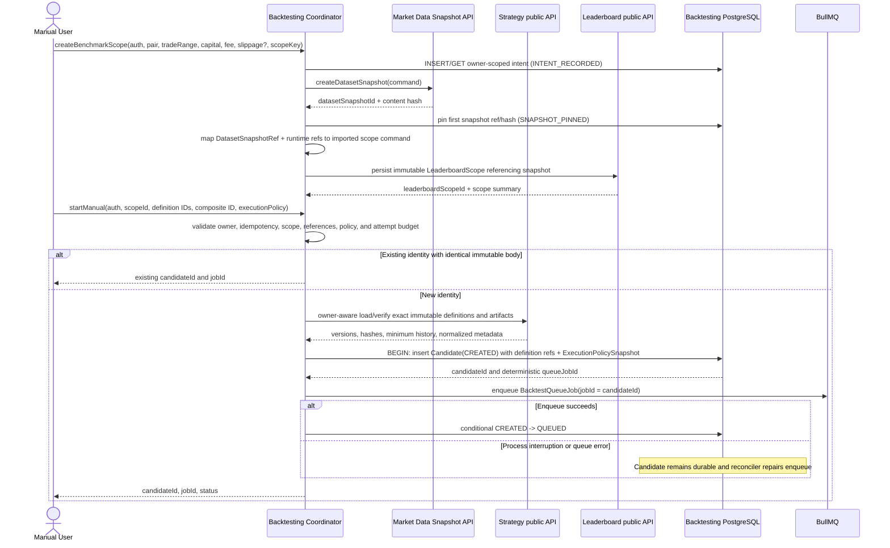
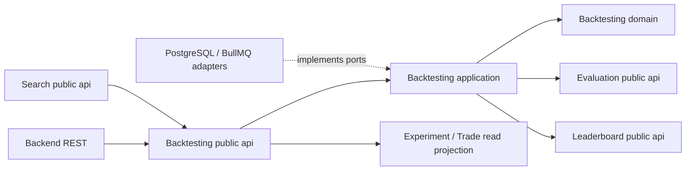

# Spec: Backtest Log and Audit Trail (`modules/backtesting`)

Status: canonical target behavior — implementation/scaffold synchronization is pending

This spec defines the durable record and read model used to understand what
happened to one Manual or Search backtest. It covers Candidate progress,
worker Attempt history, Trade Detail, completion processing, and the
provenance needed to reproduce an Experiment. It does not introduce a second
event bus or treat BullMQ messages as the source of truth.

## 1. Overview

### Purpose

The Backtest Log gives a user, operator, or downstream module a reliable
answer to: what was submitted, which immutable benchmark and strategy versions
were used, which worker deliveries ran, what each delivery did, why retries or
failures occurred, which Trades were produced, and whether the result was
evaluated and ranked.

The result is a reproducible historical simulation: it explains how the pinned
rules behaved on the pinned past dataset. It is not a forecast, profit
guarantee, live execution result, or evidence that the strategy will make money.

The log is a durable read model over Backtesting-owned PostgreSQL records:
`candidate_strategies`, `backtest_attempts`, `trades`, and
`experiment_results`. The current Candidate state is mutable, while Attempt,
Trade, and Experiment history is historical audit data. An Attempt may be
updated only while it is `RUNNING`; once it is `COMPLETED` or `FAILED`, it is
immutable. Trade and Experiment rows are append-only.

### Scope

In scope:

- Candidate identity, origin, benchmark scope, immutable composite reference,
  lifecycle status, and timestamps.
- One durable Attempt record for each runnable worker delivery, including retry
  number, worker runtime provenance, timing, outcome, and error detail.
- Trade Detail produced by a completed Attempt, including audit-only Trades
  that finish after cancellation.
- Completion processing state, claim count, lease/retry timing, failure kind,
  and the final Experiment reference.
- Fenced worker deliveries, duplicate queue notifications, terminal watchdog
  recovery, and startup/periodic reconciliation.
- The owner-aware `status(auth, candidateId)` public API and REST projections composed from
  it, plus the existing Experiment and Trade Detail read surface.
- Public submission, cancellation, Candidate audit, and paginated Trade Detail
  contracts needed by the Backend adapter and a future coding agent.

Out of scope:

- Logging every candle, indicator value, strategy decision, or worker debug
  statement as a separate durable domain row. Visualization is a bounded,
  deterministic projection of sealed candles, retained strategy overlays, and
  immutable Trades rather than a second event log.
- A general Event Bus, Redis Pub/Sub stream, non-market WebSocket channel, or
  queue payload containing the full backtest result.
- Evaluation metric calculation, score policy, or Top-10 admission rules;
  these are owned by Evaluation and Leaderboard public APIs. This spec records
  their required input/output semantics for compatibility and replay, but the
  Backtesting module does not implement or persist their internal aggregates.
- Market-data ingestion, live trading, or a live-money audit system.
- A retention duration. Retention and archival policy is an operational
  decision and must not silently remove records required for a retained
  Experiment.

### Actors

| Actor | Interaction |
|---|---|
| `apps/backend` / Frontend | Starts, polls, cancels, and displays a backtest through REST. It never reads Backtesting tables directly. |
| Backtest Coordinator | Creates Candidates, owns queue submission/reconciliation, exposes progress, and owns terminal-job watchdog behavior. |
| Backtest Worker | Claims a queue job, creates a fenced Attempt, runs the pure simulation, and persists Attempt/Trade results before returning or throwing. |
| Completion Processor | Consumes small terminal wake-ups, reloads PostgreSQL state, evaluates successful Attempts, and finalizes the Candidate/Experiment transactionally. |
| `modules/search` | Reads Candidate summaries through the Backtesting public API and receives a post-commit completion callback. |
| Evaluation / Leaderboard | Supplies metric and scoring policies through public APIs; neither owns Candidate or Attempt history. |
| PostgreSQL | Authoritative source for Candidate, Attempt, Trade, completion, and Experiment history. |
| BullMQ / Redis | Durable work dispatch and terminal wake-up transport only; its messages are not the audit record. |

### Source interpretation and precedence

`docs/assignment/crypto-strategy-lab-final-project.md` is the assignment-fit
reference. It requires historical simulation, the minimum evaluation metrics,
Trade Detail, Buy/Sell and Entry/Exit visualization, reproducibility, and a
separable Generate -> Backtest -> Evaluate -> Rank architecture. It labels
Long/Short, stop-loss, take-profit, and position sizing as optional extensions;
this project deliberately selects those extensions because the supplied
`backtest.jpg` target shows one `MA Crossover` run producing both LONG and SHORT
Trades with SL/TP and cost controls. The assignment and image define the desired
capability, not hidden implementation instructions.

For implementation decisions, the owning canonical module spec wins:

1. `evaluation-spec.md` owns metric formulas and edge-case statuses.
2. `ranking-spec.md` owns benchmark scope, scoring, and Top-K admission.
3. `strategy-spec.md` owns plugin signals and composite combination semantics.
4. Market Data and Sentiment own sealed snapshot contracts.
5. Auth and the active multi-tenant ownership change own `AuthContext` and
   owner isolation.
6. This document owns Candidate, Attempt, Trade, Experiment, simulation, replay,
   and Backtest read projections.

This document may add an explicitly named Backtesting projection, but it MUST
NOT redeclare an owned formula or silently widen a shared contract. If prose,
examples, TypeScript snippets, SQL, and acceptance criteria disagree, the
functional requirement plus the canonical type in §4 is normative; the
contradiction is a spec defect and MUST be fixed before implementation.

### Assignment alignment and closed decision register

| Decision | Classification | Closed rule and feature effect |
|---|---|---|
| Historical simulation and audit | Assignment required (§19, §35, §37) | Run only on sealed historical data and retain the exact Candidate -> Attempt -> Trades -> Experiment chain. |
| Metrics | Assignment required (§20, §37) | Evaluation owns Return, Win Rate, Max Drawdown, Trade Count, Profit Factor, and Sharpe. Backtesting adds display/audit amounts without changing those formulas. |
| Chart and Trade Detail | Assignment required (§25, §26, §37) | Experiment reads include a bounded sealed OHLCV/overlay/marker projection plus paginated Trade rows. |
| LONG and SHORT | Optional extension selected (§38; `backtest.jpg`) | One selected strategy/composite can open either direction under `TWO_SIDED_ONE_X_V1`; this is not two different strategies. |
| Stop-loss / take-profit | Optional extension selected (§38; `backtest.jpg`) | Risk intent is normalized into the Candidate's immutable execution-policy snapshot and trigger prices are persisted per Trade. It is not benchmark-scope state. |
| Position sizing | Optional extension selected (§38) | At most one 1x position uses current available equity; no leverage, borrowing, funding, liquidation, or live exchange order is modeled. |
| Signal vocabulary | Project decision compatible with §6 | Strategy remains `BUY | SELL | HOLD`; Backtesting maps BUY to LONG intent and SELL to SHORT intent. |
| Opposite signal | Project decision | `CLOSE_AND_REVERSE_NEXT_OPEN_V1`: an opposite signal schedules an exit and an entry into the opposite side at the next candle open. The simulator records two fills at that timestamp and charges exit and entry costs; this lets one crossover strategy produce alternating LONG and SHORT Trades. |
| Decision/fill timing | Project architecture decision | A decision at candle `N` close uses no data after that close; any signal-driven entry or exit fills at candle `N+1` open. Protective exits are evaluated from the first candle after entry. |
| Costs | Project decision matching the editable mockup controls | Fee and slippage are finite, non-negative benchmark inputs. Slippage defaults to 5 bps but is not a literal; both are applied on entry and exit and persisted. |
| Benchmark vs execution policy | Project architecture decision | Scope pins comparable dataset/capital/cost/runtime/formula inputs. Candidate pins the normalized execution policy derived before enqueue. |
| Evaluation | Project architecture decision | `evaluation-spec.md` is the only formula source. `totalProfitAmount` and UI counts/amounts are separate Backtesting projections. |
| Completion transaction | Project architecture decision | Pure Evaluation and scoring run outside the final write transaction; the short fenced transaction revalidates the claim and atomically commits Experiment/admission/Search facts/Candidate terminal state. |
| Purpose | Assignment required (§39, §47) | Results explain how a strategy behaved historically; they do not predict or promise future profit. |

## 2. Requirements

### 2.1 Functional requirements

| ID | Requirement |
|---|---|
| FR-BL-001 | The Backtesting module must persist one Candidate identity containing `candidateId`, origin, immutable `selectionMode`, origin-specific Search metadata, `leaderboardScopeId`, immutable composite-definition reference, `queueJobId`, attempt budget, and lifecycle timestamps before queue submission. Search Candidates require `searchRunId`, `generatedBy`, positive `iterationNumber`, a stable fingerprint, and optional genetic lineage; Manual Candidates must contain none of those Search fields. A Manual transport retry is identified by an optional durable `submissionIdempotencyKey`; the key is request metadata and is not a strategy identity. |
| FR-BL-002 | The log must expose the Candidate's current lifecycle status using the documented states `CREATED`, `QUEUED`, `BACKTESTING`, `RETRY_WAIT`, `PROCESSING_RESULT`, `TERMINAL_FAILURE_PENDING`, `COMPLETED`, `FAILED`, and `CANCELLED`. |
| FR-BL-003 | Every runnable worker delivery must create at most one Attempt number for the Candidate, and the persisted Attempt number must never exceed `Candidate.maxAttempts`. A redelivery that observes an existing `RUNNING` Attempt must reuse it or close it only after verified stalled/terminal evidence; repeated delivery of an already completed or terminal Candidate must create no new Attempt. |
| FR-BL-004 | Each Attempt must retain `attemptId`, `candidateId`, `queueJobId`, `attemptNumber`, `status`, `startedAt`, optional `completedAt`, worker runtime version, worker runtime SHA-256, and bounded, redacted failure context when the Attempt fails. |
| FR-BL-005 | A successful Attempt must persist its Trades before the worker reports success to BullMQ. A failed Attempt must have no Trades. A completed Attempt belonging to a Candidate cancelled during simulation may retain Trades as audit history, but those Trades are not eligible for an Experiment or ranking. |
| FR-BL-006 | The log must distinguish simulation Attempt status from completion-processing status. Completion processing uses the persisted `completionAttemptCount` as its claim generation, fixed completion budget, next-retry time, lease/token, `failureKind`, and `lastError`; final writes must match the Candidate, claim generation, token, and an unexpired lease (`completion_lease_until > now()`), and completion processing never consumes another simulation Attempt. |
| FR-BL-007 | The log must classify terminal failure as `RETRY_EXHAUSTED`, `INFRASTRUCTURE`, or `COMPLETION_PROCESSING`, retain bounded/redacted error context, and preserve the original simulation failure kind when completion processing later exhausts its own budget. MVP Attempt failures identify `RETRYABLE`, `INFRASTRUCTURE`, or `CANCELLED_AUDIT`; permanent validation failures are rejected before Attempt allocation, and invalid evaluator output is `COMPLETION_PROCESSING`. |
| FR-BL-008 | A non-cancelled Candidate whose completed Attempt is evaluated successfully must produce at most one ExperimentResult, linked to the exact Candidate, Attempt, Composite Definition, Leaderboard Scope, score formula, worker runtime, and evaluation runtime. The completion transaction must re-lock the Candidate and require the expected `PROCESSING_RESULT` state, claim generation/token, and unexpired completion lease before creating Experiment or ranking data. |
| FR-BL-009 | The log must preserve a zero-trade successful Experiment with finite `totalProfitAmount = 0`, `totalReturnPercent = 0`, `winRatePercent = 0`, `maxDrawdownPercent = 0`, `numberOfTrades = 0`, `overallScore = 0`, `profitFactor = null`/`NO_TRADES`, and `rankEligible = false`; it must not fabricate a Trade or silently discard the successful Attempt. |
| FR-BL-010 | Worker final writes must be fenced by the active Attempt generation and Candidate state. A superseded delivery may emit `IGNORED/SUPERSEDED`, but it must not close another Attempt, overwrite Candidate state, or add Trades. The only exception is the explicit cancelled-audit fence in §3.4, which permits that same Attempt to finish its own audit Trades without reopening the Candidate. |
| FR-BL-011 | Cancellation must be durable and idempotent. A Candidate that is `CANCELLED` must remain `CANCELLED`; a worker already simulating may finish its own Attempt and Trades for audit, but no Experiment, ranking entry, Search completion counter, or slot release may be created from that audit result. |
| FR-BL-012 | The Completion Processor must reload the authoritative log state for every terminal wake-up. Duplicate `completed`, `retries-exhausted`, or verified-terminal-failed notifications must converge to one final outcome without duplicate Attempts, Experiments, ranking entries, counters, or slot releases. |
| FR-BL-013 | Startup and periodic reconciliation must recover Candidates whose queue notification was lost, whose enqueue state was interrupted, or whose worker crashed before its normal final write. Recovery must close an abandoned `RUNNING` Attempt or create a synthetic failed Attempt before terminal failure finalization. |
| FR-BL-014 | The public progress projection must be bounded and safe for polling: it must include Candidate status, deterministically ordered Attempt summaries, retry/completion metadata, failure information, timestamps, and an Experiment reference when available, but must not embed the full Trade list or raw queue payload. `maxAttempts` must obey a finite deployment-configured upper bound. |
| FR-BL-015 | The Experiment read surface must provide a bounded reproducibility/metrics summary plus separate paginated Trade Detail and bounded visualization: pair metadata, timeframe/ranges/snapshot hash, capital/costs, immutable strategy/composite/execution versions, worker/simulator/Evaluation/formula provenance, finite metrics/amount cards, score, rank eligibility, and Trade-linked chart data. |
| FR-BL-016 | Operational structured logs and metrics may record queue, worker, reconciliation, fencing, and completion events, but they must contain stable IDs and typed failure categories rather than secrets, credentials, or provider-specific raw payloads. Operational logs are diagnostic only; PostgreSQL remains authoritative. |
| FR-BL-017 | The allowlisted Backtesting boundary must expose owner-aware submission/status/summary/cancellation/audit/Trade/visualization/replay capabilities. Terminal processing/reconciliation are bootstrap-only operations. REST maps invalid auth to `401`, missing/cross-owner IDs to concealed `404`, wrong-origin cancellation to `409`, and repeated terminal cancellation to idempotent success/no-op. |
| FR-BL-018 | The Manual Backtest flow must let the caller create or select an immutable benchmark scope containing canonical pair metadata, timeframe, sealed snapshot range, eligible trade range, warm-up capacity, initial capital, fee rate, and slippage. Fee/slippage are finite and non-negative; slippage defaults to `5` bps when omitted. The scope must seal its declared warm-up capacity before a Candidate is created; submission then rejects a selected strategy whose exact required warm-up exceeds that capacity. The accepted Candidate stores only the committed scope reference and later exposes the same values. |
| FR-BL-019 | Manual submission may declare `selectionMode = "SINGLE"` or `"COMPOSITE"` as a client assertion. The server derives and persists `SINGLE` for exactly one Strategy Definition and one-component weight-`1` Composite, or `COMPOSITE` for at least two components; a mismatching assertion is rejected. The supplied Strategy Definitions must match the Composite components one-to-one, in deterministic order, with no duplicates or extras. |
| FR-BL-020 | The Manual Backtest REST flow must expose `POST /leaderboard-scopes` for benchmark setup and `POST /backtests` for Manual submission. The first returns `201` with a committed scope reference; the second returns `202` with `candidateId`, `jobId`, and status. The REST adapter maps request bodies to the public Backtesting API and never writes domain tables directly. |
| FR-BL-021 | Paginated Trade Detail must expose one row per completed Trade with pair and settlement currency, sequence/trade ID, side, entry time and executed price, optional stop-loss/take-profit trigger prices, exit reason/time/price, quantity, equity before/after, fee, applied `slippageBps`, slippage amount, net absolute `profit`, and net `resultPercent`. Amounts are in the scope's declared settlement currency; timestamps are ISO-8601 UTC; all values are finite and deterministically ordered. The page includes `totalCount` for the mockup's “1-10 of N” display without replacing opaque cursor pagination. |
| FR-BL-022 | Trade accounting must be reproducible: the simulator applies the scope fee rate and selected slippage to both entry and exit fills, persists the applied amounts, and defines `profit` as net P&L after fees and slippage. `totalProfitAmount`, `endingEquity`, wins/losses/breakevens, and `maxDrawdownAmount` are Backtesting read projections; canonical `totalReturnPercent` and `maxDrawdownPercent` come unchanged from Evaluation. |
| FR-BL-023 | Reproducibility provenance must include an independent simulator policy/version/hash, benchmark timezone, normalized execution-policy snapshot/hash, fill policy, same-candle ordering policy, and an explicit deterministic guarantee, so replaying the same sealed scope and retained artifacts yields identical Trade rows, visualization markers, and metrics. Worker deployment provenance is audited separately and does not define simulation semantics. |
| FR-BL-024 | Benchmark-scope creation must be retry-safe through an owner-scoped durable intent ledger written before external calls. The ledger pins `(userId, idempotencyKey, requestSha256)`, phase, and the first returned snapshot reference/hash. Reconciliation resumes the stored phase; a reused key with another body returns `409`, and a later snapshot with different content cannot replace the pinned reference. This does not claim an operation-identity feature that Market Data does not expose. |
| FR-BL-025 | The Backtesting Coordinator must derive the persisted `selectionMode` from the validated Composite component count (`1` = `SINGLE`, `>=2` = `COMPOSITE`). A transport `selectionMode` is only an optional client assertion; a mismatch is rejected with `400` and it is never an independent identity field. Every retained Strategy Definition must resolve through the Strategy public API using its exact implementation version/hash; unavailable artifacts fail explicitly with `IMPLEMENTATION_ARTIFACT_UNAVAILABLE`. |
| FR-BL-026 | The public Backtesting API must expose a replay-verification operation that loads the original sealed scope, Strategy/Composite artifacts, simulator/fill/evaluation policies, and runtime hashes, then compares canonical ordered Trades and metrics without creating a new Candidate, Experiment, ranking entry, or mutating historical rows. Missing artifacts or snapshots produce typed non-replayable failures. |
| FR-BL-027 | Shared v1 REST/in-process contracts use their owning canonical types and finite JavaScript `number` values for existing prices, quantities, fees, P&L, capital, percentages, and metrics. The simulator/persistence layer uses the exact decimal policy internally and for replay comparison; `DecimalString` is not a replacement wire type. Trade timestamps declare candle-level fill semantics, and each cursor is opaque, owner/resource/limit-bound, and encodes the last `(entryTime, sequence, id)` key. |
| FR-BL-028 | The simulator must run a deterministic no-look-ahead loop once per eligible closed candle. For decision candle `N`, every component receives one `StrategyContext` containing only observations available through `N` close; the composite is combined once, and signal-driven actions are scheduled only for `N+1` open. Warm-up candles may build context but cannot open Trades. A final-close signal with no next candle is ignored. |
| FR-BL-029 | Every protected create/list/read/cancel/replay API must receive verified `AuthContext`, resolve the immutable owner chain, and scope idempotency by user. A missing/invalid token maps to `401`; an absent or other-user Candidate, Attempt, Trade, Experiment, scope, or definition maps to concealed `404`. Internal worker/bootstrap operations use a separate service capability, never a forged request `userId`. |
| FR-BL-030 | A bounded Experiment visualization read must return closed OHLCV from the exact sealed snapshot, generic typed overlays, and Trade-linked entry/exit/SL/TP markers. It must never substitute live/current candles or require the Frontend to calculate indicators, signals, Trades, or metrics. |
| FR-BL-031 | Every operational bound used by this spec must come from the validated configuration table in §2.2; implementations must not invent unbounded defaults. Every acceptance criterion has a stable `AC-BL-*` ID, and every functional requirement maps to at least one such ID. |

### 2.2 Business rules

- **Authoritative storage:** PostgreSQL is the source of truth for the Backtest
  Log. BullMQ/Redis terminal observations wake processing but cannot prove that
  an Attempt, Trade, Candidate, or Experiment exists.
- **Durable-before-notification:** on normal worker return or throw paths, the
  worker persists Attempt outcome, Trades when successful, and the fenced
  Candidate pending state before BullMQ records completion or failure.
- **Historical mutability:** An Attempt may be updated from `RUNNING` to one
  terminal status exactly once under the Candidate lock. Terminal Attempts,
  Trades, and ExperimentResults are immutable historical records. Candidate
  status and completion-claim fields are the mutable current projection.
- **Cancellation fence:** cancellation clears the normal
  `active_attempt_number`; when a worker is still running, it first copies that
  number to `cancelled_audit_attempt_number`. Only the matching Candidate and
  Attempt number may perform the one audit finalization, after which the fence
  is cleared. This preserves the existing invariant that `active_attempt_number`
  is null outside `BACKTESTING`.
- **Deterministic identity:** `queueJobId = candidateId`. Search submission
  identity is `(searchRunId, iterationNumber)`; the same identity with the same
  immutable body returns the existing Candidate, while a conflicting body is
  rejected. Manual submissions create a new Candidate by default; a transport
  retry is idempotent only when it repeats the same durable
  `submissionIdempotencyKey` and immutable body. Queue retries share the
  Candidate/job identity but have distinct Attempt numbers. Experiment
  identity is unique per Candidate, so redelivery cannot create a second
  Experiment.
- **Idempotency key bounds:** a Manual `submissionIdempotencyKey` is a
  non-empty UTF-8 string of at most 255 bytes; comparison uses the exact
  normalized request value and the immutable-body digest is lowercase
  hexadecimal SHA-256. Keys outside these bounds are rejected before any
  Candidate or mapping row is written.
- **Canonical request digest:** immutable request bodies are canonicalized
  before hashing: object keys are lexicographically sorted, arrays retain their
  validated semantic order, timestamps are normalized to ISO-8601 UTC, finite
  numbers use the shared decimal spelling, omitted fields are omitted, explicit
  `null` is retained, server defaults are applied before hashing, and no
  whitespace is included. `requestSha256` is lowercase hexadecimal SHA-256 of
  those UTF-8 bytes. This rule applies to scope and Manual submission
  idempotency and prevents equivalent JSON bodies from producing different
  identities.
- **Manual benchmark selection:** the Manual screen may present benchmark
   setup as one form, but the durable backend sequence is
   `POST /leaderboard-scopes` followed by `POST /backtests`. Scope creation
  validates Market Data's canonical pair metadata and `Timeframe`, aligned UTC
  `snapshotRange`/`tradeRange` with `snapshot.from <= trade.from < trade.to <=
  snapshot.to`, finite positive capital, fee in the configured bound, and
  slippage in the configured bound (default `5`) and warm-up capacity in the
  configured bound (default `500`). Before any external call it
  persists an owner-scoped `scope_creation_requests` intent containing the
  immutable non-secret canonical request payload, its digest, and phase
  `INTENT_RECORDED`. It then calls Market
  Data `createDatasetSnapshot`, transactionally pins the first returned
  reference/hash as phase `SNAPSHOT_PINNED`, and asks Leaderboard to create/get
  the immutable scope before phase `COMPLETED`. Backtesting never writes the
  `leaderboard_scopes` table. Reconciliation resumes the recorded phase and
  never replaces a pinned snapshot; if a repeated external result differs it
  records `SCOPE_SNAPSHOT_CONTENT_CHANGED`. `startManual` accepts only the
  committed scope ID; it cannot
   silently replace pair, range, capital, fee, or slippage with current defaults.
   `sentimentDatasetSnapshot` and `sentimentCreate` are mutually exclusive. An
   existing selection supplies the complete immutable reference returned by a
   Sentiment metadata/ref lookup, not an unverifiable opaque ID. When
   `sentimentCreate` is supplied, Backtesting calls Sentiment's public
  `createSnapshot` with the canonical command, verifies the returned immutable
  reference, and stores that reference in the Leaderboard scope. A caller may
  provide neither, but never both; Backtesting never persists sentiment points
  or reads Sentiment tables.
- **Manual strategy selection:** execution always resolves a
   `CompositeStrategyDefinition`, even for a single strategy.
   `derivedSelectionMode = SINGLE` requires one Strategy Definition, one
   matching Composite component, `WEIGHTED_SCORE`, and weight `1`;
   `derivedSelectionMode = COMPOSITE` requires at
   least two matching components and uses the existing `MAJORITY_VOTE` or
   `WEIGHTED_SCORE` rules. The submitted definitions must match component IDs
   one-to-one, with no duplicate or extra IDs. The Coordinator derives the
   persisted mode from component cardinality; a submitted mode is only a
   client assertion and a mismatch is rejected with `400`.
- **Manual strategy validation:** definitions are created or verified through
   the Strategy public API first. The API may participate in the caller's
   opaque process-level unit of work, but Strategy remains the owner of its
   tables and repositories. Backtesting persists only immutable definition
   IDs, versions, implementation hashes, and the Composite reference in its
   Candidate transaction; it never writes Strategy-owned tables or passes a
   database handle across the module boundary. Unknown, duplicate, mismatched,
   or conflicting IDs reject with a typed `400`/`409`.
   Weighted composites require finite weights summing to `1` and valid
   thresholds (`buy > sell`). If any component is an `INFORMATION` strategy,
   the selected scope must contain a matching sealed sentiment snapshot
   covering the candle range.
- **Submission references and execution normalization:** public submission
   carries an exact `compositeDefinitionId`, ordered `strategyDefinitionIds`,
   and an `ExecutionPolicyInput`; it does not accept caller-authored domain
   objects. Backtesting asks Strategy's owner-aware public API to load/verify
   the immutable definitions and retained artifacts, validates all references
   have the same owner as `AuthContext`, derives `selectionMode`, validates each
   plugin's `minimumHistoryCandles`, and persists the normalized
   `ExecutionPolicySnapshot` before enqueue. Search pins one normalized policy
   on the Search Run and submits the same shape for every Candidate unless its
   versioned generator explicitly emits another policy.
- **Strategy execution compatibility:** the worker calls the Strategy public
   `resolveStrategy` and `combineSignals` APIs. Combination semantics remain
   owned by Strategy: encode `BUY = +1`, `HOLD = 0`, `SELL = -1`; use strict
   `score > buy` / `score < sell` thresholds for `WEIGHTED_SCORE`; and return
   `HOLD` for every `MAJORITY_VOTE` tie. Majority Vote weights/thresholds use
   Strategy's normalized defaults. Backtesting records the resolved versions
   but does not reimplement or fork those rules.
- **Retained strategy artifacts:** before a worker claims an Attempt, every
   Strategy Definition is resolved through the Strategy public API using its
   retained `implementationVersion` and `implementationSha256`. If the exact
   artifact is unavailable, the Attempt records
   `failure_category = INFRASTRUCTURE`,
   `failure_code = IMPLEMENTATION_ARTIFACT_UNAVAILABLE`,
   `failure_retryable = false`, and the Candidate follows the terminal failure
   mapping; current deployed code is never substituted.
- **Attempt budget ownership:** `maxAttempts` is a positive integer requested
   by the caller but owned and capped by the Backtesting Coordinator's
   deployment configuration. The accepted Candidate persists the effective
   value before enqueue; no queue payload, worker, Search generator, or retry
   may increase it later.
- **Trade accounting:** a Trade's `entryPrice` and `exitPrice` are executed
  settlement-per-base prices after the scope's selected slippage. Market Data
  supplies normalized `baseAsset` and `settlementAsset`; Backtesting never
  parses them from a pair string. The simulator records `feeAmount` and
  `slippageAmount` in settlement currency. `grossProfit` is P&L before
  fees/slippage, `profit` is net P&L after both, and `resultPercent = profit /
  equityBeforeTrade * 100`. `equityAfterTrade = equityBeforeTrade + profit`.
  `WIN` means rounded net profit above zero, `LOSS` below zero, and `BREAKEVEN`
  exactly zero. Trading stops with a successful, auditable result when equity
  cannot fund a positive quantity; no negative equity or quantity is created.
- **Position policy `TWO_SIDED_ONE_X_V1`:** every Candidate starts `FLAT` and
  may hold at most one synthetic 1x `LONG` or `SHORT`. Strategy `BUY` expresses
  desired LONG, `SELL` desired SHORT, and `HOLD` expresses no change. While
  flat, BUY/SELL schedules the corresponding entry at the next eligible open.
  While positioned, a same-direction signal is a no-op; an opposite signal
  schedules `CLOSE_AND_REVERSE_NEXT_OPEN_V1`. At the next open the simulator
  first exits the current position, applies exit costs, then sizes and opens the
  opposite position from post-exit equity and applies entry costs. Both fills
  share the open timestamp. Protective/range exits never auto-reenter. Each entry uses current available equity and
  is fee-aware: `quantity = equityBeforeTrade / (executedEntryPrice * (1 +
  feeRatePercent / 100))`. The model has no leverage, borrowing, funding,
  liquidation, or exchange order placement; LONG/SHORT are deterministic
  historical directions, not claims about an exchange account.
- **Execution-policy hash:** `sha256` is lowercase hex SHA-256 over UTF-8
  RFC-8785 canonical JSON of every snapshot field except `sha256`; keys and
  numbers use RFC-8785 canonical form, and absent optional SL/TP fields are
  omitted rather than serialized as `null`. The server reconstructs and
  validates this object; clients never supply the hash.
- **Execution-policy source:** Backtesting normalizes the selected immutable
  Strategy/Composite execution intent before enqueue into
  `ExecutionPolicySnapshot { policyId, positionPolicyId, sizingPolicyId,
  stopLossPercent?, takeProfitPercent?, sha256 }`, persists it on Candidate,
  and copies its reference/hash to Experiment. Percentages, when present, are
  finite and strictly greater than `0` and less than `100`. They are not fields
  of `LeaderboardScope`. Trigger prices use the unadjusted market entry:
  LONG stop/take = `entry * (1 -/+ percent/100)`; SHORT stop/take =
  `entry * (1 +/- percent/100)`. Missing controls persist null triggers.
- **Exact fill formulas:** let `s = slippageBps / 10,000` and
  `d = +1` for `LONG`, `-1` for `SHORT`. The simulator computes
  `entryPrice = marketEntryPrice * (1 + d*s)` and
  `exitPrice = marketExitPrice * (1 - d*s)`;
  `entryNotional = entryPrice * quantity` and
  `exitNotional = exitPrice * quantity`; `notionalEntryValue` is exactly the
  persisted rounded `entryNotional`;
  `slippageAmount = abs(entryPrice - marketEntryPrice) * quantity +
  abs(exitPrice - marketExitPrice) * quantity`;
  `grossProfit = d * (marketExitPrice - marketEntryPrice) * quantity`;
  `feeAmount = (feeRatePercent / 100) * (entryNotional + exitNotional)`;
  and `profit = grossProfit - slippageAmount - feeAmount`. These formulas use
  the Candidate's decimal policy before persistence.
- **Evaluation ownership:** `modules/evaluation` and `evaluation-spec.md` are
  the sole owners of `EvaluationMetrics`, including compounded return,
  normalized compounded drawdown, Profit Factor/status, and unannualized
  population-standard-deviation Sharpe/status. Backtesting passes closed Trades
  in `(entryTime, sequence, id)` order and persists the returned object without
  recomputing any canonical metric. Separately, its read projection derives
  `totalProfitAmount`, `endingEquity`, `wins`, `losses`, `breakevens`, and
  `maxDrawdownAmount` from immutable Trade/equity fields. For this amount, set
  `peak = initialCapital`, visit `equityAfterTrade` in Trade order, update
  `peak = max(peak, equity)`, and take `max(peak - equity)`, rounded once to
  settlement scale `2`; zero Trades returns `0`. A cross-module golden
  fixture must prove ordered Trades -> EvaluationMetrics -> score; future metric
  changes require a new Evaluation-owned version, never duplicated prose here.
- **Decimal policy `MVP_DECIMAL_HALF_UP_V1`:** use exact decimal arithmetic;
  round market/reference, executed, stop-loss, and take-profit prices to scale
  `8`, quantity to scale `8`, settlement-currency amounts (`notionalEntryValue`,
  `grossProfit`, `feeAmount`, `slippageAmount`, `profit`) to scale `2`, and
  percentage fields to scale `8`, all with half-up rounding. Round prices and
  quantity before notionals, round each fee/slippage leg before summing, round
  `grossProfit`/`feeAmount`/`slippageAmount` before calculating rounded `profit`,
  then calculate and round `resultPercent`. The same policy applies to the
  simulator equity curve and Backtesting-owned amount/count projections.
  Evaluation receives the persisted finite `resultPercent` values and remains
  sole owner of canonical `EvaluationMetrics` and its native-number policy.
- **Fill policy `NEXT_OPEN_OHLC_STOP_FIRST_V2`:** candles are processed in UTC
  order over the sealed snapshot; only the declared trade range can create
  Trades. At each candle open, first execute the action scheduled from the
  prior close. On every candle after an entry candle, check protective exits:
  LONG stop when `low <= stopLoss`, LONG take when `high >= takeProfit`, SHORT
  stop when `high >= stopLoss`, and SHORT take when `low <= takeProfit`. If both
  trigger, stop-loss wins. If open gaps beyond the selected trigger, raw fill is
  open; otherwise it is the trigger. At candle close, build contexts using no
  future data, call each component once, combine once, and schedule at most one
  next-open action. A final-close signal with no next candle is ignored. An
  existing position is force-closed at the final closed-candle close with
  `RANGE_END`. At the final candle open, a scheduled ENTRY is suppressed; a
  scheduled REVERSE executes only its close leg and suppresses its new entry;
  a scheduled close executes normally. Thus a position is never opened on the
  final candle merely to close it immediately. Only one position exists for the composite, not one per
  component. These raw fills become `marketEntryPrice`/`marketExitPrice` before
   the selected-slippage
   execution adjustment. `entryTime` is the next candle's UTC open timestamp.
   A gap or protective trigger exit uses the current candle's UTC open
   timestamp because OHLC data has no authoritative intrabar time; a strategy
    `RANGE_END` exit uses the current candle's UTC close timestamp
    (`candle.timestamp + timeframe duration`). No synthetic sub-candle timestamp
    may be invented.
- **Slippage and fee policy:** `slippageBps` is finite, non-negative, bounded by
  configuration, and defaults to `5` (`0.05%`) when omitted. The simulator applies adverse
  slippage to both entry and exit according to side (`LONG`/`SHORT`) and
  persists the resulting executed prices and total slippage amount.
  `feeAmount = (feeRatePercent / 100) * (entryNotional + exitNotional)`;
  no UI-only recalculation may change persisted values.
- **Warm-up and no-look-ahead context:** Strategy plugin descriptors expose a
  non-negative `minimumHistoryCandles`; the Candidate pins the maximum required
  by its selected components as `warmupCandles`. The immutable scope declares
  `warmupCapacityCandles`, and its sealed `snapshotRange` starts early enough to
  supply that many aligned closed candles before `tradeRange`. Candidate
  submission rejects `warmupCandles > warmupCapacityCandles`. Warm-up candles
  may populate indicators/context but cannot schedule
  or fill a Trade. At decision candle `N`, `StrategyContext.candles`, indicators,
  current price, and sentiment contain only observations timestamped no later
  than `N` close. Indicator computation is the Strategy module's shared context
  builder responsibility; Backtesting never branches on MA, RSI, Bollinger, or
  any other plugin name.
- **Normative per-candle algorithm:** the following loop is the only simulation
  order. Examples and diagrams must not introduce another order.

  ```text
  state = FLAT; equity = initialCapital; scheduledAction = NONE
  for candle N in sealed UTC order:
      OPEN: if N is in tradeRange, execute scheduledAction from N-1 close;
            for REVERSE, close first then open opposite from post-exit equity;
            on final candle suppress ENTRY and the entry leg of REVERSE;
            clear scheduledAction; apply selected slippage and every fill fee
      INTRABAR: only when the currently open position.entryTime < N.open,
                apply gap then stop-first protective-exit rules; a position
                opened by ENTRY/REVERSE at N.open is never protected on N
      CLOSE: if N is warm-up-only, continue
             build StrategyContext using observations <= N close
             call each component analyze(context) exactly once in component order
             combine signals exactly once
             if N has a next eligible candle, schedule at most one next-open action
  after loop: ignore an unfillable final-close signal; close any existing position
              at final close with RANGE_END; persist ordered Trades and equity fields
  ```

  If data has a gap, the context contains only actual sealed candles and the
  Candidate fails validation when the selected artifact's required-history or
  alignment contract cannot be met; missing bars are never synthesized.
- **Trade output units:** all money amounts use the `settlementAsset` supplied
  by Market Data metadata; prices use settlement currency per base asset; quantity uses base
  asset units; percentages are in percentage points (for example `1.25` means
  `1.25%`). Timestamps are ISO-8601 UTC. Decimal precision and half-up
  rounding are fixed by the scope's `decimalPolicyId` and included in
  provenance; no binary floating-point display value is authoritative.
- **Runtime provenance:** the worker resolves the exact simulator version/hash
  pinned by scope/job and records its own deployment version/hash separately on
  the Attempt/Experiment. The Experiment also retains the Evaluation artifact
  that produced metrics. A worker deployment change alone does not create a
  different benchmark; a simulator or Evaluation change does.
- **Cancellation audit:** audit Attempts/Trades that finish after cancellation
  remain queryable from Attempt/Trade history, but are excluded from Search
  operational counters, Experiment History, and ranking.
- **Completion retries are separate:** the five-claim completion budget,
  generation-bound lease/token, and backoff do not allocate another simulation
  Attempt. `completionAttemptCount` is the claim generation. Claiming is
  atomic under the Candidate lock. The processor renews its lease before it
  expires while evaluation/scoring is in progress. Every final write must
  match `(candidateId, completionAttemptCount, completionClaimToken)` and
  require `completionLeaseUntil > now()`. If the lease expires, the processor
  discards its in-memory metrics/score and performs no Experiment, ranking, or
  Candidate final write; it may reacquire a new claim only when the persisted
  count is below five. When the persisted count has reached five and the lease
  expires, the expiry handler terminalizes without issuing claim six.
- **Leaderboard side effects are idempotent:** `Leaderboard.submit` uses the
  stable key `(candidateId, leaderboardScopeId, scoreFormulaId)` and, when an
  Experiment ID exists, also records that ID. It may be safely retried after
  an uncertain transaction outcome and must return/ensure the same admission
  rather than insert a duplicate. The Completion Processor renews the lease
  before scoring/submission, rechecks the Candidate/lease before finalizing,
  and creates/ensures the Experiment and Leaderboard admission in one
  PostgreSQL unit of work. If the external call outcome is uncertain, the
  Candidate remains retryable and the same key is retried; no compensating
  delete or second admission is permitted. It invokes the Search callback
  only after commit.
- **Failure context:** an Attempt failure carries a stable category and
  retryability (`RETRYABLE`, `INFRASTRUCTURE`, or `CANCELLED_AUDIT`) plus a
  bounded, redacted message. Permanent validation failures are rejected before
  an Attempt is allocated. Invalid evaluator output is a completion-processing
  failure. Candidate `failureKind` is the terminal aggregation category and
  is not a substitute for the Attempt-level failure category. The existing
  retry policy maps retryable failures with remaining `maxAttempts` to
  `RETRY_WAIT`, the last simulation failure to `RETRY_EXHAUSTED`, and verified
  worker/queue failures to `INFRASTRUCTURE`.
- **Finite attempt budget:** `maxAttempts` is a positive integer no greater
  than the deployment's configured `BACKTEST_MAX_ATTEMPTS`. This bounds both
  simulation retry allocation and the size of the polling Attempt summary.
- **Manual idempotency storage:** a Manual `submissionIdempotencyKey` is
  stored in the dedicated Backtesting-owned `candidate_submission_keys` table
  defined in §4.2.1, together with a SHA-256 digest of the immutable request
  body. The `(userId, origin = MANUAL, submissionIdempotencyKey)` tuple is unique;
  insertion and return-existing behavior occur in the same transaction as
  Candidate creation. This mapping is a request idempotency index, not an
  audit event table.
- **No guessed failure:** a raw BullMQ `failed` observation is not terminal
  until the adapter verifies BullMQ state is terminal and no retry is runnable.
  Malformed queue fields are logged and left for reconciliation.
- **No large transport payload:** the queue terminal signal carries only the
  job ID, schema/version, status, small return reference, or failure context.
  Trade arrays and Experiment metrics are reloaded or computed through the
  Backtesting completion flow.
- **Read projection boundary:** `GET /backtests/{candidateId}` is a progress
  projection, not a Trade Detail endpoint. `GET /experiments/{experimentId}`
  is the detailed result surface.
- **Loop observability ownership:** Backtesting supplies per-Candidate
  progress and Search Run Candidate summaries through its public API. Search
  owns the `LoopStatus` projection for run state, candidates tested, failure
  counters, average duration, and stop conditions; Leaderboard supplies the
  current top entry. No module duplicates Candidate persistence to display
  these assignment-required observability fields. `candidatesTested` counts
  non-cancelled terminal Candidates; `failedCandidateCount` counts terminal
  `FAILED` Candidates; `retryExhaustedCandidateCount`,
  `infrastructureFailureCandidateCount`, and
  `completionProcessingFailureCandidateCount` partition terminal failures by
  `failureKind`; `failedAttemptCount` counts failed Attempts attached to
  non-cancelled Candidates; and `averageBacktestDurationMs` averages completed
  non-cancelled Attempts using `completedAt - startedAt`. Each Candidate is
  counted once in the completion transaction; startup reconciliation may repair
  counters from PostgreSQL.
- **Replay verification:** replay is asynchronous compute on the existing
  Backtesting queue, identified by a bounded `ReplayVerificationJob` rather
  than a new Candidate. It loads the exact sealed snapshot and retained Strategy
  artifacts, reruns the pure simulator/evaluator, and compares canonical Trades,
  visualization markers, and metrics. It is read-only with respect to Candidate,
  Attempt, Trade, Experiment, and Leaderboard history. The result reports a
  bounded mismatch sample, `totalMismatchCount`, and `truncated`; missing input
  or retained artifacts returns typed `NON_REPLAYABLE`. Artifacts required for
  replay are retained for at least the lifetime of the Experiment.
- **Replay lifecycle:** a durable owner-scoped replay record moves only
  `QUEUED -> RUNNING -> MATCH | MISMATCH | NON_REPLAYABLE`. Claiming is fenced
  by `replayJobId`; a terminal record is immutable and duplicate delivery is a
  no-op. The queue carries only the bounded `ReplayVerificationJob` below.
- **No future-looking replay:** the log identifies the immutable candle and,
  when applicable, sentiment snapshot selected by the Leaderboard Scope. A
  replay must use those sealed references instead of querying mutable live
  market rows.

#### Validated configuration and bounds

Deployments may choose a value inside the stated bound; the effective value is
validated at bootstrap and exposed to deterministic tests. “Bounded” elsewhere
in this document refers to this table.

| Key | Default | Valid bound / rule |
|---|---:|---|
| `BACKTEST_MAX_ATTEMPTS` | `3` | integer `1..10` |
| `COMPLETION_MAX_ATTEMPTS` | `5` | fixed `5` for policy v1 |
| `COMPLETION_LEASE_SECONDS` | `60` | integer `30..300`; renew before one-third remains |
| `WORKER_HEARTBEAT_SECONDS` | `10` | integer `2..30` |
| `WORKER_STALL_SECONDS` | `45` | integer `3 * heartbeat..300` |
| `QUEUE_EVIDENCE_MAX_AGE_SECONDS` | `30` | integer `5..60` |
| `RECONCILIATION_INTERVAL_SECONDS` | `30` | integer `5..300` |
| `RECONCILIATION_BATCH_SIZE` | `100` | integer `1..500` |
| `TRADE_PAGE_DEFAULT` / `TRADE_PAGE_MAX` | `10` / `100` | positive integers; default <= max <= 500 |
| `SEARCH_CANDIDATE_PAGE_DEFAULT` / `SEARCH_CANDIDATE_PAGE_MAX` | `20` / `100` | positive integers; default <= max <= 500 |
| `VISUALIZATION_CANDLE_DEFAULT` / `VISUALIZATION_CANDLE_MAX` | `500` / `2000` | positive integers; server returns continuation when truncated |
| `VISUALIZATION_OVERLAY_MAX` / `VISUALIZATION_MARKER_MAX` | `32` / `5000` | positive integers; reject an unrenderable request, never silently omit |
| `CURSOR_TTL_SECONDS` | `900` | integer `60..3600`; cursor is owner/resource/query bound |
| `ERROR_MESSAGE_MAX_UTF8_BYTES` | `2048` | integer `256..8192`; redact before truncating |
| `SLIPPAGE_DEFAULT_BPS` / `SLIPPAGE_MAX_BPS` | `5` / `500` | finite `0..max` |
| `FEE_RATE_MAX_PERCENT` | `10` | finite `0..max`, and max < 100 |
| `WARMUP_CANDLE_DEFAULT` | `500` | integer `0..WARMUP_CANDLE_MAX` |
| `WARMUP_CANDLE_MAX` | `10000` | integer `0..10000` |
| `REPLAY_MISMATCH_SAMPLE_MAX` | `100` | integer `1..500` |
| `STRATEGY_COMPONENT_BUDGET_MS` | `50` | integer `1..1000` per component/candle; timeout records `STRATEGY_TIMEOUT` |

### 2.3 Candidate state transition contract

The following transitions are normative. `COMPLETED`, `FAILED`, and
`CANCELLED` are terminal. Cancellation wins when its transaction acquires the
Candidate lock before a worker or Completion Processor final write.

| Current state | Allowed next state | Guard / owner |
|---|---|---|
| `CREATED` | `QUEUED` | Coordinator records enqueue success; update is conditional on `status = CREATED`. |
| `CREATED` | `BACKTESTING` | Worker claims the job before the late `QUEUED` update; the late update must not overwrite it. |
| `CREATED` | `TERMINAL_FAILURE_PENDING` | Watchdog verifies the deterministic job is terminal and no retry is runnable. |
| `CREATED` | `CANCELLED` | Manual/Search cancellation commits first. |
| `QUEUED` | `BACKTESTING` | Worker allocates the active Attempt generation. |
| `QUEUED` | `TERMINAL_FAILURE_PENDING` | Watchdog has `QueueRecoveryEvidence` proving the deterministic job is terminal and no retry is runnable; it closes or creates one synthetic failed Attempt. |
| `QUEUED` | `CANCELLED` | Manual/Search cancellation commits first. |
| `BACKTESTING` | `RETRY_WAIT` | Fenced retryable Attempt failure with remaining simulation budget. |
| `BACKTESTING` | `PROCESSING_RESULT` | Fenced successful Attempt transaction persisted Trades and closed the Attempt. |
| `BACKTESTING` | `TERMINAL_FAILURE_PENDING` | Last simulation failure or verified infrastructure failure. |
| `BACKTESTING` | `CANCELLED` | Cancellation commits first; a later audit Attempt write does not leave this state. |
| `RETRY_WAIT` | `BACKTESTING` | A retry delivery allocates the next Attempt generation. |
| `RETRY_WAIT` | `TERMINAL_FAILURE_PENDING` | Watchdog verifies terminal/no-runnable queue state. |
| `RETRY_WAIT` | `CANCELLED` | Manual/Search cancellation commits first. |
| `PROCESSING_RESULT` | `COMPLETED` | Completion transaction matches claim generation/token and creates/ensures one Experiment. |
| `PROCESSING_RESULT` | `FAILED` | Completion claim is permanently invalid or exhausted; use `COMPLETION_PROCESSING`. |
| `PROCESSING_RESULT` | `CANCELLED` | Cancellation commits first; completion discards computed metrics. |
| `TERMINAL_FAILURE_PENDING` | `FAILED` | Completion transaction preserves `RETRY_EXHAUSTED` or `INFRASTRUCTURE`. |
| `TERMINAL_FAILURE_PENDING` | `CANCELLED` | Cancellation commits first; no Experiment is created. |
| `COMPLETED`, `FAILED`, `CANCELLED` | none | Terminal states are never reopened. |

### 2.4 Non-functional requirements

- **Auditability:** a caller with a Candidate ID must be able to follow
  submission, queue identity, Attempt history, worker provenance, errors,
  Trades, completion outcome, and Experiment/ranking references without
  consulting ephemeral worker memory.
- **Reproducibility:** the same Candidate, immutable Composite Definition,
  Leaderboard Scope, worker runtime hash, and sealed snapshots identify the
  same historical inputs and implementation provenance.
- **Crash safety:** a process crash may delay the log's terminal state, but it
  must not make a committed Attempt/Trade/Experiment disappear or require a
  queue notification that was already lost.
- **Idempotency:** reprocessing the same Candidate or terminal signal is safe
  across restart, duplicate QueueEvents, stalled-worker replacement, and
  completion-claim retry.
- **Queryability:** progress reads must be bounded and indexed by Candidate,
  queue job, Search Run, and Experiment references. Trade Detail may be larger
  but is read separately from polling status.
- **Isolation:** a Backtest Worker is stateless between jobs; the log does not
  depend on process-local caches or a particular worker instance remaining
  alive.
- **Layering and boundaries:** the module follows `api -> application ->
  domain`; infrastructure implements ports. Other modules consume the public
  Backtesting API and never read its tables or queue adapter directly.
- **Observability:** retries, fencing, terminal-watchdog repair, completion
  claim exhaustion, and malformed queue observations are measurable with
  stable Candidate/Attempt identifiers and typed categories.

## 3. Behavior

### 3.1 Create the Candidate log and enqueue work

The Manual Backtest UI can render benchmark setup and strategy selection as a
single form, but the durable flow has two explicit operations. First it creates
or selects a sealed `LeaderboardScope`; then it submits a Manual Candidate that
references that scope. This prevents a queue job from carrying mutable pair,
date-range, capital, fee, or slippage inputs.

```typescript
import type {
  DatasetSnapshotRef,
  MarketPairMetadata,
  Pair,
  Timeframe,
} from "modules/market-data/api";
import type { SentimentDatasetSnapshotRef } from "modules/sentiment/api";
import type { StrategyVisualizationOverlay } from "modules/strategy/api";

export type DecimalString = string;
// Internal/persistence-only canonical base-10 text. Public wire
// contracts retain finite `number` fields; domain code
// converts them to this exact representation before arithmetic and hashing.

// REST/application setup request. The adapter validates Pair/Timeframe,
// persists the intent, asks Market Data for a sealed snapshot, then maps to the
// imported Leaderboard command. `scopeIdempotencyKey` belongs to Backtesting's
// intent ledger; it is not a Market Data command field.
export interface CreateBenchmarkScopeRequest {
  name: string; // non-empty scope family name; Leaderboard allocates version
  pair: Pair; // opaque canonical Market Data symbol; do not parse BASE/QUOTE
  timeframe: Timeframe;
  tradeRange: { from: string; to: string }; // UTC, half-open user interval
  warmupCapacityCandles?: number; // default 500, maximum 10000
  initialCapital: number; // finite and > 0 on the shared v1 wire
  feeRatePercent: number; // finite and >= 0 on the shared v1 wire
  slippageBps?: number; // finite, non-negative; defaults to 5
  scoreFormulaId: string;
  sentimentDatasetSnapshot?: SentimentDatasetSnapshotRef;
  sentimentCreate?: CreateSentimentSnapshotCommand;
}

// Imported Leaderboard-owned shape. Snapshot/runtime refs are already sealed;
// no raw pair/range query enters the queue payload.
import type { CreateLeaderboardScopeCommand } from "modules/leaderboard/api";

export interface ExecutionPolicyInput {
  policyId?: "TWO_SIDED_ONE_X_V1"; // server default
  stopLossPercent?: number;         // finite, 0 < value < 100
  takeProfitPercent?: number;       // finite, 0 < value < 100
}

export interface ExecutionPolicySnapshot {
  policyId: "TWO_SIDED_ONE_X_V1";
  positionPolicyId: "TWO_SIDED_ONE_X_V1";
  sizingPolicyId: "FULL_CURRENT_EQUITY_FEE_AWARE_V1";
  fillPolicyId: "NEXT_OPEN_OHLC_STOP_FIRST_V2";
  oppositeSignalPolicyId: "CLOSE_AND_REVERSE_NEXT_OPEN_V1";
  stopLossPercent?: number;
  takeProfitPercent?: number;
  warmupCandles: number;
  sha256: string;
}

export interface StartManualBacktestCommand {
  leaderboardScopeId: string; // already committed by CreateLeaderboardScope
  strategyDefinitionIds: string[]; // ordered exact immutable references
  compositeDefinitionId: string;
  executionPolicy: ExecutionPolicyInput;
  maxAttempts: number;
}

// Search boundary; Search never submits a selectionMode
// field and never imports Backtesting persistence or queue infrastructure.
export interface SubmitSearchCandidateCommand {
  searchRunId: string;
  leaderboardScopeId: string;
  executionPolicy: ExecutionPolicySnapshot;
  iterationNumber: number;
  maxAttempts: number;
  strategyDefinitionIds: string[];
  compositeDefinitionId: string;
  generatedBy: GeneratorType;
  fingerprint: string;
  lineage?: {
    parentFingerprints: string[];
    crossoverPoint: number;
    mutatedParameterKeys: string[];
    selectionMutation?: { replacedStrategyId?: string; replacementStrategyId?: string };
  };
}

export type GeneratorType = "RANDOM" | "DOMAIN_GUIDED" | "GENETIC";

export interface CreateSentimentSnapshotCommand {
  relatedCoin: string; // canonical base asset, for example BTC
  range: { from: string; to: string }; // half-open [from, to)
  aggregationWindowSeconds: number;
  modelName: string;
  modelVersion: string;
  modelSha256: string;
}

export interface BenchmarkScopeSummary {
  id: string;
  name: string;
  version: number;
  datasetSnapshot: DatasetSnapshotRef;
  pairMetadata: MarketPairMetadata;
  sentimentDatasetSnapshot?: SentimentDatasetSnapshotRef;
  simulatorVersion: string;
  simulatorSha256: string;
  evaluationRuntimeVersion: string;
  evaluationRuntimeSha256: string;
  pair: Pair;
  timeframe: Timeframe;
  snapshotRange: { from: string; to: string }; // includes warm-up
  tradeRange: { from: string; to: string }; // eligible trading interval
  warmupCapacityCandles: number;
  datasetSnapshotId: string;
  datasetSnapshotSha256: string;
  initialCapital: number;
  feeRatePercent: number;
  slippageBps: number;
  decimalPolicyId: "MVP_DECIMAL_HALF_UP_V1";
  evaluationPolicyId: "MVP_EVALUATION_V1";
  scoreFormulaId: string;
  createdAt: string;
}

export interface ReplayVerificationAccepted {
  replayJobId: string;
  experimentId: string;
  status: "QUEUED";
}

export interface ReplayVerificationJob {
  schemaVersion: 1;
  replayJobId: string;
  experimentId: string;
  mismatchSampleLimit: number; // 1..REPLAY_MISMATCH_SAMPLE_MAX
  requestedAt: string;
}

interface ReplayVerificationBase {
  replayJobId: string;
  experimentId: string;
  sourceAttemptId: string;
}

export type ReplayVerificationResult = ReplayVerificationBase & (
  | { status: "QUEUED" | "RUNNING" }
  | { status: "MATCH"; comparedTradeCount: number; mismatches: []; totalMismatchCount: 0; truncated: false }
  | {
      status: "MISMATCH";
      comparedTradeCount: number;
      mismatches: Array<{ fieldPath: string; expected: string; actual: string }>;
      totalMismatchCount: number;
      truncated: boolean;
    }
  | {
      status: "NON_REPLAYABLE";
      failureCode: "MISSING_SNAPSHOT" | "IMPLEMENTATION_ARTIFACT_UNAVAILABLE" | "REPLAY_ARTIFACT_EXPIRED";
    }
);
```

The REST/application adapter for `POST /leaderboard-scopes` first validates and
persists the owner-scoped scope-creation intent, then calls Market Data's public
snapshot operation and pins the first returned reference/hash before invoking
Leaderboard's imported `CreateLeaderboardScopeCommand`. The Backtesting scope
API returns `201` only after snapshot reference, runtime refs, capital, fee, selected slippage,
evaluation policy, and score formula are sealed. `startManual` (the
in-process equivalent of `POST /backtests`) accepts only the committed scope
ID and returns `202` with Candidate/job identifiers. A single UI form may call
both operations sequentially; it must not merge them into one mutable queue
payload.



The Candidate row and all immutable definition references are committed before
queue submission. Search uses `(searchRunId, iterationNumber)` as its durable
identity. Manual REST submissions use a durable `submissionIdempotencyKey`
when the caller needs retry-safe submission; omitting it intentionally creates
a new Candidate. A reused identity with different immutable content is a
conflict and cannot overwrite the existing Candidate.

If enqueue succeeds but the `QUEUED` update does not, the Candidate Log still
exists and the deterministic job ID lets reconciliation confirm or re-enqueue
work without creating a duplicate Candidate. The `QUEUED` update is always
conditional on `status = CREATED`, so it cannot overwrite `BACKTESTING` or a
terminal state.

### 3.2 Run, retry, and record one Attempt

```mermaid
sequenceDiagram
    participant Q as BullMQ
    participant W as Backtest Worker
    participant PG as PostgreSQL
    participant S as Sealed Scope / Snapshot

    Q->>W: BacktestQueueJob
    W->>PG: lock Candidate and reload current log
    alt Candidate is terminal or cancelled
        W-->>Q: IGNORED/CANCELLED or IGNORED/ALREADY_TERMINAL
    else Candidate is runnable
        W->>PG: close RUNNING Attempt only after verified stalled/terminal evidence
        W->>PG: allocate next Attempt and active fencing generation
         W->>S: read DatasetSnapshotRef through Market Data public reader
         opt INFORMATION component
             W->>S: read SentimentDatasetSnapshotRef/readAt through Sentiment public API
         end
         W->>W: resolve exact Strategy artifacts and call combineSignals
         W->>W: run pure Strategy/Composite simulation
        alt Attempt succeeds
            W->>PG: fenced transaction: Trades + Attempt=COMPLETED + PROCESSING_RESULT
            W-->>Q: COMPLETED with small durable references
        else Retryable failure and budget remains
            W->>PG: fenced transaction: Attempt=FAILED + RETRY_WAIT
            W-->>Q: throw; BullMQ retries
        else Last attempt or infrastructure failure
            W->>PG: fenced transaction: Attempt=FAILED + TERMINAL_FAILURE_PENDING
            W-->>Q: throw or terminal signal
        end
    end
```

Only the worker delivery holding the current active generation may perform the
normal final transaction. A `RUNNING` Attempt is not stale merely because a
wall-clock threshold elapsed: it may be closed only by a Candidate-locked
replacement delivery after verified BullMQ stalled/terminal evidence, or by
the terminal watchdog after the same verification. A late delivery rolls back
its attempted final write and returns `IGNORED/SUPERSEDED`; it cannot append
Trades under a superseded Attempt. A worker crash before this transaction is
repaired by the terminal watchdog, which closes the stale Attempt or inserts a
synthetic failed Attempt. The identity of a final worker write is
`(candidateId, attemptId, activeAttemptNumber)`.

The evidence is an internal Backtesting application port result, not a raw
BullMQ payload:

```typescript
export interface QueueRecoveryEvidence {
  jobId: string;
  kind: "TERMINAL_RECONCILIATION" | "STALL_REPLACEMENT";
  bullmqState: "failed" | "completed" | "active" | "waiting" | "delayed";
  noRunnableRetry: boolean;
  previousDeliveryLockLost: boolean;
  previousDeliveryToken?: string;
  previousDeliveryHeartbeatAt?: string;
  queueLockLostAt?: string;
  evidenceVersion: "QUEUE_EVIDENCE_V1";
  observedAt: string;
}
```

`TERMINAL_RECONCILIATION` is valid only when `bullmqState = "failed"` or a
validated `RETRIES_EXHAUSTED` observation exists and `noRunnableRetry = true`.
`STALL_REPLACEMENT` is valid only when the queue adapter has confirmed the
previous delivery's lock was lost, a replacement delivery owns the job, and
the evidence was read no more than the configured `QUEUE_EVIDENCE_MAX_AGE`
before the Candidate-locked transition. A delivery must publish a heartbeat
at least every `WORKER_HEARTBEAT_INTERVAL`; the queue adapter records the
last heartbeat and lock-loss timestamp. `STALL_REPLACEMENT` is valid only if
`previousDeliveryHeartbeatAt` is present, older than `WORKER_STALL_TIMEOUT`,
and `queueLockLostAt >= previousDeliveryHeartbeatAt`.
`previousDeliveryToken` must match the delivery token stored on the active
Attempt, and the replacement must atomically acquire a new delivery token
under the Candidate lock. A generic `failed` callback, an old evidence
object, a missing heartbeat, or a job merely being `active` is insufficient
to close an Attempt. The watchdog and replacement worker use this same
predicate before allocating the next generation. The deployment must set
`WORKER_HEARTBEAT_INTERVAL < WORKER_STALL_TIMEOUT / 2` and
`QUEUE_EVIDENCE_MAX_AGE <= WORKER_STALL_TIMEOUT`.

The database is authoritative for delivery ownership. An active Attempt has a
unique `deliveryToken`, `heartbeatAt`, and optional `queueLockLostAt`; the
Candidate stores the matching active Attempt number/token. A worker heartbeat
updates the Attempt only when `(candidateId, attemptId, attemptNumber,
deliveryToken)` still matches a `RUNNING` Attempt and the Candidate is still
`BACKTESTING`. Heartbeat writes are diagnostic/lease evidence and never move
Candidate state by themselves.

Every worker finalization is one Candidate-locked compare-and-set transaction:

```sql
-- Pseudocode: the repository must check the affected-row count.
UPDATE backtest_attempts
SET status = :terminalStatus, completed_at = :now
WHERE id = :attemptId
  AND candidate_id = :candidateId
  AND attempt_number = :attemptNumber
  AND delivery_token = :deliveryToken
  AND status = 'RUNNING';
```

If the update affects zero rows, the delivery is superseded and must not
insert Trades or update the Candidate. A successful finalization inserts
Trades in the same transaction with `UNIQUE (backtest_attempt_id,
trade_sequence)`, then updates the Candidate only when its active Attempt
number/token still match. A replacement delivery acquires a fresh token only
after the Candidate lock, verified `QueueRecoveryEvidence`, and persisted
attempt-budget check all succeed. This makes a late worker harmless even if
BullMQ's own lock state is delayed or ambiguous.

For each Attempt, the worker resolves every retained Strategy Definition using
its exact `implementationSha256`, loads the sealed scope/snapshot, and runs the
normative per-candle loop in §2.2. On every eligible decision close it calls
`analyze(context)` exactly once per component in Composite order, then calls
`combineSignals()` exactly once. Each context includes only observations known
at that close. A `SINGLE` selection follows the same path with one component
and a one-component weight-1 Composite. The worker never substitutes a current
implementation or mutable market data when a retained artifact is missing. A post-claim
missing implementation artifact is recorded as
`failure_category = INFRASTRUCTURE`, `failure_code =
IMPLEMENTATION_ARTIFACT_UNAVAILABLE`, `failure_retryable = false`, then follows
`TERMINAL_FAILURE_PENDING`/`INFRASTRUCTURE`.

### 3.3 Complete, evaluate, and expose the result

```mermaid
sequenceDiagram
    participant Q as QueueEvents Adapter
    participant BC as Completion Processor
    participant PG as PostgreSQL
    participant E as Evaluation API
    participant L as Leaderboard API
    participant O as Search Loop

    Q-->>BC: completed / retries-exhausted / verified-terminal-failed
    BC->>PG: short claim transaction; reload Candidate/Attempt/Trades; commit
    alt Candidate is CANCELLED or already terminal
        BC->>PG: no-op or preserve audit rows
    else PROCESSING_RESULT with completed Attempt
        BC->>E: evaluate(completed Attempt and Trades)
        E-->>BC: finite EvaluationMetrics
        BC->>L: score(scopeId, metrics)
        L-->>BC: score, formula, rank eligibility
        BC->>PG: begin final transaction; lock in global order; revalidate claim
        BC->>PG: ensure one Experiment and optional Leaderboard entry via L.submit(UoW)
        BC->>PG: Candidate=COMPLETED and Experiment/ranking postconditions
        PG-->>BC: commit
        BC-->>O: post-commit onCandidateFinished(searchRunId)
    else TERMINAL_FAILURE_PENDING
        BC->>PG: ensure Candidate=FAILED and preserve failure classification
        PG-->>BC: commit
        BC-->>O: post-commit onCandidateFinished(searchRunId)
    end
```

Completion claims store a generation-bound lease/token and increment
`completionAttemptCount`, which is the claim generation. Transient errors use
the documented bounded delays (`5s`, `30s`, `2m`, `10m`, with jitter). A
fifth-claim crash is terminalized after lease expiry rather than creating claim
six. The processor renews the lease before expiry while evaluation/scoring is
running; every final transaction requires the matching generation/token and
`completionLeaseUntil > now()`. An expired processor discards its computed
result, and claim-five expiry is handled by the terminal expiry path rather than
by a sixth claim. The final transaction is idempotent across duplicate wake-ups
and may create only one Experiment per Candidate. `Evaluator.evaluate` receives only a
`CompletedBacktestResult` and must return finite `EvaluationMetrics`; with zero
Trades the existing metric policy applies (`Return = 0`, `Win Rate = 0`,
`Drawdown = 0`, `Sharpe = 0`/`INSUFFICIENT_OBSERVATIONS`, and
`ProfitFactor = null`/`NO_TRADES`). Pure `Leaderboard.score` runs before the
final write transaction; only idempotent `submit` receives the documented
completion unit of work. A
conflict or non-finite result creates no partial Experiment.

Backtesting does not write `search_runs` or Search-owned counters directly.
For Search Candidates, the Completion Processor supplies terminal facts to
Search's documented projection port inside the same opaque process-level unit
of work that commits the Candidate/Experiment postconditions; Search owns the
Search Run row and its counter update. After that unit commits, Backtesting
invokes the best-effort post-commit `onCandidateFinished(searchRunId)` callback
only to trigger prompt slot refill. A lost callback is repaired by Search
startup/periodic reconciliation, and a lost projection update is repaired by
the same Search-owned counter reconciliation query.

The process-level completion unit of work has one concrete owner: after pure
Evaluation and scoring complete, the Backtesting composition root opens the
final PostgreSQL transaction in global lock order, creates
`CompletionUnitOfWork { kind: "BACKTEST_COMPLETION" }`, revalidates the claim,
and commits or rolls back. Evaluation never receives or enlists in this UoW.
Leaderboard's idempotent `submit` operation receives the UoW and writes only
Leaderboard-owned rows enlisted in that transaction. Search's projection port
receives terminal facts through the same capability and writes only
Search-owned projection/counter rows. None of these adapters may open a nested
transaction or retain the capability after return. If any adapter fails, the
composition root rolls back all enlisted writes and leaves the Candidate claim
retryable (or terminalizes after the fixed claim budget); no partial Experiment,
ranking entry, Search counter, or slot release is allowed. An uncertain commit
is resolved by reloading the stable Candidate/Experiment/ranking keys, never by
compensating deletion.

The cancellation unit has the same ownership rule: Search's transition and
Backtesting's Candidate cancellations enlist in one composition-root UoW;
BullMQ cleanup occurs only after commit and is never part of the transaction.

#### 3.3.1 Atomic completion transaction

The Completion Processor uses one PostgreSQL transaction for every successful
or terminal completion. The composition root owns transaction control and
passes only transaction-bound repository ports to module adapters; no adapter
receives a database handle or opens a nested transaction. The lock order is
the repository-wide order: Search Candidates lock `SearchRun -> Candidate ->
LeaderboardScope`; Manual Candidates lock `Candidate -> LeaderboardScope`.

The success path is split deliberately:

1. In a short claim transaction, atomically acquire/renew the persisted claim,
   load immutable Attempt/Trade references, then commit and release locks.
2. Outside a write transaction, load the immutable Trades, call pure Evaluation,
   validate finite output, derive Backtesting display projections, and call pure
   Leaderboard scoring. Renew the completion lease in separate short CAS writes.
3. Begin the final transaction. For Search, lock `SearchRun -> Candidate ->
   LeaderboardScope`; for Manual, lock `Candidate -> LeaderboardScope`. Verify
   `PROCESSING_RESULT`, the generation/token, unexpired lease, and unchanged
   immutable Attempt/scope/artifact hashes.
4. Insert-or-get exactly one Experiment using the Candidate uniqueness key.
5. Call Leaderboard idempotent admission through its transaction-bound port; it
   may write only Leaderboard-owned rows.
6. For a Search Candidate, apply terminal facts and counters through the
   Search transaction-bound projection port; Search may write only its own
   `search_runs` projection.
7. Mark the Candidate terminal and commit. The post-commit refill callback
   is outside the transaction and is recoverable through reconciliation.

Any failure before commit rolls back every enlisted write. A retry reloads
the stable Candidate, Experiment, ranking, and Search identity keys; it never
uses compensating deletes. Database constraints are mandatory defenses,
including one Experiment per Candidate, stable Leaderboard admission identity,
matching Candidate/Scope foreign keys, and idempotent Search terminal-fact
application. Integration tests must inject a failure after each step and
prove that no partial Experiment, ranking entry, counter update, or Candidate
terminal transition remains.

### 3.4 Cancellation and audit completion

Cancellation first commits the Candidate's terminal `CANCELLED` state and
clears completion-claim fields. If a `RUNNING` Attempt exists, the
Candidate's `activeAttemptNumber` is copied to the durable
`cancelledAuditAttemptNumber` fence and the normal `activeAttemptNumber` is
cleared; the fence remains until that Attempt's one permitted audit
finalization. The `(candidateId, attemptNumber,
cancelledAuditAttemptNumber)` predicate identifies the audit Attempt because
`(candidateId, attemptNumber)` is unique. All normal worker and Completion
Processor transitions treat `CANCELLED` as terminal. If no Attempt is running,
`cancelledAuditAttemptNumber` is null. Waiting or delayed queue jobs may be
removed best-effort after commit; running workers are not force-killed. The
cancellation transaction wins only if it acquires the Candidate lock before
the worker/completion final-write transaction.

If cancellation wins before a worker claims the job, the worker returns
`IGNORED/CANCELLED` and no Attempt is created. If cancellation wins while a
worker is simulating, the worker takes the Candidate lock and may commit its
own still-`RUNNING` Attempt as `COMPLETED` and insert its Trades in the same
transaction, provided `(candidateId, attemptNumber,
cancelledAuditAttemptNumber)` matches the retained fence and the Attempt is
still `RUNNING`. This is the explicit audit exception to normal fencing: the
transaction must not move the Candidate, start completion processing, create
an Experiment, update Search counters, or admit a ranking entry. After the
audit transaction commits, `cancelledAuditAttemptNumber` is cleared. If the
Attempt is no longer active, the worker returns `IGNORED/SUPERSEDED` and
writes no Trades.

If cancellation wins while a Completion Processor is evaluating, the computed
metrics are discarded. Its final transaction must re-lock the Candidate and
require `PROCESSING_RESULT` plus the original claim generation/token; seeing
`CANCELLED` produces an idempotent no-op and no Experiment/ranking/counter
side effect.

If the cancelled worker crashes or stalls before its audit transaction commits,
the terminal watchdog uses the same Candidate/Attempt fence and verified queue
evidence to close one synthetic audit Attempt as `COMPLETED` with
`audit_only = true`, `failure_category = CANCELLED_AUDIT`, and
`failure_code = CANCELLED_AUDIT_INTERRUPTED`. That synthetic audit row has no
Trades and does not reopen the Candidate, create an Experiment, update Search,
or release a slot. The fence is then cleared; a late worker is
`IGNORED/SUPERSEDED`.

For Search cancellation, Search and Backtesting participate in one opaque
`CancellationUnitOfWork`: the Search Run transition and all non-terminal
Candidate cancellations commit together, while neither side passes a database
handle across the boundary. Only after that unit commits does Search call the
Coordinator's `removePendingJobs(candidateIds)` best-effort operation. It may
remove only waiting/delayed BullMQ jobs; it never force-kills a running worker.
Lost cleanup is harmless because Candidate cancellation and worker fencing are
durable, and startup reconciliation can retry the cleanup. The unit clears
`active_attempt_number`, completion retry timestamps, lease/token,
`failureKind`, and `lastError` for cancelled Candidates. It clears
`cancelled_audit_attempt_number` immediately only when no Attempt is running;
when a worker is running, the worker or terminal watchdog owns clearing that
fence after the one audit finalization.

### 3.5 Read sealed visualization and replay

`readExperimentVisualization` first resolves the authenticated Experiment
owner, validates the viewport/limit/cursor and optional `highlightTradeId`, and
then reads only the Experiment's sealed dataset. Market Data supplies exact
closed OHLCV; Strategy's retained artifact/context builder supplies generic
versioned line/zone/signal overlays; Backtesting projects immutable Trade
entry/exit/SL/TP markers. The composition layer joins these bounded projections
by timestamp and Trade ID. It never asks the Frontend to run a strategy or
indicator and never substitutes current candles. If a response exceeds the
candle bound it returns `nextCursor`; it does not silently downsample or omit an
overlay/marker. Selecting a Trade sets `highlighted` on that Trade's markers and
returns a viewport that contains them when they lie in the requested range.

If `from`/`to` are omitted they default to the Experiment `tradeRange`; a
one-sided bound uses the other trade-range endpoint. The server validates
`tradeRange.from <= from < to <= tradeRange.to` and returns the first
`VISUALIZATION_CANDLE_DEFAULT` candles unless `limit` is supplied. Marker
projection is exact: ENTRY uses `(entryTime, entryPrice)`, EXIT uses
`(exitTime, exitPrice)`, STOP_LOSS uses `(entryTime, stopLoss)`, and TAKE_PROFIT
uses `(entryTime, takeProfit)`; absent triggers create no marker. Ordering is
`time ASC`, Trade `sequence ASC`, then kind
`ENTRY < STOP_LOSS < TAKE_PROFIT < EXIT`, then marker ID.

Replay verification uses the same retained simulator and visualization
projection on the existing worker queue. `POST` returns `202`; polling is
owner-scoped. Replay jobs are resource-reference messages with their own bounded
status/result record and do not enter Candidate/Attempt/Experiment/Leaderboard
history. A mismatch response returns at most `REPLAY_MISMATCH_SAMPLE_MAX` items
plus the full count and truncation flag.

### 3.6 Error / edge cases

| Case | Trigger | Required log behavior |
|---|---|---|
| Invalid submission | Missing/invalid scope, definition, origin metadata, or non-positive attempt budget | Reject before queue submission; no Candidate or Attempt log is created. |
| Missing/invalid authentication | Protected route has no valid JWT | Return `401`; perform no domain lookup or mutation. |
| Cross-owner resource | Authenticated user supplies another user's scope/definition/Candidate/Attempt/Experiment/Trade/replay ID | Return concealed `404`; never disclose existence or metadata. |
| Insufficient warm-up | Sealed snapshot cannot satisfy the maximum selected plugin history/alignment contract | Reject before Attempt allocation with `SNAPSHOT_INCOMPLETE`; never synthesize candles or add plugin-specific Backtesting branches. |
| Duplicate submission retry | Same Search identity or Manual `submissionIdempotencyKey` and identical immutable body | Return the existing Candidate/definitions; never create a second Candidate for the same idempotency identity. |
| Idempotency conflict | Same durable identity is reused with different scope, definitions, Search metadata, or attempt budget | Reject with a conflict; never overwrite the existing Candidate or definitions. |
| Queue enqueue interruption | Candidate committed but `QUEUED` update or enqueue acknowledgment is lost | Keep Candidate durable; reconciler confirms or re-enqueues `jobId = candidateId`. |
| Retryable Attempt failure | Worker error and attempt budget remains | Persist a failed Attempt with error and `RETRY_WAIT`; later delivery receives a new Attempt number. |
| Retry exhaustion | Last allowed simulation Attempt fails | Persist failed Attempt and `TERMINAL_FAILURE_PENDING` with `RETRY_EXHAUSTED`; Completion Processor later writes terminal `FAILED`. |
| Worker crash/stall | No normal Attempt final write before queue becomes terminal | Watchdog verifies terminal/no-runnable queue state, then closes a stale Attempt or inserts one synthetic failed Attempt with `INFRASTRUCTURE`; the synthetic insert is idempotent. |
| Raw failed wake-up | Queue reports `failed` while a retry may still run | Do not finalize; verify terminal BullMQ state and no runnable retry first. |
| Duplicate terminal wake-up | `completed` and/or verified failure signals arrive more than once | Reload PostgreSQL and process or no-op idempotently; no duplicate Experiment, ranking, or counter. PostgreSQL state and claim generation/token win over signal arrival order. |
| Conflicting terminal wake-up | Signals for one job disagree or a signal's `jobId` does not match its return candidate ID | Treat `jobId` as the routing key, reject the mismatch/anomaly, create no result from the signal, and leave the Candidate for reconciliation. |
| Superseded delivery | Stalled job overlaps with replacement worker | Return `IGNORED/SUPERSEDED`; no late Attempt close, Trade insert, or Candidate overwrite. |
| Cancelled during simulation | Candidate becomes `CANCELLED` after worker claim | Preserve audit Attempt/Trades if the worker can finish safely; exclude them from Experiment, ranking, and Search counters. |
| Cancelled worker crashes/stalls | Cancellation committed, but the fenced audit Attempt has no final write | After verified terminal/no-runnable evidence, close one synthetic completed `CANCELLED_AUDIT` Attempt with `CANCELLED_AUDIT_INTERRUPTED`, no Trades, and no downstream side effects; late delivery is superseded. |
| Completed Candidate redelivery | Queue job is redelivered after durable success | Return existing successful IDs or wake completion; do not simulate again. |
| Evaluation failure | Evaluation throws, returns invalid data, or produces non-finite metrics | Retain successful Attempt/Trades, classify the failure as transient or permanent, retry only within the completion claim budget, and create no partial Experiment. Terminalization uses `COMPLETION_PROCESSING` and releases the Search slot once. |
| Zero-trade success | Simulation completes without Trades | Persist Experiment with zero metrics/score as documented and `rankEligible = false`; keep the Attempt auditable. |
| Equity cannot fund entry | Current equity/fee-aware sizing rounds to non-positive quantity | Ignore further entries, force-close any existing position, and complete successfully with the auditable Trades already produced. |
| Visualization too large or invalid | Viewport, overlays, markers, limit, cursor, or highlighted Trade violates §2.2 bounds/ownership | Return typed `400`/`404`; never silently downsample, omit data, or use live candles. |
| Missing historical input | Required sealed snapshot data is incomplete or unavailable | Validate snapshot references before worker claim; invalid/incomplete references reject with a typed 4xx and create no Attempt. If the sealed snapshot becomes unavailable after claim, record `failure_category = INFRASTRUCTURE`, `failure_code = MISSING_SNAPSHOT`, `failure_retryable = false`, move to `TERMINAL_FAILURE_PENDING`, and finalize `FAILED`. Never read future/live data or fabricate candles/sentiment. |
| Invalid lifecycle transition | A worker, reconciler, cancellation, or completion callback observes a state not allowed by §2.3 | Lock/reload, reject or no-op the transition, and leave the durable Candidate state unchanged. |

## 4. Contracts

### 4.1 Public progress and result surfaces

The public Backtesting API remains the allowlisted boundary for status and
completion. The REST adapter composes these surfaces; it does not expose
repositories or queue internals.

The module is constructed through the allowlisted
`createBacktestingModule` composition facade documented in
`docs/design/project-structure.md` §5.1. `apps/backend` and
`apps/backtest-worker` may supply concrete repository, clock, queue, runtime,
evaluation, and Leaderboard adapters only through that bootstrap boundary.
`processTerminalSignal`, `reconcile`, and `removePendingJobs` are
Backtesting-owned application/bootstrap operations; consumers must not reach
into `modules/backtesting/infrastructure` directly.

`BacktestCoordinator.createBenchmarkScope` orchestrates the durable intent and
the Market Data/Sentiment calls, then imports Leaderboard's canonical
`CreateLeaderboardScopeCommand`; it does not redeclare that owned type. The
`BacktestLogApi` facade maps the committed scope to `BenchmarkScopeSummary` and
is not a second scope aggregate.

```typescript
// modules/backtesting/api/contracts.ts

export type CandidateStatus =
  | "CREATED"
  | "QUEUED"
  | "BACKTESTING"
  | "RETRY_WAIT"
  | "PROCESSING_RESULT"
  | "TERMINAL_FAILURE_PENDING"
  | "COMPLETED"
  | "FAILED"
  | "CANCELLED";

export interface BacktestSubmissionAccepted {
  candidateId: string;
  jobId: string; // always equal to candidateId
  status: "CREATED" | "QUEUED";
}

export interface CancellationUnitOfWork {
  kind: "SEARCH_CANCELLATION";
  id: string;
  // Opaque process-level capability; never expose a PostgreSQL/ORM handle.
}

export interface CompletionUnitOfWork {
  kind: "BACKTEST_COMPLETION";
  id: string;
  candidateId: string;
  completionAttemptCount: number;
  completionClaimToken: string;
  // Module calls enlist in the Backtesting transaction; no nested transaction.
  enlist(moduleName: "LEADERBOARD" | "SEARCH"): void;
}

export interface CompletionTransactionController {
  execute<T>(work: (unitOfWork: CompletionUnitOfWork) => Promise<T>): Promise<T>;
  // The composition root owns BEGIN/COMMIT/ROLLBACK; adapters never receive
  // the database handle or transaction-control methods.
}

export interface SearchProjectionPort {
  applyCandidateTerminalFacts(
    facts: SearchCandidateTerminalFacts,
    unitOfWork: CompletionUnitOfWork,
  ): Promise<void>;
}

export interface SearchCandidateTerminalFacts {
  searchRunId: string;
  candidateId: string;
  terminalStatus: "COMPLETED" | "FAILED" | "CANCELLED";
  failureKind?: "RETRY_EXHAUSTED" | "INFRASTRUCTURE" | "COMPLETION_PROCESSING";
  durationMs?: number;
}

export interface CompletionCoordinator {
  complete(candidateId: string, unitOfWork: CompletionUnitOfWork): Promise<void>;
}

export interface AuthContext { userId: string }

// Protected user-facing/application API. REST adapters derive auth from the
// verified JWT; no request body/path/query userId is accepted.
export interface BacktestLogApi {
  createBenchmarkScope(
    auth: AuthContext,
    request: CreateBenchmarkScopeRequest,
    options: { scopeIdempotencyKey: string } // required; 1..255 UTF-8 bytes
  ): Promise<BenchmarkScopeSummary>; // REST 201
  startManual(
    auth: AuthContext,
    command: StartManualBacktestCommand,
    options?: { submissionIdempotencyKey?: string } // 1..255 UTF-8 bytes; exact value is persisted
  ): Promise<BacktestSubmissionAccepted>;
  submitSearchCandidate(auth: AuthContext, command: SubmitSearchCandidateCommand): Promise<BacktestSubmissionAccepted>;
  status(auth: AuthContext, candidateId: string): Promise<CandidateProgress>;
  summarizeSearchCandidates(auth: AuthContext, searchRunId: string): Promise<SearchCandidateSummary>;
  listSearchCandidates(auth: AuthContext, searchRunId: string, page: SearchCandidatePageRequest): Promise<SearchCandidatePage>;
  cancelSearchCandidates(auth: AuthContext, searchRunId: string, unitOfWork: CancellationUnitOfWork): Promise<{ candidateIds: string[] }>;
  cancelManualCandidate(auth: AuthContext, candidateId: string): Promise<void>; // owns one short Candidate transaction
  readAttempt(auth: AuthContext, attemptId: string): Promise<BacktestAttemptAudit>;
  listAttemptTrades(auth: AuthContext, attemptId: string, page: TradePageRequest): Promise<TradePage>;
  readExperimentSummary(auth: AuthContext, experimentId: string): Promise<ExperimentResultSummary>;
  listExperimentTrades(auth: AuthContext, experimentId: string, page: TradePageRequest): Promise<TradePage>;
  readExperimentVisualization(auth: AuthContext, experimentId: string, request: VisualizationRequest): Promise<ExperimentVisualization>;
  startReplayVerification(auth: AuthContext, experimentId: string): Promise<ReplayVerificationAccepted>;
  readReplayVerification(auth: AuthContext, replayJobId: string): Promise<ReplayVerificationResult>;
}

// Bootstrap-only service capability; never exposed as REST.
export interface BacktestInternalApi {
  removePendingJobs(candidateIds: string[]): Promise<void>;
  processTerminalSignal(signal: BacktestQueueTerminalSignal): Promise<void>;
  reconcile(): Promise<void>;
}

export interface SearchCandidateSummary {
  searchRunId: string;
  active: CandidateProgress[]; // status order then candidateId
  queuedCount: number;
  runningCount: number;
  candidatesTested: number;
  failedCandidateCount: number;
  retryExhaustedCandidateCount: number;
  infrastructureFailureCandidateCount: number;
  completionProcessingFailureCandidateCount: number;
  failedAttemptCount: number;
  averageBacktestDurationMs: number | null;
}

// `maxInFlight`, failure partitions, duration averages, and the Search Run's
// stop/counter state remain owned by `modules/search` and its `search_runs`
// projection. Backtesting supplies only these Candidate projections/counts.

export interface SearchCandidatePageRequest {
  limit: number; // default 20; positive and <= SEARCH_CANDIDATE_PAGE_MAX
  cursor?: string; // opaque Search Run-bound cursor
}

export interface SearchCandidatePage {
  items: CandidateProgress[]; // deterministic createdAt ASC, candidateId ASC
  nextCursor?: string;
}

export interface TradePageRequest {
  limit: number; // default 10; positive and <= TRADE_PAGE_MAX
  cursor?: string; // opaque resource-bound cursor; malformed/mismatched -> 400 INVALID_CURSOR
}

export interface TradePage {
  items: Trade[]; // entryTime ASC, sequence ASC, id ASC within the complete result set
  nextCursor?: string;
  totalCount: number;
}

export interface BacktestApiError {
  code:
    | "INVALID_REQUEST"
    | "INVALID_CURSOR"
    | "INVALID_EXECUTION_POLICY"
    | "INVALID_VISUALIZATION_REQUEST"
    | "NOT_FOUND"
    | "WRONG_ORIGIN"
    | "SCOPE_SNAPSHOT_CONTENT_CHANGED"
    | "MISSING_SNAPSHOT"
    | "SNAPSHOT_INCOMPLETE"
    | "IMPLEMENTATION_ARTIFACT_UNAVAILABLE"
    | "REPLAY_ARTIFACT_EXPIRED"
    | "WORKER_RUNTIME_MISMATCH"
    | "WORKER_CRASH"
    | "QUEUE_ANOMALY"
    | "RETRY_EXHAUSTED"
    | "EVALUATOR_EXCEPTION"
    | "INVALID_EVALUATOR_OUTPUT"
    | "CANCELLED_AUDIT_INTERRUPTED"
    | "SUPERSEDED";
  message: string; // bounded and redacted; no raw provider payload
  requestId: string;
}

// A cursor is opaque to clients. Its authenticated server-side payload is
// version, owner/resource kind/id, requested limit, and the last ordering tuple:
// Trade pages use (entryTime, sequence, id); Search Candidate pages use
// (createdAt, candidateId). The server rejects a cursor bound to another
// owner/resource/query/limit with 400 INVALID_CURSOR; clients never construct
// or alter its contents.

// Backtesting-owned immutable Trade Detail.
export interface Trade {
  id: string;
  sequence: number; // 1-based and unique within the Attempt
  pair: Pair; // opaque canonical Market Data symbol, derived from the Scope
  settlementAsset: string; // supplied by Market Data metadata, never parsed from pair
  backtestAttemptId: string;
  signal: "LONG" | "SHORT";
  entryTime: string; // ISO-8601 UTC; next-entry candle open timestamp
  marketEntryPrice: number; // finite sealed market/reference price before slippage
  entryPrice: number; // finite executed settlement-per-base price after slippage
  stopLoss?: number; // immutable positive trigger price; absent when disabled
  takeProfit?: number; // immutable positive trigger price; absent when disabled
  exitTime: string; // UTC; open for scheduled/gap/protective exits, close only for RANGE_END
  marketExitPrice: number; // finite sealed market/reference price before slippage
  exitPrice: number; // finite executed settlement-per-base price after slippage
  exitReason: "STOP_LOSS" | "TAKE_PROFIT" | "STRATEGY_CLOSE" | "RANGE_END";
  quantity: number; // finite base-asset units
  notionalEntryValue: number; // finite settlement-currency amount
  equityBeforeTrade: number; // current equity used for 1x sizing
  equityAfterTrade: number; // equityBeforeTrade + profit
  grossProfit: number; // finite settlement currency, before fees/slippage
  feeAmount: number; // finite settlement currency, entry + exit fee
  slippageBps: number;
  slippageAmount: number; // finite settlement currency, entry + exit slippage
  profit: number; // finite settlement currency, net after fees/slippage
  resultPercent: number; // finite net profit / equityBeforeTrade * 100
  result: "WIN" | "LOSS" | "BREAKEVEN";
}

import type { EvaluationMetrics } from "modules/evaluation/api";

// Backtesting UI/audit projection layered on canonical EvaluationMetrics.
export interface BacktestLogMetrics extends EvaluationMetrics {
  candidateId: string;
  totalProfitAmount: number;
  endingEquity: number;
  maxDrawdownAmount: number;
  wins: number;
  losses: number;
  breakevens: number;
}

export interface VisualizationRequest {
  from?: string;
  to?: string;
  limit?: number;
  cursor?: string;
  highlightTradeId?: string;
}

export interface VisualizationCandle {
  timestamp: string; // UTC candle open
  open: number; high: number; low: number; close: number; volume: number;
}

export type VisualizationOverlay = StrategyVisualizationOverlay;

export interface TradeChartMarker {
  id: string;
  tradeId: string;
  kind: "ENTRY" | "EXIT" | "STOP_LOSS" | "TAKE_PROFIT";
  side: "LONG" | "SHORT";
  time: string;
  price: number;
  exitReason?: Trade["exitReason"];
  highlighted: boolean;
}

export interface ExperimentVisualization {
  experimentId: string;
  datasetSnapshotId: string;
  datasetSnapshotSha256: string;
  simulatorSha256: string;
  pairMetadata: MarketPairMetadata;
  timeframe: Timeframe;
  viewport: { from: string; to: string };
  candles: VisualizationCandle[]; // UTC ASC, exact sealed closed candles
  overlays: VisualizationOverlay[]; // generic; no strategy-name branching
  markers: TradeChartMarker[]; // time ASC, trade sequence ASC, marker kind
  totalCandleCount: number;
  nextCursor?: string;
}

```

Public error mapping is closed and testable:

| Code / condition | HTTP | Retryable by client |
|---|---:|---|
| Missing, invalid, or expired bearer token | `401` | After re-authentication only |
| `INVALID_REQUEST`, `INVALID_CURSOR`, `INVALID_EXECUTION_POLICY`, `INVALID_VISUALIZATION_REQUEST`, `SNAPSHOT_INCOMPLETE` | `400` | No; change request |
| `NOT_FOUND`, including a cross-owner resource | `404` | No |
| `WRONG_ORIGIN`, idempotency-body conflict, `SCOPE_SNAPSHOT_CONTENT_CHANGED` | `409` | No automatic retry |
| `MISSING_SNAPSHOT`, `IMPLEMENTATION_ARTIFACT_UNAVAILABLE`, `REPLAY_ARTIFACT_EXPIRED` discovered during a read/replay | `422` | No; result is non-replayable |
| Temporary queue/database unavailability before acceptance | `503` | Yes, with the same idempotency key |

Worker/completion codes in §4.2.2 are durable audit classifications; they are
not exposed as arbitrary HTTP statuses after a request has been accepted.

The Manual Backtest result table uses this canonical mapping:

| UI column | API field | Unit / rule |
|---|---|---|
| Pair / Coin | `Trade.pair` | Opaque canonical Market Data `Pair`; the UI label does not imply BASE/QUOTE parsing. |
| Thời gian vào lệnh | `entryTime` | ISO-8601 UTC. |
| Giá vào lệnh | `entryPrice` | Executed settlement-per-base price after slippage. |
| Stoploss | `stopLoss` | Trigger price, absent when not configured. |
| TakeProfit | `takeProfit` | Trigger price, absent when not configured. |
| Thời gian kết thúc | `exitTime` | ISO-8601 UTC using the candle-level fill semantics in §2.2. |
| Giá kết thúc | `exitPrice` | Executed settlement-per-base price after slippage. |
| Khối lượng | `quantity` | Base-asset quantity used to calculate notionals and P&L. |
| Transaction cost (Phí) | `feeAmount` | Non-negative settlement-currency amount. |
| Slippage / Spread (UI label) | `slippageBps`, `slippageAmount` | Selected bps (default `5`) plus applied settlement amount; “Spread” is a display synonym only. |
| Profit | `profit`, `resultPercent` | Net settlement-currency P&L after fees/slippage and net percentage of `equityBeforeTrade`. |

```typescript

// GET /backtests/{candidateId}; bounded polling projection.
export interface CandidateProgress {
  candidateId: string;
  origin: "MANUAL" | "SEARCH";
  selectionMode: "SINGLE" | "COMPOSITE"; // additive read field; derived from immutable component count
  searchRunId?: string;
  iterationNumber?: number;
  generatedBy?: GeneratorType;
  fingerprint?: string;
  lineage?: {
    parentFingerprints: string[];
    crossoverPoint: number;
    mutatedParameterKeys: string[];
    selectionMutation?: { replacedStrategyId?: string; replacementStrategyId?: string };
  };
  leaderboardScopeId: string;
  executionPolicy: ExecutionPolicySnapshot;
  status: CandidateStatus;
  attempts: BacktestAttemptProgress[]; // attemptNumber ASC; maxAttempts is deployment-bounded
  maxAttempts: number;
  activeAttemptNumber?: number;
  completionAttemptCount: number;
  completionMaxAttempts: number;
  completionNextRetryAt?: string;
  experimentResultId?: string;
  failureKind?: "RETRY_EXHAUSTED" | "INFRASTRUCTURE" | "COMPLETION_PROCESSING";
  failureCode?: BacktestFailureCode; // stable taxonomy code; never a raw provider exception
  lastError?: string;
  createdAt: string;
  updatedAt: string;
}

export interface BacktestAttemptProgress {
  attemptId: string;
  attemptNumber: number;
  status: "RUNNING" | "COMPLETED" | "FAILED";
  startedAt: string;
  completedAt?: string;
  failureCategory?: "RETRYABLE" | "INFRASTRUCTURE" | "CANCELLED_AUDIT";
  failureCode?: BacktestFailureCode;
  errorMessage?: string;
}

export type BacktestFailureCode =
  | "INVALID_REQUEST"
  | "INVALID_CURSOR"
  | "NOT_FOUND"
  | "WRONG_ORIGIN"
  | "SCOPE_SNAPSHOT_CONTENT_CHANGED"
  | "MISSING_SNAPSHOT"
  | "SNAPSHOT_INCOMPLETE"
  | "IMPLEMENTATION_ARTIFACT_UNAVAILABLE"
  | "WORKER_RUNTIME_MISMATCH"
  | "WORKER_CRASH"
  | "QUEUE_ANOMALY"
  | "STRATEGY_TIMEOUT"
  | "STRATEGY_EXECUTION_ERROR"
  | "RETRY_EXHAUSTED"
  | "EVALUATOR_EXCEPTION"
  | "INVALID_EVALUATOR_OUTPUT"
  | "CANCELLED_AUDIT_INTERRUPTED"
  | "SUPERSEDED";

export interface BacktestAttemptAudit extends BacktestAttemptProgress {
  candidateId: string;
  queueJobId: string;
  workerRuntimeVersion: string;
  workerRuntimeSha256: string;
  tradeCount: number;
  auditOnly: boolean;
}

export interface ExperimentResultSummary {
  id: string;
  candidateId: string;
  backtestAttemptId: string;
  selectionMode: "SINGLE" | "COMPOSITE"; // additive read field; derived, never an independent identity
  compositeDefinitionId: string;
  leaderboardScopeId: string;
  scoreFormulaId: string;
  compositeDefinition: {
    id: string;
    logicalFamilyKey: string;
    version: number;
    method: "MAJORITY_VOTE" | "WEIGHTED_SCORE";
    components: Array<{ strategyDefinitionId: string; weight: number }>;
    thresholds?: { buy: number; sell: number };
  };
  datasetSnapshot: DatasetSnapshotRef;
  sentimentDatasetSnapshot?: SentimentDatasetSnapshotRef;
  strategyDefinitions: Array<{
    id: string;
    strategyName: string;
    implementationVersion: string;
    implementationSha256: string;
    version: number;
    parameters: Record<string, number | string>;
  }>;
  benchmark: {
    datasetSnapshot: DatasetSnapshotRef;
    sentimentDatasetSnapshot?: SentimentDatasetSnapshotRef;
    pairMetadata: MarketPairMetadata;
    pair: Pair;
    timeframe: Timeframe;
    snapshotRange: { from: string; to: string };
    tradeRange: { from: string; to: string };
    warmupCapacityCandles: number;
    datasetSnapshotId: string;
    datasetSnapshotSha256: string;
    initialCapital: number;
    feeRatePercent: number;
    slippageBps: number;
    decimalPolicyId: "MVP_DECIMAL_HALF_UP_V1";
    evaluationPolicyId: "MVP_EVALUATION_V1";
    sentimentSnapshotSha256?: string;
  };
  executionPolicy: ExecutionPolicySnapshot;
  workerRuntimeVersion: string;
  workerRuntimeSha256: string;
  simulatorVersion: string; // pure simulator artifact, independent of worker deployment
  simulatorSha256: string;
  benchmarkTimezone: "UTC";
  fillPolicyId: "NEXT_OPEN_OHLC_STOP_FIRST_V2";
  sameCandleOrderPolicy: "STOP_LOSS_BEFORE_TAKE_PROFIT";
  deterministic: true;
  evaluationRuntimeVersion: string;
  evaluationRuntimeSha256: string;
  metrics: BacktestLogMetrics;
  overallScore: number;
  rankEligible: boolean;
  rankExclusionReason?: "NO_TRADES";
  createdAt: string;
}
```

The REST adapter exposes the Manual flow as:

Illustrative wire shape (pseudocode; the object bodies are not literal JSON):

```text
POST /leaderboard-scopes
Content-Type: application/json
Authorization: Bearer <JWT>
Idempotency-Key: <required scope creation key>

{ name, pair, timeframe, tradeRange: { from, to }, warmupCapacityCandles?, initialCapital,
  feeRatePercent, slippageBps?, scoreFormulaId,
  sentimentDatasetSnapshot? | sentimentCreate? }

201 Created
 { id, name, version, datasetSnapshot, sentimentDatasetSnapshot?,
   simulatorVersion, simulatorSha256, evaluationRuntimeVersion,
   evaluationRuntimeSha256, pairMetadata, pair, timeframe, snapshotRange,
   tradeRange, warmupCapacityCandles, datasetSnapshotId, datasetSnapshotSha256, initialCapital,
   feeRatePercent, slippageBps,
   decimalPolicyId: "MVP_DECIMAL_HALF_UP_V1",
   evaluationPolicyId: "MVP_EVALUATION_V1", scoreFormulaId }

POST /backtests
Content-Type: application/json
Idempotency-Key: <optional Manual submission key>

{ leaderboardScopeId, selectionMode?, strategyDefinitionIds,
  compositeDefinitionId, executionPolicy, maxAttempts }

202 Accepted
{ candidateId, jobId, status: "CREATED" | "QUEUED" }

GET /backtests/{candidateId}
200 OK
CandidateProgress

GET /leaderboard-scopes
200 OK
BenchmarkScopeSummary[]

GET /experiments/{experimentId}
200 OK
ExperimentResultSummary

GET /experiments/{experimentId}/trades?limit={limit}&cursor={cursor}
200 OK
TradePage

GET /experiments/{experimentId}/visualization?from={from}&to={to}&limit={limit}&cursor={cursor}&highlightTradeId={tradeId}
200 OK
ExperimentVisualization

GET /search-runs/{searchRunId}/candidates
200 OK
SearchCandidatePage // apps/backend composition from Backtesting projections

POST /backtests/{candidateId}/cancel
204 No Content

GET /backtests/attempts/{attemptId}
200 OK
BacktestAttemptAudit

GET /backtests/attempts/{attemptId}/trades?limit={limit}&cursor={cursor}
200 OK
TradePage

POST /experiments/{experimentId}/replay-verifications
202 Accepted
ReplayVerificationAccepted

GET /replay-verifications/{replayJobId}
200 OK
ReplayVerificationResult
```

The scope endpoint validates and seals benchmark inputs; the backtest endpoint
validates the optional `selectionMode` assertion and immutable references, strips that
transport-only assertion, and invokes the canonical
`BacktestLogApi.startManual` command. The Coordinator derives the persisted
mode from the Composite component count.
The scope `Idempotency-Key` is required and is durably mapped to the sealed
scope request digest before `201` is acknowledged; a repeated identical body
returns the original scope, while a conflicting body returns `409`.
Invalid pair, range, capital, fee, slippage, strategy, or scope references
return typed `400`/`409` before Candidate creation. The `Idempotency-Key`
maps to the durable `submissionIdempotencyKey` described in §2.2.
Error responses use the bounded `BacktestApiError` shape and stable `code`;
raw provider exceptions and credentials never cross the adapter boundary.

`CandidateProgress` is intentionally smaller than the durable log: it does
not contain the Composite Definition, raw queue payload, or full Trade list.
`selectionMode` is immutable and derived from the Composite component count;
the optional request field is only an assertion and a mismatch is rejected;
the `strategyDefinitions` array in `ExperimentResultSummary` is one-to-one
with `compositeDefinition.components` and preserves that deterministic order.
`readExperimentSummary` returns the bounded summary. The existing internal
`ExperimentResult` aggregate may hydrate `trades` from child rows, but REST
Trade Detail is always paginated through `listExperimentTrades`; cancelled
audit Attempts use `readAttempt` and `listAttemptTrades` because they have no
Experiment. Every missing resource returns `404`; repeated cancellation of an
already terminal Candidate is a successful no-op, while cancelling a Search
Candidate through the Manual endpoint returns `409`. A malformed, expired, or
resource-mismatched Trade cursor returns `400 INVALID_CURSOR`; a valid empty
page returns `200` with `items = []` and no cursor.

`GET /search-runs/{searchRunId}/candidates` is a paginated Candidate history
projection (`SearchCandidatePage`); `summarizeSearchCandidates` is the bounded
counter/active-row summary and is not a substitute for that history endpoint.
`POST /backtests/{candidateId}/cancel` is the Manual-candidate cancellation
adapter and is idempotent for an already terminal Candidate. The Attempt audit
and Trade Detail routes work for cancelled audit Attempts as well as successful
Experiments. These routes require the caller to be authorized for the
resource; workers use an authenticated internal adapter, and resource IDs
alone never grant access.

REST ownership remains compatible with the canonical Search specification: Search owns
`GET /search-runs/{searchRunId}` and its pause/resume/cancel controls, while
`apps/backend` composes `GET /search-runs/{searchRunId}/candidates` directly
from Backtesting's public Candidate projection. Backtesting does not expose a
second Search API or let Search read its tables.

`submissionIdempotencyKey` is supplied by the REST/application envelope when
needed and must be durably mapped to the accepted Candidate before the request
is acknowledged. It does not require Search or Strategy to import a transport
type.

`Evaluator.evaluate(result: CompletedBacktestResult): EvaluationMetrics` and
`Leaderboard.score/submit` remain the existing public contracts. The summary
must resolve the concrete `LeaderboardScope` fields shown above, immutable
strategy/composite versions and parameters, and the score-formula version.
All canonical EvaluationMetrics numbers must be finite. The Completion
Processor derives only the additive Backtesting projection fields in
`BacktestLogMetrics` from closed Trade/equity fields in settlement currency.
It never derives or overrides `totalReturnPercent`, `maxDrawdownPercent`,
Profit Factor, or Sharpe. A UI may display a non-negative drawdown magnitude as
`-N%`, but the persisted canonical value is unchanged. With zero Trades,
`totalProfitAmount`, Return, Win Rate, Drawdown, Sharpe, and Overall Score are
`0`; Profit Factor is `null` with `NO_TRADES`, and the result is
`rankEligible = false` with `rankExclusionReason = NO_TRADES`. With non-zero
Trades, the existing `NO_LOSSES`, `NO_GROSS_MOVEMENT`,
`INSUFFICIENT_OBSERVATIONS`, and `ZERO_VARIANCE` status rules remain in force.

### 4.2 Data model, durable log ownership, and mapping

| Durable record | Owner | Required audit meaning |
|---|---|---|
| `leaderboard_scopes` | `modules/leaderboard`; Backtesting is the composition orchestrator | Leaderboard owns persistence, version allocation, locking, and immutability. Backtesting supplies the sealed references, pair metadata, trade range, capital, selected costs, runtimes, and formula through Leaderboard's public scope API. |
| `scope_creation_requests` | `modules/backtesting` | Owner-scoped intent-first saga state, immutable request digest, first pinned snapshot reference/hash, committed scope, and reconciliation phase. |
| `candidate_strategies` | `modules/backtesting` | Owner, identity, origin, immutable selection/composite references, normalized execution policy, scope, queue identity, lifecycle, budgets, completion claims, failures, and timestamps. |
| `backtest_attempts` | `modules/backtesting` | One worker delivery's execution history, retry number, runtime provenance, timing, status, and error. |
| `trades` | `modules/backtesting` | Immutable Trade Detail produced by one Attempt; excluded from ranking when the Candidate was cancelled. |
| `experiment_results` | `modules/backtesting` | One successful non-cancelled Candidate's evaluated result, score, provenance, and rank eligibility. |
| `leaderboard_entries` | `modules/leaderboard` | Optional scoped Top-10 admission/history; it is a projection of ranking, not the execution log. |
| BullMQ job/terminal signal | `modules/backtesting/infrastructure/queue` | Transport wake-up and failure context only; never a durable domain source. |
| Operational logs/metrics | Composition/observability adapters | Diagnostic record only; must reference stable IDs and typed categories. |

The Backtesting module owns the Candidate, Attempt, Trade, and Experiment
aggregate for the MVP. Evaluation calculates metrics and Leaderboard decides
scoring/admission, but neither module writes Backtesting tables directly.

#### 4.2.1 Required persistence shapes and failure mapping

The following are normative persistence additions to the repository baseline.
They make the idempotency, cancellation-fence, and typed failure rules
implementable without relying on an in-memory map or an undocumented JSON
field. The coding agent must add the equivalent migration/repository fields;
the table/column names below are canonical for this spec.

The repository is currently greenfield: a fresh install creates the target
tables/constraints directly in ordered migrations. The expand/backfill/
validate/contract sequence below applies only when upgrading a deployment that
already contains these tables; an implementation agent must not emit `ALTER`
against tables that have never been created.

1. **Expand:** add new columns nullable (or with a temporary safe default),
   create the idempotency tables, and create indexes concurrently where the
   database supports it. Do not add a new `NOT NULL` constraint to a populated
   table in this phase. Deploy repositories that dual-write the new fields while
   retaining the legacy columns.
2. **Backfill:** run bounded, resumable batches keyed by the table primary key.
   Backfill scope fields from the existing immutable benchmark/snapshot
   reference and reject rows whose referenced snapshot is missing or whose
   content hash cannot be verified. Backfill `candidate_strategies.selection_mode`
   from the persisted component count (`1` => `SINGLE`, otherwise `COMPOSITE`),
   `trades.trade_sequence` from deterministic `(entry_time, id)` order per
   Attempt, trade accounting fields from the existing entry/exit/fee records,
   `trade_outcome` from net profit, Attempt failure fields from the legacy
   status/error mapping, `backtest_attempts.delivery_token` with a fresh random
   token for every historical Attempt (tokens are delivery fences, not business
   provenance), and `experiment_results.total_profit_amount` as
   `COALESCE(SUM(trades.profit), 0)` per Experiment. A zero-trade Experiment
   must receive `0`; never invent a Trade. Record migration rejects in a
   bounded operator-review table/log and do not silently coerce them.
3. **Validate:** run the invariant queries in the acceptance criteria plus
   duplicate checks for idempotency keys and `(backtest_attempt_id,
   trade_sequence)`. Compare every backfilled total against the legacy value
   where one exists. The migration fails closed if any required row remains
   NULL, any hash/reference pair disagrees, or any value is non-finite.
4. **Contract:** only after validation succeeds, add the `NOT NULL`, CHECK,
   UNIQUE, and foreign-key constraints shown below, remove temporary defaults,
   and stop dual-writing superseded legacy fields. This phase must be recorded
   with a schema version consumed by the application bootstrap.

Existing rows are never assigned a guessed snapshot, strategy version, runtime
hash, or Trade sequence based on insertion order. If the legacy schema lacks a
source value required by this spec, the row is a migration reject and must be
resolved by an explicit operator/data migration before the contract phase.
Before the contract phase, every legacy `RUNNING` Attempt must be reconciled
or closed under the Candidate lock; the deployment must not introduce the new
fencing contract while an old worker can still write without a delivery token.
Migration rejects use the infrastructure migration ledger (migration ID,
table, primary-key identity, stable reason code, bounded detail, created time,
and resolved time), are unique per migration/row/reason, and block the
contract phase until resolved. This ledger is deployment metadata, not a
Backtesting domain event or a second source of Candidate history.

```sql
-- leaderboard_scopes is defined and migrated only by modules/leaderboard.
-- Backtesting imports its public contract; see ranking-spec.md and data-model.md.

CREATE TABLE scope_creation_requests (
  user_id                 UUID NOT NULL REFERENCES users(id),
  idempotency_key         TEXT NOT NULL CHECK (octet_length(idempotency_key) BETWEEN 1 AND 255),
  canonical_request       JSONB NOT NULL, -- validated normalized non-secret fields required to resume
  request_sha256          CHAR(64) NOT NULL CHECK (request_sha256 ~ '^[0-9a-f]{64}$'),
  phase                   TEXT NOT NULL CHECK (phase IN ('INTENT_RECORDED','SNAPSHOT_PINNED','COMPLETED','FAILED')),
  dataset_snapshot_id     TEXT,
  dataset_snapshot_sha256 CHAR(64) CHECK (dataset_snapshot_sha256 IS NULL OR dataset_snapshot_sha256 ~ '^[0-9a-f]{64}$'),
  dataset_snapshot_ref    JSONB, -- complete immutable DatasetSnapshotRef once pinned
  leaderboard_scope_id   UUID,
  failure_code            TEXT,
  created_at              TIMESTAMPTZ NOT NULL DEFAULT now(),
  updated_at              TIMESTAMPTZ NOT NULL DEFAULT now(),
  PRIMARY KEY (user_id, idempotency_key),
  CHECK ((phase = 'INTENT_RECORDED' AND dataset_snapshot_id IS NULL AND dataset_snapshot_sha256 IS NULL AND dataset_snapshot_ref IS NULL)
      OR (phase IN ('SNAPSHOT_PINNED','COMPLETED') AND dataset_snapshot_id IS NOT NULL AND dataset_snapshot_sha256 IS NOT NULL AND dataset_snapshot_ref IS NOT NULL)
      OR (phase = 'FAILED' AND ((dataset_snapshot_id IS NULL AND dataset_snapshot_sha256 IS NULL AND dataset_snapshot_ref IS NULL)
                            OR (dataset_snapshot_id IS NOT NULL AND dataset_snapshot_sha256 IS NOT NULL AND dataset_snapshot_ref IS NOT NULL)))),
  CHECK ((phase = 'COMPLETED') = (leaderboard_scope_id IS NOT NULL)),
  CHECK ((phase = 'FAILED') = (failure_code IS NOT NULL))
);

CREATE TABLE replay_verifications (
  id                    UUID PRIMARY KEY,
  user_id               UUID NOT NULL REFERENCES users(id),
  experiment_result_id  UUID NOT NULL REFERENCES experiment_results(id),
  status                TEXT NOT NULL CHECK (status IN ('QUEUED','RUNNING','MATCH','MISMATCH','NON_REPLAYABLE')),
  mismatch_sample_limit INT NOT NULL CHECK (mismatch_sample_limit BETWEEN 1 AND 500),
  compared_trade_count  INT CHECK (compared_trade_count IS NULL OR compared_trade_count >= 0),
  mismatch_sample       JSONB,
  total_mismatch_count  INT CHECK (total_mismatch_count IS NULL OR total_mismatch_count >= 0),
  truncated             BOOLEAN,
  failure_code          TEXT CHECK (failure_code IS NULL OR failure_code IN
    ('MISSING_SNAPSHOT','IMPLEMENTATION_ARTIFACT_UNAVAILABLE','REPLAY_ARTIFACT_EXPIRED')),
  created_at            TIMESTAMPTZ NOT NULL DEFAULT now(),
  started_at            TIMESTAMPTZ,
  completed_at          TIMESTAMPTZ,
  UNIQUE (id, user_id)
);

ALTER TABLE experiment_results
  ADD COLUMN total_profit_amount NUMERIC NOT NULL DEFAULT 0
    CHECK (total_profit_amount NOT IN ('NaN'::numeric, 'Infinity'::numeric, '-Infinity'::numeric)),
  ADD COLUMN ending_equity NUMERIC NOT NULL CHECK (ending_equity >= 0),
  ADD COLUMN max_drawdown_amount NUMERIC NOT NULL CHECK (max_drawdown_amount >= 0),
  ADD COLUMN wins INT NOT NULL CHECK (wins >= 0),
  ADD COLUMN losses INT NOT NULL CHECK (losses >= 0),
  ADD COLUMN breakevens INT NOT NULL CHECK (breakevens >= 0),
  ADD COLUMN execution_policy_sha256 CHAR(64) NOT NULL CHECK (execution_policy_sha256 ~ '^[0-9a-f]{64}$'),
  ADD COLUMN simulator_version TEXT NOT NULL,
  ADD COLUMN simulator_sha256 CHAR(64) NOT NULL CHECK (simulator_sha256 ~ '^[0-9a-f]{64}$');

CREATE TABLE candidate_submission_keys (
  user_id                   UUID NOT NULL REFERENCES users(id),
  origin                    candidate_origin_enum NOT NULL CHECK (origin = 'MANUAL'),
  submission_idempotency_key TEXT NOT NULL CHECK (octet_length(submission_idempotency_key) BETWEEN 1 AND 255),
  request_sha256            CHAR(64) NOT NULL CHECK (request_sha256 ~ '^[0-9a-f]{64}$'),
  candidate_id              UUID NOT NULL UNIQUE REFERENCES candidate_strategies(id),
  created_at                TIMESTAMPTZ NOT NULL DEFAULT now(),
  PRIMARY KEY (user_id, origin, submission_idempotency_key)
);

ALTER TABLE candidate_strategies
  ADD COLUMN selection_mode TEXT NOT NULL
    CHECK (selection_mode IN ('SINGLE','COMPOSITE')),
  ADD COLUMN execution_policy_id TEXT NOT NULL CHECK (execution_policy_id = 'TWO_SIDED_ONE_X_V1'),
  ADD COLUMN sizing_policy_id TEXT NOT NULL CHECK (sizing_policy_id = 'FULL_CURRENT_EQUITY_FEE_AWARE_V1'),
  ADD COLUMN fill_policy_id TEXT NOT NULL CHECK (fill_policy_id = 'NEXT_OPEN_OHLC_STOP_FIRST_V2'),
  ADD COLUMN opposite_signal_policy_id TEXT NOT NULL CHECK (opposite_signal_policy_id = 'CLOSE_AND_REVERSE_NEXT_OPEN_V1'),
  ADD COLUMN stop_loss_percent NUMERIC CHECK (stop_loss_percent IS NULL OR (stop_loss_percent > 0 AND stop_loss_percent < 100)),
  ADD COLUMN take_profit_percent NUMERIC CHECK (take_profit_percent IS NULL OR (take_profit_percent > 0 AND take_profit_percent < 100)),
  ADD COLUMN warmup_candles INT NOT NULL CHECK (warmup_candles BETWEEN 0 AND 10000),
  ADD COLUMN execution_policy_sha256 CHAR(64) NOT NULL CHECK (execution_policy_sha256 ~ '^[0-9a-f]{64}$'),
  ADD COLUMN active_attempt_delivery_token UUID,
  ADD COLUMN cancelled_audit_attempt_number INT
    CHECK (cancelled_audit_attempt_number IS NULL OR cancelled_audit_attempt_number > 0),
  ADD CONSTRAINT ck_active_attempt_delivery_fence CHECK (
    (status = 'BACKTESTING' AND active_attempt_number IS NOT NULL
      AND active_attempt_delivery_token IS NOT NULL)
    OR
    (status <> 'BACKTESTING' AND active_attempt_number IS NULL
      AND active_attempt_delivery_token IS NULL)
  );

ALTER TABLE backtest_attempts
  ADD COLUMN delivery_token UUID NOT NULL,
  ADD COLUMN heartbeat_at TIMESTAMPTZ,
  ADD COLUMN queue_lock_lost_at TIMESTAMPTZ,
  ADD COLUMN failure_category TEXT
    CHECK (failure_category IN ('RETRYABLE','INFRASTRUCTURE','CANCELLED_AUDIT')),
  ADD COLUMN failure_code TEXT,
  ADD COLUMN failure_retryable BOOLEAN NOT NULL DEFAULT false,
  ADD COLUMN audit_only BOOLEAN NOT NULL DEFAULT false,
  ADD CONSTRAINT ck_attempt_failure_shape CHECK (
    (status = 'FAILED' AND failure_category IN ('RETRYABLE','INFRASTRUCTURE')
      AND failure_code IS NOT NULL AND audit_only = false)
    OR
    (status = 'COMPLETED' AND (
      (audit_only = false AND failure_category IS NULL AND failure_code IS NULL)
      OR
      (audit_only = true AND failure_category = 'CANCELLED_AUDIT'
        AND failure_code IS NOT NULL)
    ))
    OR
    (status = 'RUNNING' AND audit_only = false
      AND failure_category IS NULL AND failure_code IS NULL)
  );

ALTER TABLE trades
  ADD COLUMN trade_sequence INT NOT NULL CHECK (trade_sequence > 0),
  ADD COLUMN settlement_asset TEXT NOT NULL,
  ADD COLUMN market_entry_price NUMERIC NOT NULL,
  ADD COLUMN stop_loss NUMERIC CHECK (stop_loss > 0),
  ADD COLUMN take_profit NUMERIC CHECK (take_profit > 0),
  ADD COLUMN market_exit_price NUMERIC NOT NULL,
  ADD COLUMN trade_exit_reason TEXT NOT NULL
    CHECK (trade_exit_reason IN ('STOP_LOSS','TAKE_PROFIT','STRATEGY_CLOSE','RANGE_END')),
  ADD COLUMN quantity NUMERIC NOT NULL CHECK (quantity > 0),
  ADD COLUMN notional_entry_value NUMERIC NOT NULL CHECK (notional_entry_value > 0),
  ADD COLUMN equity_before_trade NUMERIC NOT NULL CHECK (equity_before_trade > 0),
  ADD COLUMN equity_after_trade NUMERIC NOT NULL CHECK (equity_after_trade >= 0),
  ADD COLUMN gross_profit NUMERIC NOT NULL,
  ADD COLUMN fee_amount NUMERIC NOT NULL CHECK (fee_amount >= 0),
  ADD COLUMN slippage_bps NUMERIC NOT NULL DEFAULT 5 CHECK (slippage_bps >= 0 AND slippage_bps <= 500),
  ADD COLUMN slippage_amount NUMERIC NOT NULL CHECK (slippage_amount >= 0),
  ADD COLUMN profit NUMERIC NOT NULL,
  ADD COLUMN trade_outcome TEXT NOT NULL CHECK (trade_outcome IN ('WIN','LOSS','BREAKEVEN')),
  ADD CONSTRAINT uq_trades_attempt_sequence UNIQUE (backtest_attempt_id, trade_sequence);

CREATE INDEX idx_trades_attempt_order
  ON trades (backtest_attempt_id, entry_time, trade_sequence, id);
```

`experiment_results.total_profit_amount` is an additive Backtesting projection
field. The completion transaction writes it from the closed Trade rows; a
migration backfill must derive legacy values from those rows before removing
the default, and a zero-trade result remains exactly `0`.

`candidate_submission_keys` is written in the same transaction as the Manual
Candidate. On a repeated key, the transaction locks the existing mapping,
within the authenticated user, compares `request_sha256`, and returns the existing Candidate when equal; a
different digest is a conflict and writes nothing. Search identity remains the
existing unique `(search_run_id, iteration_number)` constraint and does not use
this table. A missing Manual key intentionally bypasses the table and creates a
new Candidate.

`scope_creation_requests` is written before Market Data is called. Its
`canonical_request` contains exactly the validated name, pair/timeframe,
trade/warm-up inputs, capital/costs, formula, sentiment intent, and pinned
runtime/policy inputs needed to reconstruct later calls; it contains no token,
credential, or provider payload. Application validation recomputes canonical
JSON SHA-256 and requires it to equal `request_sha256` before every resume. A repeated
owner/key with the same digest resumes the persisted phase; another digest
returns `409`. Once `SNAPSHOT_PINNED`, no retry may overwrite the reference or
hash. If Leaderboard creation was interrupted, reconciliation repeats only
that owner-API call and then records `COMPLETED`. An orphaned sealed snapshot is
never attached to a different request and may be garbage-collected only under
Market Data's retention/reconciliation rules.

The Attempt columns have these exact meanings: `failure_category = RETRYABLE`
means the simulation failed and the queue may deliver another Attempt;
`INFRASTRUCTURE` means a verified worker/queue failure or synthetic watchdog
Attempt; and `CANCELLED_AUDIT` is used only for a completed audit Attempt with
`audit_only = true`. `failure_code` is a stable allowlisted code, not a raw
provider error. `failure_retryable` is true only for a retryable simulation
failure. `error_message` remains bounded and redacted.

#### 4.2.2 Failure code taxonomy

The adapter and Completion Processor use this closed vocabulary. A new code is
a contract change and must update the queue adapter, repository mapping, and
acceptance fixtures together.

| Code | Used when | Category / persistence | Retry or terminal action |
|---|---|---|---|
| `INVALID_REQUEST` | Scope, strategy, origin, or attempt-budget validation fails before claim | No Attempt row; typed `4xx` | Do not enqueue or retry |
| `INVALID_CURSOR` | A Trade or Search cursor is malformed, expired, resource-bound to another ID, or limit-bound incorrectly | No Attempt row; typed `400` | Client must request a fresh page |
| `NOT_FOUND` | Candidate, Attempt, Experiment, or scope ID is not visible to the authorized caller | No Attempt row; typed `404` | Do not retry without a valid resource ID |
| `WRONG_ORIGIN` | Manual cancellation targets a Search Candidate | No Attempt row; typed `409` | Use the owning Search control |
| `SCOPE_SNAPSHOT_CONTENT_CHANGED` | A repeated scope key resolves to different sealed Market Data content | No Attempt row; typed `409` | Require explicit new scope/reconciliation |
| `MISSING_SNAPSHOT` | A claimed Candidate cannot read its sealed snapshot | `INFRASTRUCTURE`, `failure_retryable = false` | Terminal `FAILED` |
| `SNAPSHOT_INCOMPLETE` | Snapshot metadata/content hash/candle count fails verification | `INFRASTRUCTURE`, `failure_retryable = false` | Terminal `FAILED` |
| `IMPLEMENTATION_ARTIFACT_UNAVAILABLE` | Exact retained Strategy implementation version/hash cannot be resolved | `INFRASTRUCTURE`, `failure_retryable = false` | Terminal `FAILED` |
| `WORKER_RUNTIME_MISMATCH` | Worker runtime does not match the retained scope/runtime contract | `INFRASTRUCTURE`, `failure_retryable = false` | Terminal `FAILED` |
| `WORKER_CRASH` | Verified terminal worker loss requires a synthetic Attempt | `INFRASTRUCTURE`, `failure_retryable = false` | Terminal `FAILED` |
| `QUEUE_ANOMALY` | Queue observation is malformed/conflicting after durable reconciliation | `INFRASTRUCTURE`, `failure_retryable = false` | Reconcile, then terminalize if no retry is runnable |
| `STRATEGY_TIMEOUT` | A retained Strategy component exceeds its per-candle execution budget | `RETRYABLE`, `failure_retryable = true` | Retry within the Candidate Attempt budget |
| `STRATEGY_EXECUTION_ERROR` | A retained Strategy component throws a bounded, non-validation runtime error | `RETRYABLE`, `failure_retryable = true` | Retry within the Candidate Attempt budget |
| `RETRY_EXHAUSTED` | The final retryable simulation Attempt fails | `RETRYABLE`, `failure_retryable = true` | Move to `TERMINAL_FAILURE_PENDING`, then `FAILED` |
| `EVALUATOR_EXCEPTION` | Evaluation throws or returns an unusable runtime result | Candidate `failureKind = COMPLETION_PROCESSING`; no new simulation Attempt | Retry completion within its five-claim budget |
| `INVALID_EVALUATOR_OUTPUT` | Evaluation returns non-finite or contract-invalid metrics | Candidate `failureKind = COMPLETION_PROCESSING`; no new simulation Attempt | Terminal `FAILED` with `COMPLETION_PROCESSING` |
| `CANCELLED_AUDIT_INTERRUPTED` | A fenced cancelled worker crashes before audit finalization | `CANCELLED_AUDIT`, completed `audit_only = true` | Clear fence; no Trades or downstream side effects |
| `SUPERSEDED` | A stale overlapping delivery loses the Candidate/Attempt fence | Queue return only; no row overwrite | Ignore delivery and reconcile |

`Trade.pair` is a read-model field resolved through
`Trade -> BacktestAttempt -> Candidate -> LeaderboardScope`; it is not a
second mutable pair column. `TradePage` must join that immutable scope when
serving cancelled audit Attempts as well as completed Experiments. The API
names map to the durable columns as follows: `sequence` -> `trade_sequence`,
`stopLoss` -> `stop_loss`, `takeProfit` -> `take_profit`, `feeAmount` ->
`fee_amount`, `slippageAmount` -> `slippage_amount`, `profit` -> `profit`,
`marketEntryPrice` -> `market_entry_price`, `marketExitPrice` ->
`market_exit_price`, `exitReason` -> `trade_exit_reason`, and `result` ->
`trade_outcome`, `equityBeforeTrade` -> `equity_before_trade`, and
`equityAfterTrade` -> `equity_after_trade`. Simulator version/hash identify the
pure retained execution artifact and are stored independently from the worker
deployment version/hash; changing unrelated queue/logging code does not change
benchmark comparability.

| Situation | Attempt persistence | Candidate/completion result |
|---|---|---|
| Permanent request validation before worker claim | No Attempt row | Reject the request with a typed 4xx; no Candidate is created. |
| Retryable simulation error with budget remaining | `FAILED`, `failure_category = RETRYABLE`, `failure_retryable = true` | `RETRY_WAIT`; BullMQ may deliver the next Attempt. |
| Final retryable simulation error | `FAILED`, `failure_category = RETRYABLE`, `failure_retryable = true` | `TERMINAL_FAILURE_PENDING` with `failureKind = RETRY_EXHAUSTED`; completion finalizes `FAILED`. |
| Verified queue/worker stall or terminal infrastructure loss | One failed real or synthetic Attempt, `failure_category = INFRASTRUCTURE` | `TERMINAL_FAILURE_PENDING` with `failureKind = INFRASTRUCTURE`; completion finalizes `FAILED`. |
| Sealed snapshot is missing after a worker claim | `FAILED`, `failure_category = INFRASTRUCTURE`, `failure_code = MISSING_SNAPSHOT`, `failure_retryable = false` | `TERMINAL_FAILURE_PENDING` with `failureKind = INFRASTRUCTURE`; completion finalizes `FAILED`. |
| Sealed snapshot fails metadata/content verification after a worker claim | `FAILED`, `failure_category = INFRASTRUCTURE`, `failure_code = SNAPSHOT_INCOMPLETE`, `failure_retryable = false` | `TERMINAL_FAILURE_PENDING` with `failureKind = INFRASTRUCTURE`; completion finalizes `FAILED`. |
| Retained strategy implementation is missing after a worker claim | `FAILED`, `failure_category = INFRASTRUCTURE`, `failure_code = IMPLEMENTATION_ARTIFACT_UNAVAILABLE`, `failure_retryable = false` | `TERMINAL_FAILURE_PENDING` with `failureKind = INFRASTRUCTURE`; completion finalizes `FAILED`. |
| Cancellation wins during a running simulation | `COMPLETED`, `failure_category = CANCELLED_AUDIT`, `audit_only = true`, with Trades allowed | Candidate stays `CANCELLED`; no completion, Experiment, ranking, Search counter, or slot-release side effect. |
| Evaluator transient error | No new simulation Attempt | Retry the completion claim within the five-claim budget. |
| Evaluator permanent error or non-finite output | No new simulation Attempt | `FAILED` with `failureKind = COMPLETION_PROCESSING`; retain successful Attempt/Trades, create no Experiment. |

### 4.3 Provenance and immutability contract

Every completed Experiment must be traceable through this chain:

```text
ExperimentResult
  -> Candidate + CompositeStrategyDefinition version/parameters
  -> StrategyDefinition component versions/parameters
  -> LeaderboardScope
       -> sealed candle snapshot ID + content hash
       -> pair/timeframe/range
       -> initial capital/fee/slippage settings
       -> optional SentimentDatasetSnapshotRef ID/content hash
       -> optional sentiment related coin/range/window/model version/hash
       -> score formula version
       -> worker runtime version/hash
       -> simulator version/hash
       -> UTC timezone, fill policy, same-candle order policy
       -> decimal policy, evaluation policy, and deterministic guarantee
       -> evaluation runtime version/hash
  -> completed BacktestAttempt
       -> ordered Trades
```

The worker runtime hash, snapshot identifiers/hashes, immutable definition
versions, and score formula are references to sealed records. They are not
replaced by the currently deployed code or a newly fetched live dataset during
read or replay.

The Market Data reference is the canonical `DatasetSnapshotRef`, whose
content hash uses the versioned `market-data-snapshot-v1` canonical
serialization and whose `candleCount`, pair, timeframe, and half-open range are
verified before scope commit. When the composite includes an `INFORMATION`
strategy, the Sentiment reference is the canonical
`SentimentDatasetSnapshotRef`; the worker and replay call Sentiment's public
`readSnapshot`/`readAt(snapshotId, candleCloseTime)` API and never read future
points, carry values forward, or access Sentiment tables directly.

The replay-verification contract is:

```typescript
// Internal bounded replay-worker operation. The public REST/API contracts are
// startReplayVerification(...) -> ReplayVerificationAccepted (202) and
// readReplayVerification(...) -> ReplayVerificationResult via the plural
// /replay-verifications routes in §4.1.
processReplayVerification(replayJobId: string): Promise<void>;
```

The worker operation loads the owner-pinned replay job and Experiment's exact `leaderboardScopeId`, snapshot
hashes, Composite/Strategy Definition versions, retained implementation
hashes, simulator/fill/decimal/evaluation policies, and runtime hashes. It
reruns the pure simulation and evaluator against those references, compares
the canonical ordered Trade rows and metrics within configured bounds, and
persists terminal `MATCH` only when all values match. It never inserts a Candidate, Attempt, Experiment, or
Leaderboard entry and never updates the source rows. `MISMATCH` is a failed
determinism assertion; `NON_REPLAYABLE` is returned for
`MISSING_SNAPSHOT` or `IMPLEMENTATION_ARTIFACT_UNAVAILABLE`.

### 4.4 Terminal queue contract

The canonical serialized queue schema is authored at
`packages/contracts/queue/backtesting.ts` and is exported logically as
`@cryptox/contracts/queue/backtesting`. It is versioned with
`schemaVersion`. The job and return contracts are:

```typescript
export interface BacktestQueueJob {
  schemaVersion: 1;
  jobId: string;
  candidateId: string;
  leaderboardScopeId: string;
  maxAttempts: number;
  simulatorVersion: string;
  simulatorSha256: string;
  enqueuedAt: string;
}

export type BacktestQueueReturn =
  | {
      candidateId: string;
      status: "COMPLETED";
      attemptId: string;
      completedAt: string;
    }
  | {
      candidateId: string;
      status: "IGNORED";
      reason: "CANCELLED" | "ALREADY_TERMINAL" | "SUPERSEDED" | "PENDING_COMPLETION";
    };
```

`jobId === candidateId`, `maxAttempts` is positive and no greater than the
deployment `BACKTEST_MAX_ATTEMPTS`. The queue return follows the canonical
`BacktestQueueReturn` shape in this specification exactly; Attempt number, failure code,
and bounded error context remain PostgreSQL audit fields rather than queue
fields. The job contains no Trades, metrics, or raw provider payload. The
terminal signal is limited to the following kinds:

```typescript
export type BacktestQueueTerminalSignal =
  | {
      schemaVersion: 1;
      jobId: string;
      status: "COMPLETED";
      returnValue: BacktestQueueReturn;
    }
  | {
      schemaVersion: 1;
      jobId: string;
      status: "RETRIES_EXHAUSTED";
      attemptsMade: number;
    }
  | {
      schemaVersion: 1;
      jobId: string;
      status: "VERIFIED_TERMINAL_FAILED";
      failedReason: string; // bounded and redacted wake-up hint only
    };
```

The adapter validates the discriminator and fields, requires
`jobId === returnValue.candidateId` for `COMPLETED` signals, forwards the
canonical versioned signal, and does not query domain tables. The Completion
Processor derives `candidateId = jobId`, reloads PostgreSQL, and performs the
domain decision, mapping only the bounded `failedReason` wake-up hint into
durable typed failure context.
Unknown or malformed versions, mismatched IDs, and conflicting terminal
observations are rejected as anomalies and left for reconciliation; they are
never guessed or silently coerced. QueueEvents is the existing BullMQ terminal
wake-up adapter; it is not a new durable event bus and the Search callback is a
direct post-commit application call.

### 4.5 Events

The MVP publishes no Backtesting domain events. BullMQ `QueueEvents` are
transport wake-ups only; they do not carry the audit record and are never a
replacement for PostgreSQL state. Search completion is a direct post-commit
application callback, not a Backtesting event. Any future domain-event
catalog requires a separate accepted architecture decision. The queue adapter
normalizes provider-specific observations: `RETRIES_EXHAUSTED` is accepted only
when BullMQ terminal state and `attemptsMade` prove no runnable retry remains;
otherwise the observation is only a reconciliation hint. The MVP therefore
uses state-driven processing with queue wake-ups, not event sourcing.

### 4.6 Module dependency direction

These boundaries are architecture decisions, not implementation suggestions:

- The Backtesting Coordinator owns Candidate lifecycle, queue reconciliation,
  cancellation fences, and completion claims because those operations must be
  serialized against PostgreSQL state and cannot depend on queue delivery
  order.
- PostgreSQL owns the authoritative Candidate/Attempt/Trade/Experiment audit
  history. BullMQ/Redis only dispatches work and wakes reconciliation; treating
  it as state would lose history on duplicate, delayed, or missing events.
- A sealed Leaderboard Scope is created before a Candidate so the worker can
  run against immutable market inputs and cost policies. This is why the UI's
  single form maps to two durable operations rather than one mutable queue
  payload.
- Backtest Workers are stateless and run pure simulation against the sealed
  scope and retained Strategy artifacts. This permits retries and replacement
  workers without changing the result or requiring process-local memory.
- Evaluation and Leaderboard remain public API consumers of completed results;
  they do not write Backtesting tables directly. This preserves aggregate
  ownership and prevents ranking concerns from changing execution history.



Consumers may import `modules/backtesting/api` or its approved bootstrap
facade only. `modules/search` may request Candidate summaries, submission, and
cancellation through the public Backtesting API; it may not read Candidate,
Attempt, Trade, or queue infrastructure directly.

## 5. Constraints

### Technical constraints

- TypeScript domain/application logic must remain independent of HTTP,
  PostgreSQL, Redis, BullMQ, framework code, and UI code.
- PostgreSQL repositories are the durable implementation of the log; Redis may
  support BullMQ but must not become authoritative for Candidate or result
  state.
- The Backtest queue is a competing-consumer work queue. It is not broadcast
  Pub/Sub and is the only asynchronous backend boundary in the MVP.
- Queue wire contracts are self-contained and versioned in
  `packages/contracts/queue/backtesting.ts`, exported as
  `@cryptox/contracts/queue/backtesting`; the queue adapter remains under
  `modules/backtesting/infrastructure/queue`.
- The polling projection must use bounded queries. Trade Detail is loaded
  separately so a large Experiment cannot make status polling unbounded.
- Schema changes must preserve the existing composite foreign keys and unique
  identities that enforce Candidate/Attempt/Experiment provenance and
  idempotency.
- Protected REST handlers derive `AuthContext` only from a verified bearer JWT
  and pass it explicitly to the owner-aware API in §4.1. Owner resolution follows
  immutable parent chains (scope/definition -> Candidate -> Attempt/Experiment
  -> Trade/replay); absent and cross-owner resources both return `404`. IDs are
  not authorization credentials. Internal worker/reconciler calls use the
  separate bootstrap service capability, not a user-supplied identity.

### Business constraints

- Cryptox is an experiment platform, not a live trading or financial execution
  system. The Backtest Log describes simulations only.
- Strategy and Composite Definitions, benchmark scopes, snapshot contents,
  terminal Attempt history, Trades, and Experiment results are immutable
  historical inputs/results; a newer implementation creates new versioned
  data. A `RUNNING` Attempt may transition once to a terminal status.
- A non-cancelled Candidate whose pipeline succeeds creates exactly one
  Experiment. A failed or cancelled Candidate creates none.
- Cancelled audit Attempts and Trades remain available for investigation but
  never affect Search counters, Experiment History, or ranking.
- Evaluation failures must not create a partial Experiment or non-finite
  metrics. A zero-trade success is retained as an auditable non-rankable
  Experiment.
- Logs must avoid secrets, credentials, raw provider payloads, and unbounded
  diagnostic blobs. Stable IDs and typed failure context are sufficient for
  tracing.

### Out of scope

- A general-purpose audit-event table or domain-event catalog.
- A centralized log search product, log retention SLA, or cross-service trace
  collector.
- Streaming backtest progress through WebSocket. Frontend progress uses REST
  polling.
- Storing every strategy decision or candle in the queue payload. Replays read
  immutable snapshots and definitions through the Backtesting/Market Data
  public contracts.

## 6. Acceptance Criteria

These criteria are normative and executable. Test names use the stable ID. A
criterion is complete only when its automated test and the owning contract
compile together; prose-only review is insufficient.

### 6.1 Core acceptance matrix

| ID | Executable acceptance criterion |
|---|---|
| AC-BL-001 | Creating a Manual or Search Candidate persists its authenticated owner, origin-specific identity, immutable scope/composite/definition references, normalized execution-policy snapshot/hash, queue identity, attempt budget, and timestamps before enqueue. |
| AC-BL-002 | Submission returns only `CREATED | QUEUED`; a late `CREATED -> QUEUED` CAS cannot overwrite `BACKTESTING`, processing, or terminal state. |
| AC-BL-003 | Duplicate Search identity or owner-scoped Manual idempotency key plus identical digest returns the same Candidate; a conflicting digest returns `409` and writes nothing. |
| AC-BL-004 | Missing/invalid JWT returns `401`; cross-owner scope, definition, Candidate, Attempt, Trade, Experiment, or replay access returns indistinguishable `404`; forged body/query/path `userId` has no effect. |
| AC-BL-005 | Scope creation first persists an immutable non-secret canonical request plus matching SHA in `INTENT_RECORDED`, pins the complete first snapshot ref/hash, reconstructs the exact Market Data/Leaderboard call after crashes at either phase, and never substitutes later changed content; owner/key conflicts are isolated. |
| AC-BL-006 | Scope input validates Market Data's canonical pair metadata and `Timeframe`, aligned snapshot/trade ranges, warm-up capacity (default `500`, maximum `10000`), positive capital, bounded fee/slippage, and default slippage `5`; Candidate submission rejects an exact Strategy requirement above scope capacity and Backtesting has no duplicated timeframe allowlist. |
| AC-BL-007 | Exact same-owner Strategy/Composite IDs are loaded through Strategy's public API; selection mode is server-derived; missing artifacts fail explicitly; no caller-authored domain aggregate is trusted. |
| AC-BL-008 | Each runnable delivery allocates at most one Attempt generation, never exceeds `maxAttempts`, and only the matching Candidate state/attempt/token may persist a final outcome or Trades. |
| AC-BL-009 | A failed Attempt has no Trades; a successful Attempt atomically persists ordered unique Trades before the queue success; a superseded worker changes nothing. |
| AC-BL-010 | Cancellation is durable/idempotent; an in-flight matching worker may finish one audit-only Attempt/Trades, but creates no Experiment, ranking entry, Search terminal count, or slot release. |
| AC-BL-011 | Completion claims use the fixed five-claim generation/token/lease policy; every final write requires an unexpired matching claim and claim-five expiry cannot create claim six. |
| AC-BL-012 | Duplicate/malformed terminal observations reload PostgreSQL and converge to one final result; raw BullMQ `failed` is not proof of terminal failure. |
| AC-BL-013 | Startup/periodic reconciliation repairs interrupted enqueue, abandoned Attempts, lost terminal wake-ups, expired completion claims, and best-effort queue cleanup without relying on process memory. |
| AC-BL-014 | A golden candle loop proves warm-up cannot trade, each component runs once per eligible close with data `<= close`, the composite runs once, and signal-driven actions fill only at the next open. |
| AC-BL-015 | BUY while flat opens LONG next-open; SELL while flat opens SHORT next-open; LONG and SHORT use symmetric adverse-slippage, fee, P&L, and trigger formulas under one selected strategy/composite. |
| AC-BL-016 | An opposite signal schedules `CLOSE_AND_REVERSE_NEXT_OPEN_V1`: the next open records an exit fill followed by an opposite entry fill, charges both fills, and sizes the new side from post-exit equity; same-side/HOLD are no-ops and protective/range exits never auto-reenter. |
| AC-BL-017 | Current-equity fee-aware 1x sizing produces positive quantity/equity fields, compounds subsequent position size, and stops new entries without negative equity when capital is insufficient. |
| AC-BL-018 | LONG/SHORT SL/TP fixtures cover absent controls, side-correct trigger prices, open gaps, both triggers in one candle (stop first), and immutable persisted trigger prices. |
| AC-BL-019 | The entry candle cannot protectively exit; a final-close signal with no next candle is ignored; an existing position closes once at final close with `RANGE_END`. |
| AC-BL-020 | The shared golden fixture passes ordered Trades unchanged to Evaluation, receives the exact canonical Evaluation metrics, passes them to pure Leaderboard scoring, and contains no Backtesting metric formula implementation. |
| AC-BL-021 | Zero Trades produce the canonical finite Evaluation statuses, Backtesting amount/count projections equal zero, one visible non-rankable Experiment, and no fabricated Trade. |
| AC-BL-022 | Experiment summary exposes reproducibility plus total profit, ending equity, wins, losses, breakevens, drawdown amount/percent, Return, Win Rate, Profit Factor/status, Sharpe/status, trade count, score, and rank eligibility. |
| AC-BL-023 | Trade Detail includes total count and bounded owner/resource/query-bound cursor pagination in `(entryTime, sequence, id)` order; the UI can show “1-10 of N” without loading all rows. |
| AC-BL-024 | Visualization returns bounded exact sealed closed OHLCV/volume, generic line/zone/signal overlays, and ordered Trade-linked LONG/SHORT entry/exit/SL/TP markers; it never reads live candles or runs logic in the Frontend. |
| AC-BL-025 | A valid `highlightTradeId` highlights only that owned Experiment Trade's markers; invalid/cross-owner IDs are concealed; continuation is explicit and no data is silently downsampled or omitted. |
| AC-BL-026 | Replay POST returns `202`; its reference-only queue job uses retained artifacts, mutates no historical/ranking aggregate, and returns MATCH/MISMATCH/NON_REPLAYABLE with bounded samples, full mismatch count, and truncation flag. |
| AC-BL-027 | Evaluation and pure scoring run outside the final transaction. The final transaction follows `SearchRun -> Candidate -> LeaderboardScope` or `Candidate -> LeaderboardScope`, revalidates the claim/hashes, and atomically ensures Experiment/admission/Search facts/Candidate terminal state. |
| AC-BL-028 | Injecting failure after each final-transaction write leaves no partial state; retry creates exactly one Experiment, at most one active admission, one Search terminal application, and one terminal Candidate. |
| AC-BL-029 | Search reads Candidate facts only through Backtesting's owner-aware API; Search owns loop state/counters and Leaderboard owns current Top-K. |
| AC-BL-030 | Public errors follow the closed HTTP/retryability table; messages obey the configured UTF-8 bound and contain no secret/raw provider payload. |
| AC-BL-031 | From one Experiment, the system resolves owner, Candidate/Attempt, scope/snapshot hashes, pair metadata/ranges/costs, Strategy/Composite versions, execution/simulator/worker/Evaluation/formula provenance, Trades, visualization, metrics, and score. |
| AC-BL-032 | Architecture tests reject domain imports of HTTP/PostgreSQL/Redis/BullMQ/UI and reject consumers importing Backtesting internals; queue payloads remain small/versioned/reference-only. |
| AC-BL-033 | Configuration bootstrap rejects values outside §2.2 bounds; cursor expiry, page/visual/replay limits, leases, heartbeat/stall evidence, reconciliation batches, and error truncation have deterministic boundary tests. |
| AC-BL-034 | Greenfield migrations create owner-scoped constraints directly; upgrade migrations use expand/backfill/validate/contract, preserve rejects, fence legacy running workers, and never guess missing provenance. |
| AC-BL-035 | The purpose copy and result UI state that this is a historical simulation—not a prediction, guarantee, live execution result, or evidence of future profitability. |

### 6.2 Required golden fixtures

| Fixture ID | Minimum contents and exact assertions |
|---|---|
| FX-BL-LONG-001 | Warm-up + BUY + HOLD + SELL candles; next-open fills, selected costs, current-equity sizing, ordered Trade/equity values, Evaluation metrics, score, and chart markers. |
| FX-BL-SHORT-001 | Warm-up + SELL + HOLD + BUY candles; symmetric SHORT fills/P&L, next-open close, costs, metrics, and markers. |
| FX-BL-OPPOSITE-001 | One MA-crossover signal sequence alternates BUY/SELL and produces LONG then SHORT Trades; each opposite signal closes and reverses at the next open with two ordered, costed fills. |
| FX-BL-RISK-001 | LONG/SHORT gaps and same-candle SL+TP ambiguity; stop wins and the entry candle cannot exit. |
| FX-BL-RANGE-001 | Open position force-closes at final close; final-close entry signal is ignored. |
| FX-BL-ZERO-001 | No signals/Trades; finite canonical Evaluation result, Backtesting zero projections, no ranking admission, empty markers. |
| FX-BL-REPLAY-001 | Original and replay canonical Trades/metrics/markers match byte-for-byte; one deliberate difference yields bounded MISMATCH output. |
| FX-BL-TENANT-001 | Two users reuse the same idempotency keys and IDs without collision/leakage; cross-owner access is `404`. |
| FX-BL-COMPLETION-001 | Duplicate wakes, lock loss, expired leases, and injected final-write failures converge exactly once. |

Fixtures store input candles, component signals per decision close, normalized execution
policy, expected decimal Trade rows, imported Evaluation output, score, and
visualization response. They are shared by Backtesting, Evaluation, Leaderboard,
and Frontend contract tests; no module keeps a competing expected formula.

### 6.3 Requirement-to-verification traceability

| Requirement | Primary acceptance IDs |
|---|---|
| FR-BL-001..005 | AC-BL-001..003, AC-BL-007..010 |
| FR-BL-006..008 | AC-BL-011..013, AC-BL-027..028 |
| FR-BL-009 | AC-BL-020..022 |
| FR-BL-010..013 | AC-BL-008..013 |
| FR-BL-014..017 | AC-BL-002, AC-BL-023, AC-BL-029..032 |
| FR-BL-018 | AC-BL-005..006 |
| FR-BL-019..020 | AC-BL-001..003, AC-BL-007 |
| FR-BL-021..023 | AC-BL-015..025, AC-BL-031 |
| FR-BL-024 | AC-BL-005 |
| FR-BL-025 | AC-BL-007, AC-BL-014 |
| FR-BL-026 | AC-BL-026, FX-BL-REPLAY-001 |
| FR-BL-027 | AC-BL-023, AC-BL-031..034 |
| FR-BL-028 | AC-BL-014..019 |
| FR-BL-029 | AC-BL-003..005, AC-BL-029, FX-BL-TENANT-001 |
| FR-BL-030 | AC-BL-024..025 |
| FR-BL-031 | AC-BL-030, AC-BL-033 |

All 31 functional requirements have an explicit executable path. A change that
alters a shared type, policy ID, fill order, formula owner, or source-of-data
rule must update its owner spec and these fixtures in the same change.
