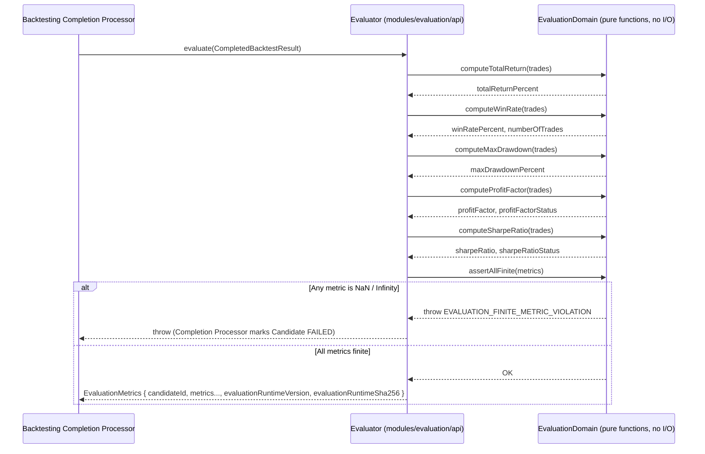
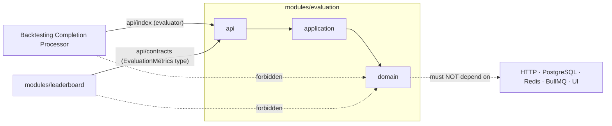

# Spec: Evaluation Module (`modules/evaluation`)

## 1. Overview

### Purpose

`modules/evaluation` turns a completed list of simulated trades into objective,
reproducible performance metrics. It owns the mathematical policy for computing
**Total Return**, **Win Rate**, **Max Drawdown**, **Profit Factor**, and
**Sharpe Ratio** from a raw `Trade[]`.

The module is intentionally narrow: it receives only trade outcomes and knows nothing
about the strategy that generated those trades, the dataset it ran on, or how the
metrics will be used for ranking. This separation is the core mandate from the project
brief (A§20–21): *"Strategy Evaluation must be separate from Strategy Implementation."*

The position of `modules/evaluation` in the overall pipeline:

```
modules/backtesting (runs simulation, produces Trade[])
  → **modules/evaluation** (computes EvaluationMetrics)
    → modules/leaderboard (applies ScoreFormula, admits to Top-K)
```

### Scope

In scope:
- Accepting a `CompletedBacktestResult` (candidateId + `Trade[]`) as the sole input.
- Computing all five core metrics: `totalReturnPercent`, `winRatePercent`,
  `numberOfTrades`, `maxDrawdownPercent`, `profitFactor`, `sharpeRatio`.
- Enforcing the documented finite-metric policy for all edge cases: zero trades,
  all-winning trades, all break-even trades, insufficient observations, zero variance.
- Tagging each metric with a machine-readable `status` field when the metric cannot
  be finite (e.g., `profitFactorStatus: "NO_LOSSES"`, `sharpeRatioStatus: "ZERO_VARIANCE"`).
- Returning a typed `EvaluationMetrics` object to the caller (Backtesting Completion
  Processor) for persistence and ranking.

Out of scope (owned by other modules):
- Executing the strategy or simulating trades — `modules/backtesting`.
- Applying a score formula or managing the Top-K leaderboard — `modules/leaderboard`.
- Generating strategy candidates or managing Search Runs — `modules/search`.
- Persisting `EvaluationMetrics` into any table — `modules/backtesting` owns
  `experiment_results`; Evaluation is a pure computation service.

### Actors

| Actor | Interaction |
|---|---|
| Backtesting Completion Processor | Calls `Evaluator.evaluate(completedBacktestResult)` synchronously after loading the completed `Trade[]`. Uses the returned `EvaluationMetrics` to build the `ExperimentResult` aggregate. |
| `modules/leaderboard` | Consumes the `EvaluationMetrics` shape (imported from `modules/evaluation/api`) as input to `score()`. It never calls `Evaluator` directly. |
| `apps/backend` | Composes the Evaluation module at startup by injecting it into the Backtesting Completion Processor. |

## 2. Requirements

### 2.1 Functional requirements

| ID | Requirement |
|---|---|
| FR-1 | The module must expose a synchronous `evaluate(result: CompletedBacktestResult): EvaluationMetrics` function. |
| FR-2 | `evaluate()` must compute `totalReturnPercent` as the overall portfolio return across all trades. |
| FR-3 | `evaluate()` must compute `winRatePercent` as the percentage of trades with `resultPercent > 0`. Break-even trades (`resultPercent === 0`) count as **losses**, not wins. |
| FR-4 | `evaluate()` must compute `numberOfTrades` as the count of all trades in the input array. |
| FR-5 | `evaluate()` must compute `maxDrawdownPercent` as a **non-negative** magnitude (e.g., `18`, never `-18`) representing the largest peak-to-trough portfolio value decline across all trades. |
| FR-6 | `evaluate()` must compute `profitFactor` and `profitFactorStatus` according to the documented edge-case policy (§2.2). |
| FR-7 | `evaluate()` must compute `sharpeRatio` and `sharpeRatioStatus` according to the documented edge-case policy (§2.2). |
| FR-8 | `evaluate()` must never return `NaN`, `Infinity`, or `-Infinity` in any numeric field. |
| FR-9 | `evaluate()` must be a **pure function**: no I/O, no database access, no network calls, no external state. Given the same `CompletedBacktestResult`, it must always return the same `EvaluationMetrics`. |
| FR-10 | The module must stamp `evaluationRuntimeVersion` and `evaluationRuntimeSha256` on the `EvaluationMetrics` object so the Completion Processor can pin them on `experiment_results` for reproducibility. |

### 2.2 Business rules

#### Total Return
`totalReturnPercent` is the compounded result of all trade returns. Because `initialCapital`
appears in both numerator and denominator it cancels out — `evaluate()` does **not** receive
or need `initialCapital` as a parameter.

```
factor = 1.0
for each trade in sequence:
    factor = factor × (1 + resultPercent / 100)
totalReturnPercent = (factor - 1) × 100
```

With zero trades: `totalReturnPercent = 0`.

#### Win Rate
```
wins = count of trades where resultPercent > 0
winRatePercent = (wins / numberOfTrades) × 100
```
With zero trades: `winRatePercent = 0`.
Break-even trades (`resultPercent === 0`) are **not** wins.

#### Max Drawdown
Like Total Return, `initialCapital` cancels out — the algorithm tracks a normalized factor
starting at `1.0`.

```
factor = 1.0
peak   = 1.0
maxDrawdown = 0
for each trade in sequence:
    factor = factor × (1 + resultPercent / 100)
    if factor > peak: peak = factor
    drawdown = (peak - factor) / peak × 100
    if drawdown > maxDrawdown: maxDrawdown = drawdown
maxDrawdownPercent = maxDrawdown  // non-negative, e.g. 18.5 not -18.5
```
With zero trades: `maxDrawdownPercent = 0`.

#### Profit Factor

| Condition | `profitFactor` | `profitFactorStatus` |
|---|---|---|
| `numberOfTrades = 0` | `null` | `"NO_TRADES"` |
| `grossProfit > 0` AND `grossLoss > 0` | `grossProfit / grossLoss` (finite, ≥ 0) | `"FINITE"` |
| `grossProfit > 0` AND `grossLoss = 0` (no losing trades) | `null` | `"NO_LOSSES"` |
| `grossProfit = 0` AND `grossLoss = 0` (all break-even) | `null` | `"NO_GROSS_MOVEMENT"` |

where:
- `grossProfit = sum of resultPercent for all trades where resultPercent > 0`
- `grossLoss = abs(sum of resultPercent for all trades where resultPercent < 0)`
- A `"NO_LOSSES"` scenario — all trades profitable — is the **best** possible case; the UI may display `"∞"` but this value never crosses an API or persistence boundary.

#### Sharpe Ratio

Computed on the per-trade return series (`trade.resultPercent` values):

```
observations = [trade.resultPercent for each trade]
mean = average(observations)
stdDev = population standard deviation of observations
sharpeRatio = mean / stdDev    (annualization is not required for MVP)
```

| Condition | `sharpeRatio` | `sharpeRatioStatus` |
|---|---|---|
| `numberOfTrades < 2` | `0` | `"INSUFFICIENT_OBSERVATIONS"` |
| `stdDev ≤ 1e-12` (effectively zero variance — all returns identical) | `0` | `"ZERO_VARIANCE"` |
| Otherwise | finite float | `"FINITE"` |

> **Note:** The Sharpe Ratio uses population standard deviation over the trade-return
> series. Annualization is deferred to a future formula version; the MVP Sharpe is a
> raw signal-to-noise ratio of the trade series.

#### Finite-metric enforcement
- All numeric fields (`totalReturnPercent`, `winRatePercent`, `maxDrawdownPercent`,
  `sharpeRatio`, and `profitFactor` when non-null) must be finite (not `NaN`, not
  `±Infinity`).
- If any intermediate computation produces a non-finite value (e.g., division by zero
  not handled by the edge-case rules above), `evaluate()` must throw
  `EVALUATION_FINITE_METRIC_VIOLATION` rather than return a corrupt result.

#### Zero-trade experiment
When `trades.length === 0`:
- `totalReturnPercent = 0`
- `winRatePercent = 0`
- `numberOfTrades = 0`
- `maxDrawdownPercent = 0`
- `sharpeRatio = 0`, `sharpeRatioStatus = "INSUFFICIENT_OBSERVATIONS"`
- `profitFactor = null`, `profitFactorStatus = "NO_TRADES"`

This combination is consistent with the `experiment_results` DB check constraints that
enforce `(number_of_trades = 0 AND profit_factor_status = 'NO_TRADES')`.

### 2.3 Non-functional requirements

- **Purity**: `evaluate()` is a pure function with no side effects. It must be safely
  runnable inside `apps/backtest-worker` without any dependency on PostgreSQL, Redis,
  BullMQ, or the NestJS DI container.
- **Determinism**: The same `CompletedBacktestResult` input must always produce the
  same `EvaluationMetrics` output. This is a hard requirement for Experiment
  reproducibility (brief A§36).
- **Layering**: `api → application → domain`. Domain code must not import HTTP,
  PostgreSQL, Redis, BullMQ, or UI libraries.
- **Boundary safety**: Consumers may only import `modules/evaluation/api`. No module
  may reach into `modules/evaluation/domain` or `modules/evaluation/infrastructure`.
- **Provenance**: `evaluationRuntimeVersion` and `evaluationRuntimeSha256` must be
  embedded in the returned `EvaluationMetrics` so the Completion Processor can store
  them on `experiment_results`. Changing any metric formula is a provenance change
  and requires a new version/SHA.

---

## 3. Behavior

### 3.1 Evaluate a completed backtest

This is the only execution flow for this module. It is always called synchronously
by the Backtesting Completion Processor.



### 3.2 Error / edge cases

| Case | Trigger | Behavior |
|---|---|---|
| Zero trades | `completedBacktestResult.trades.length === 0` | Returns valid `EvaluationMetrics` with all numeric fields `= 0`, `profitFactorStatus = "NO_TRADES"`, `sharpeRatioStatus = "INSUFFICIENT_OBSERVATIONS"`. Does NOT throw. |
| Single trade | `trades.length === 1` | `sharpeRatio = 0`, `sharpeRatioStatus = "INSUFFICIENT_OBSERVATIONS"`. Other metrics computed normally. |
| All trades break-even | All `resultPercent === 0` | `winRatePercent = 0`, `profitFactor = null`, `profitFactorStatus = "NO_GROSS_MOVEMENT"`, `sharpeRatio = 0`, `sharpeRatioStatus = "ZERO_VARIANCE"`. |
| All trades winning | All `resultPercent > 0` | `winRatePercent = 100`, `profitFactor = null`, `profitFactorStatus = "NO_LOSSES"`. Other metrics computed normally. |
| All trades losing | All `resultPercent < 0` | `winRatePercent = 0`, `profitFactor = 0` (grossProfit = 0, grossLoss > 0, ratio = 0), `profitFactorStatus = "FINITE"`. |
| Non-finite intermediate | Unexpected division by zero or overflow not handled by edge-case rules | Throw `EVALUATION_FINITE_METRIC_VIOLATION`. Completion Processor marks Candidate `FAILED`. |
| Called with `FailedBacktestResult` | Caller mistakenly passes a failed result | Must throw `INVALID_INPUT`: `evaluate()` requires `status: "COMPLETED"`. |

---

## 4. Contracts

### 4.1 Public API (`modules/evaluation/api/index.ts`)

```typescript
// modules/evaluation/api/index.ts
export interface EvaluatorModulePublicApi {
  readonly evaluator: Evaluator;
  readonly runtimeVersion: string;
  readonly runtimeSha256: string;
}
```

### 4.2 Bootstrap facade (`modules/evaluation/api/bootstrap.ts`)

```typescript
// modules/evaluation/api/bootstrap.ts
export function createEvaluationModule(): EvaluatorModulePublicApi;
```

No external dependencies are needed at construction time. The module is self-contained.
The returned `runtimeVersion` and `runtimeSha256` are derived from the package version
and a build-time hash of the evaluation domain source files, injected at compile/build
time (e.g., via an environment variable or a generated constants file).

### 4.3 Core domain contracts (`modules/evaluation/api/contracts.ts`)

```typescript
// modules/evaluation/api/contracts.ts

// Imported from modules/backtesting/api — not redeclared here.
import type { CompletedBacktestResult } from "modules/backtesting/api";

// ─── EvaluationMetrics ───────────────────────────────────────────────────────

export interface EvaluationMetrics {
  candidateId: string;

  // Core metrics — all finite numbers; never NaN / Infinity / -Infinity
  totalReturnPercent: number;
  winRatePercent: number;           // 0–100
  numberOfTrades: number;           // non-negative integer
  maxDrawdownPercent: number;       // non-negative; 18 = 18% loss, NOT -18

  // Profit Factor — null when status is not "FINITE"
  profitFactor: number | null;
  profitFactorStatus:
    | "FINITE"               // grossLoss > 0; value = grossProfit / grossLoss
    | "NO_TRADES"            // numberOfTrades = 0
    | "NO_LOSSES"            // grossProfit > 0, grossLoss = 0 (all trades profitable)
    | "NO_GROSS_MOVEMENT";   // grossProfit = 0, grossLoss = 0 (all break-even)

  // Sharpe Ratio — always a finite number (0 when status is not "FINITE")
  sharpeRatio: number;
  sharpeRatioStatus:
    | "FINITE"                      // numberOfTrades >= 2 AND stdDev > 1e-12
    | "INSUFFICIENT_OBSERVATIONS"   // numberOfTrades < 2
    | "ZERO_VARIANCE";              // stdDev <= 1e-12

  // Provenance — must match the values pinned in experiment_results
  evaluationRuntimeVersion: string; // semver, e.g. "1.0.0"
  evaluationRuntimeSha256: string;  // hex SHA-256 (64 chars) of the evaluation domain code
}

// ─── Evaluator ───────────────────────────────────────────────────────────────

export interface Evaluator {
  /**
   * Pure function. No I/O. Deterministic.
   * Throws EVALUATION_FINITE_METRIC_VIOLATION if any metric would be non-finite
   * due to an unhandled computation edge case.
   * Throws INVALID_INPUT if result.status !== "COMPLETED".
   */
  evaluate(result: CompletedBacktestResult): EvaluationMetrics;
}

// ─── Errors ──────────────────────────────────────────────────────────────────

export type EvaluationError =
  | { code: "EVALUATION_FINITE_METRIC_VIOLATION"; message: string }
  | { code: "INVALID_INPUT"; message: string };
```

### 4.4 Trade contract (imported from `modules/backtesting/api`)

The `Trade` type is owned by `modules/backtesting`. Evaluation imports and uses it
without redeclaring it.

```typescript
// From modules/backtesting/api/contracts.ts (authoritative source)
export interface Trade {
  id: string;
  backtestAttemptId: string;
  entryTime: string;    // ISO-8601 UTC
  entryPrice: number;
  exitTime: string;     // ISO-8601 UTC
  exitPrice: number;
  resultPercent: number; // e.g. +1.85 or -0.90
  signal: "LONG" | "SHORT"; // MVP uses LONG only
}

export interface CompletedBacktestResult {
  status: "COMPLETED";
  candidateId: string;
  attemptId: string;
  workerRuntimeVersion: string;
  workerRuntimeSha256: string;
  startedAt: string;
  completedAt: string;
  trades: Trade[];
}
```

### 4.5 Data model

`modules/evaluation` does **not own any database tables**. It is a pure computation
service. The `EvaluationMetrics` fields are persisted by `modules/backtesting` into
`experiment_results` as part of the Completion Processor's atomic transaction.

The DB constraints on `experiment_results` that the `EvaluationMetrics` output must
satisfy are shown here for reference (implementation must match):

```sql
-- Enforced by experiment_results CHECK constraints:
-- All numeric metrics are finite (no NaN / Infinity):
CHECK (total_return_percent NOT IN ('NaN'::numeric, 'Infinity'::numeric, '-Infinity'::numeric))
CHECK (win_rate_percent BETWEEN 0 AND 100)
CHECK (number_of_trades >= 0)
CHECK (max_drawdown_percent >= 0)
CHECK (sharpe_ratio NOT IN ('NaN'::numeric, 'Infinity'::numeric, '-Infinity'::numeric))

-- profitFactor / status consistency:
CHECK (
  (profit_factor_status = 'FINITE' AND profit_factor IS NOT NULL AND profit_factor >= 0)
  OR (profit_factor_status <> 'FINITE' AND profit_factor IS NULL)
)
CHECK (
  (number_of_trades = 0 AND profit_factor_status = 'NO_TRADES')
  OR (number_of_trades > 0 AND profit_factor_status <> 'NO_TRADES')
)

-- sharpeRatio / status consistency:
CHECK (
  (sharpe_ratio_status = 'FINITE')
  OR (sharpe_ratio_status IN ('INSUFFICIENT_OBSERVATIONS','ZERO_VARIANCE') AND sharpe_ratio = 0)
)
CHECK (number_of_trades >= 2 OR sharpe_ratio_status = 'INSUFFICIENT_OBSERVATIONS')

-- Zero-trade full consistency:
CHECK (
  (rank_eligible AND rank_exclusion_reason IS NULL AND number_of_trades > 0)
  OR (NOT rank_eligible AND rank_exclusion_reason = 'NO_TRADES' AND number_of_trades = 0
      AND total_return_percent = 0 AND win_rate_percent = 0 AND max_drawdown_percent = 0
      AND sharpe_ratio = 0 AND overall_score = 0 AND profit_factor_status = 'NO_TRADES')
)
```

### 4.6 Events

**None.** `modules/evaluation` is a pure synchronous computation service. It publishes
no events and subscribes to none. No BullMQ, Redis, or WebSocket involvement.

### 4.7 Module dependency direction

```text
apps/backend / apps/backtest-worker
  → modules/evaluation/api  (or modules/evaluation/api/bootstrap)

modules/evaluation/api
  → modules/evaluation/application

modules/evaluation/application
  → modules/evaluation/domain

modules/evaluation/infrastructure
  (none required for MVP — no storage or external calls)

forbidden:
  modules/evaluation/domain → HTTP / PostgreSQL / Redis / BullMQ / UI
  other modules → modules/evaluation/domain or modules/evaluation/infrastructure
```



---

## 5. Constraints

### Technical constraints

- **Language/runtime**: TypeScript. The `domain` layer consists entirely of pure
  functions that can run identically in `apps/backend` and `apps/backtest-worker`.
- **No ORM, no DB**: No Knex, TypeORM, or SQL client in this module.
- **Provenance injection**: `evaluationRuntimeVersion` and `evaluationRuntimeSha256`
  are injected at module creation time (e.g., from a build-time constant file under
  `modules/evaluation/api/version.ts`). They must not be computed at `evaluate()` call
  time to avoid per-call overhead.
- **Precision**: All arithmetic uses JavaScript's native `number` (IEEE 754 double).
  For the MVP, this is sufficient. If numeric precision becomes a concern, a future
  change may introduce `Decimal.js`.
- **Validation**: No Zod is needed at the domain layer since this module has no REST
  surface. The `Evaluator` performs its own argument validation.

### Business constraints

- The `winRatePercent` definition is strict: only `resultPercent > 0` counts as a win.
  Break-even trades (`resultPercent === 0`) are treated as losses.
- `maxDrawdownPercent` is always a **non-negative magnitude**. The UI may render it as
  `−18%`, but the value stored in the database and returned from `evaluate()` is `18`.
- A zero-trade experiment is a valid, non-error result. The Completion Processor must
  still persist it and the Leaderboard must exclude it from the Top-K.
- The `evaluationRuntimeSha256` must change whenever the metric computation formulas
  change. This is a reproducibility guarantee: given the same SHA, the same result is
  always produced.

### Out of scope

- Executing the strategy or producing the `Trade[]` — `modules/backtesting`.
- Applying a score formula to rank strategies — `modules/leaderboard`.
- Persisting `EvaluationMetrics` to any table — `modules/backtesting` (Completion
  Processor owns `experiment_results`).
- Annualizing the Sharpe Ratio — deferred to a future `ScoreFormula` version.
- Short selling simulation — the `"SHORT"` signal on `Trade` is a forward-compatibility
  field; MVP evaluation treats all trades identically regardless of signal direction.

---

## 6. Acceptance Criteria

### Total Return

- [ ] `evaluate()` with an empty `trades` array returns `totalReturnPercent = 0`.
- [ ] `evaluate()` with a single trade of `resultPercent = +5` returns
  `totalReturnPercent = 5`.
- [ ] `evaluate()` with two trades `[+10, -5]` returns
  `totalReturnPercent = ((1.10 × 0.95) − 1) × 100 = 4.5`.
- [ ] `evaluate()` with all-losing trades returns a finite negative `totalReturnPercent`.

### Win Rate

- [ ] `evaluate()` with `trades = [+1, -1, 0, +2]` returns
  `numberOfTrades = 4`, `winRatePercent = 50` (2 wins; break-even counts as loss).
- [ ] `evaluate()` with zero trades returns `winRatePercent = 0`.
- [ ] `evaluate()` with all break-even trades (`resultPercent = 0`) returns
  `winRatePercent = 0`.
- [ ] `evaluate()` with all winning trades returns `winRatePercent = 100`.

### Max Drawdown

- [ ] `evaluate()` with zero trades returns `maxDrawdownPercent = 0`.
- [ ] `evaluate()` with a trade sequence `[+20, -10, +5]` returns a finite,
  non-negative `maxDrawdownPercent`.
- [ ] `evaluate()` with all-winning trades returns `maxDrawdownPercent = 0`.
- [ ] `evaluate()` never returns a negative `maxDrawdownPercent`.

### Profit Factor

- [ ] Zero trades → `profitFactor = null`, `profitFactorStatus = "NO_TRADES"`.
- [ ] Trades `[+5, -2]` → `profitFactor = 5/2 = 2.5`, `profitFactorStatus = "FINITE"`.
- [ ] All trades winning (`[+3, +1]`) → `profitFactor = null`,
  `profitFactorStatus = "NO_LOSSES"`.
- [ ] All break-even (`[0, 0]`) → `profitFactor = null`,
  `profitFactorStatus = "NO_GROSS_MOVEMENT"`.
- [ ] All trades losing (`[-2, -1]`) → `profitFactor = 0`,
  `profitFactorStatus = "FINITE"`.

### Sharpe Ratio

- [ ] Zero trades → `sharpeRatio = 0`, `sharpeRatioStatus = "INSUFFICIENT_OBSERVATIONS"`.
- [ ] Single trade → `sharpeRatio = 0`, `sharpeRatioStatus = "INSUFFICIENT_OBSERVATIONS"`.
- [ ] Two identical trades (`[+2, +2]`) → `sharpeRatio = 0`,
  `sharpeRatioStatus = "ZERO_VARIANCE"` (stdDev = 0 ≤ 1e-12).
- [ ] Mixed trades (`[+5, -1, +3]`) → finite `sharpeRatio`,
  `sharpeRatioStatus = "FINITE"`.

### Finite metric enforcement

- [ ] Any computation path that would produce `NaN` or `±Infinity` throws
  `EVALUATION_FINITE_METRIC_VIOLATION`; no `EvaluationMetrics` object is returned.
- [ ] Calling `evaluate()` with a `FailedBacktestResult` (status `"FAILED"`) throws
  `INVALID_INPUT`.

### Purity and determinism

- [ ] `evaluate()` called twice with identical `CompletedBacktestResult` returns byte-for-byte
  identical `EvaluationMetrics` (determinism test).
- [ ] A unit test for `evaluate()` requires no database, no network, and no async
  setup; it runs in < 10ms for 10,000 trades.

### Provenance

- [ ] `evaluationRuntimeVersion` and `evaluationRuntimeSha256` on the returned
  `EvaluationMetrics` are non-empty strings and match the values exposed by
  `EvaluatorModulePublicApi.runtimeVersion` / `runtimeSha256`.
- [ ] Changing any metric formula (e.g., the `stdDev` threshold or the win definition)
  results in a different `evaluationRuntimeSha256` without requiring a manual update —
  enforced by deriving the hash from the source files at build time.

### Architecture boundary

- [ ] An architecture test or code review prevents `modules/evaluation/domain` from
  importing PostgreSQL, Redis, BullMQ, HTTP, or UI libraries.
- [ ] An architecture test or code review prevents any module other than
  `modules/backtesting` from calling `Evaluator.evaluate()` at runtime (the type is
  exported but calling it outside the Completion Processor is a design violation).
- [ ] A unit test confirms `evaluate()` contains no `await`, `Promise`, or any async
  primitive in its call stack.
