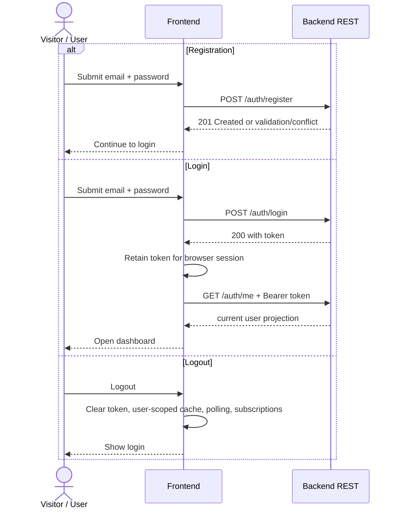
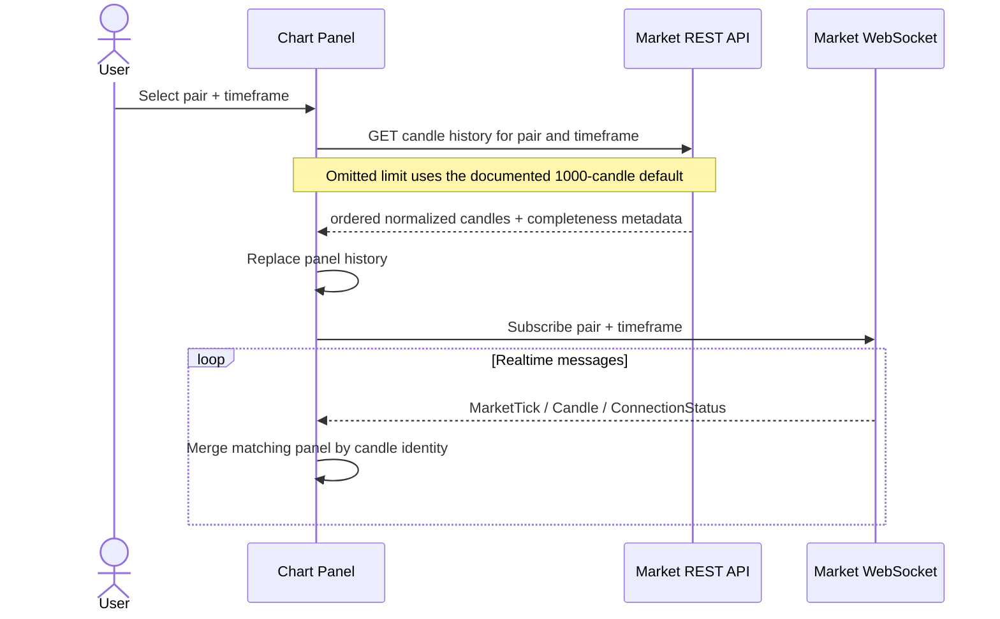
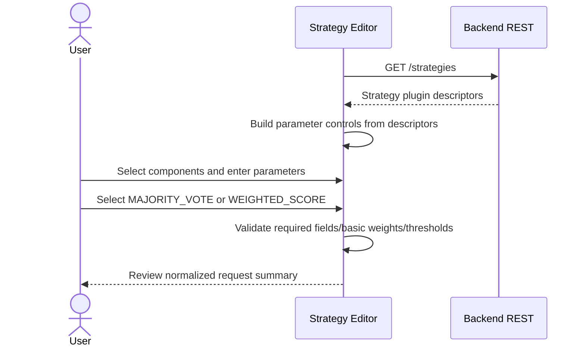
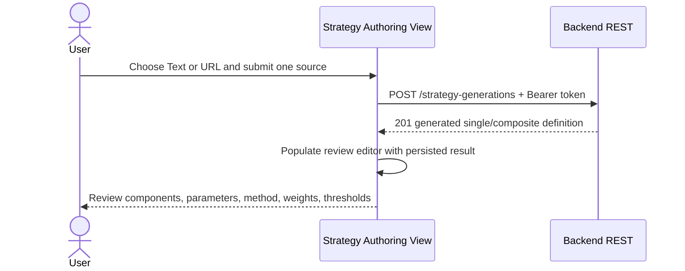
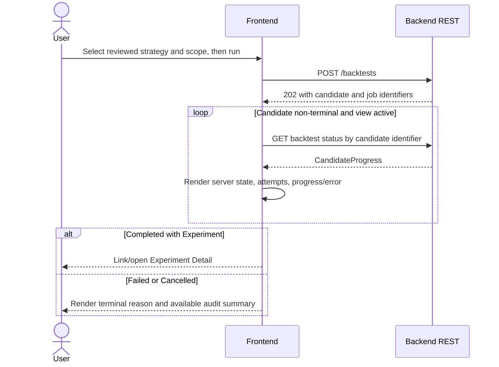
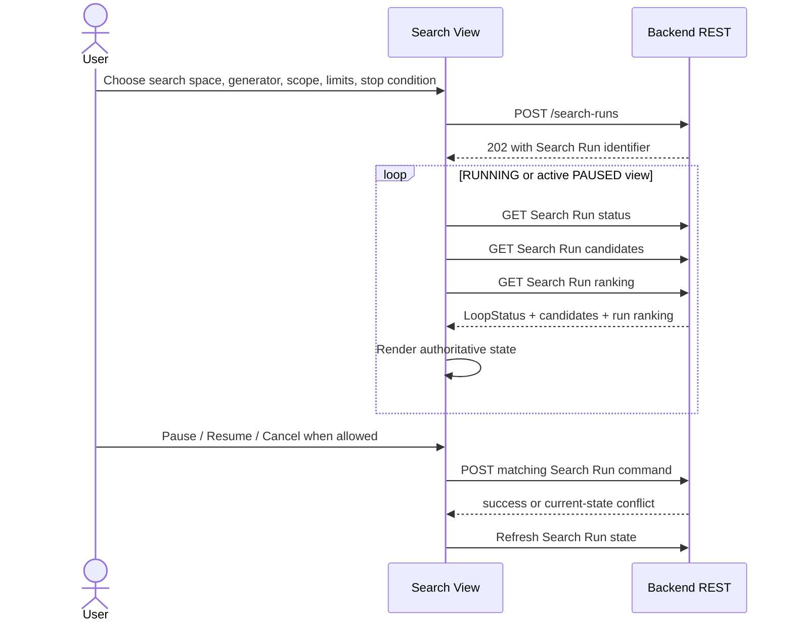
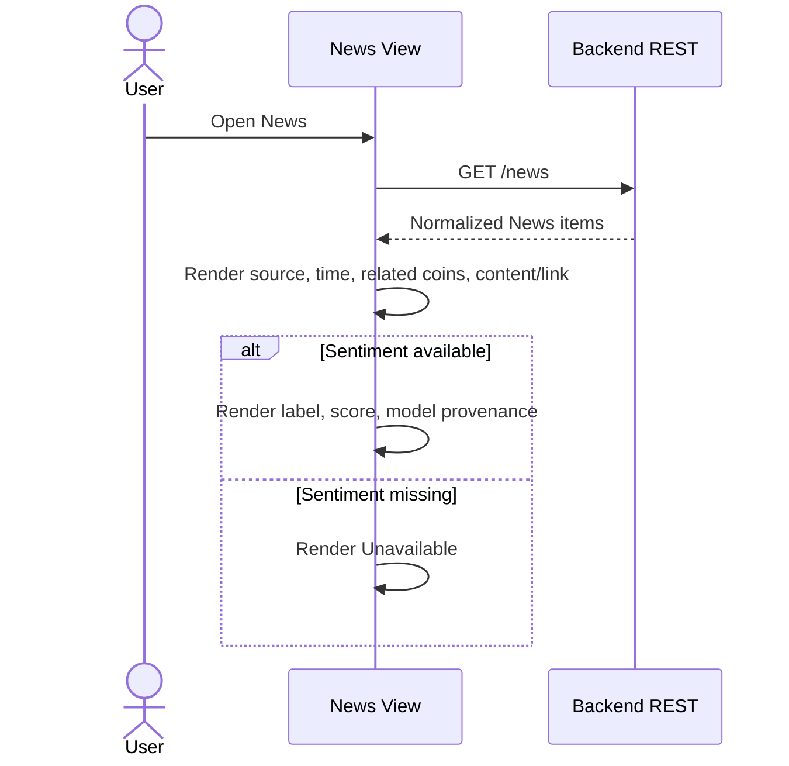

# Spec: Frontend Application (`apps/frontend`)

## 1. Overview

### Purpose

`apps/frontend` is the browser-based dashboard for the Crypto Strategy Lab. It lets an authenticated user inspect realtime market data, configure or generate strategies, run and monitor manual backtests and bounded Search Runs, inspect Experiments and Trade Detail, compare ranked results, and read News with available Sentiment.

The Frontend is a presentation and interaction boundary. It does not implement trading, strategy analysis, backtest simulation, evaluation, scoring, ranking, Search orchestration, News extraction, or Sentiment inference. Those behaviors remain owned by Backend modules and are consumed through documented transport contracts.

### Scope

In scope:

- Simple registration, login, logout, and authenticated-route handling.
- A dashboard with up to four independently configured candlestick charts.
- Historical chart bootstrap through REST and subsequent normalized market updates through the market WebSocket.
- Descriptor-driven manual strategy/composite configuration without strategy-specific UI branches.
- AI-assisted Strategy generation from natural language or one website URL.
- Leaderboard Scope selection and creation.
- Manual backtest submission, progress polling, cancellation, and result navigation.
- Search Run configuration, start, progress polling, pause/resume/cancel controls, candidate history, and run-scoped ranking.
- Persistent Top-10 display for one user-owned immutable Leaderboard Scope.
- Experiment metrics and Trade Detail, including stop-loss and take-profit values when present.
- News display with available Sentiment and explicit missing-sentiment presentation.
- Loading, empty, degraded, validation, authentication, and transport-error states.

Out of scope:

- Live-money trading, exchange order entry, wallets, deposits, or portfolio custody.
- Frontend-side strategy execution, backtesting, evaluation, score calculation, ranking, or stop-condition enforcement.
- OAuth/SSO, MFA, RBAC, refresh-token workflows, or granular permissions.
- A general WebSocket event system for Search, Backtesting, Leaderboard, News, or Sentiment.
- Direct browser access to PostgreSQL, Redis, BullMQ, Binance, LLM providers, or News providers.
- Offline-first synchronization, native mobile applications, and server-side rendering.

### Actors

| Actor | Interaction |
|---|---|
| Visitor | Registers or logs in before accessing user-owned application data. |
| Authenticated user | Configures charts and strategies, starts work, monitors progress, and reads their own results. |
| Backend REST API | Single command/query boundary and source of authoritative application state. |
| Market WebSocket Gateway | Supplies normalized ticks, candles, and exchange connection status only. |
| Browser runtime | Hosts React, session authentication state, REST cache, chart state, and reconnect behavior. |

### Source interpretation and precedence

This spec is a frontend projection of the contracts owned by the Backend modules. If a DTO or business rule differs between this document and its owning module spec, the owning module spec and `docs/design/component-contracts.md` take precedence. The Frontend must adapt its rendering to those contracts; it must not create a competing business definition.

## 2. Requirements

### 2.1 Functional requirements

| ID | Requirement |
|---|---|
| FR-FE-001 | The Frontend must provide registration and login forms using the Auth REST endpoints and must attach the returned JWT as `Authorization: Bearer <token>` on protected REST requests. |
| FR-FE-002 | The Frontend must clear local authentication state on logout and on an authenticated request that returns `401`, then direct the user to login. |
| FR-FE-003 | Authenticated screens must never accept or send a user-selected `userId`; ownership is derived by the Backend from the bearer token. |
| FR-FE-004 | The dashboard must support one to four chart panels. Each panel independently selects a supported pair and `Timeframe`. |
| FR-FE-005 | Each chart must load initial closed-candle history with `GET /market/candles`; when `limit` is omitted, the documented effective load is the latest 1000 closed candles. |
| FR-FE-006 | After historical bootstrap, charts must consume normalized `MarketTick`, `Candle`, and `MarketDataConnectionStatus` messages from the market WebSocket only. |
| FR-FE-007 | The Frontend must merge candle updates by `(pair, timeframe, timestamp)`, update forming candles in place, and never render a duplicate candle for repeated or corrected messages. |
| FR-FE-008 | The Frontend must obtain `StrategyPluginDescriptor[]` from `GET /strategies` and render parameter controls from descriptor metadata without branching on a specific strategy name. |
| FR-FE-009 | The manual strategy editor must support one or more Strategy Definitions and the documented `MAJORITY_VOTE` or `WEIGHTED_SCORE` composite configuration. |
| FR-FE-010 | The Frontend must support authenticated AI-assisted Strategy generation from exactly one natural-language text input or one HTTP(S) website URL through `POST /strategy-generations`. |
| FR-FE-011 | A generated Strategy/Composite must be shown as a reviewable configuration before the user starts a manual backtest or uses it in a Search configuration. |
| FR-FE-012 | The Frontend must list user-owned Leaderboard Scopes and allow creation of a new immutable scope/version using the documented REST contracts. |
| FR-FE-013 | Starting a manual backtest must submit the selected immutable strategy/composite configuration and `leaderboardScopeId` through `POST /backtests`, then navigate to or display the returned Candidate status. |
| FR-FE-014 | While a manual Candidate is non-terminal, the Frontend must periodically poll `GET /backtests/{candidateId}`. It must stop active polling when the Candidate is terminal or the view is no longer active. |
| FR-FE-015 | The Frontend must expose manual cancellation through `POST /backtests/{candidateId}/cancel`; Search Candidates must be controlled through their Search Run rather than the manual endpoint. |
| FR-FE-016 | The Search form must require a search space, generator type, positive `maxInFlight`, one Leaderboard Scope, and at least one positive Stop Condition field before submitting `POST /search-runs`. |
| FR-FE-017 | While a Search Run is active, the Frontend must poll its `LoopStatus`, candidate history, and run-scoped leaderboard through REST. Closing or navigating away from the page must not imply cancellation. |
| FR-FE-018 | Search controls must reflect the current server state and invoke the documented pause, resume, or cancel command. The UI must not optimistically claim a lifecycle transition before the command succeeds. |
| FR-FE-019 | The Frontend must distinguish the Search Run ranking from the persistent Top-10 for a selected user-owned Leaderboard Scope. It must render Backend-provided ranks/scores without recalculating them. |
| FR-FE-020 | Experiment Detail must render the persisted strategy/composite version, benchmark scope, finite Evaluation metrics, score/rank eligibility, and Trade Detail returned by `GET /experiments/{experimentId}`. |
| FR-FE-021 | Trade Detail must render entry/exit values, result percentage, signal, and optional `stopLoss`/`takeProfit`; missing risk values must display as unavailable rather than zero. |
| FR-FE-022 | The News view must render normalized News items and available Sentiment. Missing Sentiment caused by unavailable or failed analysis must not be presented as `NEUTRAL`. |
| FR-FE-023 | Every REST-driven view must provide distinguishable loading, empty, validation-error, unauthorized, not-found, conflict, degraded-service, and retryable-failure states where applicable. |
| FR-FE-024 | Data returned for a previous authenticated user must be removed from the client cache when authentication changes or logout occurs. |

### 2.2 Business and presentation rules

- **Backend authority:** the Backend response is authoritative for Candidate/Search state, score, rank, metric eligibility, immutable versions, and ownership. The Frontend may format values but never recompute or override them.
- **User isolation:** all user-owned lists and detail views use the current JWT. A `404` for an owner-scoped identifier is rendered as unavailable/not found without suggesting another user owns it.
- **Asynchronous commands:** a `202 Accepted` response means work was accepted, not completed. The UI transitions to progress monitoring using the returned `candidateId`, `jobId`, or `searchRunId`.
- **Terminal Candidate states:** `COMPLETED`, `FAILED`, and `CANCELLED` stop Candidate polling. All other documented Candidate states remain in progress.
- **Terminal Search states:** `COMPLETED`, `CANCELLED`, and `FAILED` stop Search polling. `PAUSED` remains non-terminal but does not require high-frequency polling.
- **Cancellation:** closing a browser tab, refreshing, losing the network, or navigating away does not cancel server-side work. Cancellation occurs only after the corresponding REST command succeeds.
- **Ranking:** Search Run ranking and persistent scope Top-10 are different views. A successful Experiment may exist without a persistent Leaderboard Entry, and a zero-trade Experiment is not rank-eligible.
- **Finite metric display:** API values are finite. `profitFactor = null` must be presented using its reason (`NO_TRADES`, `NO_LOSSES`, or `NO_GROSS_MOVEMENT`); the UI may display `NO_LOSSES` as `∞`, but must not send infinity back through a contract.
- **Drawdown display:** `maxDrawdownPercent` is received as a non-negative loss magnitude. The UI may add a minus sign for human-readable presentation without changing the underlying value.
- **Sentiment display:** absent sentiment is “Unavailable” or equivalent, never inferred as neutral.
- **Strategy extensibility:** parameter forms are driven by `StrategyParameterDescriptor` type, bounds, options, and required metadata. Adding a registered plugin must not require a Frontend core change.
- **Form validation:** client validation improves feedback but never replaces Backend validation. Backend field/global errors remain visible to the user.
- **Stale responses:** request identity must include the authenticated user and relevant resource/query parameters. Late responses from a previous selection must not replace the active view.

### 2.3 Non-functional requirements

- **Technology:** the Frontend uses TypeScript, React, and Vite. TanStack Query manages REST server state and polling; TradingView Lightweight Charts renders candlesticks.
- **Transport separation:** REST handles all commands and queries. WebSocket handles only normalized realtime market messages and connection status.
- **Responsiveness:** the primary target is a desktop/laptop dashboard. The layout must remain usable at common tablet widths, but a separate mobile application is not required.
- **Accessibility baseline:** forms and controls must have associated labels, keyboard access, visible focus, and text/status equivalents for color-only chart or signal indicators.
- **Performance:** chart updates must mutate the affected series incrementally rather than rebuilding all chart data for every tick. Hidden/unmounted views must release timers and subscriptions.
- **Recoverability:** transient REST failures expose retry, and WebSocket disconnects expose status while reconnecting with bounded backoff. Reconnect must refresh missed candle history through REST before normal live merging resumes.
- **Security baseline:** passwords must never be logged or persisted by application code. The JWT may be retained for the current browser session, must be removed on logout/`401`, and must never be placed in URLs.
- **Boundary safety:** the browser must not receive raw Binance payloads, BullMQ messages, database records, raw News-provider HTML, or LLM provider payloads.
- **Testability:** transport clients, polling decisions, chart merge logic, and form-schema mapping must be separable from presentation components and testable with deterministic fixtures.

## 3. Behavior

### 3.1 Registration, login, and logout



Duplicate registration errors are shown without clearing the form. Invalid login uses a generic credential error. Any protected request returning `401` clears authentication state and redirects to login; `404` does not trigger logout.

### 3.2 Historical bootstrap and realtime chart updates



When pair/timeframe changes, the panel unsubscribes the obsolete selection, clears incompatible transient state, loads the new history, then subscribes. A late response/message for the prior selection is ignored. On reconnect, the panel refreshes REST history before applying subsequent live updates so missed closed candles are recovered.

The dashboard may open at most four chart panels. Removing a panel releases its subscription and chart resources. One panel's selection or failure must not overwrite another panel.

### 3.3 Descriptor-driven manual Strategy configuration



For `WEIGHTED_SCORE`, the editor shows weights and buy/sell thresholds and checks basic numeric validity and sum-to-one feedback. For `MAJORITY_VOTE`, weights are not presented as meaningful inputs. The Backend remains authoritative for normalization and validation.

### 3.4 AI-assisted Strategy generation



The submit control is disabled while the request is active to prevent accidental duplicate interaction. Source-fetch, model-unavailable, unsafe-URL, malformed-output, and Strategy-validation errors are displayed distinctly using the Backend error contract. The Frontend never calls an LLM or fetches the submitted source website directly.

### 3.5 Start and monitor a manual backtest



The cancel control calls the manual cancellation endpoint once and then reloads authoritative status. A `409` indicating a Search-origin Candidate directs the user to its Search Run controls.

### 3.6 Start and monitor a Search Run



The status view shows active candidates, queued/running counts, tested/failed counters, average duration, current best entry, stop condition, timestamps, stop reason, and last error when present. It must distinguish an orchestration `FAILED/ERROR` result from user cancellation and normal completion.

### 3.7 Rankings, Experiment Detail, and Trade Detail

The Search Run view renders all Backend-ranked eligible Experiments for that run. The persistent Leaderboard view requires a selected Leaderboard Scope and renders at most the Backend-provided fixed Top-10 for that user-owned scope. The Frontend must not merge the two lists or infer admission from score alone.

Experiment Detail renders:

- immutable Strategy/Composite version and component summary;
- immutable benchmark scope and score formula references;
- total return, win rate, maximum drawdown, Profit Factor/status, Sharpe Ratio, trade count, score, and rank eligibility;
- Trade Detail rows with entry/exit time and price, signal, result percent, and optional stop-loss/take-profit prices;
- terminal/audit information made available by the response.

### 3.8 News and Sentiment



The Frontend does not expose raw crawler HTML or raw model output. A News/Sentiment failure may degrade this view but must not disable charts, Strategy configuration, Search, or Backtesting views.

### 3.9 Error and edge cases

| Case | Frontend behavior |
|---|---|
| Missing/expired JWT | Clear authenticated state and user-scoped cache; show login. |
| Owner-scoped `404` | Show unavailable/not found without disclosing ownership. |
| `409` lifecycle conflict | Reload authoritative resource state and explain that the action is no longer valid. |
| `400` validation error | Keep user input and map field/global errors where supplied. |
| `503` model/provider dependency failure | Keep the current page usable and offer bounded retry for that operation. |
| REST polling failure | Keep the last successful projection visibly stale, show retry status, and retry according to the query policy while the view remains active. |
| WebSocket disconnect | Show connection degradation; reconnect with bounded backoff and reconcile candles through REST. |
| Duplicate/out-of-order candle | Merge by identity; never append a duplicate or regress a closed candle to forming. |
| Search/browser disconnect | Do not cancel the Search Run; reload its state by ID after reconnection/navigation. |
| Candidate completes between polls | The next authoritative response transitions the UI directly to the terminal state. |
| Empty ranking | Show an empty state; do not synthesize placeholder ranks. |
| Zero-trade Experiment | Show persisted metrics/score and the not-rank-eligible reason; do not hide the Experiment. |
| Missing Trade risk price | Display unavailable; do not render `0`. |
| Missing Sentiment | Display unavailable; do not render `NEUTRAL`. |

## 4. Contracts

### 4.1 Frontend route/view contract

The minimum navigable views are:

| Route | View | Authentication |
|---|---|---|
| `/register` | Account registration | Public |
| `/login` | Login | Public |
| `/dashboard` | One-to-four market charts and entry navigation | Required |
| `/strategies` | Manual and AI-assisted Strategy authoring/review | Required |
| `/backtests/:candidateId` | Manual Candidate progress/control | Required, owner-scoped |
| `/search-runs/:searchRunId` | Search status, candidates, controls, and run ranking | Required, owner-scoped |
| `/experiments/:experimentId` | Metrics and Trade Detail | Required, owner-scoped |
| `/leaderboard` | Persistent Top-10 for selected scope | Required, owner-scoped |
| `/news` | News and available Sentiment | Required |

Exact component/file names are implementation details. Routes may be nested without changing the view responsibilities above.

### 4.2 REST client contract

```typescript
export interface AuthSession {
  token: string;
  userId: string;
}

export interface RestClient {
  register(input: { email: string; password: string }): Promise<void>;
  login(input: { email: string; password: string }): Promise<{ token: string }>;
  me(): Promise<{ userId: string; email: string }>;

  readCandles(query: ReadCandlesQuery): Promise<ReadCandlesResult>;
  listStrategies(): Promise<StrategyPluginDescriptor[]>;
  generateStrategy(input: GenerateStrategyRequest): Promise<GenerateStrategyResponse>;
  listLeaderboardScopes(): Promise<LeaderboardScope[]>;
  createLeaderboardScope(input: CreateLeaderboardScopeRequest): Promise<LeaderboardScope>;

  startBacktest(input: StartManualBacktestRequest): Promise<BacktestSubmissionAccepted>;
  readBacktest(candidateId: string): Promise<CandidateProgress>;
  cancelBacktest(candidateId: string): Promise<void>;

  startSearch(input: StartSearchRequest): Promise<{ searchRunId: string }>;
  readSearch(searchRunId: string): Promise<LoopStatus>;
  readSearchCandidates(searchRunId: string): Promise<CandidateProgress[]>;
  readSearchLeaderboard(searchRunId: string): Promise<SearchRunRankingEntry[]>;
  controlSearch(searchRunId: string, action: "pause" | "resume" | "cancel"): Promise<void>;

  readLeaderboard(scopeId: string): Promise<LeaderboardEntry[]>;
  readExperiment(experimentId: string): Promise<ExperimentResult>;
  readNews(): Promise<NewsReadItem[]>;
}
```

All methods except `register` and `login` attach the current bearer JWT where the Backend route is protected. The transport adapter validates response DTOs at the boundary and converts transport failures into a small typed UI error model; React components do not parse arbitrary Backend payloads directly.

### 4.3 Market WebSocket client contract

```typescript
export interface MarketSubscription {
  pair: string;
  timeframe: Timeframe;
}

export type MarketMessage =
  | { type: "TICK"; data: MarketTick }
  | { type: "CANDLE"; data: Candle }
  | { type: "CONNECTION_STATUS"; data: MarketDataConnectionStatus };

export interface MarketStreamClient {
  connect(): void;
  subscribe(subscription: MarketSubscription): void;
  unsubscribe(subscription: MarketSubscription): void;
  disconnect(): void;
  onMessage(handler: (message: MarketMessage) => void): () => void;
}
```

The exact wire envelope must match `packages/contracts/websocket/market-data.ts`. This local shape documents the capabilities the UI consumes; it does not authorize a competing protocol.

### 4.4 UI state contract

```typescript
export interface ChartPanelState {
  id: string;
  pair: string;
  timeframe: Timeframe;
}

export interface StrategyDraft {
  components: Array<{
    strategyName: string;
    parameters: Record<string, unknown>;
    weight?: number;
  }>;
  method: "MAJORITY_VOTE" | "WEIGHTED_SCORE";
  thresholds?: { buy: number; sell: number };
}
```

`ChartPanelState` and `StrategyDraft` are local UI state, not domain entities and not authoritative persistence. Server state remains in TanStack Query and is invalidated/refetched after successful commands. Logging out clears every user-scoped query and draft that contains user data.

### 4.5 Minimum REST mapping

| Method and path | Frontend use |
|---|---|
| `POST /auth/register` | Register account |
| `POST /auth/login` | Obtain session JWT |
| `GET /auth/me` | Restore/verify current authenticated identity |
| `GET /market/candles?pair=...&timeframe=...` | Initial/reconciliation candle history; omitted limit defaults to 1000 |
| `GET /strategies` | Render descriptor-driven configuration |
| `POST /strategy-generations` | Generate persisted single/composite Strategy from text or URL |
| `GET /leaderboard-scopes` | List the current user's scopes |
| `POST /leaderboard-scopes` | Create an immutable scope/version |
| `POST /backtests` | Start manual Candidate; expect `202` plus IDs |
| `GET /backtests/{candidateId}` | Poll Candidate progress |
| `POST /backtests/{candidateId}/cancel` | Cancel a Manual Candidate |
| `POST /search-runs` | Start bounded Search Run; expect `202` plus ID |
| `GET /search-runs/{searchRunId}` | Poll `LoopStatus` |
| `GET /search-runs/{searchRunId}/candidates` | Read Search candidate progress/history |
| `GET /search-runs/{searchRunId}/leaderboard` | Read Search Run ranking |
| `POST /search-runs/{searchRunId}/pause` | Pause generation |
| `POST /search-runs/{searchRunId}/resume` | Resume generation |
| `POST /search-runs/{searchRunId}/cancel` | Cancel run/non-terminal Candidates |
| `GET /leaderboard?scopeId=...` | Read persistent scope Top-10 |
| `GET /experiments/{experimentId}` | Read Experiment metrics and Trades |
| `GET /news` | Read normalized News and available Sentiment |

### 4.6 Persistence and events

The Frontend owns no authoritative database tables and publishes no domain events. Browser persistence is limited to session authentication and non-authoritative presentation preferences where implemented. PostgreSQL-backed Backend services remain authoritative.

The Frontend does not subscribe to BullMQ or internal completion events. It observes Candidate/Search/Leaderboard changes through REST polling. The only push channel is the market WebSocket.

## 5. Constraints

### Technical constraints

- Implemented under `apps/frontend` with React, Vite, and TypeScript.
- Uses TanStack Query for REST server state/polling and TradingView Lightweight Charts for candlestick rendering.
- Consumes only documented REST and market WebSocket contracts; no deep import from Backend module domain/infrastructure code.
- Shared imports are limited to browser-safe transport contracts from `packages/contracts/rest` and `packages/contracts/websocket`.
- Up to four chart panels are supported concurrently.
- Polling and subscriptions must be scoped to mounted/visible workflows and cleaned up when no longer required.
- Market messages are normalized before reaching the browser; exchange-specific parsing is forbidden in the Frontend.

### Business constraints

- The application is an experiment platform, not a trading terminal.
- Backend ownership and authorization decisions are final.
- The fixed persistent leaderboard size is 10 and cannot be configured in the UI.
- Search always requires an explicit Stop Condition; the Frontend must not offer an uncontrolled search mode.
- A cancelled Candidate may retain Attempt/Trade audit data but has no Experiment/rank; the UI must not promote audit Trades as a successful result.
- An `INFORMATION` strategy requires a compatible scope with a sealed Sentiment snapshot; the Frontend presents Backend validation and must not substitute live sentiment.

### Out of scope

- Business-rule duplication for scoring, ranking, simulation, strategy signals, or data completeness.
- Non-market WebSocket subscriptions and direct queue monitoring.
- Raw HTML/LLM output inspection tools, prompt editing/version management, or model-provider selection.
- Advanced identity management, collaborative organizations, public sharing, and per-resource permissions.
- User-defined dashboard persistence/synchronization across devices.

## 6. Acceptance Criteria

### Authentication and isolation

- [ ] A visitor can register, log in, and reach authenticated views with the returned JWT.
- [ ] Logout or any protected `401` clears authentication state, user-scoped cache, polling, and subscriptions.
- [ ] The Frontend never sends a user-selected `userId` as authorization evidence.
- [ ] Owner-scoped `404` responses disclose no other-user information.

### Market dashboard

- [ ] The dashboard supports one to four independent chart panels.
- [ ] A chart without an explicit limit loads the latest available set under the 1000-candle default.
- [ ] Repeated/forming/closed candle messages merge by identity without duplicates or closed-to-forming regression.
- [ ] WebSocket disconnect is visible, reconnect is bounded, and missed candles are reconciled through REST.
- [ ] Reconfiguring or removing a panel cleans up obsolete requests/subscriptions.

### Strategy authoring

- [ ] Manual parameter forms render from `StrategyPluginDescriptor` metadata without per-plugin core branches.
- [ ] Single and composite configurations support the documented combination methods and validation feedback.
- [ ] Text or URL generation calls only the Backend and displays the persisted result for review.
- [ ] AI fetch/model/output/validation failures leave the existing editor and saved definitions usable.

### Manual Backtesting and Search

- [ ] Manual submission handles `202`, monitors Candidate state, supports idempotent cancellation, and stops polling at a terminal state.
- [ ] Search cannot start without a valid scope, positive concurrency value, and explicit positive Stop Condition.
- [ ] Search status, candidate history, and run ranking are polled through REST; navigation/disconnection does not cancel work.
- [ ] Pause, resume, and cancel controls are enabled only for compatible server states and refresh authoritative state after commands.

### Results, ranking, and news

- [ ] Search Run ranking and persistent scope Top-10 are visibly distinct and are never recalculated client-side.
- [ ] Zero-trade Experiments remain visible with their not-rank-eligible reason.
- [ ] Experiment Detail renders finite metrics and Trade Detail, including optional stop-loss/take-profit values without converting absence to zero.
- [ ] Profit Factor reason statuses and drawdown display follow the documented presentation rules.
- [ ] Missing Sentiment is displayed as unavailable, never neutral.
- [ ] News/Sentiment degradation does not disable Market, Strategy, Search, or Backtesting views.

### Architecture and quality

- [ ] All commands/queries use REST and only realtime market messages use WebSocket.
- [ ] The Frontend has no BullMQ, PostgreSQL, Redis, Binance, News-provider, or LLM-provider dependency.
- [ ] Loading, empty, validation, unauthorized, not-found, conflict, degraded, and retryable error states are test-covered where applicable.
- [ ] Transport parsing, chart merge behavior, descriptor-driven forms, polling termination, authentication cleanup, and reconnect reconciliation have deterministic tests.
