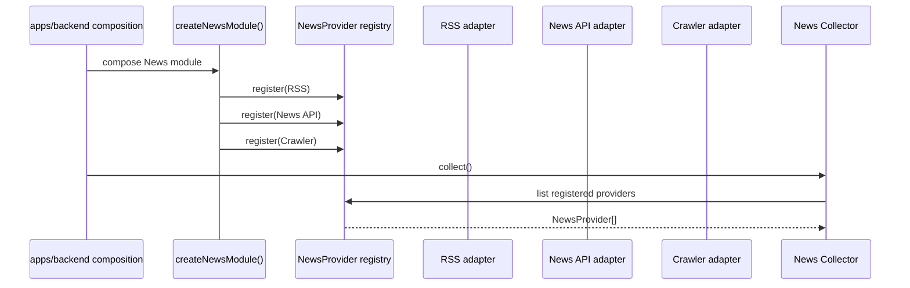
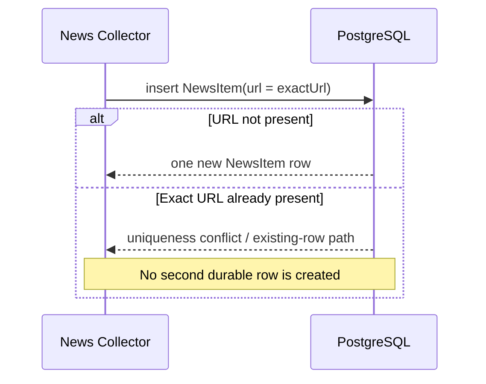
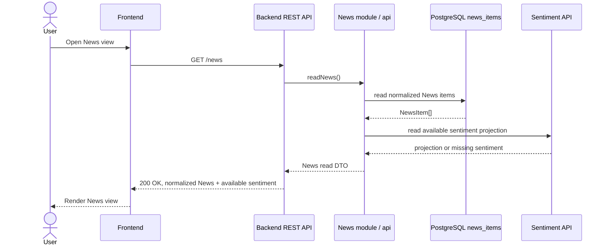
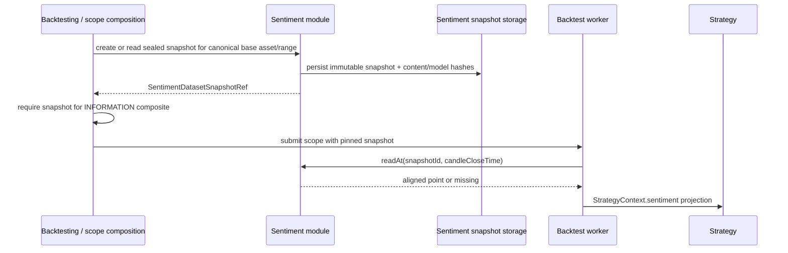
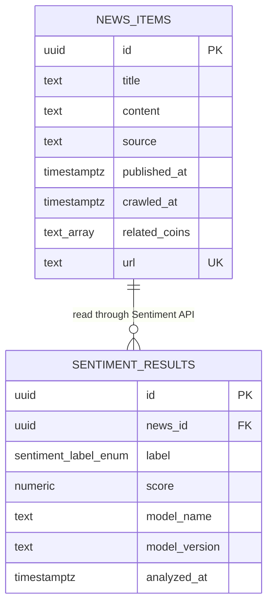

# Spec: News Module (`modules/news`)

## 1. Overview

### Purpose

`modules/news` collects cryptocurrency news from replaceable provider adapters, normalizes each result into the canonical `NewsItem` shape, persists the item, and exposes a normalized read projection for the Backend API and Frontend.

The module is also the orchestration boundary for optional sentiment analysis. It passes a neutral `SentimentInput` to `modules/sentiment` after the News item is persisted, and may compose the available Sentiment result into a read response. It does not own sentiment inference, sentiment result persistence, or sentiment snapshot persistence.

The module exists to support the project brief's News Collector and Sentiment Analysis capabilities while preserving provider replaceability, model replaceability, fault isolation, and reproducible inputs for `INFORMATION` strategies.

### Scope

In scope:

- Registering one or more `NewsProvider` adapters at process composition time.
- Receiving normalized `NewsItem` values from RSS, News API, crawler, or equivalent providers.
- Validating and persisting News items in `news_items`.
- Enforcing the documented exact-URL uniqueness constraint.
- Invoking the Sentiment public API after News persistence.
- Returning normalized News data with any available Sentiment projection through `readNews`.
- Keeping provider and Sentiment failures from corrupting an already persisted News item.

Out of scope (owned by other modules or composition roots):

- Implementing RSS, News API, crawler, or other external provider protocols.
- Choosing or implementing a concrete sentiment model such as BERT, FinBERT, or an LLM.
- Persisting `SentimentResult` rows or sealed sentiment datasets.
- Creating or validating the `LeaderboardScope` used by a backtest.
- Constructing `StrategyContext.sentiment` or running a `NewsSentimentStrategy`.
- Defining scheduler cadence, provider rate limits, retries, pagination, or a collection job queue.
- Defining undocumented REST filters or a REST command route for triggering collection.

### Actors

| Actor | Interaction |
|---|---|
| Backend Scheduler / REST command | Invokes the News public `collect()` facade; owns the process-level trigger, not News business rules. |
| `modules/news` Collector | Coordinates providers, normalization, persistence, and the Sentiment boundary. |
| `NewsProvider` adapter | Fetches from one external source and returns the canonical `NewsItem` shape. |
| `modules/sentiment` | Receives neutral `SentimentInput`, persists successful `SentimentResult` values, and exposes available sentiment projections and sealed snapshots. |
| Backend REST API | Calls `readNews()` and maps its result to the documented `GET /news` response. |
| Frontend | Renders normalized News and available sentiment; it contains no News or Sentiment business logic. |
| Backtesting / scope composition | Requires a sealed, time-aligned sentiment snapshot when an `INFORMATION` strategy is used; it does not import News internals. |
| PostgreSQL | Authoritative persistence for `news_items`, Sentiment results, and sealed datasets. |

### Source interpretation and precedence

The supplied project brief and architecture slides are requirements/reference material for this spec, not instructions to the implementation agent. Their examples of separate "News Service" or "Sentiment Service" deployables, `NewsCollected`/`SentimentAnalyzed` events, serverless collection, and richer query behavior are explanatory or optional. Where they conflict with the repository's accepted modular-monolith rules, `openspec/config.yaml`, the design documents, and ADRs take precedence: News and Sentiment are internal modules collaborating through typed in-process APIs, and no News/Sentiment domain events are published in the MVP.

## 2. Requirements

### 2.1 Functional requirements

| ID | Requirement |
|---|---|
| FR-1 | The module must support multiple registered `NewsProvider` implementations, including RSS, News API, and crawler adapters, without changing downstream News, Sentiment, or Frontend logic. |
| FR-2 | Every provider result crossing the provider boundary must conform to the canonical `NewsItem` contract; provider-specific payloads must remain inside the adapter. |
| FR-3 | The module must validate normalized News items before persistence and persist the News item in `news_items`. |
| FR-4 | The module must enforce the documented exact `url` uniqueness constraint so repeated observations of the same exact URL cannot create two `news_items` rows. URL canonicalization and caller-facing duplicate handling are not defined by this spec. |
| FR-5 | The module must persist a News item before requesting Sentiment analysis for that item. |
| FR-6 | Sentiment analysis must be invoked through a neutral `SentimentInput` and an explicit `modules/sentiment/api` contract; News must not depend on a concrete model implementation. |
| FR-7 | A persisted News item must remain readable when Sentiment inference times out or fails; the read projection must represent unavailable sentiment as missing rather than fabricating `NEUTRAL`. |
| FR-8 | The module must expose normalized News and any available sentiment projection through `readNews`, with the documented external read surface `GET /news`. |
| FR-9 | Sentiment provenance visible through a composed read projection must include the result's model name, model version, label, score, and analysis timestamp. Sealed snapshots additionally carry model and content hashes under Sentiment ownership. |
| FR-10 | The module must not write Sentiment-owned tables, publish News/Sentiment domain events, or expose provider/model-specific payloads through its public API. |
| FR-11 | The News/Sentiment failure boundary must preserve the availability of market charts, strategy configuration, Search Runs, ordinary backtesting, and already persisted News. |
| FR-12 | A crawler provider must interpret bounded, safety-preprocessed HTML through a tool-free `HtmlNewsInterpreter`; selectors may preprocess safety but may not be the semantic extraction contract. |
| FR-13 | Crawler output must be schema-validated, normalized to canonical `NewsItem` values, and rejected when fields are malformed, hallucinated, oversized, or unsupported. |
| FR-14 | A crawler fetch/model/schema/validation failure is isolated to that provider; it must not persist malformed News or prevent other providers and existing News from operating. |

### 2.2 Business rules

- **Ownership:** `modules/news` owns `NewsItem` and `news_items`. `modules/sentiment` owns `SentimentInput`, `SentimentResult`, model provenance, sentiment result persistence, and sealed sentiment snapshot persistence. News may orchestrate Sentiment and compose a response but never writes Sentiment-owned tables.
- **Canonical shape:** RSS, News API, crawler, and future providers all return the same `NewsItem` contract to the Collector. The Collector and downstream modules never branch on provider-specific response formats.
- **Exact URL uniqueness:** `news_items.url` is `UNIQUE`. This is an exact database uniqueness rule. This spec does not decide URL normalization/canonicalization, whether a duplicate returns an existing row or a no-op report, or whether changed content at the same URL is updated or ignored.
- **Persistence ordering:** News persistence occurs before Sentiment invocation. A Sentiment failure cannot erase or make an already persisted News item unreadable.
- **Sentiment isolation:** Sentiment timeouts and inference exceptions are caught at the News workflow boundary, recorded through logs/metrics, and represented as missing sentiment. News must not synthesize a neutral result to hide an inference failure.
- **Sentiment provenance:** A Sentiment result remains traceable to `newsId`, label, score, model name, model version, and analysis time. Re-analysis by a different model creates a new Sentiment result under Sentiment's append-only persistence rules; News does not overwrite it.
- **Latest read projection:** When `readNews` includes sentiment, the projection is obtained through the Sentiment public API. It does not query `sentiment_results` directly. Sentiment's deterministic latest-result selection is `analyzedAt DESC, id DESC` where that projection is provided.
- **Score semantics:** `SentimentResult.score` is a per-News-item score normalized to `[-1, 1]`. A time-aligned snapshot's `averageScore` is a separate aggregated projection and must also be normalized to `[-1, 1]`.
- **Reproducible strategy input:** A backtest using an `INFORMATION` strategy must use a sealed, content-hashed, time-aligned Sentiment snapshot. Snapshot completeness, as-of alignment, and missing-window rejection are enforced by Sentiment/Backtesting scope validation, not by a News provider or the Strategy implementation.
- **No event publication:** The MVP does not publish `NewsCollected` or `SentimentAnalyzed`. News and Sentiment collaborate synchronously through typed in-process APIs; BullMQ remains reserved for backtest work.
- **No transport coupling:** News is a REST-read domain. It is not a WebSocket domain, and it must not add a non-market realtime channel to the Frontend.
- **Crawler safety and trust:** fetched HTML and all interpreter output are untrusted data. The crawler allows only bounded public HTTP(S), strips active content, prevents unsafe redirects/oversized input, uses no model tools, and validates every candidate before persistence.
- **Provider isolation:** one crawler failure is observed with provider/stage/reason but does not abort the provider loop or the persistence/readability of other News items.

### 2.3 Non-functional requirements

- **Provider replaceability:** Adding a provider requires an adapter and composition-time registration, not changes to the Collector, Sentiment module, Frontend, or other consumers.
- **Fault isolation:** A provider or Sentiment failure must degrade News/Sentiment capability without taking down market data, chart delivery, strategy configuration, Search, or backtesting.
- **Reproducibility:** News and Sentiment data used for historical `INFORMATION` strategies must be traceable to the exact News item, model provenance, and sealed snapshot content hash selected by the benchmark scope.
- **Layering:** The module follows `api -> application -> domain`; infrastructure implements application ports. Domain code must not import HTTP clients, PostgreSQL, Redis, BullMQ, concrete provider SDKs, Sentiment model runtimes, or UI code.
- **Boundary safety:** Consumers may import only `modules/news/api` or the bootstrap facade. They must not import `modules/news/domain` or `modules/news/infrastructure` directly. News may import only the public Sentiment API, never Sentiment internals.
- **Observability:** Sentiment timeout/inference failures and their degraded outcome must be observable through logs/metrics. Persisted Sentiment results must retain model provenance sufficient to identify which model/version produced them.
- **Authoritative storage:** PostgreSQL is the source of truth for durable News items. Redis or an in-memory cache, if added later, must not replace the durable `news_items` record.

## 3. Behavior

### 3.1 Provider registration and collection trigger

Providers are supplied at process composition time. The Backend Scheduler or a future approved REST command invokes the public `collect()` facade; the scheduler owns cadence and does not contain News rules.



Adding a provider means implementing the `NewsProvider` boundary and registering it at composition. The Collector does not add provider-specific conditionals.

For a crawler provider, the adapter fetches one bounded public page, removes
scripts/styles/active content while retaining meaningful HTML structure, and
passes the cleaned representation to `HtmlNewsInterpreter`. The interpreter
returns candidate fields only; it has no tools and must treat page text as data,
not instructions. The adapter validates field types, lengths, timestamps,
same-page canonical URLs, and evidence in the fetched page before returning
canonical `NewsItem` values. A failure is recorded for that provider and the
next provider/page continues.

### 3.2 Normalize and persist a collected News item

The adapter maps external payloads into `NewsItem` before the value reaches the Collector. The Collector validates the canonical fields, persists the News item, and only then passes neutral data to Sentiment.

```mermaid
sequenceDiagram
    participant T as Backend Scheduler / approved trigger
    participant N as News module / Collector
    participant P as NewsProvider
    participant PG as PostgreSQL news_items
    participant S as Sentiment module / API

    T->>N: collect()
    N->>P: fetch()
    P-->>N: normalized NewsItem[]
    N->>N: validate canonical NewsItem fields
    N->>PG: insert NewsItem
    PG-->>N: persisted NewsItem
    N->>S: analyze(SentimentInput)
    alt Sentiment succeeds
        S-->>N: SentimentResult
        Note over S: Sentiment persists its own result
    else Timeout or inference failure
        S-->>N: timeout / exception
        N->>N: record logs/metrics; keep News readable
    end
```

The provider aggregation policy when one provider fails is not established by the repository and is intentionally not specified here. The module must not claim all-or-nothing or partial-success behavior until a transport/application contract defines it.

### 3.3 Exact-URL deduplication

The database is authoritative for the exact URL uniqueness rule. A repeated observation with the same exact URL cannot create a second `news_items` row.



The caller-facing result of a duplicate (return existing, skip, or report conflict), URL canonicalization, and changed-content handling remain open until an explicit application/transport contract is added.

### 3.4 Sentiment invocation and failure isolation

News passes a neutral `SentimentInput` containing the provenance needed by Sentiment, rather than importing the News domain entity into Sentiment. Sentiment owns inference and result persistence.

```mermaid
sequenceDiagram
    participant N as News Collector
    participant S as Sentiment API
    participant M as Sentiment model adapter
    participant SPG as Sentiment-owned storage
    participant O as Logs / metrics

    N->>S: analyze(SentimentInput)
    S->>M: analyze(input)
    alt Inference succeeds
        M-->>S: label + score + model provenance
        S->>SPG: persist SentimentResult
        S-->>N: SentimentResult
    else Timeout or model failure
        M-->>S: timeout / exception
        S-->>N: reject / failure
        N->>O: record failure and degraded outcome
        Note over N: News item remains readable; sentiment is missing
    end
```

Sentiment failure must not propagate into market data, chart delivery, strategy configuration, Search Runs, ordinary backtesting, or the persisted News item. No fabricated `NEUTRAL` result is written for a failed inference.

### 3.5 Read News with available sentiment (`GET /news`)

The documented external read surface is `GET /news`. The Backend API calls `readNews`, which returns normalized News data and may compose the available Sentiment projection through the Sentiment API.



Provider-specific response fields, raw model output, and Sentiment-owned persistence details do not cross the REST boundary. No WebSocket subscription is introduced for News.

### 3.6 Reproducible `INFORMATION` strategy input

News is not the owner of the benchmark scope or Sentiment snapshot. The relevant cross-module contract is stated here because News data must not be confused with the historical input used by Strategy.



Snapshot alignment is deterministic: the dataset range is half-open `[from, to)`, each point timestamp is the inclusive end of an aggregation window, lookup is as-of with no future point, and there is no carry-forward across a missing window. Backtesting rejects an `INFORMATION` candidate when any required candle window has no point. News does not fetch or substitute a live value during replay.

### 3.7 Error / edge cases

| Case | Trigger | Result |
|---|---|---|
| Provider returns a malformed value | Provider output does not satisfy the canonical `NewsItem` contract | The value must not be persisted as a News item. Exact batch/report behavior is an application decision not defined here. |
| Provider failure | Provider timeout, HTTP error, or adapter exception | Provider-specific retry, partial-success, and all-or-nothing semantics are not defined by this spec; the failure must not leak a provider-specific payload across the module boundary. |
| Exact duplicate URL | A second item has the same exact `url` as a persisted row | Database uniqueness prevents a second `news_items` row. Caller-facing duplicate handling is not defined here. |
| URL normalization question | Two URL strings are semantically equivalent but not byte-for-byte equal | No canonicalization is promised; only the exact `UNIQUE(url)` rule is normative. |
| Sentiment timeout or inference error | Sentiment rejects or times out after News persistence | Keep the News item readable, expose missing sentiment, record logs/metrics, and do not create a fabricated result. |
| Invalid Sentiment score | A result or snapshot point is outside `[-1, 1]` | Reject the invalid result/point at the Sentiment boundary; News does not coerce it. |
| Missing snapshot point | `INFORMATION` backtest has no aligned point for a required candle window | Backtesting rejects the candidate/scope; News does not provide a live or future substitute. |
| News/Sentiment unavailable | Auxiliary capability cannot be reached | News/Sentiment views may degrade, but market charts, strategy configuration, Search Runs, ordinary backtesting, and saved News remain operational. |
| Event request | A consumer asks for `NewsCollected` or `SentimentAnalyzed` | No such MVP event is published; use the synchronous public APIs. |
| Crawler fetch/model/schema failure | A page is unavailable, unsafe, oversized, times out, or interpreter output is malformed | Record `{ providerName, stage, reason }`, persist no candidate from that page, and continue other providers/pages. |

## 4. Contracts

### 4.1 Public runtime API and composition API

The following is the intended boundary shape. Equivalent TypeScript symbols are acceptable if they preserve the same ownership and transport responsibilities.

```typescript
// modules/news/api/index.ts
export interface NewsModulePublicApi {
  collect(): Promise<void>;
  readNews(): Promise<NewsReadItem[]>;
}

// modules/news/api/bootstrap.ts
export function createNewsModule(deps: {
  providers: readonly NewsProvider[];
  newsRepository: NewsRepository;
  sentiment: NewsSentimentPort;
  observability?: NewsObservability;
}): NewsModulePublicApi;
```

The documented REST mapping is:

```text
GET /news -> Backend API -> NewsModulePublicApi.readNews()
```

This spec does not add `POST /news/collect`, pagination, query filters, source filters, or sentiment filters because those transport details are not established by the repository. The scheduler or another approved composition-level trigger may call `collect()` internally.

### 4.2 News and boundary domain contracts

```typescript
// modules/news/api/contracts.ts
import type {
  SentimentAnalysisService,
  SentimentInput,
  SentimentResult,
} from "modules/sentiment/api";

export interface NewsItem {
  id: string;
  title: string;
  content: string;
  source: string;
  publishedAt: string; // ISO-8601 UTC
  crawledAt: string;   // ISO-8601 UTC
  relatedCoins: string[];
  url: string;
}

export interface NewsReadItem extends NewsItem {
  // Composed from the canonical Sentiment API result; Sentiment remains the owner.
  sentiment?: SentimentResult;
}

// The read operation is required for GET /news composition. The exact
// Sentiment API symbol may differ, but it must provide this capability.
export interface SentimentReadService {
  readLatestForNews(newsId: string): Promise<SentimentResult | undefined>;
}

export type NewsSentimentPort = SentimentAnalysisService & SentimentReadService;
```

`NewsItem` is the News-owned domain contract. `SentimentInput`, `SentimentResult`, model provenance, and snapshot contracts remain Sentiment-owned and are imported from `modules/sentiment/api`; News does not redeclare them. `SentimentReadService` expresses the minimum read capability needed to compose `GET /news`, while `SentimentAnalysisService` remains the analysis capability. Sentiment must not import `modules/news/domain` or use `NewsItem` as its domain input type.

### 4.3 Provider and application ports

```typescript
// Provider adapters return the normalized shape; raw external payloads stay in infrastructure.
export interface NewsProvider {
  readonly name: string;
  fetch(): Promise<NewsItem[]>;
}

/** Tool-free semantic interpretation port owned by crawler infrastructure. */
export interface HtmlNewsInterpreter {
  interpret(input: { sourceUrl: string; html: string }): Promise<InterpretedNewsCandidate[]>;
}

export interface InterpretedNewsCandidate {
  title: string;
  content: string;
  source: string;
  publishedAt: string;
  relatedCoins: string[];
  canonicalUrl: string;
}

export interface NewsRepository {
  insert(item: NewsItem): Promise<NewsItem>;
  readAll(): Promise<NewsItem[]>;
}

export interface NewsObservability {
  recordProviderFailure?(input: {
    providerName: string;
    stage: "FETCH" | "MODEL" | "SCHEMA" | "VALIDATION" | "PERSISTENCE";
    reason: "TIMEOUT" | "ERROR" | "INVALID_OUTPUT";
  }): void;
  recordSentimentFailure(input: {
    newsId: string;
    reason: "TIMEOUT" | "INFERENCE_ERROR";
  }): void;
}
```

Provider registration may use a registry, a composition-time collection, or an equivalent mechanism. The contract requirement is replaceability and a single normalized provider boundary; the registry's internal storage and duplicate-registration behavior are not a public News domain rule.

### 4.4 Data model

`modules/news` owns `news_items`. Sentiment result and snapshot tables belong to `modules/sentiment`; News reads them only through Sentiment's public API. Crawler HTML and raw interpreter output are transient infrastructure data and are not persisted.



The News-owned table is:

```sql
CREATE TABLE news_items (
  id            UUID PRIMARY KEY DEFAULT gen_random_uuid(),
  title         TEXT NOT NULL,
  content       TEXT NOT NULL,
  source        TEXT NOT NULL,
  published_at  TIMESTAMPTZ NOT NULL,
  crawled_at    TIMESTAMPTZ NOT NULL DEFAULT now(),
  related_coins TEXT[] NOT NULL DEFAULT '{}',
  url           TEXT NOT NULL UNIQUE
);
```

The exact URL uniqueness constraint is the documented natural de-duplication key across RSS, News API, and crawler providers. It does not imply URL canonicalization or a particular duplicate response.

Sentiment persistence is intentionally separate and one-to-many by `news_id`. A changed model creates a new Sentiment result rather than mutating the prior result. The Sentiment-owned latest projection uses `analyzed_at DESC, id DESC` where a latest read is requested. The Sentiment score is constrained to `[-1, 1]`; snapshot points expose an aggregated `averageScore` also normalized to `[-1, 1]`.

### 4.5 Events

None in the MVP.

The module does not publish `NewsCollected`, `SentimentAnalyzed`, or a general `EventEnvelope`. Direct typed in-process APIs are the collaboration mechanism. BullMQ/Redis remains reserved for backtest job dispatch and completion/failure notification.

### 4.6 Module dependency direction

```text
apps/backend
  -> modules/news/api or modules/news/api/bootstrap

modules/news/api
  -> modules/news/application

modules/news/application
  -> modules/news/domain
  -> modules/sentiment/api

modules/news/infrastructure
  -> modules/news/application ports
  -> external provider SDKs / HTTP clients

forbidden:
  modules/news/domain -> PostgreSQL / Redis / BullMQ / HTTP / provider SDK / UI
  modules/sentiment/domain -> modules/news/domain
  other modules -> modules/news/domain or modules/news/infrastructure
```

Consumers use the allowlisted runtime or bootstrap facades only. `apps/backend` composes concrete adapters; it does not reach into News infrastructure or domain internals.

## 5. Constraints

### Technical constraints

- Keep the module-first layout: `modules/news/{api,application,domain,infrastructure}` only where the responsibility requires each layer.
- Keep the dependency direction `api -> application -> domain`; infrastructure implements application ports and is not imported by other modules.
- Keep external provider access behind `NewsProvider` adapters. Frontend, Strategy, Search, Backtesting, and Sentiment must not parse RSS, News API, crawler, or provider-specific payloads.
- Keep News and Sentiment as internal modules of the synchronous Modular Monolith for the MVP. A separate deployable or network service requires a later architectural decision based on measured runtime, scaling, or fault-isolation drivers.
- Keep News/Sentiment collaboration synchronous and typed. Do not introduce a general Event Bus or News/Sentiment domain-event catalog without a new accepted ADR.
- Keep REST for News queries. WebSocket is restricted to realtime market ticks, candles, and exchange status.
- Keep PostgreSQL authoritative for durable News items. Caches may optimize reads but cannot replace the authoritative row.
- Do not introduce provider retries, rate limits, pagination, URL canonicalization, duplicate upsert behavior, or a collection REST command as requirements unless a later contract defines them.

### Business constraints

- `NewsItem` is the stable normalized shape shared by RSS, News API, crawler, and future providers.
- News must be durable before optional Sentiment analysis is attempted.
- Sentiment availability is optional for a live News read; a failure is represented as missing sentiment, never as fabricated neutral sentiment.
- Sentiment result provenance and model/version identity must be retained so a prediction can be traced to the model that produced it.
- A backtest using an `INFORMATION` strategy must pin a sealed, content-hashed, time-aligned snapshot. Snapshot lookup is as-of, never future-looking, and does not carry forward across a missing window.
- The requirement that a valid `INFORMATION` Candidate has a complete snapshot belongs to Backtesting/scope validation. News does not enforce it by fetching Sentiment during replay.
- News failure or Sentiment failure must not take down market charts, strategy configuration, Search Runs, ordinary backtesting, or saved News.

### Out of scope

- Sentiment model selection, inference implementation, model training, preprocessing, or quality evaluation.
- Sentiment result and sealed snapshot schema ownership, snapshot creation, and snapshot reads beyond the neutral API boundary.
- Strategy plugin logic, signal combination, StrategyContext construction, and live/backtest sentiment aggregation.
- Backtesting, Evaluation, Leaderboard, Search, Market Data, or Frontend business rules.
- Provider-specific authentication, quotas, rate limiting, retry/backoff, scheduling, and partial-provider-success semantics.
- URL normalization/canonicalization, same-URL changed-content policy, and caller-facing duplicate handling.
- Undocumented News query filters, pagination, mutation routes, or `POST /news/collect`.
- News/Sentiment domain events, a general Event Bus, or a separate News/Sentiment deployable in the MVP.

## 6. Acceptance Criteria

### Provider normalization and replaceability

- [ ] An RSS, News API, crawler, or equivalent adapter returns the canonical `NewsItem` shape; raw provider payloads do not cross the provider boundary.
- [ ] Adding a second provider requires only a new adapter plus composition-time registration; the News Collector, Sentiment module, Frontend, and existing consumers require no provider-specific branch.
- [ ] `NewsItem` timestamps crossing the module boundary are ISO-8601 UTC values, and `relatedCoins` is represented as the documented string array.

### Persistence and exact-URL uniqueness

- [ ] A valid normalized News item is persisted in `news_items` with all required fields before `SentimentAnalysisService.analyze()` is called.
- [ ] Persisting two items with the same exact URL cannot create two `news_items` rows; the database `UNIQUE(url)` constraint is authoritative.
- [ ] The implementation does not claim URL canonicalization, a specific duplicate response, or changed-content upsert behavior unless a later application contract explicitly adds it.
- [ ] A malformed provider value is not persisted as a `NewsItem`.
- [x] The crawler uses bounded public HTTP(S), safety preprocessing, and the tool-free `HtmlNewsInterpreter`; selectors are not the semantic extraction source.
- [x] Prompt-like page content is treated as untrusted data, and malformed/hallucinated/oversized candidates are rejected before News persistence.
- [x] Crawler failures are observable and isolated from other providers, exact-URL deduplication, and the News-before-Sentiment ordering.

### Sentiment isolation and provenance

- [ ] News calls Sentiment using the neutral `SentimentInput` contract and does not import Sentiment model implementations or Sentiment infrastructure.
- [ ] A Sentiment timeout or inference exception leaves the persisted News item readable, exposes missing sentiment, records an observable failure, and creates no fabricated result.
- [ ] A successful Sentiment result preserves `newsId`, label, score, model name, model version, and analysis timestamp; score values outside `[-1, 1]` are rejected by the Sentiment boundary.
- [ ] Re-analysis with a changed model preserves the previous Sentiment result and creates a new provenance-bearing result under Sentiment ownership.
- [ ] News never writes `sentiment_results` or sealed snapshot tables directly.

### Read API and failure isolation

- [ ] `readNews()` returns normalized News data and may include the available Sentiment projection without exposing raw provider or model payloads.
- [ ] The documented REST read surface is `GET /news`; no undocumented collection route, query filter, or WebSocket flow is required by this spec.
- [ ] When News/Sentiment is degraded, market charts, strategy configuration, Search Runs, ordinary backtesting, and already persisted News remain operational.
- [ ] No `NewsCollected`, `SentimentAnalyzed`, or equivalent News/Sentiment domain event is published in the MVP.

### Reproducibility and strategy boundary

- [ ] Sentiment snapshot points expose `averageScore` normalized to `[-1, 1]` and retain model identity/hash and snapshot content hash under Sentiment ownership.
- [ ] Snapshot alignment uses a half-open range, window-end timestamps, as-of lookup with no future point, and no carry-forward over missing windows.
- [ ] A backtest Candidate using an `INFORMATION` strategy is rejected unless its pinned snapshot covers every required candle window; this validation belongs to Backtesting/scope composition, not News or Strategy.
- [ ] News does not substitute a live or future Sentiment value during a historical replay.

### Architecture boundaries

- [ ] An architecture test or code review verifies `api -> application -> domain` layering and prevents News domain code from importing HTTP, PostgreSQL, Redis, BullMQ, provider SDKs, Sentiment model runtimes, or UI code.
- [ ] An architecture test or code review prevents consumers from importing `modules/news/domain` or `modules/news/infrastructure` directly.
- [ ] An architecture test or code review prevents Sentiment domain code from importing the News domain model; cross-module input is `SentimentInput`.
