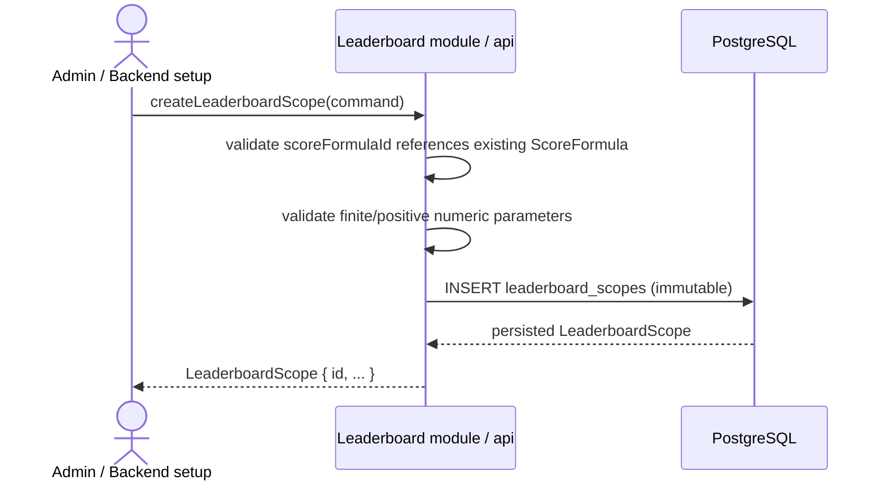
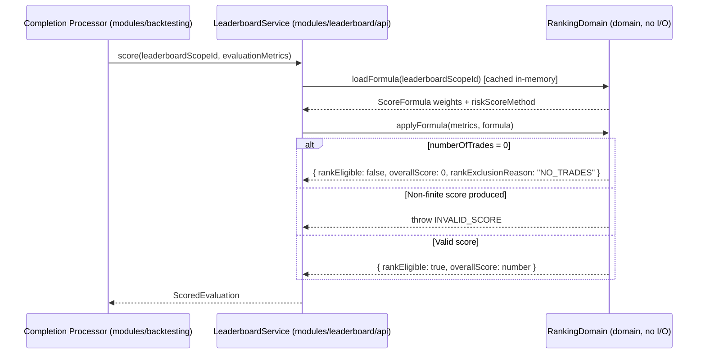
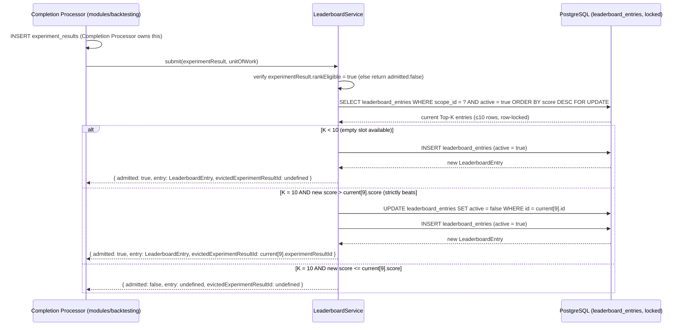
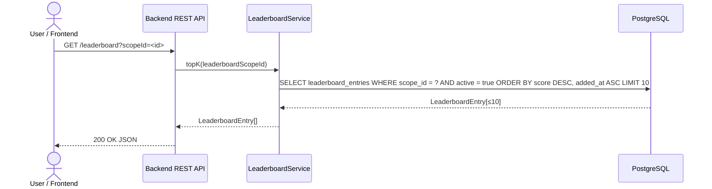
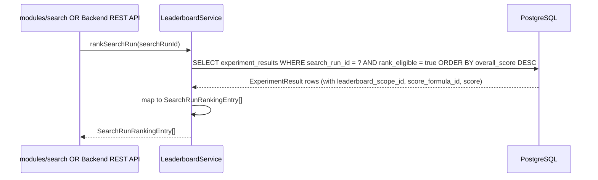
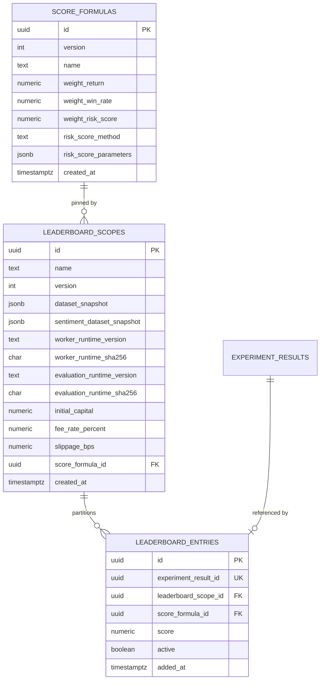
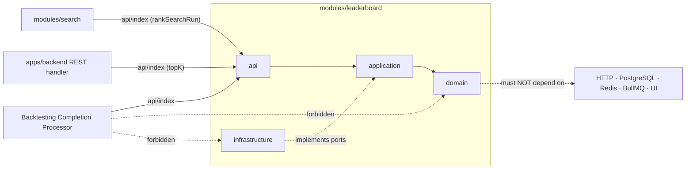

# Spec: Leaderboard Module (`modules/leaderboard`)

## 1. Overview

### Purpose

`modules/leaderboard` is the module responsible for scoring a completed `ExperimentResult`
against an immutable benchmark scope and formula, maintaining a persistent Top-K admission
list (MVP: K = 10) partitioned by that scope, and exposing both the persistent cross-run
Top-10 and a session-scoped per-Search-Run ranking.

It sits at the very end of the Continuous Strategy Loop and knows only about
`EvaluationMetrics` (calculated upstream by `modules/evaluation`) and immutable
`LeaderboardScope`/`ScoreFormula` references. It never performs simulation, evaluates
trades, or generates strategy candidates.

The module's position in the overall pipeline:

```
modules/search → modules/backtesting → modules/evaluation → **modules/leaderboard**
```

### Scope

In scope:

- Applying an immutable `ScoreFormula` to `EvaluationMetrics` to produce a deterministic
  `ScoredEvaluation` (pure function, no I/O).
- Creating and persisting immutable `LeaderboardScope` rows that pin the benchmark
  parameters (dataset snapshot, capital, fees, runtime versions, formula ID).
- Submitting a completed `ExperimentResult` for Top-K admission inside the Completion
  Processor's existing PostgreSQL transaction.
- Persisting, evicting, and returning `LeaderboardEntry` rows for the cross-run Top-10.
- Ranking all rank-eligible Experiments from a single Search Run on demand
  (`rankSearchRun`).
- Exposing `topK(leaderboardScopeId)` and `rankSearchRun(searchRunId)` for read queries.

Out of scope (owned by other modules, consumed through their public APIs only):

- Executing strategy backtests or persisting `Trade` rows — `modules/backtesting`.
- Computing `EvaluationMetrics` from `Trade[]` — `modules/evaluation`.
- Generating or selecting strategy candidates — `modules/search`.
- Persisting `CandidateStrategy`, `BacktestAttempt`, or `ExperimentResult` rows —
  `modules/backtesting` (Completion Processor is the persistence owner; Leaderboard
  receives the committed Experiment as input to `submit()`).
- Constructing or pinning market data / sentiment snapshots — `modules/backtesting`
  (scope composition) and `modules/sentiment`.
- Driving WebSocket broadcasts — `apps/backend` (REST/WS gateway layer, not this module).

### Actors

| Actor                            | Interaction                                                                                                                                                                                                                                      |
| -------------------------------- | ------------------------------------------------------------------------------------------------------------------------------------------------------------------------------------------------------------------------------------------------ |
| `apps/backend`                   | Creates the Leaderboard module at startup; exposes `GET /leaderboard` and `GET /search-runs/{id}/leaderboard` via REST using the public API.                                                                                                     |
| Backtesting Completion Processor | Calls `score()` to produce a `ScoredEvaluation`, then calls `submit(experiment, unitOfWork)` inside an existing PostgreSQL transaction to perform Top-10 admission atomically with Experiment persistence.                                       |
| `modules/search`                 | Calls `rankSearchRun(searchRunId)` to get the session-scoped best Experiment for `currentTopEntry` and no-improvement stop-condition checks. Reads the public `LeaderboardService` API only; never imports Leaderboard domain or infrastructure. |
| Frontend (via Backend REST)      | Reads `GET /leaderboard?scopeId=...` for the persistent cross-run Top-10 and `GET /search-runs/{id}/leaderboard` for a run-scoped ranking.                                                                                                       |

---

## 2. Requirements

### 2.1 Functional requirements

| ID    | Requirement                                                                                                                                                                                                                                                    |
| ----- | -------------------------------------------------------------------------------------------------------------------------------------------------------------------------------------------------------------------------------------------------------------- |
| FR-1  | The module must expose a pure `score(leaderboardScopeId, metrics)` function that applies the pinned `ScoreFormula` and returns a deterministic `ScoredEvaluation`.                                                                                             |
| FR-2  | `score()` must override `overallScore = 0`, set `rankEligible = false`, and set `rankExclusionReason = "NO_TRADES"` when `metrics.numberOfTrades === 0`.                                                                                                       |
| FR-3  | `score()` must reject (throw/return invalid) any `ScoredEvaluation` containing `NaN`, `Infinity`, or `-Infinity` values.                                                                                                                                       |
| FR-4  | The module must expose `submit(experiment, unitOfWork)` that, using the caller's PostgreSQL transaction, inserts a `leaderboard_entries` row when the experiment is rank-eligible and either a slot is empty or the experiment beats the current lowest entry. |
| FR-5  | `submit()` must evict the lowest-ranked existing entry when the Top-K is full and the new score is strictly higher, retaining the evicted row as inactive history.                                                                                             |
| FR-6  | `submit()` must be idempotent: submitting the same `experimentResultId` twice must result in exactly one active `leaderboard_entries` row.                                                                                                                     |
| FR-7  | The module must expose `topK(leaderboardScopeId)` returning the current active Top-K `LeaderboardEntry[]`, ordered by `score` descending, for a given scope.                                                                                                   |
| FR-8  | The module must expose `rankSearchRun(searchRunId)` returning all rank-eligible `ExperimentResult`s from that Search Run, ordered by `score` descending.                                                                                                       |
| FR-9  | The module must persist immutable `LeaderboardScope` rows via `createLeaderboardScope(command)` and expose `getLeaderboardScope(id)` for reload.                                                                                                               |
| FR-10 | `createLeaderboardScope()` must validate that `scoreFormulaId` references an existing `ScoreFormula`, that all numeric parameters are finite and positive, and that runtime version strings are non-empty.                                                     |

### 2.2 Business rules

- **Score formula (MVP default)**:

  ```
  riskScore = clamp(50 + (10 × sharpeRatio) − maxDrawdownPercent, 0, 100)
  score = (w_return × totalReturnPercent)
        + (w_winRate × winRatePercent)
        + (w_risk   × riskScore)
  ```

  where the MVP default weights are `w_return = 0.5`, `w_winRate = 0.2`,
  `w_risk = 0.3` (must sum to `1.0`).
  `maxDrawdownPercent` is a **non-negative** magnitude (e.g., `18` represents an 18%
  loss; the UI may display it as `−18%`).

- **Score formula versioning**: `ScoreFormula` rows are immutable and versioned.
  Changing any weight, `riskScoreMethod`, or `riskScoreParameters` creates a new
  `ScoreFormula` version, not an update in place.

- **Scope immutability**: A `LeaderboardScope` row is never updated. Changing the
  dataset snapshot, capital/cost settings, formula, or runtime hashes creates a new
  scope. Past `LeaderboardEntry` rows always point to the exact scope/formula that
  produced them.

- **Top-K admission**: K = 10 is a fixed MVP constant. Admission requires
  `rankEligible = true` AND `score > score_of_current_10th` (or the board has fewer
  than 10 entries). A tied score does **not** replace an existing entry; the newer
  experiment is not admitted.

- **Zero-trade exclusion**: An experiment with `numberOfTrades = 0` is retained as an
  `ExperimentResult` with `overallScore = 0` and `rankEligible = false`. It never
  creates a `leaderboard_entries` row and is excluded from `topK()` and `rankSearchRun()`
  results.

- **Cancelled candidates**: A cancelled Candidate may produce an in-flight audit
  Attempt, but it never creates an `ExperimentResult` and therefore never creates a
  `leaderboard_entries` row. `submit()` must reject a call rooted in a cancelled
  Candidate (enforced via the Completion Processor's prior Experiment invariant check).

- **Scope partitioning**: The persistent Top-K is partitioned by `leaderboardScopeId`.
  Two experiments under different scopes are never compared. The per-Search-Run ranking
  covers only experiments sharing the run's `leaderboardScopeId`.

- **Finite scores**: All `overallScore` values stored in `leaderboard_entries` and
  returned by `topK()`/`rankSearchRun()` must be finite. A non-finite score from a
  formula bug is a hard rejection (`submit()` throws), not a silently persisted `NaN`.

- **Displaced entries**: When an entry is evicted from Top-K it is marked `active = false`
  and retained for history/audit. It is never deleted.

### 2.3 Non-functional requirements

- **Purity of scoring**: `score()` must be a pure function with no I/O. Given the same
  `(leaderboardScopeId, EvaluationMetrics)` pair it must always return the same
  `ScoredEvaluation`. This enables deterministic replay of "which formula produced this
  score."
- **Atomicity**: `submit()` uses the Completion Processor's `CompletionUnitOfWork` (an
  opaque wrapper around the caller's PostgreSQL transaction). It must not open a separate
  transaction or connection. Experiment persistence, Candidate completion, Search Run
  counter update, and Top-10 admission are all in one atomic commit.
- **Layering**: `api → application → domain`; infrastructure implements application ports.
  Domain code must not import HTTP, PostgreSQL, Redis, BullMQ, or UI code.
- **Boundary safety**: Consumers may only import `modules/leaderboard/api` or the
  bootstrap facade. No module may reach into `modules/leaderboard/domain` or
  `modules/leaderboard/infrastructure`.
- **Determinism**: `topK()` must return a stable sort: primary by `score DESC`, secondary
  by `addedAt ASC` for equal scores (older entry retains the higher rank).
- **Performance**: `topK()` is called on every Completion Processor write and on every
  frontend `GET /leaderboard` request. The query must be indexed by `(leaderboard_scope_id,
active, score DESC)` and must not require a full table scan.

---

## 3. Behavior

### 3.1 Scope and formula creation

Occurs at system setup, before any Search Run is started. The Backend API or an admin
script creates the immutable scope and formula rows.



`ScoreFormula` rows are seeded at migration time for the MVP default formula (§2.2).
A new formula version is created only when the weights or risk method change.

### 3.2 Scoring a completed experiment (pure, no I/O)

Called by the Completion Processor before opening the admission transaction, to decide
rank eligibility before any database write.



`score()` is a pure call. The `ScoreFormula` is loaded from an in-process cache seeded at
module startup (reloaded only when a new scope/formula is created). No database I/O occurs
during `score()`.

### 3.3 Top-K admission (`submit()`)

The Completion Processor already holds a PostgreSQL transaction (`CompletionUnitOfWork`)
when it calls `submit()`. This sequence runs entirely within that transaction.



`submit()` **must not** open a new transaction. It must operate on the `unitOfWork`'s
implicit connection. The caller (Completion Processor) ensures global lock order:
`SearchRun → Candidate → LeaderboardScope` for Search-originated candidates, or
`Candidate → LeaderboardScope` for manual candidates.

### 3.4 Read: persistent Top-10 (`topK`)

Called by the Frontend REST handler (`GET /leaderboard?scopeId=...`) and optionally by
the Completion Processor to return the updated board.



### 3.5 Read: Search Run ranking (`rankSearchRun`)

Used by `modules/search` for the no-improvement stop condition, and by the Frontend for
`GET /search-runs/{id}/leaderboard`.



`rankSearchRun()` queries `experiment_results` directly (read-only) and does not require
a lock. It is a best-effort read; concurrent writes during an active Search Run may mean
the view is slightly stale.

### 3.6 Error / edge cases

| Case                           | Trigger                                                                                           | Result                                                                                                                                                                                                   |
| ------------------------------ | ------------------------------------------------------------------------------------------------- | -------------------------------------------------------------------------------------------------------------------------------------------------------------------------------------------------------- |
| `numberOfTrades = 0`           | `EvaluationMetrics.numberOfTrades === 0`                                                          | `score()` returns `{ rankEligible: false, overallScore: 0, rankExclusionReason: "NO_TRADES" }`. `submit()` returns `admitted: false` immediately without touching `leaderboard_entries`.                 |
| Non-finite score               | Formula produces `NaN`, `Infinity`, or `-Infinity`                                                | `score()` throws `INVALID_SCORE`. The Completion Processor marks the Candidate as `FAILED` with reason `COMPLETION_PROCESSING`. No `leaderboard_entries` row is created.                                 |
| Duplicate `submit()`           | Same `experimentResultId` submitted twice (e.g., retry)                                           | `submit()` detects the existing row by `experimentResultId` uniqueness constraint. Returns `admitted: true` with the existing entry (idempotent).                                                        |
| Score exactly ties current #10 | New score equals current lowest active entry's score                                              | New experiment is **not** admitted (`admitted: false`). Existing entry retains its rank (older entry wins ties).                                                                                         |
| `leaderboardScopeId` not found | `score()` or `submit()` called with a non-existent scope ID                                       | Throw `SCOPE_NOT_FOUND`. Caller (Completion Processor) treats this as a non-retryable invariant failure and marks the Candidate `FAILED`.                                                                |
| Formula missing from cache     | Formula ID referenced by scope no longer in in-process cache                                      | Reload from PostgreSQL. If still not found, throw `FORMULA_NOT_FOUND`.                                                                                                                                   |
| Cancelled candidate path       | Completion Processor mistakenly calls `submit()` for a cancelled Candidate                        | The Experiment row will not exist (Completion Processor invariant), so `submit()` will find no row to reference. If reached, throw `INVALID_EXPERIMENT_STATE`.                                           |
| Concurrent submission race     | Two Completion Processor instances submit different experiments for the same scope simultaneously | `SELECT ... FOR UPDATE` serializes the admission. One writer will see the other's commit first. Both may be admitted if both beat #10, or one may be evicted by the other. No corrupt state is possible. |

---

## 4. Contracts

### 4.1 Public runtime API (`modules/leaderboard/api/index.ts`)

```typescript
// modules/leaderboard/api/index.ts
export interface LeaderboardModulePublicApi {
  score(leaderboardScopeId: string, metrics: EvaluationMetrics): ScoredEvaluation;
  topK(leaderboardScopeId: string): Promise<LeaderboardEntry[]>;
  rankSearchRun(searchRunId: string): Promise<SearchRunRankingEntry[]>;
  submit(
    experiment: ExperimentResult,
    unitOfWork: CompletionUnitOfWork,
  ): Promise<LeaderboardSubmissionResult>;
}
```

### 4.2 Bootstrap facade (`modules/leaderboard/api/bootstrap.ts`)

```typescript
// modules/leaderboard/api/bootstrap.ts
export function createLeaderboardModule(deps: {
  scopeRepository: LeaderboardScopeRepository;
  entryRepository: LeaderboardEntryRepository;
  formulaRepository: ScoreFormulaRepository;
  experimentReader: ExperimentResultReader; // read-only port into modules/backtesting tables
  clock: Clock;
}): LeaderboardModulePublicApi & {
  createLeaderboardScope(command: CreateLeaderboardScopeCommand): Promise<LeaderboardScope>;
  getLeaderboardScope(id: string): Promise<LeaderboardScope>;
};
```

### 4.3 Core domain contracts (`modules/leaderboard/api/contracts.ts`)

```typescript
// modules/leaderboard/api/contracts.ts

// Supplied by modules/evaluation — imported, not redeclared.
import type { EvaluationMetrics } from "modules/evaluation/api";

// Supplied by modules/backtesting — imported for ExperimentResult and UoW types.
import type { ExperimentResult, CompletionUnitOfWork } from "modules/backtesting/api";

// ─── ScoreFormula ────────────────────────────────────────────────────────────

export interface ScoreFormula {
  id: string;
  version: number;
  name: string;
  weights: {
    return: number; // must sum to 1.0 with winRate + riskScore
    winRate: number;
    riskScore: number;
  };
  // MVP: "DEFAULT" → riskScore = clamp(50 + 10×sharpeRatio − maxDrawdownPercent, 0, 100)
  riskScoreMethod: string;
  riskScoreParameters: Record<string, number>;
  createdAt: string; // ISO-8601 UTC
}

// ─── LeaderboardScope ────────────────────────────────────────────────────────

export interface LeaderboardScope {
  id: string;
  name: string;
  version: number;
  datasetSnapshot: DatasetSnapshotRef;
  sentimentDatasetSnapshot?: SentimentDatasetSnapshotRef; // required for INFORMATION composites
  workerRuntimeVersion: string;
  workerRuntimeSha256: string; // hex SHA-256, 64 chars
  evaluationRuntimeVersion: string;
  evaluationRuntimeSha256: string; // hex SHA-256, 64 chars
  initialCapital: number; // must be finite and positive
  feeRatePercent: number; // must be finite and non-negative
  slippageBps: number; // must be finite and non-negative
  scoreFormulaId: string;
  createdAt: string; // ISO-8601 UTC
}

// ─── ScoredEvaluation ────────────────────────────────────────────────────────

interface ScoredEvaluationBase {
  leaderboardScopeId: string;
  scoreFormulaId: string;
  overallScore: number; // always finite; never NaN/Infinity
}

export type ScoredEvaluation = ScoredEvaluationBase &
  (
    | { rankEligible: true; rankExclusionReason?: never }
    | { rankEligible: false; rankExclusionReason: "NO_TRADES" }
  );

// ─── LeaderboardEntry ────────────────────────────────────────────────────────

export interface LeaderboardEntry {
  id: string;
  rank: number; // 1-indexed, stable sort: score DESC, addedAt ASC
  experimentResultId: string;
  leaderboardScopeId: string;
  scoreFormulaId: string;
  score: number; // always finite
  addedAt: string; // ISO-8601 UTC
}

// ─── SearchRunRankingEntry ────────────────────────────────────────────────────

export interface SearchRunRankingEntry {
  rank: number;
  searchRunId: string;
  leaderboardScopeId: string;
  candidateId: string;
  experimentResultId: string;
  scoreFormulaId: string;
  score: number;
}

// ─── LeaderboardSubmissionResult ─────────────────────────────────────────────

export interface LeaderboardSubmissionResult {
  admitted: boolean;
  entry?: LeaderboardEntry;
  evictedExperimentResultId?: string;
}

// ─── CreateLeaderboardScopeCommand ───────────────────────────────────────────

export interface CreateLeaderboardScopeCommand {
  name: string;
  datasetSnapshot: DatasetSnapshotRef;
  sentimentDatasetSnapshot?: SentimentDatasetSnapshotRef;
  workerRuntimeVersion: string;
  workerRuntimeSha256: string;
  evaluationRuntimeVersion: string;
  evaluationRuntimeSha256: string;
  initialCapital: number;
  feeRatePercent: number;
  slippageBps: number;
  scoreFormulaId: string;
}
```

### 4.4 Application ports (infrastructure implements these)

```typescript
// modules/leaderboard/application/ports.ts

export interface LeaderboardScopeRepository {
  insert(scope: LeaderboardScope): Promise<LeaderboardScope>;
  getById(id: string): Promise<LeaderboardScope | undefined>;
}

export interface ScoreFormulaRepository {
  getById(id: string): Promise<ScoreFormula | undefined>;
  listAll(): Promise<ScoreFormula[]>; // used for in-process cache warm-up at startup
}

export interface LeaderboardEntryRepository {
  // Reads active Top-K entries for a scope, ordered by score DESC, added_at ASC.
  // Must use index: (leaderboard_scope_id, active, score DESC).
  // Caller must be inside a database transaction with FOR UPDATE when calling from submit().
  getActiveTopK(leaderboardScopeId: string, k: number): Promise<LeaderboardEntry[]>;

  // Inserts a new active entry. Enforces UNIQUE(experiment_result_id) for idempotency.
  insert(entry: Omit<LeaderboardEntry, "id" | "rank">): Promise<LeaderboardEntry>;

  // Marks an existing active entry as inactive (eviction). Never deletes.
  deactivate(entryId: string): Promise<void>;
}

// Read-only port. Leaderboard never writes experiment_results directly.
export interface ExperimentResultReader {
  getBySearchRunId(searchRunId: string): Promise<
    Array<{
      id: string;
      candidateId: string;
      searchRunId: string;
      leaderboardScopeId: string;
      scoreFormulaId: string;
      overallScore: number;
      rankEligible: boolean;
    }>
  >;
}

export interface Clock {
  now(): string; // ISO-8601 UTC
}
```

### 4.5 Data model (owned tables)



**SQL schema (authoritative)**:

```sql
CREATE TABLE score_formulas (
  id                    UUID PRIMARY KEY DEFAULT gen_random_uuid(),
  version               INT NOT NULL,
  name                  TEXT NOT NULL,
  weight_return         NUMERIC NOT NULL CHECK (weight_return >= 0),
  weight_win_rate       NUMERIC NOT NULL CHECK (weight_win_rate >= 0),
  weight_risk_score     NUMERIC NOT NULL CHECK (weight_risk_score >= 0),
  -- weights sum constraint enforced at application layer (not DB, to avoid float precision issues)
  risk_score_method     TEXT NOT NULL,
  risk_score_parameters JSONB NOT NULL DEFAULT '{}',
  created_at            TIMESTAMPTZ NOT NULL DEFAULT now()
);

CREATE TABLE leaderboard_scopes (
  id                          UUID PRIMARY KEY DEFAULT gen_random_uuid(),
  name                        TEXT NOT NULL,
  version                     INT NOT NULL,
  dataset_snapshot            JSONB NOT NULL,
  sentiment_dataset_snapshot  JSONB,
  worker_runtime_version      TEXT NOT NULL,
  worker_runtime_sha256       CHAR(64) NOT NULL
    CHECK (worker_runtime_sha256 ~ '^[0-9A-Fa-f]{64}$'),
  evaluation_runtime_version  TEXT NOT NULL,
  evaluation_runtime_sha256   CHAR(64) NOT NULL
    CHECK (evaluation_runtime_sha256 ~ '^[0-9A-Fa-f]{64}$'),
  initial_capital             NUMERIC NOT NULL CHECK (initial_capital > 0),
  fee_rate_percent            NUMERIC NOT NULL CHECK (fee_rate_percent >= 0),
  slippage_bps                NUMERIC NOT NULL CHECK (slippage_bps >= 0),
  score_formula_id            UUID NOT NULL REFERENCES score_formulas(id),
  created_at                  TIMESTAMPTZ NOT NULL DEFAULT now()
);

CREATE TABLE leaderboard_entries (
  id                    UUID PRIMARY KEY DEFAULT gen_random_uuid(),
  experiment_result_id  UUID NOT NULL UNIQUE REFERENCES experiment_results(id),
  leaderboard_scope_id  UUID NOT NULL REFERENCES leaderboard_scopes(id),
  score_formula_id      UUID NOT NULL REFERENCES score_formulas(id),
  score                 NUMERIC NOT NULL,
  active                BOOLEAN NOT NULL DEFAULT true,
  added_at              TIMESTAMPTZ NOT NULL DEFAULT now()
);

-- Required index for topK() performance
CREATE INDEX idx_leaderboard_entries_topk
  ON leaderboard_entries (leaderboard_scope_id, active, score DESC, added_at ASC);
```

No `UPDATE` or `DELETE` is permitted on `leaderboard_scopes` or `score_formulas` rows.
Application roles may `SELECT`/`INSERT` those tables and `UPDATE active` on
`leaderboard_entries` only.

### 4.6 Events

**None.** This module does not publish or consume domain events.

`modules/leaderboard` collaborates synchronously:

- The Backtesting Completion Processor calls `submit()` inside its transaction.
- `modules/search` calls `rankSearchRun()` in-process.
- BullMQ/Redis is reserved for backtest job dispatch only (`openspec/config.yaml`
  transport rules).

### 4.7 Module dependency direction

```text
apps/backend
  → modules/leaderboard/api   (or modules/leaderboard/api/bootstrap)

modules/leaderboard/api
  → modules/leaderboard/application

modules/leaderboard/application
  → modules/leaderboard/domain
  → modules/evaluation/api     (EvaluationMetrics import only)
  → modules/backtesting/api    (ExperimentResult, CompletionUnitOfWork imports only)

modules/leaderboard/infrastructure
  → modules/leaderboard/application ports
  → PostgreSQL (Knex)

forbidden:
  modules/leaderboard/domain → HTTP / PostgreSQL / Redis / BullMQ / UI
  other modules → modules/leaderboard/domain or modules/leaderboard/infrastructure
  modules/leaderboard → modules/search/domain or modules/backtesting/infrastructure
```



---

## 5. Constraints

### Technical constraints

- **Language/runtime**: TypeScript, composed inside `apps/backend`.
- **Database access**: Hand-written Knex repositories (no ORM), consistent with
  the rest of the platform. `SELECT ... FOR UPDATE` in `getActiveTopK()` during
  `submit()` — the lock is held within the caller's `CompletionUnitOfWork` transaction.
- **In-process formula cache**: `ScoreFormula` rows are few (MVP: 1) and immutable.
  Load all formulas into memory at module startup. Invalidate the cache only when
  `createLeaderboardScope()` is called with a previously unseen `scoreFormulaId`.
- **`score()` is synchronous**: It must return synchronously using the in-memory formula
  cache. No `Promise` / `async` signature.
- **Fixed K**: `K = 10` is a module-level constant (`const TOP_K = 10`), not a database
  column or configuration value.
- **Validation**: Zod for REST-facing DTOs (consistent with `tech-stack.md`).

### Business constraints

- `ScoreFormula` and `LeaderboardScope` rows are append-only. Changing either requires a
  new row with an incremented `version`.
- `leaderboard_entries` rows are never deleted; eviction sets `active = false`.
- A zero-trade Experiment is always stored in `experiment_results` but never in
  `leaderboard_entries`.
- Leaderboard comparison is only valid within the same `leaderboardScopeId` (same
  dataset snapshot, capital, fees, runtime versions).

### Out of scope

- Simulating trades or persisting backtest attempts (`modules/backtesting`).
- Computing raw metrics from `Trade[]` (`modules/evaluation`).
- Generating strategy candidates or managing Search Run lifecycle (`modules/search`).
- Fetching or normalizing market data or sentiment snapshots.
- Pushing realtime WebSocket updates to the frontend (`apps/backend` gateway).
- Exposing any REST endpoint directly — this module provides in-process APIs only;
  `apps/backend` maps them to HTTP.

---

## 6. Acceptance Criteria

### Score calculation (`score()`)

- [ ] `score()` given `numberOfTrades = 0` always returns
      `{ rankEligible: false, overallScore: 0, rankExclusionReason: "NO_TRADES" }` regardless
      of other metrics.
- [ ] `score()` given valid non-zero metrics with the MVP formula computes
      `riskScore = clamp(50 + 10×sharpeRatio − maxDrawdownPercent, 0, 100)` and
      `overallScore = 0.5×totalReturnPercent + 0.2×winRatePercent + 0.3×riskScore`,
      returning a finite float.
- [ ] `score()` given metrics that produce a `NaN` or `Infinity` formula result throws
      `INVALID_SCORE`; it never returns or stores a non-finite value.
- [ ] `score()` called twice with identical arguments always returns an identical
      `ScoredEvaluation` (determinism test).
- [ ] `score()` does not perform any database query, file I/O, or network call during
      execution.

### Scope and formula creation

- [ ] `createLeaderboardScope()` with a valid command persists an immutable row with all
      fields including `scoreFormulaId` FK, finite capital/fee values, and 64-char hex runtime
      hashes.
- [ ] `createLeaderboardScope()` with a non-existent `scoreFormulaId` rejects with a
      validation error and persists no row.
- [ ] `createLeaderboardScope()` with `initialCapital ≤ 0` rejects with a validation
      error.
- [ ] Calling `UPDATE` or `DELETE` on a `leaderboard_scopes` or `score_formulas` row is
      rejected by the database permissions.

### Top-K admission (`submit()`)

- [ ] `submit()` given a rank-eligible experiment when the Top-K has fewer than 10 active
      entries inserts one new active `leaderboard_entries` row and returns
      `{ admitted: true, entry: ..., evictedExperimentResultId: undefined }`.
- [ ] `submit()` given a rank-eligible experiment whose score **strictly exceeds** the
      current 10th entry's score deactivates the 10th entry and inserts a new active row.
      Returns `{ admitted: true, entry: ..., evictedExperimentResultId: <10th's id> }`.
- [ ] `submit()` given a rank-eligible experiment whose score equals or is below the
      current 10th entry's score returns `{ admitted: false }` and inserts no row.
- [ ] `submit()` called twice with the same `experimentResultId` returns `admitted: true`
      with the existing entry on the second call, and `SELECT COUNT(*) FROM leaderboard_entries
WHERE experiment_result_id = ?` = 1.
- [ ] `submit()` given a `rankEligible = false` experiment returns `{ admitted: false }`
      immediately without touching `leaderboard_entries`.
- [ ] `submit()` with a non-existent `leaderboardScopeId` throws `SCOPE_NOT_FOUND`.

### Read queries

- [ ] `topK(leaderboardScopeId)` returns at most 10 active entries ordered by `score DESC`,
      with `addedAt ASC` as tie-breaker (older entry has the higher rank on a tie).
- [ ] `topK()` never returns an inactive (evicted) entry.
- [ ] `rankSearchRun(searchRunId)` returns only experiments with `rankEligible = true`,
      ordered by `score DESC`, and excludes zero-trade experiments.
- [ ] `GET /leaderboard?scopeId=<id>` maps to `topK()` and returns a valid JSON response
      (verified by a REST integration test).

### Architecture and boundary

- [ ] An architecture test or code review prevents `modules/leaderboard/domain` from
      importing HTTP, PostgreSQL, Redis, BullMQ, or UI libraries.
- [ ] An architecture test or code review prevents any other module from importing
      `modules/leaderboard/domain` or `modules/leaderboard/infrastructure` directly.
- [ ] `submit()` uses the caller's `CompletionUnitOfWork` and does not open a separate
      database transaction (verified by inspecting the infrastructure implementation and
      confirming no new `knex.transaction()` call inside `submit()`).
- [ ] A unit test for `score()` does not require a running database or any async setup.
