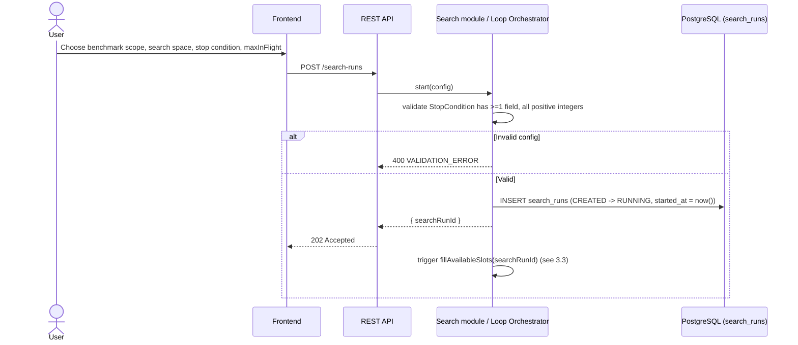
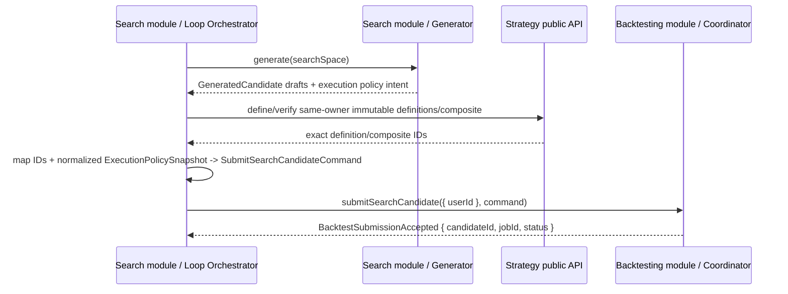
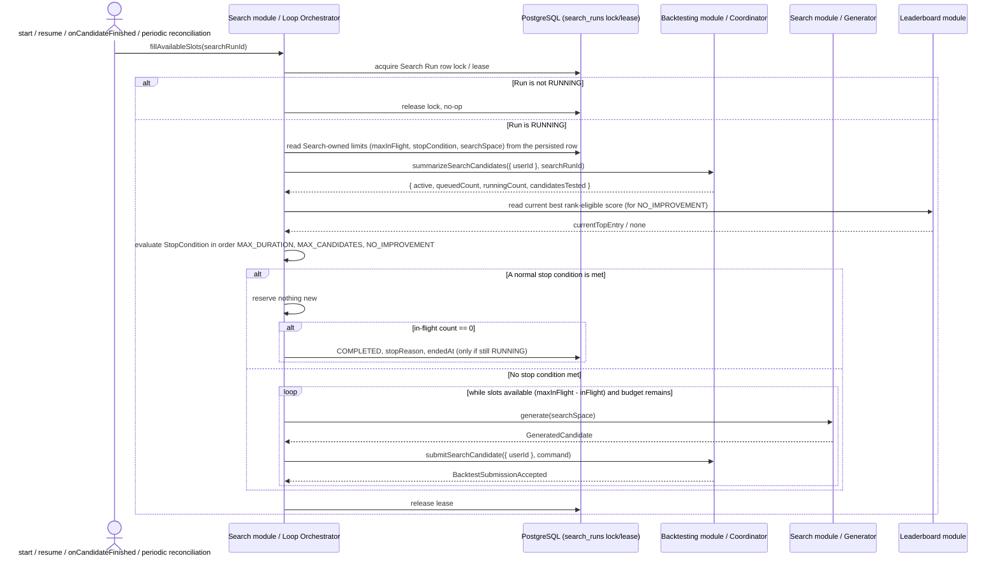
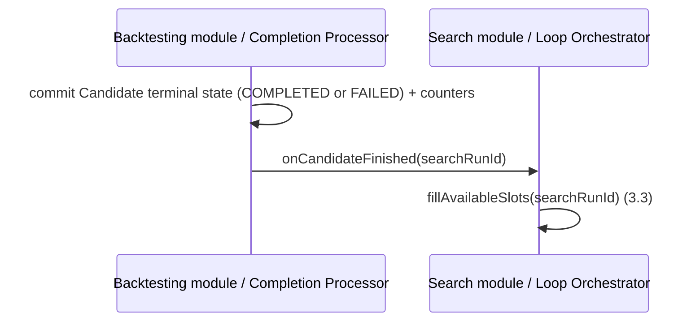
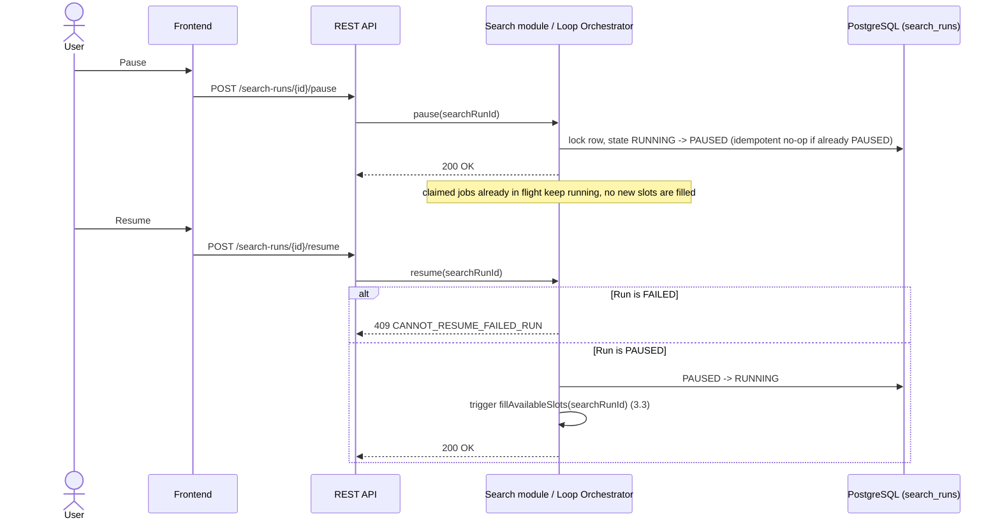
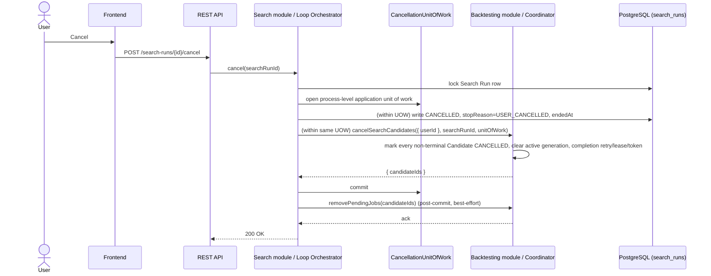
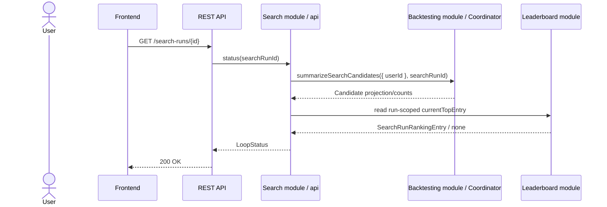
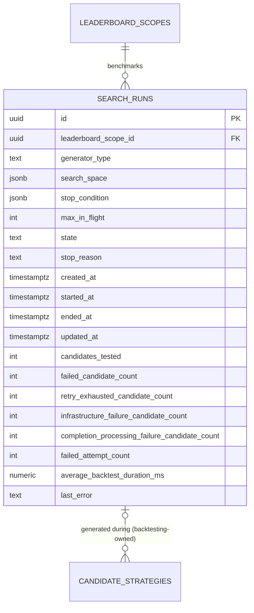
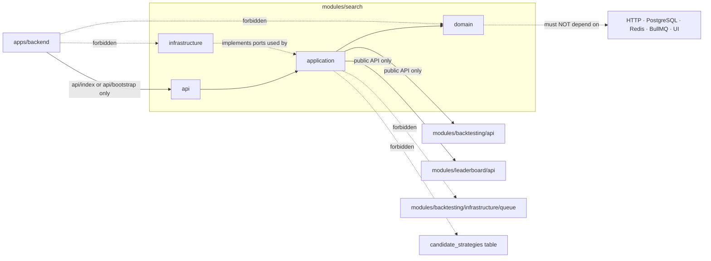

# Spec: Search Module (`modules/search`)

## 1. Overview

### Purpose

`modules/search` is the module that runs an unattended, bounded search for good strategy candidates. It repeats **Generate → Submit to Backtesting → (wait) → Evaluate/Score happens elsewhere → react to completion**, under an explicit stop condition, without ever running `while(true)` unbounded (brief §23). It owns three things and nothing else:

1. The **Strategy Generator** — produces a `GeneratedCandidate` (Random, Domain-guided, or a future Genetic algorithm) from a `SearchSpaceConfig`.
2. The **Continuous Loop Orchestrator** — owns the `SearchRun` lifecycle (`CREATED → RUNNING → PAUSED/COMPLETED/CANCELLED/FAILED`), enforces `maxInFlight` and the stop condition, and serializes slot-filling so the loop is safe under concurrent triggers.
3. **Search-run observability** — a durable, pollable `LoopStatus` projection and a run-scoped ranking read.

Search does **not** own Candidate persistence, the BullMQ queue, backtest execution, evaluation, or scoring. It is a pure orchestration/generation module that talks to `modules/backtesting` exclusively through that module's public API (`project-structure.md` §3.1, §5).

### Scope

In scope:
- Starting, pausing, resuming, cancelling, and polling the status of a `SearchRun`.
- Generating candidate strategy/composite definitions within a declared `SearchSpaceConfig` via a replaceable `StrategyGenerator`.
- Enforcing `StopCondition` (`maxCandidates`, `maxDurationSeconds`, `noImprovementAfterIterations`) and `maxInFlight` concurrency.
- Serialized, idempotent `fillAvailableSlots` — the single recovery-safe use case that both normal progress and crash recovery route through.
- Reading Candidate progress/counts through the Backtesting public projection API (never Candidate tables directly).
- Reading a run-scoped ranking via the Leaderboard public API for `currentTopEntry` / `GET /search-runs/{id}/leaderboard`.

Adjacent but **not** served by this module: `GET /search-runs/{searchRunId}/candidates` (per-candidate progress/history for a run) is part of the minimum REST surface in `component-contracts.md` §10, but it is composed directly from `modules/backtesting`'s `CandidateProgress` projection by `apps/backend`; it does not route through `modules/search/api`.

Out of scope (owned by other modules, consumed through their public APIs only):
- Persisting Candidates, Attempts, Trades, or owning the BullMQ queue/adapter — `modules/backtesting`.
- Validating/persisting `StrategyDefinition`/`CompositeStrategyDefinition` content — `modules/strategy` (Search only maps its own `GeneratedCandidate` into Backtesting's neutral submission command).
- Running the backtest simulation — the Backtest Worker Pool (`apps/backtest-worker`), composed from `modules/backtesting` + `modules/strategy`.
- Computing evaluation metrics — `modules/evaluation`.
- Scoring, rank eligibility, and Top-10/persistent Leaderboard admission — `modules/leaderboard`.
- Serving REST/WebSocket transport — `apps/backend`, which composes this module via `createSearchModule` and exposes it over `POST/GET /search-runs*`.

### Actors

| Actor | Interaction |
|---|---|
| `apps/backend` | Calls `createSearchModule()` at startup; exposes `start/pause/resume/cancel/status` over REST; invokes periodic reconciliation for every `RUNNING` run. |
| Frontend (via Backend REST) | Starts a Search Run, polls `GET /search-runs/{id}` and `GET /search-runs/{id}/leaderboard` while active; may also read `GET /search-runs/{id}/candidates` for per-candidate history. Closing the browser does not stop server-side work. |
| `modules/backtesting` (Coordinator) | Receiving side of `submitSearchCandidate`; source of `CandidateProgress` counts/projections via `summarizeSearchCandidates`; also the direct source for `GET /search-runs/{id}/candidates` (Backend composes this endpoint straight from Backtesting's projection API — Search's own `api` surface is not on this read path). Calls `SearchLoop.onCandidateFinished(searchRunId)` after a Candidate reaches a durable terminal state. |
| `modules/leaderboard` | Source of the run-scoped ranking (`currentTopEntry`, `GET /search-runs/{id}/leaderboard`) and of the `noImprovementAfterIterations` baseline signal. |
| `modules/strategy` | Persists/returns owner-scoped immutable Strategy/Composite references before Search submits them to Backtesting; Search never imports Strategy internals. |

## 2. Requirements

### 2.1 Functional requirements

| ID | Requirement |
|---|---|
| FR-1 | The module must let a caller `start` a `SearchRun` given a `SearchSpaceConfig`, `StopCondition`, `GeneratorType`, `leaderboardScopeId`, and `maxInFlight`, and must return a `searchRunId` immediately (`202`-style acceptance; work continues server-side). |
| FR-2 | The module must expose `pause`, `resume`, and `cancel` for a `SearchRun`, each idempotent and safe to call while slot-filling is in progress. |
| FR-3 | The module must expose `status(searchRunId)` returning a durable `LoopStatus` projection sufficient for REST polling, with no reliance on in-memory state surviving a backend restart. |
| FR-4 | The module must expose serialized, idempotent `fillAvailableSlots(searchRunId)` that generates and submits at most the run's missing in-flight slots, respecting `maxInFlight` and remaining `StopCondition` budget. |
| FR-5 | The module must generate candidates only through the replaceable `StrategyGenerator` interface (`RANDOM`, `DOMAIN_GUIDED`, future `GENETIC`), never branching orchestration logic on generator identity. |
| FR-6 | The module must submit every generated candidate to `modules/backtesting` through `BacktestCoordinator.submitSearchCandidate` and must never persist, query, or mutate Candidate rows itself. |
| FR-7 | The module must expose `onCandidateFinished(searchRunId)` as an internal post-commit callback that triggers `fillAvailableSlots`; a lost callback must never be the sole path to progress. |
| FR-8 | The module must invoke `fillAvailableSlots` on `start`, `resume`, every completion callback, and backend startup/periodic reconciliation for every `RUNNING` run. |
| FR-9 | The module must expose a run-scoped ranking read (`GET /search-runs/{id}/leaderboard`) sourced from the Leaderboard public API, distinct from the persistent cross-run Top-10. |

### 2.2 Business rules

- **No unbounded loop (brief §23):** every `SearchRun` requires at least one `StopCondition` field (`maxCandidates`, `maxDurationSeconds`, or `noImprovementAfterIterations`); `POST /search-runs` additionally validates every supplied value as a positive integer.
- **Serialized slot-filling:** `fillAvailableSlots` locks/leases the `SearchRun` row (or an equivalent per-run advisory lock) before reading counts or reserving iterations, so concurrent triggers (callback + periodic reconciliation + `resume`) cannot overfill `maxInFlight` or exceed `maxCandidates`.
- **Search never touches Candidate persistence or BullMQ directly:** all Candidate counts/projections come from `BacktestCoordinator.summarizeSearchCandidates`; all submission goes through `BacktestCoordinator.submitSearchCandidate`; all queue cleanup goes through `BacktestCoordinator.removePendingJobs`. Search never imports `modules/backtesting/infrastructure/queue` or Candidate tables.
- **In-flight accounting:** `CREATED | QUEUED | BACKTESTING | RETRY_WAIT | PROCESSING_RESULT | TERMINAL_FAILURE_PENDING` all occupy an in-flight slot. Only `COMPLETED | FAILED | CANCELLED` release one. `queuedCount` counts `CREATED | QUEUED`; `runningCount` counts the remaining four in-flight states.
- **`failedAttemptCount` semantics:** counts every failed `BacktestAttempt` row attached to a non-cancelled Candidate of the run, including a synthetic failure Attempt inserted by Backtesting's terminal-job watchdog when no real Attempt existed at crash time. Audit Attempts belonging to a `CANCELLED` Candidate are excluded, consistent with `candidatesTested`/`failedCandidateCount`.
- **Stop-condition evaluation order:** at every serialized `fillAvailableSlots` boundary, normal conditions are evaluated in the deterministic order `MAX_DURATION`, then `MAX_CANDIDATES`, then `NO_IMPROVEMENT`. An accepted user cancellation wins over any of these normal conditions.
- **`maxCandidates` semantics:** counts every committed candidate reservation (via the `UNIQUE (search_run_id, iteration_number)` allocation); cancellation never restores budget.
- **`maxDurationSeconds` semantics:** counts only active `RUNNING` wall-clock time; `CREATED` and `PAUSED` time are excluded. `started_at` is set only on the `CREATED → RUNNING` transition.
- **`noImprovementAfterIterations` semantics:** means no *strict* increase in the current best rank-eligible score after the configured number of completed non-cancelled Search candidates; ties are not improvements. Before the first rank-eligible score exists, the baseline is `none`; the first rank-eligible score establishes the baseline and resets the count.
- **Idempotent reservation:** `UNIQUE (search_run_id, iteration_number)` makes a repeated slot reservation (e.g. after a crash mid-fill) load the existing iteration instead of creating a duplicate.
- **Pause vs. cancel:** `pause` stops filling new slots but lets already-claimed jobs finish; it does not touch Candidate state. `cancel` locks the run and, through one process-level application unit of work, writes `SearchRun` `CANCELLED`/`USER_CANCELLED`/`endedAt` and asks Backtesting's public facade to mark every non-terminal Candidate `CANCELLED`; only after that commit does Search call `BacktestCoordinator.removePendingJobs(candidateIds)` for best-effort waiting/delayed-job cleanup.
- **Unit of work is opaque:** the `CancellationUnitOfWork` passed across the Search↔Backtesting boundary is a process-level application transaction port, never a database handle — Search cannot open a second transaction through it.
- **Completion path:** on normal drain, once in-flight reaches zero after a stop condition is met, the run is marked `COMPLETED` with `stopReason` and `endedAt`, but only if the run is still `RUNNING` (never overwrites `FAILED`/`CANCELLED`).
- **Unrecoverable orchestration error:** an unrecoverable Search orchestration/configuration error immediately transitions a `RUNNING` or `PAUSED` run to terminal `FAILED` with `stopReason = ERROR`, `lastError`, and `endedAt`. It stops new generation but does not rewrite already-committed Candidates — those continue through Backtesting's own reconciliation and may still finish for audit/Experiment purposes. Completion callbacks may keep updating counters afterward but must never flip `FAILED` back to `COMPLETED`. `resume` rejects a `FAILED` run; `cancel` becomes an idempotent no-op after the error is recorded. A user cancellation wins only if its transaction acquires the `SearchRun` lock before the error transition commits.
- **Recovery is not callback-dependent:** because `fillAvailableSlots` also runs on `start`, `resume`, and backend startup/periodic reconciliation for every `RUNNING` run, a lost `onCandidateFinished` callback delays but never stalls progress, and concurrent callbacks cannot exceed `maxInFlight`/`maxCandidates`.
- **Manual candidates are invisible to Search:** Search's counts, stop-condition evaluation, and ranking apply only to Candidates it generated (`search_run_id` set); Manual candidates never affect `maxInFlight`/`maxCandidates` accounting for any run.

### 2.3 Non-functional requirements

- **Crash safety:** every mutation Search performs is either (a) one process-level transaction covering only `search_runs` plus a delegated Backtesting cancellation call, or (b) idempotent given the `(search_run_id, iteration_number)` uniqueness constraint. No Search invariant depends on an in-memory loop surviving a process restart.
- **Layering:** `api → application → domain`; `infrastructure` implements application ports only, where present. Search's own domain (`StrategyGenerator` implementations, stop-condition evaluation) must not import HTTP, PostgreSQL, Redis, BullMQ, or framework code (`architecture.md` §1.3.1).
- **Boundary:** other modules and `apps/backend` may only import `modules/search/api` (`start/pause/resume/cancel/status/leaderboard`) or the bootstrap facade `createSearchModule`. No module may reach into `modules/search/domain` or `modules/search/infrastructure`.
- **Extensibility without ripple:** adding a new `StrategyGenerator` implementation (e.g. `GENETIC`) must not require changes to `modules/backtesting`, `modules/evaluation`, `modules/leaderboard`, `modules/strategy`, or the Frontend core.
- **No direct async ownership:** Search must never touch BullMQ or `modules/backtesting/infrastructure/queue`; the only asynchronous boundary in the system belongs to `modules/backtesting` (`architecture.md` §1.1).

## 3. Behavior

### 3.1 Start a Search Run



### 3.2 Generate one candidate



`GeneratedCandidate` is Search-owned and immutable once produced; it is not a
persisted Strategy aggregate. Search calls Strategy's owner-aware public API
first, then Backtesting verifies the returned exact references. Backtesting
never persists Strategy-owned rows in its Candidate transaction.

### 3.3 `fillAvailableSlots` — the serialized, idempotent core loop



`fillAvailableSlots` re-reads `maxInFlight`, `stopCondition`, and `searchSpace` from the persisted `search_runs` row on every invocation rather than trusting any caller-supplied or in-memory copy of that config (`data-flow.md` §5: *"acquire Search Run lease; read Search-owned limits"*). This is what makes the use case safe to invoke from a fresh process after a crash or restart — it never depends on orchestrator state surviving in memory. It never creates more than the missing `maxInFlight` slots or the remaining `maxCandidates` budget, whichever is smaller. It is safe to invoke concurrently from any trigger because the row lock/lease serializes all callers, and `UNIQUE (search_run_id, iteration_number)` makes a repeated reservation idempotent rather than duplicative.

### 3.4 Completion callback (post-commit)



This callback only ever fires after a durable commit in Backtesting. Because the same `fillAvailableSlots` use case also runs on startup/periodic reconciliation for every `RUNNING` run, a lost callback delays but never stalls the loop.

### 3.5 Pause / Resume



### 3.6 Cancel



Running workers are not forcibly stopped; a late worker may finish its own Attempt as `COMPLETED` audit data, but fenced/conditional writes and the Completion Processor never resurrect the Candidate or create an Experiment/rank for a cancelled run (`data-flow.md` §5, §6).

### 3.7 Poll status



`LoopStatus` is a read-only projection derived from `search_runs`, `candidate_strategies`, `backtest_attempts`, and Experiment ranking data — Search holds no second copy of Candidate state (`data-model.md` §4).

### 3.8 Error / edge cases

| Case | Trigger | Result |
|---|---|---|
| `StopCondition` with no fields, or a non-positive value | `POST /search-runs` body validation | `400 VALIDATION_ERROR`; no `search_runs` row written |
| Concurrent `fillAvailableSlots` triggers (callback + periodic + resume, same run) | Multiple triggers fire close together | Row lock/lease serializes them; at most one performs reservations for that boundary; others observe updated counts and no-op or reserve the remaining delta |
| Callback lost (backend crash between commit and callback delivery) | Backtesting commits Candidate terminal state but the process crashes before `onCandidateFinished` fires | Periodic reconciliation for `RUNNING` runs invokes `fillAvailableSlots` and repairs the missed refill; no candidate slot is permanently lost |
| `resume` on a `FAILED` run | `stopReason = ERROR` already recorded | Rejected: `409 CANNOT_RESUME_FAILED_RUN` |
| `cancel` on an already-`FAILED` run | Error already recorded | Idempotent no-op; no new Candidate cancellation issued |
| `cancel` racing the `ERROR` transition | Both try to lock `search_runs` concurrently | Whichever transaction acquires the row lock first commits; the loser observes the already-terminal state and no-ops (cancel) or is rejected (a subsequent error attempt on an already-cancelled run) |
| `maxCandidates` reached mid-fill | `fillAvailableSlots` computes remaining budget as `0` | No further candidates generated this boundary; existing in-flight candidates continue to completion |
| `noImprovementAfterIterations` reached with no rank-eligible score ever recorded | All completed candidates are zero-trade / non-rank-eligible | Baseline remains `none`; the condition can never trigger until at least one rank-eligible score exists |
| A generated candidate's definitions fail Backtesting/Strategy validation | e.g. malformed `SearchSpaceConfig` produces an invalid composite | `submitSearchCandidate` rejects; Search does not commit that iteration slot and may retry generation within the same `fillAvailableSlots` boundary, subject to remaining budget |
| Search Run restarted after a crash mid-reservation | Process died after generating but before Backtesting committed | The Backtesting-side idempotent `(searchRunId, iterationNumber)` allocation prevents a duplicate; the next `fillAvailableSlots` call re-derives the correct remaining slot count from `summarizeSearchCandidates` |

## 4. Contracts

### 4.1 Public runtime API (consumed by `apps/backend`)

```typescript
// modules/search/api/index.ts
// REST derives this only from Auth.verify(token).userId.
export interface AuthContext { userId: string }

export interface SearchModulePublicApi {
  start(auth: AuthContext, config: {
    searchSpace: SearchSpaceConfig;
    stopCondition: StopCondition;
    generatorType: GeneratorType;
    leaderboardScopeId: string;
    maxInFlight: number;
  }): Promise<{ searchRunId: string }>;
  pause(auth: AuthContext, searchRunId: string): Promise<void>;
  resume(auth: AuthContext, searchRunId: string): Promise<void>;
  cancel(auth: AuthContext, searchRunId: string): Promise<void>;
  status(auth: AuthContext, searchRunId: string): Promise<LoopStatus>;
  leaderboard(auth: AuthContext, searchRunId: string): Promise<SearchRunRankingEntry[]>;
}

// modules/search/api/bootstrap.ts
export function createSearchModule(deps: {
  searchRunRepository: SearchRunRepository;
  generators: Record<GeneratorType, StrategyGenerator>;
  backtestCoordinator: BacktestCoordinator;      // modules/backtesting public API only
  leaderboardService: Pick<LeaderboardService, "rankSearchRun">; // modules/leaderboard public API only
}): SearchModulePublicApi & {
  onCandidateFinished(searchRunId: string): Promise<void>;   // internal callback target for Backtesting
  fillAvailableSlots(searchRunId: string): Promise<void>;    // serialized, idempotent recovery use case
};
```

`onCandidateFinished` and `fillAvailableSlots` are exposed through the bootstrap/composition facade because they require the repository/coordinator dependencies; `start/pause/resume/cancel/status/leaderboard` form the pure runtime facade used by `apps/backend`'s REST layer, matching the export matrix in `project-structure.md` §5.1.

### 4.2 Core domain contracts (from `component-contracts.md` §1, §5)

```typescript
export type GeneratorType = "RANDOM" | "DOMAIN_GUIDED" | "GENETIC";

export type StrategyCategory =
  | "TREND" | "MOMENTUM" | "VOLATILITY" | "STRUCTURE" | "INFORMATION";

export interface GeneratedCandidate {
  strategyDefinitions: StrategyDefinition[];
  compositeDefinition: CompositeStrategyDefinition;
  executionPolicyIntent: {
    mode: "TWO_SIDED_ONE_X_V1";
    stopLossPercent?: number;
    takeProfitPercent?: number;
  };
  generatedBy: GeneratorType;
}

export interface StrategyGenerator {
  readonly type: GeneratorType;
  generate(searchSpace: SearchSpaceConfig): GeneratedCandidate;
}

export interface SearchSpaceConfig {
  availableStrategies: StrategyDefinition[];
  domainRules?: {
    requiredCategories: StrategyCategory[]; // e.g. ["TREND", "MOMENTUM", "STRUCTURE"]
  };
  maxComponents?: number;
}

type StopConditionFields = {
  maxCandidates?: number;
  maxDurationSeconds?: number;
  noImprovementAfterIterations?: number;
};

export type StopCondition =
  | (StopConditionFields & { maxCandidates: number })
  | (StopConditionFields & { maxDurationSeconds: number })
  | (StopConditionFields & { noImprovementAfterIterations: number });
```

### 4.3 Observability contract (from `component-contracts.md` §5.1)

```typescript
// modules/search/api/loop.ts
import type { CandidateProgress } from "modules/backtesting/api";
import type { SearchRunRankingEntry } from "modules/leaderboard/api";

export interface LoopStatus {
  searchRunId: string;
  state: "CREATED" | "RUNNING" | "PAUSED" | "COMPLETED" | "CANCELLED" | "FAILED";
  activeCandidates: CandidateProgress[];      // every non-terminal Candidate
  queuedCount: number;                        // CREATED | QUEUED
  runningCount: number;                       // BACKTESTING | RETRY_WAIT | PROCESSING_RESULT | TERMINAL_FAILURE_PENDING
  candidatesTested: number;                   // non-cancelled Candidates terminal COMPLETED or FAILED
  failedCandidateCount: number;
  retryExhaustedCandidateCount: number;
  infrastructureFailureCandidateCount: number;
  completionProcessingFailureCandidateCount: number;
  failedAttemptCount: number;
  averageBacktestDurationMs: number;          // completed Attempts only
  currentTopEntry?: SearchRunRankingEntry;
  createdAt: string;
  startedAt?: string;
  updatedAt: string;
  endedAt?: string;
  stopReason?: "MAX_CANDIDATES" | "MAX_DURATION" | "NO_IMPROVEMENT" | "USER_CANCELLED" | "ERROR";
  stopCondition: StopCondition;
  lastError?: string;
}

export interface ContinuousLoopOrchestrator {
  start(auth: AuthContext, config: {
    searchSpace: SearchSpaceConfig;
    stopCondition: StopCondition;
    generatorType: GeneratorType;
    leaderboardScopeId: string;
    maxInFlight: number;
  }): Promise<{ searchRunId: string }>;
  pause(auth: AuthContext, searchRunId: string): Promise<void>;
  resume(auth: AuthContext, searchRunId: string): Promise<void>;
  cancel(auth: AuthContext, searchRunId: string): Promise<void>;
  status(auth: AuthContext, searchRunId: string): Promise<LoopStatus>;
  onCandidateFinished(searchRunId: string): Promise<void>;
  fillAvailableSlots(searchRunId: string): Promise<void>;
}
```

### 4.4 Consumed contracts (owned by `modules/backtesting`, imported through its public API only)

```typescript
// Imported, never redeclared or weakened locally.
import type {
  BacktestSubmissionAccepted,
  CancellationUnitOfWork,
  CandidateProgress,
  CompletionUnitOfWork,
  SearchCandidateTerminalFacts,
  SubmitSearchCandidateCommand,
} from "modules/backtesting/api";

// Search-owned adapter implemented by the composition root and injected into
// Backtesting's Completion Processor. It writes only Search projections in the
// caller's final transaction; it never opens or commits a nested transaction.
export interface SearchProjectionPort {
  applyCandidateTerminalFacts(
    facts: SearchCandidateTerminalFacts,
    unitOfWork: CompletionUnitOfWork,
  ): Promise<void>;
}

export interface BacktestCoordinator {
  submitSearchCandidate(auth: AuthContext, command: SubmitSearchCandidateCommand): Promise<BacktestSubmissionAccepted>;
  summarizeSearchCandidates(auth: AuthContext, searchRunId: string): Promise<{
    active: CandidateProgress[];
    queuedCount: number;
    runningCount: number;
    candidatesTested: number;
  }>;
  cancelSearchCandidates(auth: AuthContext, searchRunId: string, unitOfWork: CancellationUnitOfWork): Promise<{ candidateIds: string[] }>;
}

export interface BacktestInternalApi {
  removePendingJobs(candidateIds: string[]): Promise<void>; // best-effort, waiting/delayed jobs only
}
```

### 4.5 Data model (owned table — from `data-model.md` §3.6)



- `search_runs` is the **only** table `modules/search` owns. `candidate_strategies`, `backtest_attempts`, `trades`, and `experiment_results` belong to `modules/backtesting`/`modules/evaluation`/`modules/leaderboard` and are reached only through their public APIs (`data-model.md` §3.7-§3.11).
- `search_space` and `stop_condition` are stored as `jsonb` snapshots of the config supplied at `start` — the run's own configuration is immutable for its lifetime; changing search parameters requires starting a new `SearchRun`.
- Counter invariants enforced at the schema level (`data-model.md` §3.6): `candidates_tested >= failed_candidate_count`; `failed_candidate_count = retry_exhausted_candidate_count + infrastructure_failure_candidate_count + completion_processing_failure_candidate_count`.
- Repository roles update this row directly (it is not append-only like the versioned definition tables); `fillAvailableSlots`/`cancel` serialize on this row's lock so counters and `state` transitions stay consistent under concurrency.
- `search_runs` carries composite unique constraints — `UNIQUE (id, leaderboard_scope_id)` and `UNIQUE (id, leaderboard_scope_id, generator_type)` — that exist purely so `modules/backtesting`'s `candidate_strategies` table can enforce a composite foreign key back to this row (`data-model.md` §3.7). Search does not consume these constraints itself; they exist only to let Backtesting guarantee a Candidate's `leaderboard_scope_id`/`generated_by` always agree with the run that spawned it.

### 4.6 Events

None. `modules/search` publishes no domain events — Cryptox has no general Event Bus (`architecture.md` §1.1). Its only cross-module signal is the direct, in-process `onCandidateFinished` callback from `modules/backtesting`, which is explicitly an optimization layered on top of idempotent polling/reconciliation, not a required delivery channel.

### 4.7 Module dependency direction



## 5. Constraints

### Technical constraints

- Language/runtime: TypeScript, composed inside `apps/backend` (NestJS DI); Search has no presence in `apps/backtest-worker` — it never runs simulations (`tech-stack.md`, `project-structure.md` §6.1).
- `domain` (stop-condition evaluation, generator implementations' pure selection logic) must be pure TypeScript with zero framework/infra imports (`architecture.md` §1.3.1).
- Persistence for `search_runs` uses hand-written Knex repositories (no ORM), consistent with the rest of the platform (`tech-stack.md`).
- Row locking for `fillAvailableSlots`/`cancel` uses PostgreSQL row locks (`SELECT ... FOR UPDATE` or equivalent lease), matching the transactional-correctness driver in `tech-stack.md` §1.
- Validation of REST-facing DTOs (`start` request body) uses Zod, consistent with `tech-stack.md`.

### Business constraints

- A `SearchRun`, once `COMPLETED`, `CANCELLED`, or `FAILED`, is terminal; no operation transitions it back to `RUNNING` or `PAUSED`.
- `maxInFlight` and `StopCondition` are fixed for the lifetime of a run; changing search parameters means starting a new `SearchRun`, not mutating an existing one.
- Search must never read or write `candidate_strategies`, `backtest_attempts`, `trades`, or `experiment_results` directly, under any circumstance, including recovery/reconciliation code paths.
- Manual candidates (`origin = MANUAL`) are entirely invisible to Search's counts, stop conditions, and ranking.

### Out of scope

- Persisting Candidates, Attempts, Trades, or owning BullMQ — `modules/backtesting`.
- Validating/versioning `StrategyDefinition`/`CompositeStrategyDefinition` content — `modules/strategy`.
- Running the simulation itself — `apps/backtest-worker`.
- Computing performance metrics — `modules/evaluation`.
- Scoring, rank eligibility, and Top-10 admission — `modules/leaderboard`.
- Exposing REST endpoints or WebSocket transport — `apps/backend`.

## 6. Acceptance Criteria

### Start / configuration

- [ ] `start` with a `StopCondition` containing at least one positive-integer field succeeds and returns a `searchRunId` immediately, with the row's `state = RUNNING` and `started_at` set.
- [ ] `start` with an empty `StopCondition`, or any non-positive field value, is rejected with `400` and writes no `search_runs` row.
- [ ] After `start`, `fillAvailableSlots` runs at least once without requiring any external trigger.

### Slot filling and concurrency

- [ ] Concurrent invocations of `fillAvailableSlots` for the same `searchRunId` (simulating callback + periodic reconciliation racing) never create more than `maxInFlight` simultaneous in-flight Candidates.
- [ ] `fillAvailableSlots` never submits more candidates than the remaining `maxCandidates` budget, verified by `SELECT COUNT(*) FROM candidate_strategies WHERE search_run_id = ?` staying `<= maxCandidates`.
- [ ] A process restart mid-`fillAvailableSlots` (crash after `submitSearchCandidate` commits, before the loop's next iteration) does not produce a duplicate iteration when reconciliation re-invokes `fillAvailableSlots` — verified via `UNIQUE (search_run_id, iteration_number)`.
- [ ] `fillAvailableSlots` invoked from a freshly started process (no in-memory state) still enforces the correct `maxInFlight`/`stopCondition` for the run, proving the limits are read from `search_runs` and not from orchestrator memory.

### Stop conditions

- [ ] Reaching `maxCandidates` stops new generation; already in-flight Candidates are allowed to finish.
- [ ] `maxDurationSeconds` excludes `CREATED` and `PAUSED` time — a run paused for longer than its duration budget and then resumed does not stop immediately on resume.
- [ ] `noImprovementAfterIterations` never triggers before at least one rank-eligible score has been recorded for the run.
- [ ] When multiple stop conditions could apply at one `fillAvailableSlots` boundary, the recorded `stopReason` follows the order `MAX_DURATION`, then `MAX_CANDIDATES`, then `NO_IMPROVEMENT`.
- [ ] A run transitions to `COMPLETED` with a `stopReason` and `endedAt` only after in-flight count reaches zero following a met stop condition, and only if it was still `RUNNING` at that moment.

### Pause / Resume / Cancel

- [ ] `pause` stops new slot reservation but does not cancel or otherwise mutate already-claimed Candidates.
- [ ] `resume` on a `PAUSED` run re-triggers `fillAvailableSlots` and returns the run to `RUNNING`.
- [ ] `resume` on a `FAILED` run is rejected with `409` and leaves the run's state unchanged.
- [ ] `cancel` marks the `SearchRun` `CANCELLED`/`USER_CANCELLED`/`endedAt` and every non-terminal Candidate for that run `CANCELLED`, atomically, before any `removePendingJobs` call is issued.
- [ ] `cancel` is idempotent: calling it twice in a row produces no error and no duplicate side effects.
- [ ] `cancel` on an already-`FAILED` run is a no-op that issues no Candidate cancellation.

### Error handling

- [ ] An unrecoverable orchestration error transitions a `RUNNING` or `PAUSED` run directly to `FAILED` with `stopReason = ERROR`, `lastError`, and `endedAt`, without rewriting any already-committed Candidate row.
- [ ] Completion callbacks arriving after a run is `FAILED` may still update counters/projections but never change `state` back to `COMPLETED`.

### Observability

- [ ] `status(searchRunId)` returns a `LoopStatus` whose `queuedCount`/`runningCount`/`candidatesTested` match independently computed counts from `candidate_strategies` for that run.
- [ ] `failedAttemptCount` in `LoopStatus` includes synthetic watchdog-inserted failure Attempts and excludes any Attempt belonging to a `CANCELLED` Candidate.
- [ ] `status(searchRunId)` never blocks on or triggers new candidate generation — it is a pure read.
- [ ] `GET /search-runs/{id}/leaderboard` returns only rank-eligible successful Experiments belonging to that run's Candidates, ordered by the canonical `overall_score DESC, created_at ASC, id ASC` tie-break.

### Boundary / architecture

- [ ] An architecture test fails the build if `modules/search/domain` imports HTTP, PostgreSQL, Redis, BullMQ, or framework code.
- [ ] An architecture test fails the build if `modules/search/application` imports `modules/backtesting/infrastructure/*` or any Candidate/Attempt/Trade table directly instead of `modules/backtesting/api`.
- [ ] An architecture test fails the build if any other module imports `modules/search/domain/*` or `modules/search/infrastructure/*` directly instead of `modules/search/api/*`.
