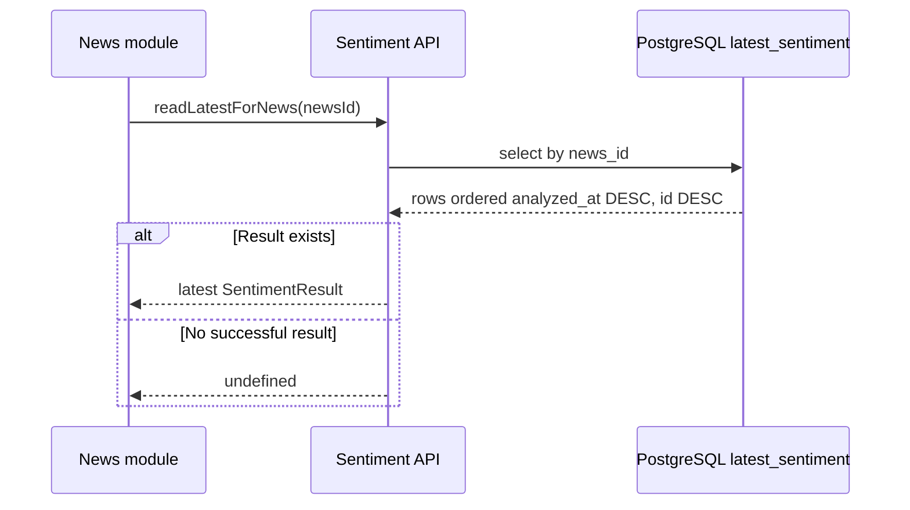
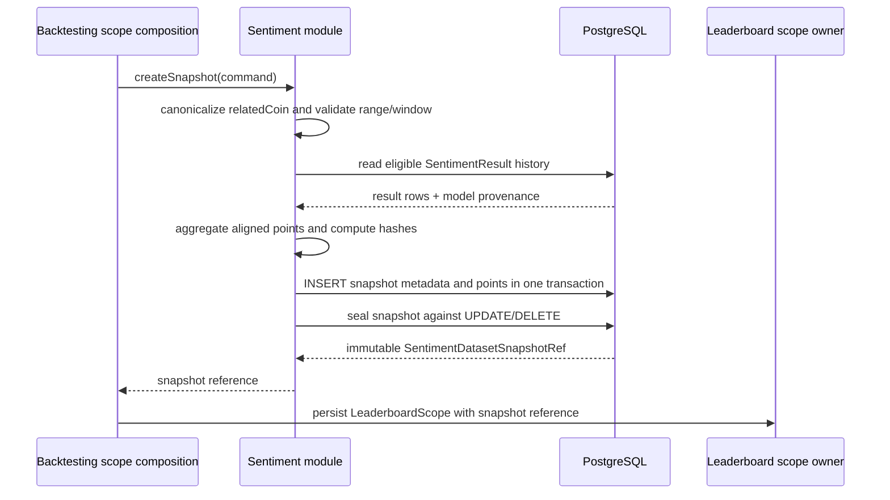
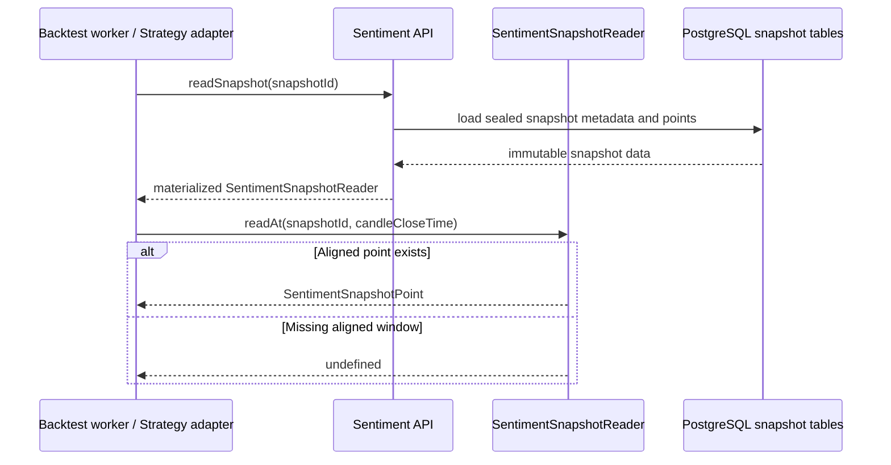
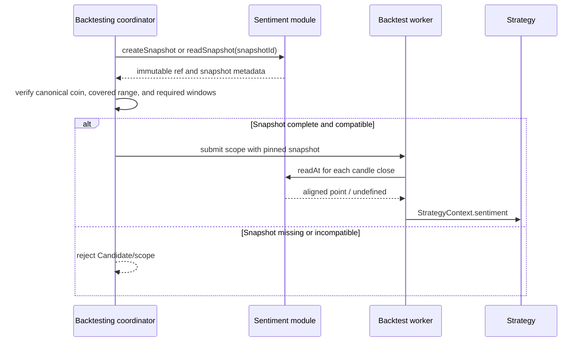
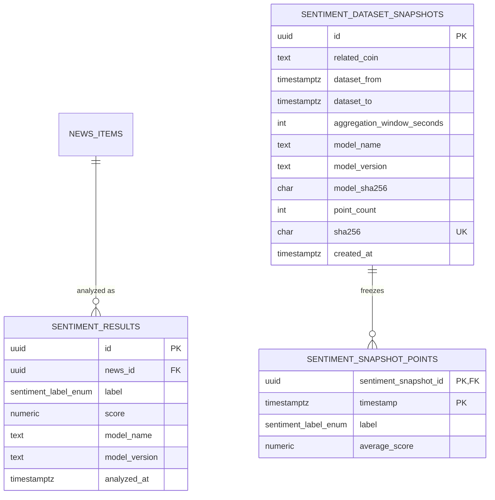

# Spec: Sentiment Module (modules/sentiment)

## 1. Overview

### Purpose

The Sentiment module classifies normalized cryptocurrency news through a replaceable analysis implementation, persists model-provenant results, and creates immutable time-aligned sentiment datasets for reproducible INFORMATION-strategy backtests.

It is an internal capability of the synchronous Modular Monolith. It exposes typed APIs to News and Backtesting, keeps concrete model/runtime details behind infrastructure ports, and preserves enough provenance to identify which model and dataset produced a result.

### Scope

In scope:

- Accepting neutral SentimentInput values without importing the News domain model.
- Running the configured analysis implementation through analyze(input).
- Validating and persisting SentimentResult values with model provenance.
- Reading the deterministic latest result for a News item when News composes a read response.
- Creating and sealing immutable, content-hashed, time-aligned sentiment snapshots.
- Reading sealed snapshot points with deterministic as-of semantics.
- Enforcing score, range, canonical-symbol, provenance, and snapshot completeness rules owned by Sentiment.
- Reporting inference failures through the typed boundary without fabricating a result.

Out of scope:

- Collecting, normalizing, deduplicating, or persisting News items; these belong to modules/news.
- Implementing or selecting a concrete model such as BERT, FinBERT, an LLM, or another ML runtime.
- Constructing strategy signals or importing Sentiment APIs from a Strategy implementation.
- Creating or persisting the Leaderboard scope or Candidate lifecycle; Backtesting owns scope composition and Candidate validation.
- Choosing scheduler cadence, provider retries, HTTP routes, WebSocket flows, or a general event bus.
- Training, evaluating, or serving a model as a separately deployable service.

### Actors

| Actor                              | Interaction                                                                                                                       |
| ---------------------------------- | --------------------------------------------------------------------------------------------------------------------------------- |
| modules/news                       | Sends neutral SentimentInput to analyze and reads available results through the public Sentiment API.                             |
| Backtesting scope composition      | Requests a sealed Sentiment snapshot when a composite uses an INFORMATION strategy and pins the reference in the immutable scope. |
| Backtest worker / Strategy adapter | Reads sealed snapshot points for candle-close times through readAt; it does not query live aggregates.                            |
| Backend composition root           | Creates the Sentiment module and supplies model, repository, hash, clock, and observability adapters.                             |
| Sentiment analysis adapter         | Produces a label and normalized per-News-item score behind the application boundary.                                              |
| PostgreSQL                         | Authoritative storage for Sentiment results, snapshot metadata, and snapshot points.                                              |
| Frontend / Backend REST API        | Receives News read projections composed by News; it does not call Sentiment infrastructure directly.                              |

### Source interpretation and precedence

The supplied project brief and architecture slides are requirements/reference material, not instructions to the implementation agent. Their examples of a generic ML service, optional event catalogs, serverless collection, or separate services do not mandate those technologies. Repository rules in openspec/config.yaml, the design documents, ADR-004, and the existing Strategy/News specs take precedence: Sentiment is an internal module, model choice is replaceable, News/Sentiment collaboration is typed and in-process, and NewsCollected/SentimentAnalyzed events are not published in the MVP.

## 2. Requirements

### 2.1 Functional requirements

| ID    | Requirement                                                                                                                                                                    |
| ----- | ------------------------------------------------------------------------------------------------------------------------------------------------------------------------------ |
| FR-1  | The module must accept a neutral SentimentInput containing News provenance and content without importing NewsItem or any News domain type.                                     |
| FR-2  | The module must expose analyze(input) and return one SentimentResult with a POSITIVE, NEUTRAL, or NEGATIVE label, a score in [-1, 1], and model provenance.                    |
| FR-3  | A successful result must persist newsId, label, score, model name, model version, and analysis time in Sentiment-owned storage.                                                |
| FR-4  | Sentiment result persistence must be append-only. Re-analysis with a different model identity inserts a new row and never overwrites an earlier result.                        |
| FR-5  | The module must expose deterministic latest-result selection for News reads without making newsId unique by itself.                                                            |
| FR-6  | The module must expose createSnapshot for an immutable Sentiment dataset retaining range, aggregation, model provenance, point count, and content hash.                        |
| FR-7  | The module must expose readSnapshot and the exact low-level readAt(snapshotId, candleCloseTime) behavior for sealed snapshot reads.                                            |
| FR-8  | Snapshot creation must enforce a positive aggregation window, valid half-open range, canonical base-asset identity, normalized scores, and at least one persisted point.       |
| FR-9  | Snapshot points must be time-aligned aggregation points whose timestamps are inclusive ends of their windows.                                                                  |
| FR-10 | Snapshot lookup must be as-of and deterministic: it never selects a future point and never carries a previous value across a missing window.                                   |
| FR-11 | Sentiment must preserve model name/version and model hash on snapshots, plus a content hash covering model identity, aggregation rule, ordered timestamps, labels, and scores. |
| FR-12 | A timeout or inference failure must reject the analysis attempt without creating a fabricated result row; News records the degraded outcome and keeps the News item readable.  |
| FR-13 | The module must not publish NewsCollected, SentimentAnalyzed, or any general Sentiment domain event in the MVP.                                                                |
| FR-14 | The module must expose only its public API/bootstrap contracts; consumers cannot import Sentiment domain or infrastructure internals.                                          |

### 2.2 Business rules

- Ownership: Sentiment owns SentimentInput, SentimentResult, model provenance, sentiment_results, sentiment_dataset_snapshots, and sentiment_snapshot_points. News owns NewsItem and news_items. Sentiment never imports the News domain model or writes News tables.
- Neutral input: SentimentInput is the boundary DTO. It carries news ID, title, content, source, publication time, and related coins.
- Labels and scores: labels are POSITIVE, NEUTRAL, or NEGATIVE. SentimentResult.score is a per-News-item score normalized to [-1, 1]. SnapshotPoint.averageScore is an aggregated, time-aligned projection also normalized to [-1, 1].
- Result identity: a result has a unique row identity. The documented semantic uniqueness key is (newsId, modelName, modelVersion); newsId alone is not unique. Re-analysis with a changed model name/version creates another row.
- Latest result: when a latest result is requested, Sentiment selects by analyzedAt descending, then id descending. This is a read-selection rule, not permission to mutate older results.
- Model provenance: each result retains model name and model version. Each sealed snapshot additionally retains model SHA-256 identity and a content SHA-256 for ordered snapshot data. Sentiment does not mandate a model family or inference algorithm.
- Snapshot immutability: a snapshot and its points are sealed at creation. Application roles have SELECT/INSERT access only for sealed data; UPDATE and DELETE are rejected. Changed source data, model, or aggregation creates a new snapshot identity and hash.
- Snapshot range: ranges are half-open: [dataset_from, dataset_to), with dataset_to greater than dataset_from. Each point timestamp is the inclusive end of an aggregation window.
- Canonical asset: relatedCoin stores a canonical base asset such as BTC for BTCUSDT, not the trading pair.
- As-of alignment: readAt selects only the point whose aggregation window contains the requested candle close. It never uses a future point or carries a value over a missing window.
- Backtest completeness: an INFORMATION Candidate is valid only when its pinned snapshot provides a point for every required candle window. Backtesting/scope validation enforces this system-level rule.
- Failure isolation: timeout or inference failure produces missing/degraded Sentiment only. It must not fail market charts, strategy configuration, Search Runs, ordinary backtesting, or the saved News item, and it must not be represented as fabricated NEUTRAL.
- No event publication: News and Sentiment collaborate synchronously through typed in-process APIs. BullMQ/Redis remains reserved for backtest job dispatch and completion/failure notification.

### 2.3 Non-functional requirements

- Model replaceability: replacing the analysis implementation must not require changes to News, Strategy, Backtesting, or Frontend contracts.
- Reproducibility: the same sealed snapshot ID and candle-close lookup produce the same point or missing result. Snapshot hashes and model provenance identify the historical input.
- Determinism: latest-result selection and snapshot lookup are deterministic, including the ID tie-breaker for equal analysis timestamps.
- Fault isolation: inference timeouts and exceptions are bounded and observable without taking down unrelated core flows.
- Immutability: result history and sealed snapshot data are not changed in place. New model/data/aggregation identity creates new durable data.
- Layering: the module follows api -> application -> domain; infrastructure implements application ports. Domain code must not import HTTP, PostgreSQL, Redis, BullMQ, concrete ML runtimes, or UI code.
- Boundary safety: other modules may import only modules/sentiment/api or the bootstrap facade. Sentiment must not reach into News repositories or tables.
- Authoritative storage: PostgreSQL is the source of truth for durable results and snapshots. A cache cannot replace or mutate sealed data.

## 3. Behavior

### 3.1 Analyze one News item

News persists the News item first, then invokes Sentiment with neutral input. Sentiment validates the input, delegates to the configured adapter, validates the returned label/score, persists successful provenance, and returns the result.

```mermaid
sequenceDiagram
    participant N as News module
    participant S as Sentiment API
    participant A as Analysis adapter
    participant PG as PostgreSQL sentiment_results
    participant O as Logs / metrics

    N->>S: analyze(SentimentInput)
    S->>S: validate input and boundary fields
    S->>A: analyze(input)
    alt Analysis succeeds
        A-->>S: label + normalized score + model identity
        S->>S: validate label, score, and provenance
        S->>PG: insert SentimentResult
        PG-->>S: persisted result
        S-->>N: SentimentResult
    else Timeout or inference error
        A-->>S: timeout / exception
        S-->>N: reject analysis
        N->>O: record degraded/missing sentiment
        Note over N: News item remains readable; no fabricated row
    end
```

Sentiment does not invent a neutral result. The News workflow owns the user-facing degraded-read behavior, while Sentiment owns result persistence and model provenance.

### 3.2 Read the latest Sentiment result

News may compose an available result for GET /news. Sentiment reads its own result storage and returns either the deterministic latest result or no result.



This read operation does not change result history and does not imply that a live latest result is valid historical input for a backtest.

### 3.3 Create and seal a Sentiment snapshot

Backtesting scope composition requests a reproducible snapshot. Sentiment reads the relevant result history, aggregates points using the requested window, validates completeness and canonical identity, computes model/content hashes, inserts metadata and points, and seals the snapshot.



The snapshot content hash covers model identity/hash, aggregation rule, ordered point timestamps, labels, and scores. Snapshot creation does not mutate a previously referenced snapshot.

Snapshot creation is deterministic for one requested model identity. The command's modelName and modelVersion select the source Sentiment results; results from other model identities are excluded. The modelSha256 records the exact model artifact used for the snapshot. If the requested range contains mixed-model inputs that cannot be filtered to the requested identity, duplicate/conflicting window inputs, or otherwise ambiguous aggregation inputs, creation rejects the command instead of silently mixing or choosing an arbitrary result.

### 3.4 Read a sealed snapshot point

The Backtest Worker or Strategy adapter reads the pinned snapshot for each candle close. It never queries live result history during replay.



readSnapshot may perform the storage read and validation needed to hydrate the sealed reader. The low-level readAt contract is then a synchronous, deterministic lookup over that immutable reader, using half-open range and window-end semantics. It does not select a future point and does not carry a prior point forward.

### 3.5 Validate an INFORMATION benchmark input

Sentiment provides the sealed snapshot contract; Backtesting owns Candidate/scope validation.



No module substitutes a live aggregate or future point to make incomplete historical input appear valid.

### 3.6 Error / edge cases

| Case                        | Trigger                                                                      | Result                                                                              |
| --------------------------- | ---------------------------------------------------------------------------- | ----------------------------------------------------------------------------------- |
| Invalid neutral input       | Missing required field or invalid timestamp/coin representation              | Reject before model execution; no result row is written.                            |
| Model timeout               | Analysis adapter exceeds the configured timeout                              | Reject the analysis; News records missing sentiment; no fabricated result row.      |
| Model inference error       | Adapter throws or returns an invalid result                                  | Reject the analysis; record observability data; keep the saved News item readable.  |
| Invalid label               | Result is not POSITIVE, NEUTRAL, or NEGATIVE                                 | Reject and persist no result.                                                       |
| Out-of-range score          | Score is outside [-1, 1] or non-finite                                       | Reject and persist no result.                                                       |
| Same News/model identity    | A result already exists for the same newsId, modelName, and modelVersion     | Respect the documented unique identity; do not overwrite the existing row.          |
| Changed model               | Model name/version changes for the same News item                            | Insert a new result row; preserve the old result.                                   |
| Equal analyzed timestamps   | Multiple results have the same analyzedAt                                    | Latest selection uses id descending as deterministic tie-breaker.                   |
| Invalid snapshot range      | dataset_to <= dataset_from                                                   | Reject snapshot creation; write no sealed snapshot.                                 |
| Invalid aggregation window  | aggregationWindowSeconds <= 0                                                | Reject snapshot creation.                                                           |
| Empty snapshot              | No valid point can be produced                                               | Reject snapshot creation; do not create a zero-point snapshot.                      |
| Missing candle-window point | Snapshot has no point for a required candle window                           | readAt returns undefined; Backtesting rejects the INFORMATION Candidate/scope.      |
| Future point                | A point is after the requested candle close or outside its containing window | Do not return it; readAt returns the as-of point or undefined.                      |
| Carry-forward request       | Caller requests a value across a missing window                              | Do not carry forward; return undefined and let Backtesting reject incomplete input. |
| Snapshot mutation           | UPDATE or DELETE is attempted after sealing                                  | Reject the operation; the original snapshot remains unchanged.                      |
| Event request               | Consumer expects News/Sentiment domain events                                | No such MVP event is published; use the typed public APIs.                          |

## 4. Contracts

### 4.1 Public runtime API and composition API

The following is the intended public boundary. Equivalent TypeScript symbols are acceptable if the responsibilities and public names analyze, createSnapshot, and readSnapshot remain available through the module facade.

```typescript
// modules/sentiment/api/index.ts
export interface SentimentModulePublicApi {
  analyze(input: SentimentInput): Promise<SentimentResult>;
  readLatestForNews(newsId: string): Promise<SentimentResult | undefined>;
  createSnapshot(command: CreateSentimentSnapshotCommand): Promise<SentimentDatasetSnapshotRef>;
  readSnapshot(snapshotId: string): SentimentSnapshotReader;
}

// modules/sentiment/api/bootstrap.ts
export function createSentimentModule(deps: {
  analysis: SentimentAnalysisService;
  resultRepository: SentimentResultRepository;
  snapshotRepository: SentimentSnapshotRepository;
  clock: Clock;
  observability?: SentimentObservability;
}): SentimentModulePublicApi;
```

readLatestForNews is the read capability used when News composes GET /news. The planning-level API matrix names the snapshot facade readSnapshot; the exact point lookup contract is SentimentSnapshotReader.readAt.

There is no required public REST route owned by Sentiment. Backend composition and News/Backtesting call the in-process API. Sentiment does not expose a WebSocket stream.

### 4.2 Analysis contracts

```typescript
// modules/sentiment/api/contracts.ts
export type SentimentLabel = "POSITIVE" | "NEUTRAL" | "NEGATIVE";

export interface SentimentInput {
  newsId: string;
  title: string;
  content: string;
  source: string;
  publishedAt: string; // ISO-8601 UTC
  relatedCoins: string[];
}

export interface SentimentResult {
  newsId: string; // references NewsItem.id without importing NewsItem
  label: SentimentLabel;
  score: number; // normalized to [-1, 1]
  modelName: string;
  modelVersion: string;
  analyzedAt: string; // ISO-8601 UTC
}

export interface SentimentAnalysisService {
  // Rejects/throws on timeout or inference failure.
  analyze(input: SentimentInput): Promise<SentimentResult>;
}
```

Sentiment owns these public contracts. News maps its own News item into SentimentInput; Sentiment never accepts the News domain entity directly.

### 4.3 Snapshot contracts

```typescript
export interface CreateSentimentSnapshotCommand {
  relatedCoin: string; // canonical base asset, e.g. BTC for BTCUSDT
  range: { from: string; to: string }; // half-open [from, to)
  aggregationWindowSeconds: number;
  modelName: string;
  modelVersion: string;
  modelSha256: string;
}

export interface SentimentDatasetSnapshotRef {
  id: string;
  relatedCoin: string;
  range: { from: string; to: string };
  aggregationWindowSeconds: number;
  modelName: string;
  modelVersion: string;
  modelSha256: string;
  pointCount: number;
  sha256: string;
  createdAt: string;
}

export interface SentimentSnapshotPoint {
  timestamp: string; // inclusive end of an aggregation window
  label: SentimentLabel;
  averageScore: number; // normalized to [-1, 1]
}

export interface SentimentSnapshotReader {
  readAt(snapshotId: string, candleCloseTime: string): SentimentSnapshotPoint | undefined;
}
```

readAt selects the point whose aggregation window contains the requested candle close, subject to the snapshot's half-open range. It never selects a future point and never carries forward over a missing window.

### 4.4 Application ports and observability

```typescript
export interface SentimentResultRepository {
  insert(result: SentimentResult): Promise<SentimentResult>;
  readLatestForNews(newsId: string): Promise<SentimentResult | undefined>;
}

export interface SentimentSnapshotRepository {
  insertSealed(
    ref: SentimentDatasetSnapshotRef,
    points: SentimentSnapshotPoint[],
  ): Promise<SentimentDatasetSnapshotRef>;
  readAt(snapshotId: string, candleCloseTime: string): SentimentSnapshotPoint | undefined;
}

export interface Clock {
  now(): string;
}

export interface SentimentObservability {
  recordInferenceFailure(input: {
    newsId: string;
    reason: "TIMEOUT" | "INFERENCE_ERROR" | "INVALID_RESULT";
  }): void;
}
```

These are application ports, not cross-module persistence contracts. Infrastructure implements them; consumers use the public Sentiment facade.

### 4.5 Data model

Sentiment owns the following tables. News remains the owner of news_items; news_id is a foreign-key reference only.



The result and snapshot schema is:

```sql
CREATE TYPE sentiment_label_enum AS ENUM ('POSITIVE','NEUTRAL','NEGATIVE');

CREATE TABLE sentiment_results (
  id            UUID PRIMARY KEY DEFAULT gen_random_uuid(),
  news_id       UUID NOT NULL REFERENCES news_items(id),
  label         sentiment_label_enum NOT NULL,
  score         NUMERIC NOT NULL CHECK (score BETWEEN -1 AND 1),
  model_name    TEXT NOT NULL,
  model_version TEXT NOT NULL,
  analyzed_at   TIMESTAMPTZ NOT NULL DEFAULT now(),
  UNIQUE (news_id, model_name, model_version)
);

CREATE INDEX idx_sentiment_news
  ON sentiment_results (news_id, analyzed_at DESC);

CREATE TABLE sentiment_dataset_snapshots (
  id                         UUID PRIMARY KEY DEFAULT gen_random_uuid(),
  related_coin               TEXT NOT NULL,
  dataset_from               TIMESTAMPTZ NOT NULL,
  dataset_to                 TIMESTAMPTZ NOT NULL,
  aggregation_window_seconds INT NOT NULL CHECK (aggregation_window_seconds > 0),
  model_name                 TEXT NOT NULL,
  model_version              TEXT NOT NULL,
  model_sha256               CHAR(64) NOT NULL
    CHECK (model_sha256 ~ '^[0-9A-Fa-f]{64}$'),
  point_count                INT NOT NULL CHECK (point_count > 0),
  sha256                     CHAR(64) NOT NULL UNIQUE
    CHECK (sha256 ~ '^[0-9A-Fa-f]{64}$'),
  created_at                 TIMESTAMPTZ NOT NULL DEFAULT now(),
  CHECK (dataset_to > dataset_from)
);

CREATE TABLE sentiment_snapshot_points (
  sentiment_snapshot_id UUID NOT NULL
    REFERENCES sentiment_dataset_snapshots(id),
  "timestamp"           TIMESTAMPTZ NOT NULL,
  label                  sentiment_label_enum NOT NULL,
  average_score          NUMERIC NOT NULL CHECK (average_score BETWEEN -1 AND 1),
  PRIMARY KEY (sentiment_snapshot_id, "timestamp")
);
```

The Sentiment-owned latest read projection is:

```sql
CREATE VIEW latest_sentiment AS
SELECT DISTINCT ON (news_id) *
FROM sentiment_results
ORDER BY news_id, analyzed_at DESC, id DESC;
```

Snapshot creation inserts metadata and points atomically, verifies the declared point count and content hash, and seals the result. Application code canonicalizes relatedCoin and validates point-window containment, while the transaction verifies point count and ordered-content hash. Database permissions/append-only triggers reject UPDATE or DELETE on sealed snapshot metadata and points; corrected data creates a new snapshot ID/hash. Result rows are append-only in the business model, and the semantic identity prevents duplicate rows for the same News/model identity.

### 4.6 Events

None in the MVP.

Sentiment does not publish NewsCollected, SentimentAnalyzed, or a generic EventEnvelope. Direct typed in-process APIs are the collaboration mechanism. BullMQ/Redis is not a Sentiment transport.

### 4.7 Module dependency direction

```text
apps/backend
  -> modules/sentiment/api or modules/sentiment/api/bootstrap

modules/sentiment/api
  -> modules/sentiment/application

modules/sentiment/application
  -> modules/sentiment/domain
  -> neutral contracts needed by News/Backtesting

modules/sentiment/infrastructure
  -> application ports
  -> concrete ML runtime / PostgreSQL / hashing / clock adapters

forbidden:
  modules/sentiment/domain -> News domain / HTTP / PostgreSQL / Redis / BullMQ / UI
  modules/sentiment/domain -> concrete model runtime
  other modules -> modules/sentiment/domain or modules/sentiment/infrastructure
```

News and Backtesting consume only the public Sentiment API. Strategy implementations consume the caller-supplied StrategyContext.sentiment and never call Sentiment.

## 5. Constraints

### Technical constraints

- Keep the module-first layout: modules/sentiment/{api,application,domain,infrastructure} where each layer has a responsibility.
- Keep api -> application -> domain dependency direction; infrastructure implements application ports.
- Keep concrete model runtimes behind Sentiment application/infrastructure ports. The domain must not know whether inference uses BERT, FinBERT, an LLM, or another implementation.
- Keep News/Sentiment collaboration in-process and typed for the MVP. A separate deployable, network boundary, or event bus requires a superseding ADR with a measured driver.
- Keep PostgreSQL authoritative for Sentiment results and sealed snapshots. Caches cannot mutate or replace durable state.
- Use REST only through the Backend API for any future external read surface; Sentiment itself has no required REST route or WebSocket flow in this spec.
- Enforce snapshot immutability with database permissions and append-only protections, not only an application convention.
- Keep result and snapshot creation atomic enough that a returned reference never points to a partially persisted dataset.

### Business constraints

- Sentiment must accept the neutral SentimentInput contract and never import NewsItem.
- A successful result must be traceable to the News item and model name/version. A snapshot must additionally retain model hash and content hash.
- Result history is append-only; model changes or new historical inputs create new rows/snapshots rather than mutating prior Experiment inputs.
- Snapshot relatedCoin uses canonical base assets, not trading pairs.
- Snapshot ranges are half-open, point timestamps are window ends, lookup is as-of, future lookup is forbidden, and missing windows are not carried forward.
- An INFORMATION Candidate cannot proceed without a pinned snapshot covering every required candle window. Backtesting owns this Candidate/scope rejection.
- Inference failure is degraded/missing Sentiment only. It must not fabricate a neutral result or take down core flows.
- No News/Sentiment domain events are published in the MVP.

### Out of scope

- News provider adapters, NewsItem persistence, URL deduplication, News collection cadence, or provider retry semantics.
- Model training, feature engineering, model quality metrics, drift policy, or concrete runtime packaging.
- HTTP endpoint design, authentication, WebSocket streaming, background scheduling, and queue transport for Sentiment.
- Strategy algorithms, signal combination, StrategyContext construction, Candidate lifecycle, or Leaderboard scope persistence.
- Cross-module writes into News tables or direct SQL access by News, Backtesting, Strategy, or Frontend.
- A one-result-per-news rule, a unique news_id constraint, or an overwrite policy for prior model results.
- Mutable snapshots, live aggregate substitution during replay, future lookup, or carry-forward behavior.

## 6. Acceptance Criteria

### Analysis and result persistence

- [ ] analyze accepts valid neutral SentimentInput without requiring a News domain object.
- [ ] A successful analysis returns and persists newsId, a valid label, a score in [-1, 1], model name, model version, and analyzedAt.
- [ ] A timeout, inference exception, invalid label, non-finite score, or out-of-range score persists no result for that attempt and is observable through the failure port.
- [ ] Two different model identities can produce two result rows for the same newsId; the earlier row remains unchanged.
- [ ] The same semantic identity cannot create duplicate rows because (news_id, model_name, model_version) is unique; news_id alone is not unique.
- [ ] Latest-result selection is deterministic by analyzed_at DESC, id DESC.
- [ ] Result rows retain no model-specific payload that couples the public contract to a concrete implementation.

### Snapshot creation and immutability

- [ ] createSnapshot rejects a non-positive aggregation window, invalid range, empty point set, invalid score, or non-canonical related coin.
- [ ] A valid snapshot stores range, aggregation window, canonical base asset, model name/version/SHA-256, positive point count, content SHA-256, and creation time.
- [ ] Invalid model/content hash format, non-canonical relatedCoin, or a point outside the declared range/window partition is rejected before sealing.
- [ ] Snapshot metadata and points are inserted atomically; declared point count and content hash match the persisted ordered points.
- [ ] Snapshot point identity is (sentiment_snapshot_id, timestamp), and duplicate timestamps within one snapshot are rejected.
- [ ] Snapshot points enforce average_score in [-1, 1] and use the declared Sentiment label enum.
- [ ] UPDATE and DELETE attempts against sealed snapshot metadata or points are rejected; changed model/source/aggregation creates a new snapshot.
- [ ] Snapshot content hash changes when any hashed model identity, aggregation rule, ordered timestamp, label, or score changes.

### Snapshot alignment and replay

- [ ] Snapshot range uses [dataset_from, dataset_to), and each point timestamp is the inclusive end of its aggregation window.
- [ ] readSnapshot loads and validates the sealed snapshot before returning a materialized reader; readAt is a synchronous lookup over that immutable reader.
- [ ] readAt returns only the point whose window contains the requested candle close; it never returns a future point.
- [ ] readAt returns undefined for a missing window and never carries a prior value forward.
- [ ] BTCUSDT resolves to canonical snapshot relatedCoin BTC.
- [ ] Backtesting rejects an INFORMATION Candidate/scope when any required candle window lacks a point in the pinned snapshot.
- [ ] Replay never reads a mutable live aggregate as a substitute for its pinned snapshot.

### Boundary and failure isolation

- [ ] News invokes Sentiment only through modules/sentiment/api and never writes Sentiment-owned tables.
- [ ] Sentiment does not import modules/news/domain or accept NewsItem as its domain input.
- [ ] Strategy reads caller-supplied StrategyContext.sentiment and does not call Sentiment during analyze.
- [ ] Sentiment timeout/inference failure leaves the saved News item readable and does not stop market charts, strategy configuration, Search Runs, or ordinary backtesting.
- [ ] No NewsCollected, SentimentAnalyzed, or equivalent Sentiment domain event is published.

### Architecture and API boundaries

- [ ] The public module facade exposes analyze, createSnapshot, readSnapshot, and the latest-News read capability without exposing infrastructure.
- [ ] readSnapshot exposes or delegates to exact readAt(snapshotId, candleCloseTime) semantics.
- [ ] Other modules cannot import modules/sentiment/domain or modules/sentiment/infrastructure directly.
- [ ] An architecture test or code review prevents Sentiment domain code from importing HTTP, PostgreSQL, Redis, BullMQ, concrete ML runtimes, or UI code.
- [ ] An architecture test or code review confirms that model replacement changes only Sentiment implementation/composition wiring and does not require News or Strategy changes.
