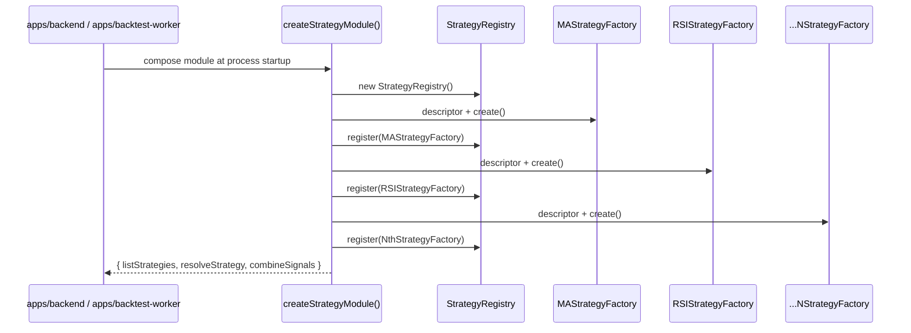
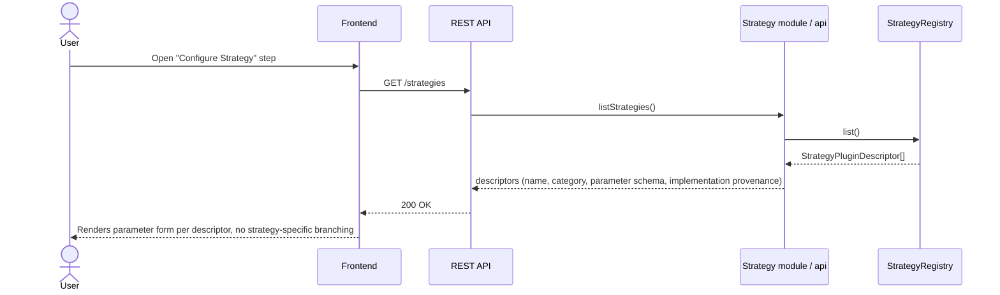
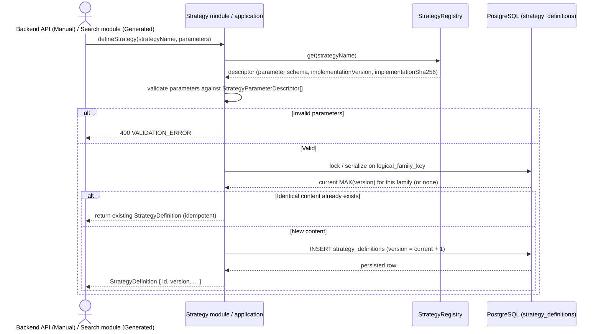
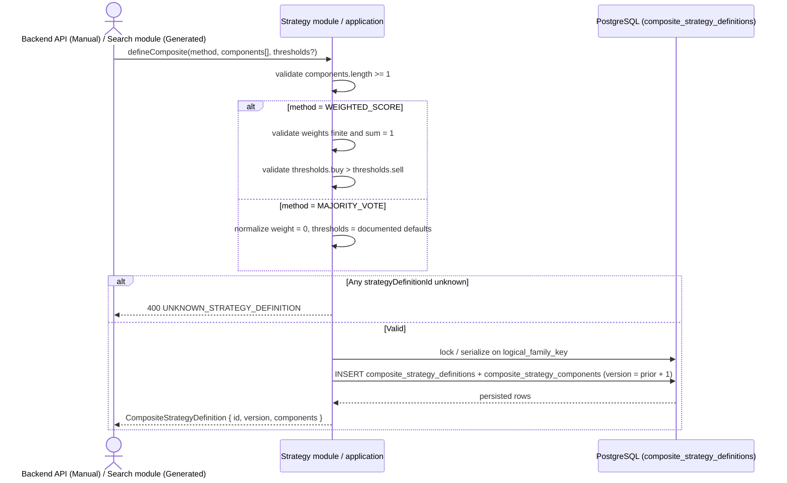
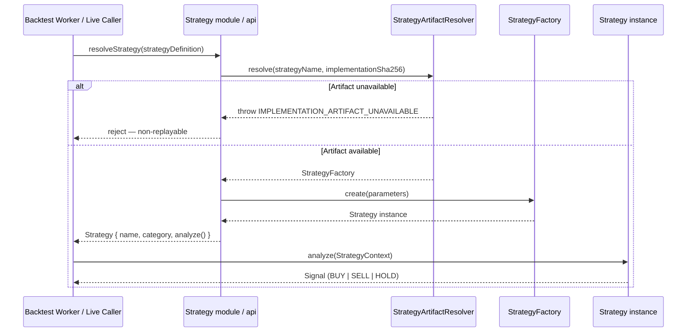
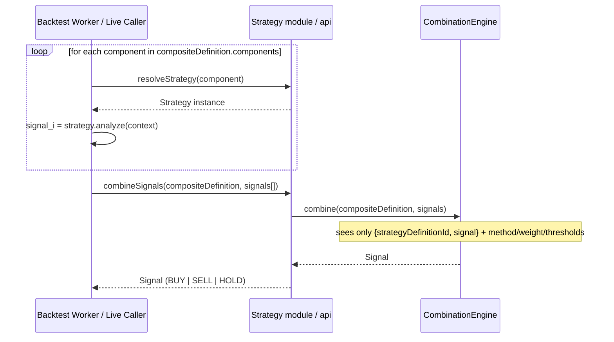
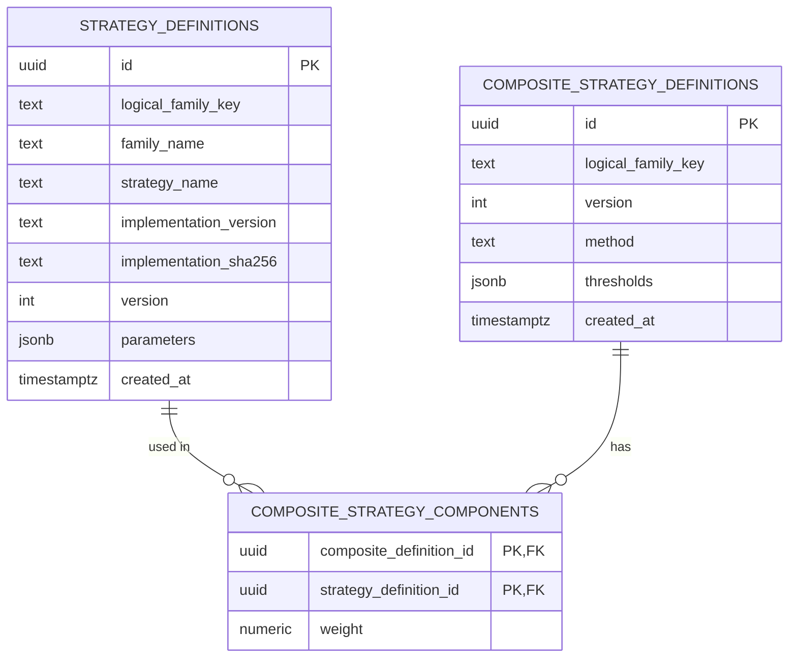
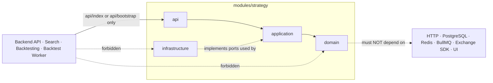

# Spec: Strategy Module (`modules/strategy`)

## 1. Overview

### Purpose

`modules/strategy` is the module that turns a normalized market context into a trading `Signal`, and combines several such signals into one decision. It owns three things and nothing else:

1. The **Strategy Engine** — runs one registered plugin (`Strategy`) against a `StrategyContext` and returns `BUY | SELL | HOLD`.
2. The **Strategy Registry / Artifact Resolver** — discovers which plugins exist, exposes their parameter schema, and resolves an exact retained build for replay.
3. **Composite Strategy** — combines several strategies' signals via `MAJORITY_VOTE` or `WEIGHTED_SCORE`, without ever inspecting _why_ a component produced its signal.

This is the extensibility seam of the whole platform (`architecture.md` §1.2): adding a new strategy (e.g. MACD) means implementing one plugin and calling `register()` once. No other module — Backtesting, Evaluation, Leaderboard, Search, or the Frontend — changes.

### Scope

In scope:

- Registering strategy plugins at process bootstrap.
- Listing registered plugin descriptors for the Frontend's configuration UI.
- Creating and versioning immutable `StrategyDefinition` rows (a plugin + concrete parameters).
- Creating and versioning immutable `CompositeStrategyDefinition` rows (a set of `StrategyDefinition`s + combination method).
- Resolving a runnable `Strategy` instance from a `StrategyDefinition`, including exact retained-artifact resolution for replay.
- Executing `Strategy.analyze()` for one strategy and `CombinationEngine.combine()` for a composite.

Out of scope (owned by other modules, consumed through their public APIs only):

- Deciding _which_ strategies/composites to generate — `modules/search` (Generator).
- Persisting/queuing/retrying backtest work, Attempts, Trades — `modules/backtesting`.
- Computing Return/Win Rate/Drawdown/Sharpe from trades — `modules/evaluation`.
- Scoring and Top-10 admission — `modules/leaderboard`.
- Producing `context.sentiment` — `modules/sentiment`; Strategy only _reads_ it.
- Normalizing candles / building `StrategyContext.candles` — `modules/market-data` plus the caller's context-builder.

### Actors

| Actor                       | Interaction                                                                                                                           |
| --------------------------- | ------------------------------------------------------------------------------------------------------------------------------------- |
| `apps/backend`              | Calls `createStrategyModule()` at startup to compose the module and register bootstrap plugins.                                       |
| `apps/backtest-worker`      | Same bootstrap facade; resolves and executes strategies/composites while simulating trades.                                           |
| Frontend (via Backend REST) | Reads `GET /strategies` to render the strategy configuration step.                                                                    |
| `modules/search`            | Calls the public API to validate/persist generated `StrategyDefinition`/`CompositeStrategyDefinition`s before submitting a candidate. |
| `modules/backtesting`       | Calls `resolveStrategy` / `combineSignals` once per Attempt to run the pinned composite against snapshot candles.                     |

## 2. Requirements

### 2.1 Functional requirements

| ID   | Requirement                                                                                                                                                          |
| ---- | -------------------------------------------------------------------------------------------------------------------------------------------------------------------- | ---- | ------ |
| FR-1 | The module must let a process register a `StrategyFactory` (implementation + descriptor) exactly once per `(strategyName, implementationSha256)` at bootstrap.       |
| FR-2 | The module must expose `listStrategies()` returning every registered `StrategyPluginDescriptor`, safe to serialize over REST.                                        |
| FR-3 | The module must create an immutable `StrategyDefinition` from a registered plugin name + parameters, validating parameters against the plugin's declared schema.     |
| FR-4 | The module must create an immutable `CompositeStrategyDefinition` from ≥1 `StrategyDefinition` references + a `CombinationMethod`.                                   |
| FR-5 | The module must resolve a runnable `Strategy` instance for a given `StrategyDefinition`, retrieving the _exact_ retained build identified by `implementationSha256`. |
| FR-6 | The module must run `Strategy.analyze(context)` and return exactly one of `BUY                                                                                       | SELL | HOLD`. |
| FR-7 | The module must combine an array of per-component signals into one `Signal` using the composite's `method`, `components[].weight`, and `thresholds`.                 |
| FR-8 | Repeated definition/composite creation with identical logical identity and identical content must be idempotent (return the existing row, not a duplicate).          |

### 2.2 Business rules

- **Identity & versioning (contracts §0):** `id` is unique **per version**, not per logical strategy. Every versioned contract carries a stable `logicalFamilyKey`; any change to parameters, implementation provenance, components, weights, thresholds, or method **inserts a new row** with `version = previous + 1`. Existing rows are never updated. `familyName` is a display label only and is never a foreign key.
- **Purity:** `Strategy.analyze()` and `CombinationEngine.combine()` must not perform I/O. They read only what `StrategyContext` (or the signal list) supplies.
- **Composite blindness:** the `CombinationEngine` sees only `{ strategyDefinitionId, signal }` pairs plus the composite's own `method`/`weight`/`thresholds`. It must never branch on which strategy produced a signal, and must never read another strategy's internal state or indicators.
- **`WEIGHTED_SCORE` validation:** at least one component; all weights finite; weights sum to `1`; `thresholds.buy > thresholds.sell`.
- **`WEIGHTED_SCORE` formula:** each component signal is encoded as `BUY = +1`, `HOLD = 0`, `SELL = -1`. The composite score is the weighted sum:

  ```
  score = Σ (encode(signal_i) × weight_i)   for i in components
  ```

  The `CombinationEngine` then maps `score` to a `Signal`:
  - `score > thresholds.buy` → `BUY`
  - `score < thresholds.sell` → `SELL`
  - otherwise → `HOLD`

  Encoding and thresholding happen entirely inside `CombinationEngine.combine()`; no component strategy is aware of this mapping.

- **`MAJORITY_VOTE` validation:** at least one component; weights are ignored and normalized to `0`; thresholds are normalized to the documented defaults (`buy: 0.3, sell: -0.3`) even though unused, so the row is always fully populated.
- **`MAJORITY_VOTE` formula and tie-break rule:** count `signal_i` occurrences across all components into `buyCount`, `sellCount`, `holdCount`. The result is whichever of the three has the strictly highest count.
  - **Tie-break rule:** if two or more counts are tied for the highest value, the result is `HOLD`. This applies uniformly regardless of which signals are tied (e.g. `BUY == SELL`, `BUY == HOLD`, or all three equal) — `HOLD` is the deterministic, conservative default whenever the vote is inconclusive.
  - Example: `{BUY, BUY, HOLD}` → `buyCount=2` → `BUY`. `{BUY, SELL, HOLD}` → all counts `=1` → tie → `HOLD`. `{BUY, SELL}` → `buyCount=1, sellCount=1` → tie → `HOLD`.
- **Artifact fidelity:** replay must use the exact retained build (`implementationSha256`) that produced a definition. If that artifact is unavailable, the module must fail explicitly (`IMPLEMENTATION_ARTIFACT_UNAVAILABLE`) rather than silently substitute the currently deployed plugin code.
- **Sentiment is read-only input:** an `INFORMATION`-category strategy reads `context.sentiment`; it never calls Sentiment's API itself. Ensuring that sentiment is present for a given candle window is the caller's contract (Backtesting verifies the pinned `LeaderboardScope` has a snapshot before submission), not something Strategy fetches or defends against at runtime beyond typing `sentiment` as optional.

### 2.3 Non-functional requirements

- **Determinism / reproducibility:** the same `(StrategyDefinition | CompositeStrategyDefinition, StrategyContext)` pair must always produce the same `Signal`, so that "Experiment #122" can always be replayed exactly (brief §36).
- **Extensibility without ripple:** adding a plugin must not require changes to `modules/backtesting`, `modules/evaluation`, `modules/leaderboard`, `modules/search`, or the Frontend core.
- **Layering:** `api → application → domain`; `infrastructure` implements application ports only. `domain` must not import HTTP, PostgreSQL, Redis, BullMQ, exchange SDKs, framework code, or UI code (`architecture.md` §1.3.1).
- **Boundary:** other modules may only import `modules/strategy/api` (runtime facade `listStrategies/resolveStrategy/combineSignals`) or the bootstrap facade `createStrategyModule`. No module may reach into `modules/strategy/domain` or `modules/strategy/infrastructure`.

## 3. Behavior

### 3.1 Plugin registration (process bootstrap)



Adding `MACDStrategy` means: implement `Strategy`, add one `MACDStrategyFactory` with its descriptor, and add one `register()` call here. Nothing else in this diagram changes shape.

### 3.2 List strategies (`GET /strategies`)



### 3.3 Create / version a `StrategyDefinition`



### 3.4 Create / version a `CompositeStrategyDefinition`



### 3.5 Resolve and execute one strategy

Used by the Backtest Worker while simulating an Attempt, and by any in-process caller that needs a live signal.



### 3.6 Combine signals for a composite



### 3.7 Error / edge cases

| Case                                                    | Trigger                                                                                                                     | Result                                                                                                                                                                                                                                                                                                                         |
| ------------------------------------------------------- | --------------------------------------------------------------------------------------------------------------------------- | ------------------------------------------------------------------------------------------------------------------------------------------------------------------------------------------------------------------------------------------------------------------------------------------------------------------------------ |
| Unregistered strategy name                              | `defineStrategy`/`resolveStrategy` references a name never registered                                                       | Reject with `STRATEGY_NOT_REGISTERED`; no row written                                                                                                                                                                                                                                                                          |
| Parameter validation failure                            | Parameters don't match the descriptor's schema (missing required key, out of `minimum`/`maximum`, invalid `ENUM` option)    | `400 VALIDATION_ERROR`, no row written                                                                                                                                                                                                                                                                                         |
| Artifact unavailable at replay time                     | `implementationSha256` on an old `StrategyDefinition` no longer has a retained build                                        | `IMPLEMENTATION_ARTIFACT_UNAVAILABLE`; the caller (Backtesting) surfaces this as a non-replayable Candidate rather than substituting current plugin code                                                                                                                                                                       |
| Composite with zero components                          | `components.length = 0`                                                                                                     | `400 VALIDATION_ERROR`                                                                                                                                                                                                                                                                                                         |
| `WEIGHTED_SCORE` weights don't sum to 1, or non-finite  | e.g. `[0.5, 0.4]` or `NaN` weight                                                                                           | `400 VALIDATION_ERROR`                                                                                                                                                                                                                                                                                                         |
| `WEIGHTED_SCORE` invalid thresholds                     | `thresholds.buy <= thresholds.sell`                                                                                         | `400 VALIDATION_ERROR`                                                                                                                                                                                                                                                                                                         |
| Composite references unknown `strategyDefinitionId`     | ID doesn't exist, or belongs to a different, unrelated version chain                                                        | `400 UNKNOWN_STRATEGY_DEFINITION`                                                                                                                                                                                                                                                                                              |
| Concurrent identical definition request                 | Two callers submit the same content for the same `logicalFamilyKey` at once                                                 | Family-level lock/serialization; second caller observes the first's committed row and returns it (idempotent), never a duplicate version                                                                                                                                                                                       |
| Conflicting reused ID                                   | A caller supplies a `StrategyDefinition.id`/`CompositeStrategyDefinition.id` that already exists with **different** content | Reject — an existing ID is never overwritten with different content                                                                                                                                                                                                                                                            |
| `INFORMATION` category strategy, no `context.sentiment` | Caller invokes `analyze()` without ever having supplied sentiment                                                           | Not a Strategy-module runtime guard; the strategy plugin's own `analyze()` implementation may treat missing sentiment as `HOLD`/neutral, but the _system-level_ guarantee that sentiment is present for a valid backtest belongs to `modules/backtesting` (composite-uses-`INFORMATION` ⇒ scope must pin a sentiment snapshot) |

## 4. Contracts

### 4.1 Public runtime API (consumed by other modules/processes)

```typescript
// modules/strategy/api/index.ts
export interface StrategyModulePublicApi {
  listStrategies(): StrategyPluginDescriptor[];
  resolveStrategy(definition: StrategyDefinition): Promise<Strategy>;
  combineSignals(
    definition: CompositeStrategyDefinition,
    signals: Array<{ strategyDefinitionId: string; signal: Signal }>,
  ): Signal;
}

// modules/strategy/api/bootstrap.ts
export function createStrategyModule(deps: {
  artifactResolver: StrategyArtifactResolver;
  definitionRepository: StrategyDefinitionRepository;
  compositeRepository: CompositeDefinitionRepository;
}): StrategyModulePublicApi & {
  defineStrategy(
    strategyName: string,
    parameters: Record<string, number | string>,
  ): Promise<StrategyDefinition>;
  defineComposite(command: {
    method: CombinationMethod;
    components: Array<{ strategyDefinitionId: string; weight: number }>;
    thresholds?: { buy: number; sell: number };
  }): Promise<CompositeStrategyDefinition>;
};
```

`defineStrategy`/`defineComposite` are exposed through the bootstrap/composition facade (they need repositories); `listStrategies`/`resolveStrategy`/`combineSignals` are the pure runtime facade also usable inside `apps/backtest-worker`, matching the export matrix in `project-structure.md` §5.1.

### 4.2 Core domain contracts (from `component-contracts.md` §1, §3, §4)

```typescript
export type Signal = "BUY" | "SELL" | "HOLD";

export type StrategyCategory =
  | "TREND" // MA, MACD
  | "MOMENTUM" // RSI, Stochastic
  | "VOLATILITY" // Bollinger, ATR
  | "STRUCTURE" // Support/Resistance, SMC, Wyckoff
  | "INFORMATION"; // News Sentiment

export type CombinationMethod = "MAJORITY_VOTE" | "WEIGHTED_SCORE";

export interface StrategyCandle {
  timestamp: string;
  open: number;
  high: number;
  low: number;
  close: number;
  volume: number;
}

export interface StrategyContext {
  pair: string;
  timeframe: "1m" | "5m" | "15m" | "1h" | "4h" | "1d";
  candles: StrategyCandle[];
  currentPrice: number;
  indicators: Record<string, number | number[]>;
  sentiment?: { label: "POSITIVE" | "NEUTRAL" | "NEGATIVE"; averageScore: number };
}

export interface Strategy {
  readonly name: string;
  readonly category: StrategyCategory;
  analyze(context: StrategyContext): Signal;
}

export interface StrategyDefinition {
  id: string; // unique per version
  logicalFamilyKey: string;
  familyName?: string; // display-only, never a FK
  strategyName: string;
  implementationVersion: string;
  implementationSha256: string;
  version: number;
  parameters: Record<string, number | string>;
  createdAt: string;
}

export interface CompositeStrategyDefinition {
  id: string;
  logicalFamilyKey: string;
  version: number;
  method: CombinationMethod;
  components: Array<{ strategyDefinitionId: string; weight: number }>;
  thresholds?: { buy: number; sell: number };
  createdAt: string;
}

export interface CombinationEngine {
  combine(
    definition: CompositeStrategyDefinition,
    signals: Array<{ strategyDefinitionId: string; signal: Signal }>,
  ): Signal;
}
```

### 4.3 Registry / artifact contracts (from `component-contracts.md` §3)

```typescript
export interface StrategyRegistry {
  register(factory: StrategyFactory): void;
  get(name: string, implementationSha256: string): StrategyFactory | undefined;
  list(): StrategyPluginDescriptor[];
}

export type StrategyParameterDescriptor =
  | {
      key: string;
      label: string;
      type: "INTEGER" | "NUMBER";
      required: boolean;
      defaultValue: number;
      minimum?: number;
      maximum?: number;
      step?: number;
    }
  | {
      key: string;
      label: string;
      type: "ENUM";
      required: boolean;
      defaultValue: string;
      options: string[];
    };

export interface StrategyPluginDescriptor {
  name: string;
  displayName: string;
  description: string;
  category: StrategyCategory;
  implementationVersion: string;
  implementationSha256: string;
  parameters: StrategyParameterDescriptor[];
}

export interface StrategyFactory {
  descriptor: StrategyPluginDescriptor;
  create(parameters: Record<string, number | string>): Strategy;
}

export interface StrategyArtifactResolver {
  resolve(strategyName: string, implementationSha256: string): Promise<StrategyFactory>;
  // throws IMPLEMENTATION_ARTIFACT_UNAVAILABLE; never substitutes another build
}
```

### 4.4 Data model (owned tables — from `data-model.md` §3.2–3.3)



- `strategy_definitions`: `SELECT`/`INSERT` only for repository roles; append-only trigger as defense in depth; `UNIQUE (logical_family_key, version)`.
- `composite_strategy_definitions` / `composite_strategy_components`: same append-only policy; every `strategy_definition_id` is a real FK, so a composite can never silently pick up a newer version of one of its components.
- There is deliberately **no `strategy_catalog` table** — the list of currently registered plugin _types_ lives only in the in-process `StrategyRegistry`, returned live by `list()`. Persisting it would create a second, driftable source of truth for "what code is currently deployed" (`data-model.md` §3.2.1).

### 4.5 Events

None. `modules/strategy` publishes no domain events — Cryptox has no general Event Bus (`architecture.md` §1.1). Consumers call the public API in-process and get a direct return value.

### 4.6 Module dependency direction



## 5. Constraints

### Technical constraints

- Language/runtime: TypeScript, composed inside `apps/backend` (NestJS DI) and reused as a library inside `apps/backtest-worker` (`tech-stack.md`).
- `domain` (Strategy Engine, Composite combination logic, plugin implementations) must be pure TypeScript with zero framework/infra imports, since the exact same code must run identically inside both `apps/backend` and `apps/backtest-worker`.
- Persistence for `strategy_definitions` / `composite_strategy_definitions` uses hand-written Knex repositories (no ORM), consistent with the rest of the platform's data-access choice.
- Validation of REST-facing DTOs (`defineStrategy`/`defineComposite` request bodies) uses Zod, consistent with `tech-stack.md`.

### Business constraints

- A `StrategyDefinition`/`CompositeStrategyDefinition` row, once created, is never updated or deleted — only superseded by a new version under the same `logicalFamilyKey`.
- The Combination Engine must never be given, and must never request, anything beyond `Signal` + `weight`/`method`/`thresholds` — no access to another strategy's `indicators` or internal state, even for debugging.
- A composite containing an `INFORMATION` plugin is a valid `CompositeStrategyDefinition` on its own; the requirement that its _execution_ have a sentiment snapshot available is enforced by the caller (`modules/backtesting`'s scope validation), not by this module.

### Out of scope

- Choosing which strategies to combine, or generating parameter values (Random/Domain-guided/Genetic generation) — `modules/search`.
- Deciding when/how often a strategy runs, retrying failed simulations, or persisting Attempts/Trades — `modules/backtesting`.
- Computing performance metrics from trade outcomes — `modules/evaluation`.
- Scoring, ranking, and Top-10 admission — `modules/leaderboard`.
- Fetching/normalizing candles or building the `candles`/`indicators` fields of `StrategyContext` — `modules/market-data` and the calling module's context-builder.
- Producing `SentimentResult`/sealed snapshots — `modules/sentiment`.

## 6. Acceptance Criteria

### Plugin registry

- [ ] `listStrategies()` returns one `StrategyPluginDescriptor` per registered plugin, including `parameters` sufficient for the Frontend to render a form without any strategy-specific branch.
- [ ] Registering two factories with the same `(strategyName, implementationSha256)` at bootstrap does not create two catalog entries; the second call is a no-op or explicit rejection (implementation choice), never silent duplication.
- [ ] Adding a new plugin (e.g. MACD) requires exactly one new factory file + one `register()` call; no other module's source changes.

### Strategy Definitions

- [ ] Creating a `StrategyDefinition` with valid parameters returns a row with `version = 1` for a brand-new `logicalFamilyKey`.
- [ ] Submitting the same `logicalFamilyKey` with **changed** parameters returns a new row with `version = previous + 1`; the prior row is unchanged in the database.
- [ ] Submitting **identical** content for a `logicalFamilyKey` that already has that exact version returns the existing row — `SELECT COUNT(*) FROM strategy_definitions WHERE logical_family_key = ?` does not increase.
- [ ] Submitting parameters outside the descriptor's `minimum`/`maximum`/`options` is rejected with `400` and writes no row.
- [ ] Two concurrent requests for the same new content on the same `logicalFamilyKey` result in exactly one persisted version — `SELECT COUNT(*) FROM strategy_definitions WHERE logical_family_key = ? AND version = ?` = 1.

### Composite Strategy Definitions

- [ ] A `WEIGHTED_SCORE` composite with weights summing to exactly `1` and `thresholds.buy > thresholds.sell` is accepted.
- [ ] A `WEIGHTED_SCORE` composite with weights summing to `0.9` or `1.1` is rejected with `400`, no row written.
- [ ] A `MAJORITY_VOTE` composite is accepted regardless of supplied weights, and the persisted row stores normalized `weight = 0` and the documented default thresholds.
- [ ] A composite with zero components is rejected with `400`.
- [ ] A composite referencing a non-existent `strategyDefinitionId` is rejected with `400`, no row written.
- [ ] Changing one component's weight, the method, or a threshold produces a new `CompositeStrategyDefinition` version; it never mutates the prior row.

### Resolution & execution

- [ ] `resolveStrategy` for a definition whose `implementationSha256` is retained returns a `Strategy` whose `analyze()` is callable and pure (no network/DB calls observed during the call).
- [ ] `resolveStrategy` for a definition whose `implementationSha256` is **not** retained rejects with `IMPLEMENTATION_ARTIFACT_UNAVAILABLE` and never substitutes the currently deployed plugin version.
- [ ] `combineSignals` given N component signals and a `MAJORITY_VOTE` composite returns the signal with the strictly highest count (per §2.2); any tie among the counts (2-way or 3-way) returns `HOLD`.
- [ ] `combineSignals` given a `WEIGHTED_SCORE` composite computes `score = Σ(encode(signal_i) × weight_i)` with `BUY=+1/HOLD=0/SELL=-1` (per §2.2) and returns `BUY` when `score > thresholds.buy`, `SELL` when `score < thresholds.sell`, and `HOLD` otherwise.
- [ ] The `CombinationEngine` implementation contains no conditional logic keyed on `strategyName` or `category` — verified by code review / architecture test, not just unit test.

### Reproducibility

- [ ] Given the same `StrategyDefinition`/`CompositeStrategyDefinition` and the same `StrategyContext` (or same signal array), repeated calls to `analyze()`/`combineSignals()` return identical output — verified by a determinism test that calls twice and diffs results.
- [ ] An architecture test (e.g. dependency-cruiser / ESLint boundary rule) fails the build if `modules/strategy/domain` imports any HTTP, PostgreSQL, Redis, BullMQ, or exchange-SDK package.
- [ ] An architecture test fails the build if any other module imports `modules/strategy/domain/*` or `modules/strategy/infrastructure/*` directly instead of `modules/strategy/api/*`.
